<!-- cSpell:ignore WEBVM SQLVM OSTICKETWEB OSTICKETMYSQL contosohost vcenter contosodc NSGs agentless SQLMI iisreset -->

# Rehost an on-premises application by migrating to Azure VMs and Azure SQL Managed Instance

This article shows how the fictional company Contoso migrates a two-tier Windows .NET front-end application running on VMware virtual machines (VMs) to an Azure VM by using Azure Migrate. It also shows how Contoso migrates the application database to Azure SQL Managed Instance.

The SmartHotel360 application used in this example is provided as open-source software. If you want to use it for your own testing purposes, download it from [GitHub](https://github.com/Microsoft/SmartHotel360).

## Business drivers

Contoso's IT leadership team has worked closely with the company's business partners to understand what the business wants to achieve with this migration. They want to:

- **Address business growth.** Contoso is growing. As a result, pressure has increased on the company's on-premises systems and infrastructure.
- **Increase efficiency.** Contoso needs to remove unnecessary procedures and streamline processes for its developers and users. The business needs IT to be fast and not waste time or money for the company to deliver faster on customer requirements.
- **Increase agility.** Contoso IT needs to be more responsive to the needs of the business. It must react faster than the changes that occur in the marketplace for the company to be successful in a global economy. IT at Contoso must not get in the way or become a business blocker.
- **Scale.** As the company's business grows successfully, Contoso IT must provide systems that can grow at the same pace.

## Migration goals

The Contoso cloud team has identified goals for this migration. The company uses migration goals to determine the best migration method.

- After migration, the application in Azure should have the same performance capabilities that the application has today in Contoso's on-premises VMware environment. Moving to the cloud doesn't mean that application performance is less critical.
- Contoso doesn't want to invest in the application. The application is critical and important to the business, but Contoso simply wants to move the application in its current form to the cloud.
- Database administration tasks should be minimized after the application is migrated.
- Contoso doesn't want to use Azure SQL Database for this application. It's looking for alternatives.

## Solution design

After pinning down the company's goals and requirements, Contoso designs and reviews a deployment solution and identifies the migration process. The Azure services that it will use for the migration also are identified.

### Current architecture

- Contoso has one main datacenter (`contoso-datacenter`). The datacenter is located in New York City in the eastern United States.
- Contoso has three additional local branches across the United States.
- The main datacenter is connected to the internet with a fiber-optic Metro Ethernet connection (500 megabits per second).
- Each branch is connected locally to the internet by using business-class connections with IPsec VPN tunnels back to the main datacenter. The setup allows Contoso's entire network to be permanently connected and optimizes internet connectivity.
- The main datacenter is fully virtualized with VMware. Contoso has two ESXi 6.5 virtualization hosts that are managed by vCenter Server 6.5.
- Contoso uses Active Directory for identity management. Contoso uses DNS servers on the internal network.
- Contoso has an on-premises domain controller (`contosodc1`).
- The domain controllers run on VMware VMs. The domain controllers at local branches run on physical servers.
- The SmartHotel360 application is tiered across two VMs (`WEBVM` and `SQLVM`) that are located on a VMware ESXi version 6.5 host (`contosohost1.contoso.com`).
- The VMware environment is managed by vCenter Server 6.5 (`vcenter.contoso.com`) running on a VM.

### Proposed architecture

In this scenario, Contoso wants to migrate its two-tier on-premises travel application as follows:

- Migrate the application database (`SmartHotelDB`) to a SQL managed instance.
- Migrate the front end, `WEBVM`, to an Azure VM.
- The on-premises VMs in the Contoso datacenter will be decommissioned when the migration is finished.

### Database considerations

As part of the solution design process, Contoso did a feature comparison between Azure SQL Database and SQL Managed Instance. The following considerations helped the company decide to use SQL Managed Instance.

- SQL Managed Instance aims to deliver almost 100% compatibility with the latest on-premises SQL Server version. We recommend SQL Managed Instance for customers who are running SQL Server on-premises or on infrastructure as a service (IaaS) VMs and want to migrate their applications to a fully managed service with minimal design changes.
- Contoso is planning to migrate a large number of applications from on-premises to IaaS. Many of these applications are ISV provided. Contoso realizes that using SQL Managed Instance will help ensure database compatibility for these applications, rather than using SQL Database, which might not be supported.
- Contoso can perform a lift-and-shift migration to SQL Managed Instance by using the fully automated Azure Database Migration Service. With this service in place, Contoso can reuse it for future database migrations.
- SQL Managed Instance supports SQL Server Agent, an important component of the SmartHotel360 application. Contoso needs this compatibility. Otherwise, it will have to redesign maintenance plans required by the application.
- With Software Assurance, Contoso can exchange its existing licenses for discounted rates on a SQL managed instance by using the Azure Hybrid Benefit for SQL Server. For this reason, Contoso can save up to 30 percent on SQL Managed Instance.
- SQL Managed Instance is fully contained in the virtual network, so it provides greater isolation and security for Contoso's data. Contoso can get the benefits of the public cloud while keeping the environment isolated from the public internet.
- SQL Managed Instance supports many security features. They include Always Encrypted, dynamic data masking, row-level security, and threat detection.

### Solution review

Contoso evaluates the proposed design by putting together a list of pros and cons.

| Consideration | Details |
| --- | --- |
| **Pros** | `WEBVM` will be moved to Azure without changes, which makes the migration simple.    SQL Managed Instance supports Contoso's technical requirements and goals.    SQL Managed Instance will provide 100 percent compatibility with Contoso's current deployment while moving the company away from SQL Server 2008 R2.    Contoso can take advantage of its investment in Software Assurance and use the Azure Hybrid Benefit for SQL Server and Windows Server.    Contoso can reuse Azure Database Migration Service for additional future migrations.    SQL Managed Instance has built-in fault tolerance that Contoso doesn't need to configure. This feature ensures that the data tier is no longer a single point of failure. |
| **Cons** | `WEBVM` is running Windows Server 2008 R2. Although this operating system is supported by Azure, it's no longer a supported platform. To learn more, see [Support policy for Microsoft SQL Server products](/troubleshoot/sql/general/support-policy-hardware-virtualization-product).    The web tier remains a single point of failover with only `WEBVM` providing services.    Contoso will need to continue supporting the application web tier as a VM rather than moving to a managed service, such as Azure App Service.    For the data tier, SQL Managed Instance might not be the best solution if Contoso wants to customize the operating system or the database server, or if the company wants to run third-party applications along with SQL Server. Running SQL Server on an IaaS VM could provide this flexibility. |

### Migration process

Contoso will migrate the web and data tiers of its SmartHotel360 application to Azure by completing these steps:

1. Contoso already has its Azure infrastructure in place, so it just needs to add a couple of specific Azure components for this scenario.
1. The data tier will be migrated by using Azure Database Migration Service. This service connects to the on-premises SQL Server VM across a Site-to-Site VPN connection between the Contoso datacenter and Azure. The service then migrates the database.
1. The web tier will be migrated by using a lift-and-shift migration by using Azure Migrate. The process entails preparing the on-premises VMware environment, setting up and enabling replication, and migrating the VMs by failing them over to Azure.

     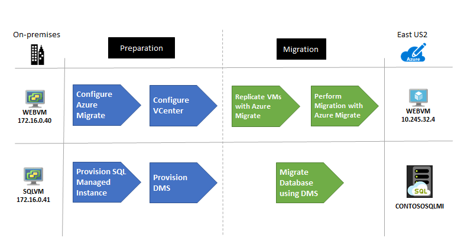

### Azure services

| Service | Description | Cost |
| --- | --- | --- |
| [Azure Database Migration Service](/azure/dms/dms-overview) | Azure Database Migration Service enables seamless migration from multiple database sources to Azure data platforms with minimal downtime. | Learn about [supported regions](/azure/dms/dms-overview#regional-availability) and [Azure Database Migration Service pricing](https://azure.microsoft.com/pricing/details/database-migration/). |
| [Azure SQL Managed Instance](/azure/azure-sql/managed-instance/sql-managed-instance-paas-overview) | SQL Managed Instance is a managed database service that represents a fully managed SQL Server instance in the Azure cloud. It uses the same code as the latest version of SQL Server Database Engine and has the latest features, performance improvements, and security patches. | Using a SQL managed instance running in Azure incurs charges based on capacity. Learn more about [SQL Managed Instance pricing](https://azure.microsoft.com/pricing/details/azure-sql/sql-managed-instance/single/). |
| [Azure Migrate](/azure/migrate/migrate-services-overview) | Contoso uses Azure Migrate to assess its VMware VMs. Azure Migrate assesses the migration suitability of the machines. It provides sizing and cost estimates for running in Azure. | Azure Migrate is available at no additional charge. They might incur charges depending on the tools (first-party or independent software vendor) they decide to use for assessment and migration. Learn more about [Azure Migrate pricing](https://azure.microsoft.com/pricing/details/azure-migrate/). |

## Prerequisites

Contoso and other users must meet the following prerequisites for this scenario.

| Requirements | Details |
| --- | --- |
| **Azure subscription** | Contoso already created a subscription in the first article in this series. If you don't have an Azure subscription, create a [free account](https://azure.microsoft.com/free/).    If you create a free account, you're the administrator of your subscription and can perform all actions.    If you use an existing subscription and you're not the administrator of the subscription, work with the admin to assign you Owner or Contributor permissions to the necessary resource groups and resources. |
| **Azure infrastructure** | Contoso set up its Azure infrastructure as described in [Azure infrastructure for migration](./contoso-migration-infrastructure.md). |
| **On-premises servers** | The on-premises vCenter Server should be running version 5.5, 6.0, or 6.5.    An ESXi host should be running version 5.5, 6.0, or 6.5.    One or more VMware VMs should be running on the ESXi host. |
| **On-premises VMs** | [Review Linux machines](/azure/virtual-machines/linux/endorsed-distros) that are endorsed to run on Azure. |
| **Database Migration Service** | For Azure Database Migration Service, you need a [compatible on-premises VPN device](/azure/vpn-gateway/vpn-gateway-about-vpn-devices).    You must be able to configure the on-premises VPN device. It must have an external-facing public IPv4 address. The address can't be located behind a NAT device.    Make sure you can access your on-premises SQL Server database.    Windows Firewall should be able to access the source database engine. Learn how to [configure Windows Firewall for database engine access](/sql/database-engine/configure-windows/configure-a-windows-firewall-for-database-engine-access).    If there's a firewall in front of your database machine, add rules to allow access to the database and files via SMB port 445.    The credentials that are used to connect to the source SQL Server instance and that target SQL Managed Instance must be members of the sysadmin server role.    You need a network share in your on-premises database that Azure Database Migration Service can use to back up the source database.    Make sure that the service account running the source SQL Server instance has write permissions on the network share.    Make a note of a Windows user and password that has full control permissions on the network share. Azure Database Migration Service impersonates these user credentials to upload backup files to the Azure Storage container.    The SQL Server Express installation process sets the TCP/IP protocol to **Disabled** by default. Make sure that it's enabled. |

## Scenario steps

Here's how Contoso plans to set up the deployment:

> [!div class="checklist"]
>
> - **Step 1: Prepare a SQL managed instance.** Contoso needs an existing managed instance to which the on-premises SQL Server database will migrate.
> - **Step 2: Prepare Azure Database Migration Service.** Contoso must register the database migration provider, create an instance, and then create a Database Migration Service project. Contoso also must set up a shared access signature (SAS) uniform resource identifier (URI) for the Database Migration Service instance. An SAS URI provides delegated access to resources in Contoso's storage account so that Contoso can grant limited permissions to storage objects. Contoso sets up an SAS URI so that Azure Database Migration Service can access the storage account container to which the service uploads the SQL Server backup files.
> - **Step 3: Prepare Azure for the Azure Migrate: Server Migration tool.** Contoso adds the server migration tool to its Azure Migrate project.
> - **Step 4: Prepare on-premises VMware for Azure Migrate: Server Migration.** Contoso prepares accounts for VM discovery and prepares to connect to Azure VMs after migration.
> - **Step 5: Replicate the on-premises VMs.** Contoso sets up replication and starts replicating VMs to Azure Storage.
> - **Step 6: Migrate the database via Azure Database Migration Service.** Contoso migrates the database.
> - **Step 7: Migrate the VMs with Azure Migrate: Server Migration.** Contoso runs a test migration to make sure everything's working and then runs a full migrate to move the VM to Azure.

## Step 1: Prepare a SQL managed instance

To set up a SQL managed instance, Contoso needs a subnet that meets the following requirements:

- The subnet must be dedicated. It must be empty. It can't contain any other cloud service. The subnet can't be a gateway subnet.
- After the managed instance is created, Contoso shouldn't add resources to the subnet.
- The subnet can't have a network security group associated with it.
- The subnet must have a user-defined route table. The only route assigned should be `0.0.0.0/0` next-hop internet.
- If an optional custom DNS is specified for the virtual network, the virtual IP address `168.63.129.16` for the recursive resolvers in Azure must be added to the list. Learn how to [configure custom DNS for a SQL managed instance](/azure/azure-sql/managed-instance/custom-dns-configure).
- The subnet must not have a service endpoint (storage or SQL) associated with it. Service endpoints should be disabled on the virtual network.
- The subnet must have a minimum of 16 IP addresses. Learn how to [size the managed instance subnet](/azure/azure-sql/managed-instance/vnet-existing-add-subnet).
- In Contoso's hybrid environment, custom DNS settings are required. Contoso configures DNS settings to use one or more of the company's Azure DNS servers. Learn more about [DNS customization](/azure/azure-sql/managed-instance/custom-dns-configure).

### Set up a virtual network for the managed instance

To set up the virtual network, the Contoso admins:

1. Create a new virtual network (`VNET-SQLMI-EU2`) in the primary region (`East US 2`). It adds the virtual network to the `ContosoNetworkingRG` resource group.
1. Assign an address space of `10.235.0.0/24`. They ensure that the range doesn't overlap with any other networks in its enterprise.
1. Add two subnets to the network:
    - `SQLMI-DS-EUS2` (`10.235.0.0/25`).
    - `SQLMI-SAW-EUS2` (`10.235.0.128/29`). This subnet is used to attach a directory to the managed instance.

      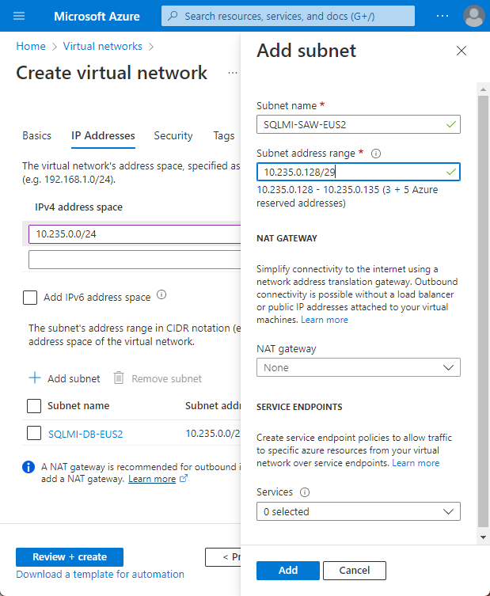

1. After the virtual network and subnets are deployed, they peer networks as follows:

    - Peers `VNET-SQLMI-EUS2` with `VNET-HUB-EUS2` (the hub virtual network in `East US 2`).
    - Peers `VNET-SQLMI-EUS2` with `VNET-PROD-EUS2` (the production network).

      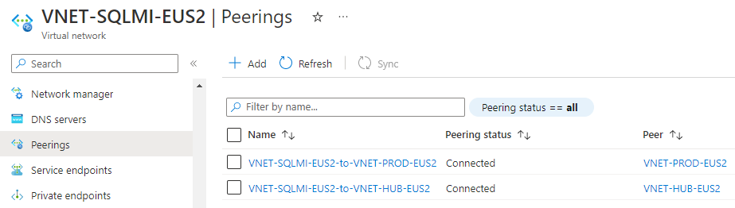

1. Set custom DNS settings. DNS points first to Contoso's Azure domain controllers. Azure DNS is secondary. The Contoso Azure domain controllers are located as follows:

    - Located in the `PROD-DC-EUS2` subnet, in the `East US 2` production network (`VNET-PROD-EUS2`).
    - `CONTOSODC3` address: `10.245.42.4`.
    - `CONTOSODC4` address: `10.245.42.5`.
    - Azure DNS resolver: `168.63.129.16`.

      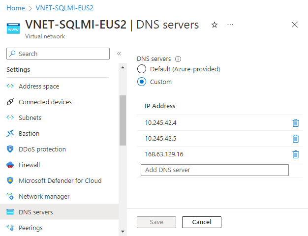

**Need more help?**

- Read the [SQL Managed Instance overview](/azure/azure-sql/managed-instance/sql-managed-instance-paas-overview).
- Learn how to [create a virtual network for a SQL managed instance](/azure/azure-sql/managed-instance/vnet-existing-add-subnet).
- Learn how to [set up peering](/azure/virtual-network/virtual-network-manage-peering).
- Learn how to [update Azure Active Directory DNS settings](/azure/active-directory-domain-services/tutorial-create-instance).

### Set up routing

The managed instance is placed in a private virtual network. Contoso needs a route table for the virtual network to communicate with the Azure management service. If the virtual network can't communicate with the service that manages it, the virtual network becomes inaccessible.

Contoso considers these factors:

- The route table contains a set of rules (routes) that specify how packets sent from the managed instance should be routed in the virtual network.
- The route table is associated with subnets where managed instances are deployed. Each packet that leaves a subnet is handled based on the associated route table.
- A subnet can be associated with only one route table.
- There are no additional charges for creating route tables in Microsoft Azure.

 To set up routing, the Contoso admins do the following steps:

1. Create a user-defined route table in the `ContosoNetworkingRG` resource group.

    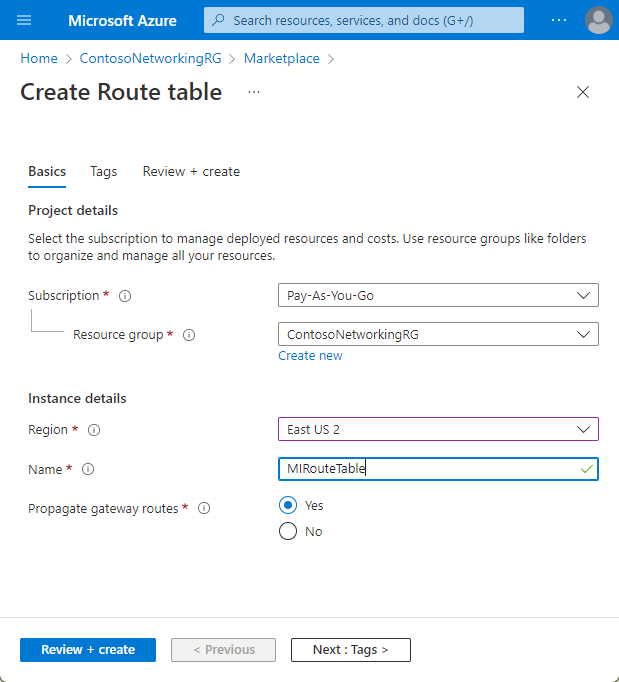

1. To comply with SQL Managed Instance requirements, after the route table (`MIRouteTable`) is deployed, they add a route that has an address prefix of `0.0.0.0/0`. The **Next hop type** option is set to **Internet**.

    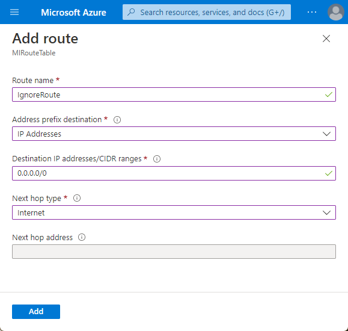

1. Associate the route table with the `SQLMI-DB-EUS2` subnet (in the `VNET-SQLMI-EUS2` network).

    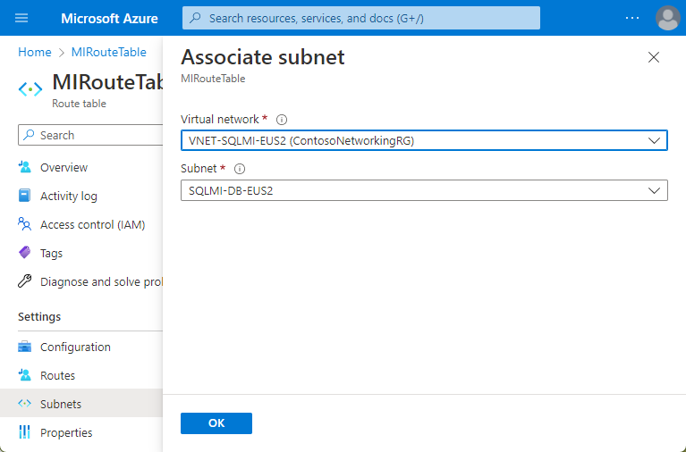

**Need more help?**

Learn how to [set up routes for a managed instance](/azure/azure-sql/managed-instance/instance-create-quickstart).

### Create a managed instance

Now the Contoso admins can provision a SQL managed instance:

1. Because the managed instance serves a business application, they deploy the managed instance in the company's primary region (`East US 2`). They add the managed instance to the `ContosoRG` resource group.
1. They select a pricing tier, size compute, and storage for the instance. Learn more about [SQL Managed Instance pricing](https://azure.microsoft.com/pricing/details/azure-sql/sql-managed-instance/single/).

    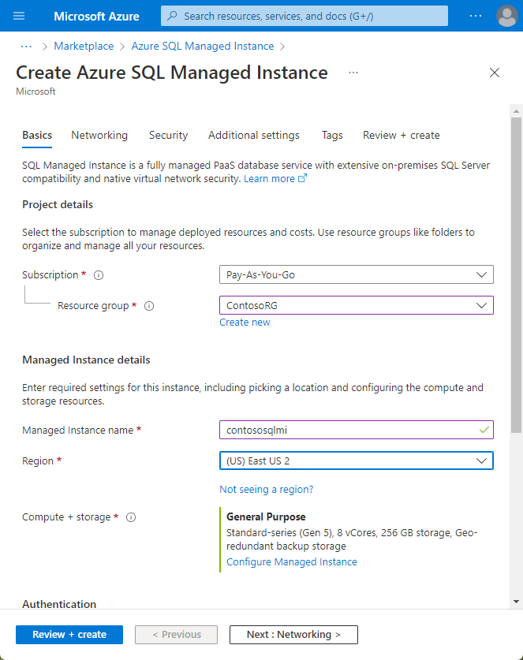

1. After the managed instance is deployed, two new resources appear in the `ContosoRG` resource group:

    - The SQL managed instance.
    - A virtual cluster in case Contoso has multiple managed instances.

      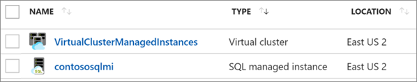

**Need more help?**

Learn how to [provision a managed instance](/azure/azure-sql/managed-instance/instance-create-quickstart).

## Step 2: Prepare Azure Database Migration Service

To prepare Azure Database Migration Service, the Contoso admins need to do a few things:

- Register the Database Migration Service provider in Azure.
- Grant permission for Database Migration Service to access Azure Storage for uploading the backup files that are used to migrate a database. To provide access to Azure Storage, create an Azure Blob Storage container. Generate an SAS URI for the Blob Storage container.
- Create an Azure Database Migration Service project.

They complete the following steps:

1. Register the database migration provider under its subscription. 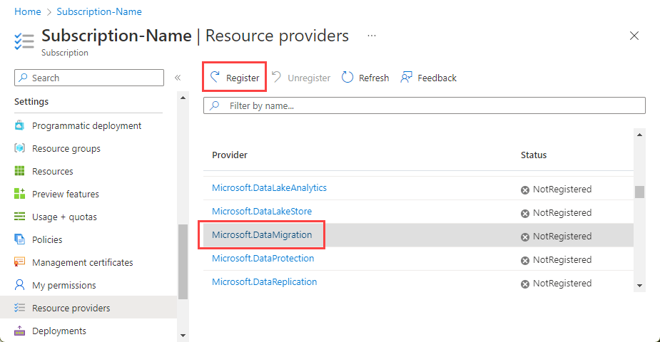

1. Create an Azure Blob Storage container. Contoso generates an SAS URI so that Azure Database Migration Service can access it.

    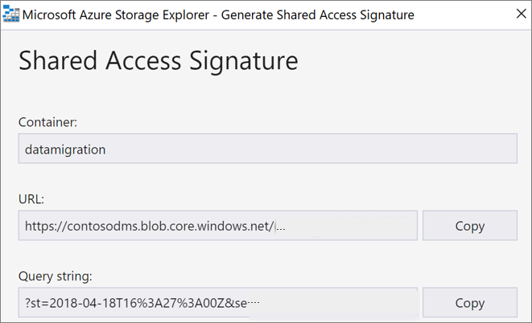

1. Create an Azure Database Migration Service instance.

    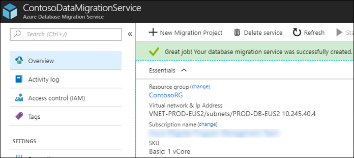

1. Place the Database Migration Service instance in the `PROD-DC-EUS2` subnet of the `VNET-PROD-DC-EUS2` virtual network.
    - The instance is placed here because the service must be in a virtual network that can access the on-premises SQL Server VM via a VPN gateway.
    - `VNET-PROD-EUS2` is peered to `VNET-HUB-EUS2` and is allowed to use remote gateways. The **Use remote gateways** option ensures that the instance can communicate as required.

        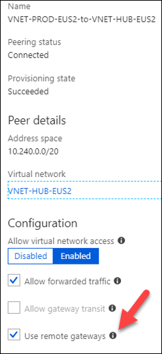

**Need more help?**

- Learn how to [set up Azure Database Migration Service](/azure/dms/quickstart-create-data-migration-service-portal).
- Learn how to [create and use SAS](/azure/storage/common/storage-sas-overview).

## Step 3: Prepare Azure for the Azure Migrate: Server Migration tool

Here are the Azure components Contoso needs to migrate the VMs to Azure:

- A virtual network in which Azure VMs will be located when they're created during migration.
- The Azure Migrate: Server Migration tool provisioned.

The Contoso admins set up these components:

1. Set up a network. Contoso already set up a network that can be used for Azure Migrate: Server Migration when it [deployed the Azure infrastructure](./contoso-migration-infrastructure.md).

    - The SmartHotel360 application is a production application, and the VMs will be migrated to the Azure production network (`VNET-PROD-EUS2`) in the primary region (`East US 2`).
    - Both VMs will be placed in the `ContosoRG` resource group, which is used for production resources.
    - The application front-end VM (`WEBVM`) will migrate to the front-end subnet (`PROD-FE-EUS2`) of the production network.
    - The application database VM (`SQLVM`) will migrate to the database subnet (`PROD-DB-EUS2`) of the production network.

## Step 4: Prepare on-premises VMware for Azure Migrate: Server Migration

Here are the Azure components Contoso needs to migrate the VMs to Azure:

- A virtual network in which Azure VMs will be located when they're created during migration.
- The Azure Migrate appliance, provisioned and configured.

The Contoso admins set up these components by following these steps:

1. Set up a network. Contoso already set up a network that can be used for Azure Migrate: Server Migration when it [deployed the Azure infrastructure](./contoso-migration-infrastructure.md).

    - The SmartHotel360 application is a production application, and the VMs will be migrated to the Azure production network (`VNET-PROD-EUS2`) in the primary region (`East US 2`).
    - Both VMs will be placed in the `ContosoRG` resource group, which is used for production resources.
    - The application front-end VM (`WEBVM`) will migrate to the front-end subnet (`PROD-FE-EUS2`) in the production network.
    - The application database VM (`SQLVM`) will migrate to the database subnet (`PROD-DB-EUS2`) in the production network.

1. Provision the Azure Migrate appliance.

    1. From Azure Migrate, download the OVA image and import it into VMware.

        

    1. Start the imported image and configure the tool by following these steps:

       1. Set up the prerequisites.

          

       1. Point the tool to the Azure subscription.

          

       1. Set the VMware vCenter credentials.

          

       1. Add any Linux-based or Windows-based credentials for discovery.

          

1. After configuration, it takes some time for the tool to enumerate all the virtual machines. After the process is finished, the Contoso admins can see the VMs populated in the Azure Migrate tool in Azure.

**Need more help?**

Learn about how to set up the [Azure Migrate appliance](/azure/migrate/migrate-services-overview#azure-migrate-server-migration-tool).

### Prepare on-premises VMs

After migration, Contoso wants to connect to the Azure VMs and allow Azure to manage the VMs. The Contoso admins must do the following steps before migration:

1. For access over the internet, they:

    - Enable RDP or SSH on the on-premises VM before migration.
    - Ensure that TCP and UDP rules are added for the **Public** profile.
    - Check that RDP or SSH is allowed in the operating system firewall.

1. For access over Site-to-Site VPN, they:

    - Enable RDP or SSH on the on-premises VM before migration.
    - Check that RDP or SSH is allowed in the operating system firewall.
    - For Windows, set the operating system's SAN policy on the on-premises VM to **OnlineAll**.

1. They install the Azure agent:

    - [Azure Linux agent](/azure/virtual-machines/extensions/agent-linux)
    - [Azure Windows agent](/azure/virtual-machines/extensions/agent-windows)

1. Other considerations:

   - For Windows, there should be no Windows updates pending on the VM when triggering a migration. If there are, they won't be able to sign in to the VM until the update finishes.
   - After migration, they can check **boot diagnostics** to view a screenshot of the VM. If this doesn't work, they should verify that the VM is running and review these [troubleshooting tips](https://social.technet.microsoft.com/wiki/contents/articles/31666.troubleshooting-remote-desktop-connection-after-failover-using-asr.aspx).

**Need more help?**

Learn about how to [prepare VMs for migration](/azure/migrate/prepare-for-migration).

## Step 5: Replicate the on-premises VMs

Before the Contoso admins can run a migration to Azure, they need to set up and enable replication.

With discovery completed, they can begin replication of VMware VMs to Azure.

1. In the Azure Migrate project, they go to **Servers** > **Azure Migrate: Server Migration**. Then they select **Replicate**.

    

1. In **Replicate** > **Source settings** > **Are your machines virtualized?**, they select **Yes, with VMware vSphere**.

1. In **On-premises appliance**, they select the name of the Azure Migrate appliance that was set up and then select **OK**.

    

1. In **Virtual machines**, they select the machines they want to replicate:
    - If they've run an assessment for the VMs, they can apply VM sizing and disk type (premium/standard) recommendations from the assessment results. In **Import migration settings from an Azure Migrate assessment?**, they select the **Yes** option.
    - If they didn't run an assessment or they don't want to use the assessment settings, they select the **No** option.
    - If they selected to use the assessment, they select the VM group and assessment name.

    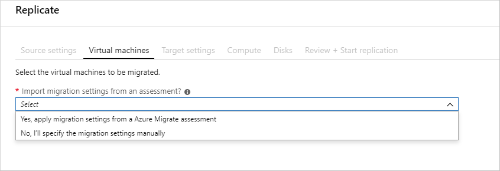

1. In **Virtual machines**, they search for VMs as needed and check each VM they want to migrate. Then they select **Next: Target settings**.

1. In **Target settings**, they select the subscription and target region to which they'll migrate. They also specify the resource group in which the Azure VMs will reside after migration. In **Virtual Network**, they select the Azure virtual network/subnet to which the Azure VMs will be joined after migration.

1. In **Azure Hybrid Benefit**, they:

    - Select **No** if they don't want to apply Azure Hybrid Benefit. Then they select **Next**.
    - Select **Yes** if they have Windows Server machines that are covered with active Software Assurance or Windows Server subscriptions and they want to apply the benefit to the machines they're migrating. Then they select **Next**.

1. In **Compute**, they review the VM name, size, OS disk type, and availability set. VMs must conform with [Azure requirements](/azure/migrate/migrate-support-matrix-vmware#vmware-requirements).

    - **VM size:** If they're using assessment recommendations, the VM size drop-down list contains the recommended size. Otherwise, Azure Migrate picks a size based on the closest match in the Azure subscription. Alternatively, they can pick a manual size in **Azure VM size.**
    - **OS disk:** They specify the OS (boot) disk for the VM. The OS disk is the disk that has the operating system bootloader and installer.
    - **Availability set:** If the VM should be in an Azure availability set after migration, they specify the set. The set must be in the target resource group specified for the migration.

1. In **Disks**, they specify whether the VM disks should be replicated to Azure. Then they select the disk type (standard SSD/HDD or premium-managed disks) in Azure and select **Next**.
    - They can exclude disks from replication.
    - If disks are excluded, they won't be present on the Azure VM after migration.

1. In **Review + start replication**, they review the settings. Then they select **Replicate** to start the initial replication for the servers.

> [!NOTE]
> Replication settings can be updated any time before replication starts in **Manage** > **Replicating machines**. Settings can't be changed after replication starts.

## Step 6: Migrate the database via Azure Database Migration Service

The Contoso admins need to create a Database Migration Service project and then migrate the database.

### Create an Azure Database Migration Service project

1. The admins create a Database Migration Service project. They select the **SQL Server** source server type and **Azure SQL Managed Instance** as the target.

     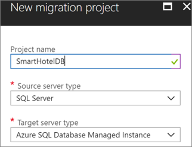

1. The Migration Wizard opens.

### Migrate the database

1. In the Migration Wizard, they specify the source VM on which the on-premises database is located. They enter the credentials to access the database.

    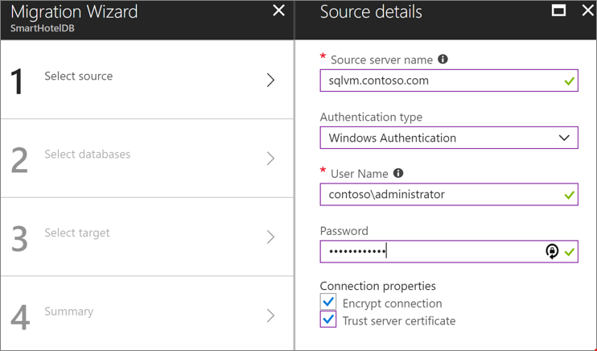

1. They select the database to migrate (`SmartHotel.Registration`).

    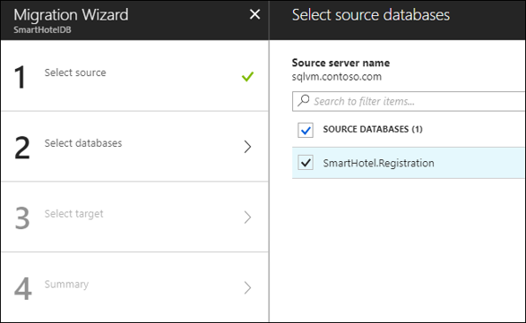

1. For the target, they enter the name of the managed instance in Azure and the access credentials.

    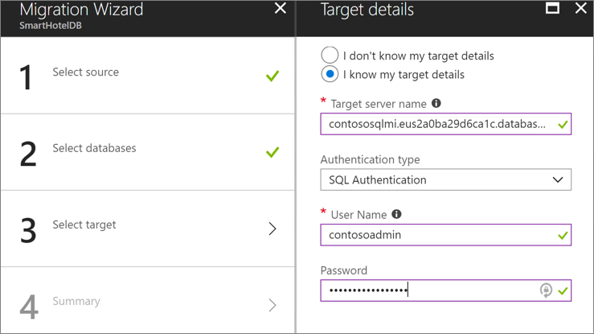

1. In **New Activity** > **Run migration**, they specify settings to run the migration:
    - Source and target credentials.
    - The database to migrate.
    - The network share created on the on-premises VM. Azure Database Migration Service takes source backups to this share.
        - The service account that runs the source SQL Server instance must have write permissions on this share.
        - The FQDN path to the share must be used.
    - The SAS URI that provides Azure Database Migration Service with access to the storage account container to which the service uploads the backup files for migration.

        

1. They save the migration settings and then run the migration.
1. In **Overview**, they monitor the migration status.

    

1. When migration is finished, they verify that the target databases exist on the managed instance.

    

## Step 7: Migrate the VMs with Azure Migrate: Server Migration

The Contoso admins run a quick test migration and verify the VM is working properly. Then they migrate the VM.

### Run a test migration

1. In **Migration goals** > **Servers** > **Azure Migrate: Server Migration**, they select **Test migrated servers**.

     

1. They select and hold (or right-click) the VM to test, and then they select **Test migrate**.

    

1. In **Test migration**, they select the Azure virtual network in which the Azure VM will be located after the migration. We recommend using a nonproduction virtual network.
1. The **Test migration** job starts. They monitor the job in the portal notifications.
1. After the migration finishes, they view the migrated Azure VM in **Virtual Machines** in the Azure portal. The machine name has a suffix **-Test**.
1. After the test is done, they select and hold (or right-click) the Azure VM in **Replicating machines** and then select **Clean up test migration**.

    

### Migrate the VM

Now the Contoso admins run a full migration to complete the move.

1. In the Azure Migrate project, they go to **Servers** > **Azure Migrate: Server Migration** and select **Replicating servers**.

    

1. In **Replicating machines**, they select and hold (or right-click) the VM, and then they select **Migrate**.
1. In **Migrate** > **Shut down virtual machines and perform a planned migration with no data loss**, they select **Yes** > **OK**.
    - By default, Azure Migrate shuts down the on-premises VM and runs an on-demand replication to synchronize any VM changes that occurred since the last replication occurred. This action ensures no data loss.
    - If they don't want to shut down the VM, they select **No**.
1. A migration job starts for the VM. They track the job in Azure notifications.
1. After the job finishes, they can view and manage the VM from the **Virtual Machines** page.
1. Finally, they update the DNS records for `WEBVM` on one of the Contoso domain controllers.

### Update the connection string

As the final step in the migration process, the Contoso admins update the connection string of the application to point to the migrated database that's running on the SQL managed instance.

1. In the Azure portal, they find the connection string by selecting **Settings** > **Connection strings**.

    

1. They update the string with the user name and password of the SQL managed instance.
1. After the string is configured, they replace the current connection string in the `web.config` file of its application.
1. After they update the file and save it, they restart IIS on `WEBVM` by running `iisreset /restart` in a command prompt window.
1. After IIS is restarted, the application uses the database that's running on the SQL managed instance.
1. At this point, they can shut down the on-premises `SQLVM` machine. The migration is finished.

**Need more help?**

- Learn how to [run a test failover](/azure/site-recovery/tutorial-dr-drill-azure).
- Learn how to [create a recovery plan](/azure/site-recovery/site-recovery-create-recovery-plans).
- Learn how to [fail over to Azure](/azure/site-recovery/site-recovery-failover).

## Clean up after migration

With the migration finished, the SmartHotel360 application is running on an Azure VM and the SmartHotel360 database is available in the Azure SQL managed instance.

Now, Contoso needs to perform these cleanup tasks:

- Remove the `WEBVM` machine from the vCenter Server inventory.
- Remove the `SQLVM` machine from the vCenter Server inventory.
- Remove `WEBVM` and `SQLVM` from local backup jobs.
- Update internal documentation to show the new location and IP address for `WEBVM`.
- Remove `SQLVM` from internal documentation. Alternatively, Contoso can revise the documentation to show `SQLVM` as deleted and no longer in the VM inventory.
- Review any resources that interact with the decommissioned VMs. Update any relevant settings or documentation to reflect the new configuration.

## Review the deployment

With the migrated resources in Azure, Contoso needs to fully operationalize and secure its new infrastructure.

### Security

The Contoso security team checks the Azure VMs and the SQL managed instance for any security issues in the implementation:

- The team reviews the network security groups that are used to control access for the VM. Network security groups help ensure that only traffic that's allowed to the application can pass.
- Contoso's security team also is considering securing the data on the disk by using Azure Disk Encryption and Azure Key Vault.
- The team enables threat detection on the managed instance. Threat detection sends an alert to Contoso's security team/service desk system to open a ticket if a threat is detected. Learn more about [threat detection for SQL Managed Instance](/azure/azure-sql/managed-instance/threat-detection-configure).

     

To learn more about security practices for VMs, see [Security best practices for IaaS workloads in Azure](/azure/security/fundamentals/iaas).

### Business continuity and disaster recovery

For business continuity and disaster recovery, Contoso takes the following actions:

- **Keep data safe.** Contoso backs up the data on the VMs by using the Azure Backup service. For more information, see [An overview of Azure VM backup](/azure/backup/backup-azure-vms-introduction).
- **Keep applications up and running.** Contoso replicates the application VMs in Azure to a secondary region using Site Recovery. To learn more, see [Set up disaster recovery to a secondary Azure region for an Azure VM](/azure/site-recovery/azure-to-azure-quickstart).
- **Learn more.** Contoso learns more about managing SQL Managed Instance, which includes [database backups](/azure/azure-sql/database/automated-backups-overview).

### Licensing and cost optimization

- Contoso has existing licensing for `WEBVM`. To take advantage of pricing with Azure Hybrid Benefit, Contoso converts the existing Azure VM.
- Contoso will use [Azure Cost Management + Billing](/azure/cost-management-billing/cost-management-billing-overview) to ensure the company stays within budgets established by the IT leadership.

## Conclusion

In this article, Contoso rehosts the SmartHotel360 application in Azure by migrating the application front-end VM to Azure by using Azure Migrate. Contoso migrates the on-premises database to a SQL managed instance by using Azure Database Migration Service.
