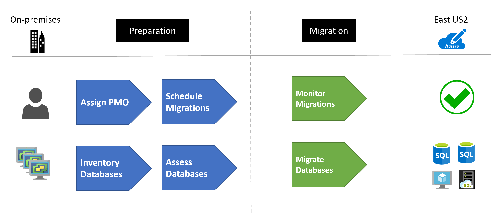
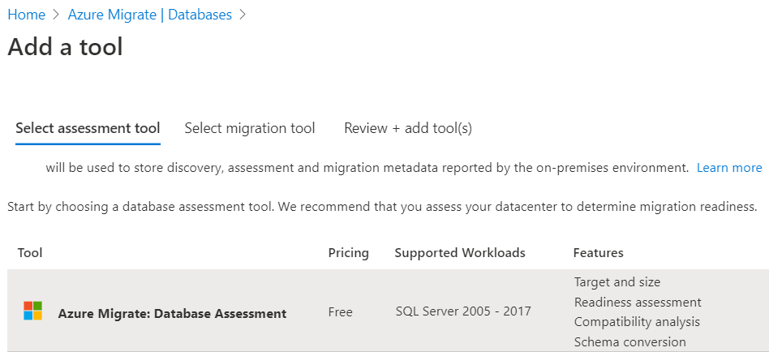
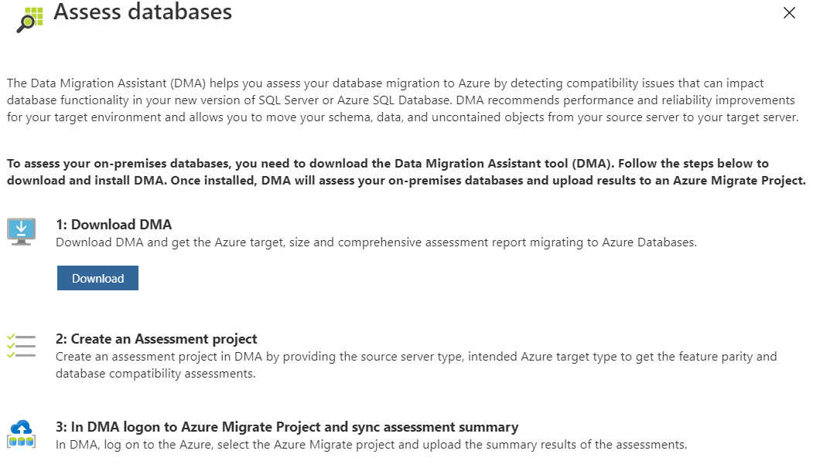

<!-- cSpell:ignore BACPAC FILESTREAM -->

# Migrate SQL Server databases to Azure

This article demonstrates how a fictional company Contoso assessed, planned and migrated their various on-premises SQL Server databases to Azure.

As Contoso considers migrating to Azure, the company needs a technical and financial assessment to determine whether its on-premises workloads are good candidates for cloud migration. In particular, the Contoso team wants to assess machine and database compatibility for migration. Additionally, it wants to estimate capacity and costs for running Contoso's resources in Azure.

## Business drivers

Contoso is having various issues with maintaining all the wide array of versions of SQL Server workloads that exist on their network. After the latest investor's meeting, the CFO and CTO have made the decision to move all these workloads to Azure. This will allow them to shift from a structured capital expense model to a fluid operating expense model.

The IT leadership team has worked closely with business partners to understand the business and technical requirements:

- **Increase security:** Contoso needs to be able to monitor and protect all data resources in a more timely and efficient manner. They would also like to get a more centralized reporting system setup on database access patterns.

- **Optimize compute resources:** Contoso has deployed a large on-premises server infrastructure. They have several SQL Server instances that consume but do not really use the underlying CPU, memory and disk allocated in efficient ways.

- **Increase efficiency:** Contoso needs to remove unnecessary procedures, and streamline processes for developers and users. The business needs IT to be fast and not waste time or money, thus delivering faster on customer requirements. Database administration should be reduced and/or minimized after the migration.

- **Increase agility:** Contoso IT needs to be more responsive to the needs of the business. It must be able to react faster than the changes in the marketplace, to enable the success in a global economy. It mustn't get in the way, or become a business blocker.

- **Scale:** As the business grows successfully, Contoso IT must provide systems that are able to grow at the same pace. There are several legacy hardware environments that cannot be upgraded any further and are past or near end of support.

- **Costs:** Business and applications owners want to know they won't be stuck with high cloud costs as compared to running the applications on-premises.

## Migration goals

The Contoso cloud team has pinned down goals for the various migrations. These goals were used to determine the best migration methods.

| Requirements | Details |
| --- | --- |
| **Performance** | After migration, applications in Azure should have the same performance capabilities that applications have today in Contoso's on-premises environment. Moving to the cloud doesn't mean that application performance is less critical. |
| **Compatibility** | Contoso needs to understand the compatibility of its applications and databases with Azure. Contoso also needs to understand its Azure hosting options. |
| **Data sources** | All databases will be moved to Azure with no exceptions. Based on the database and application analysis of the SQL features being used, they will move to PaaS, IaaS or managed instances. All databases must move. |
| **Application** | Applications must be moved to the cloud wherever possible. If they cannot move, then they will be allowed to connect to the migrated database over the Azure network through private connections only. |
| **Costs** | Contoso wants to understand not only its migration options, but also the costs associated with the infrastructure after it moves to the cloud. |
| **Management** | Resource management groups must be created for the various departments along with resource groups to managed all SQL databases that are migrated. All resources must be tagged with department information for chargeback requirements. |
| **Limitations** | Initially, not all branch offices that run applications will have a direct ExpressRoute link to Azure, so these offices will need to connect through virtual network gateways. |

## Solution design

Contoso has already performed a [migration assessment](../../plan/contoso-migration-assessment.md) of their digital estate using [Azure Migrate](/azure/migrate/migrate-services-overview).

The assessment results in multiple workloads spread across multiple departments. The overall size of the migration project will require a full project management office (PMO), to manage the specifics of communication, resources and schedule planning.

### Solution review

Contoso evaluates their proposed design by putting together a pros and cons list.

| Consideration | Details |
| --- | --- |
| **Pros** | Azure will provide a single pane of glass into the database workloads    Costs will be monitored via Azure Cost Management + Billing.    Business chargeback billing will be easy to perform with the Azure Billing APIs.    Server and software maintenance will be reduced to only the IaaS-based environments. |
| **Cons** | Due to the requirement of IaaS-based virtual machines, there will still need to be management of the software on those machines. |

### Budget and management

Before the migration can occur, the necessary Azure structure is required to be in place to support the administration and billing aspects of the solution.

For the management requirements, several [management groups](/azure/governance/management-groups/overview) were created to support the organizational structure.

For the billing requirements, each of the Azure resources are then [tagged](/azure/azure-resource-manager/management/tag-resources) with the appropriate billing tags.

### Migration process

Data migrations follow a standard repeatable pattern. This involves the following steps based on [Microsoft best practices](/data-migration/):

- Pre-migration:
  - **Discovery:** Inventory database assets and application stack.
  - **Assess:** Assess workloads and fix recommendations.
  - **Convert:** Convert source schema to work in the target.
- Migration:
  - **Migrate:** Migrate the source schema, source data and objects to target.
  - **Sync data:** Sync data (for minimal downtime).
  - **Cutover:** Cut over the source to target.
- Post-migration:
  - **Remediate applications:** Iteratively make and necessary changes to your applications.
  - **Perform tests:** Iteratively run functional and performance tests.
  - **Optimize:** Based on tests, address performance issues and then retest to confirm performance improvements.
  - **Retire assets:** Old VMs and hosting environments are backed up and retired.

#### Step 1: Discovery

Contoso used Azure Migrate to surface the dependencies across the Contoso environment. Azure Migrate automatically discovered application components on Windows and Linux systems and mapped the communication between services. Azure Migrate also surfaced the connections between Contoso servers, processes, inbound and outbound connection latency, and ports across their TCP-connected architecture.

Contoso also added Data Migration Assistant to their Azure Migrate project. By selecting this tool they're able to assess the databases for migration to Azure.

#### Step 2: Application assessment

<!-- docutune:casing "mainly .NET-based" "non-.NET-based" -->

The assessment determined that Contoso uses mainly .NET-based applications. However, some projects have used other technologies such as PHP and Node.js. Vendor-purchased systems also introduced applications not based on .NET. Contoso identified the following applications:

- ~800 Windows .NET applications
- ~50 PHP applications
- 25 Node.js applications
- 10 Java applications

#### Step 3: Database assessment

As each database workload was discovered, Data Migration Assistant (DMA) tool was run to determine which features were being used. DMA helps Contoso assess their database migrations to Azure by detecting compatibility issues that can impact database functionality in a new version of SQL Server or Azure SQL Database.

Contoso followed these steps to assess their databases and then upload results data to Azure Migrate:

1. Download DMA.
1. Create an assessment project.
1. In DMA, logon to the Azure Migrate project and sync the assessment summary.

DMA recommends performance and reliability improvements for your target environment and allows them to move their schema, data, and uncontained objects from a source server to a target server.

Learn more about [Data Migration Assistant](/sql/dma/dma-assesssqlonprem).

Contoso used the DMA to run the assessment and then uploaded the data directly to Azure Migrate.

With the database information now loaded into Azure Migrate, Contoso has identified over 1,000 database instances that must be migrated. Of these instances, roughly 40 percent can be moved to SQL Database for Azure. The remaining 60 percent must be moved either to either SQL Server running on Azure Virtual Machines or to Azure SQL Managed Instance. Of those 60 percent, about 10 percent require a virtual machine-based approach, the remaining instances will be moved to Azure SQL Managed Instance.

When DMA was not able to be executed on a data source, the following guidelines were followed on the database migrations.

> [!NOTE]
> Contoso discovered various open-source databases during the assessment phase. Separately, they followed the guidance in [migrate open-source databases to Azure](./contoso-migration-oss-db-to-azure.md) for their migration planning.

<!-- docutune:casing "custom .NET" -->

#### Step 4: Migration planning

With the information at hand, Contoso uses the following guidelines to determine which migration method to use for each database.

| Target | Database usage | Details | Online migration | Offline migration | Max size | Migration guide |
| --- | --- | --- | --- | ---| --- | --- |
| Azure SQL Database (PaaS) | SQL Server (data only) | These databases simply use basic tables, columns, stored procedures and functions | [Data Migration Assistant](/sql/dma/dma-overview), [transactional replication](/azure/azure-sql/managed-instance/replication-transactional-overview) | [BACPAC](/sql/relational-databases/data-tier-applications/import-a-bacpac-file-to-create-a-new-user-database), [bcp](/sql/tools/bcp-utility) | 1 TiB | [Link](/azure/dms/tutorial-sql-server-to-azure-sql) |
| Azure SQL Managed Instance | SQL Server (advanced features) | These databases use triggers and other [advanced concepts](/azure/azure-sql/managed-instance/transact-sql-tsql-differences-sql-server#service-broker) such as custom .NET types, service brokers, and so on. | [Data Migration Assistant](/sql/dma/dma-overview), [transactional replication](/azure/azure-sql/managed-instance/replication-transactional-overview) | [BACPAC](/sql/relational-databases/data-tier-applications/import-a-bacpac-file-to-create-a-new-user-database), [bcp](/sql/tools/bcp-utility), [native backup/restore](/azure/azure-sql/managed-instance/restore-sample-database-quickstart) | 2 TiB - 8 TiB | [Link](/azure/dms/tutorial-sql-server-managed-instance-online) |
| SQL Server on Azure Virtual Machines (IaaS) | SQL Server (third-party integrations) | The SQL Server must have [non-supported SQL Managed Instance features](/azure/azure-sql/managed-instance/transact-sql-tsql-differences-sql-server#service-broker) (cross-instance service brokers, cryptographic providers, buffer pool, compatibility levels below 100, database mirroring, FILESTREAM, PolyBase, anything that requires access to file shares, external scripts, extended stored procedures, and others) or third-party software installed to support the activities of the database. | [Transactional replication](/azure/azure-sql/managed-instance/replication-transactional-overview) | [BACPAC](/sql/relational-databases/data-tier-applications/import-a-bacpac-file-to-create-a-new-user-database), [bcp](/sql/tools/bcp-utility), [snapshot replication](/azure/azure-sql/managed-instance/replication-transactional-overview), [native backup/restore](/azure/azure-sql/managed-instance/restore-sample-database-quickstart), convert physical machine to VM | 4 GiB - 64 TiB | [Link](/azure/azure-sql/virtual-machines/windows/migrate-to-vm-from-sql-server) |

Due to the large number of databases, Contoso created a project management office (PMO) to keep track of every database migration instance. [Accountability and responsibilities](../migration-considerations/assess/index.md) were assigned to each business and application team.

Contoso also performed a [workload readiness review](../migration-considerations/assess/evaluate.md). This review examined the infrastructure, database and network components.

#### Step 5: Test migrations

The first part of the migration preparation involved a test migration of each of the databases to the pre-setup environments. In order to save time, they scripted all of the operations for the migrations and recorded the timings for each. In order to speed up the migration, they identified what migration operations could be run concurrently.

Any rollback procedures were identified for each of the database workloads in case of some unexpected failures.

For the IaaS-based workloads, they set up all the required third-party software beforehand.

After the test migration, Contoso was able to use the various Azure [cost estimation tools](../migration-considerations/assess/estimate.md) to get a more accurate picture of the future operational costs of their migration.

#### Step 6: Migration

For the production migration, Contoso identified the time frames for all database migrations and what could be sufficiently executed in a weekend window (midnight Friday through midnight Sunday) with minimal downtime to the business.

Based on their documented test procedures, they execute each migration via scripting as much as possible, limiting any manual tasks to minimize errors.

If any migrations fail during the window, they're rolled back and re-scheduled in the next migration window.

### Clean up after migration

Contoso identified the archival window for all database workloads. As the window expires, the resources will be retired from the on-premises infrastructure.

This includes:

- Removing the production data from on-premises servers.
- Retiring the hosting server when the last workload window expires.

### Review the deployment

With the migrated resources in Azure, Contoso needs to fully operationalize and secure their new infrastructure.

#### Security

- Contoso needs to ensure that their new Azure database workloads are secure. [Learn more](/azure/azure-sql/database/security-overview).
- In particular, Contoso should review the firewall and virtual network configurations.
- Setup [Private Link](/azure/azure-sql/database/private-endpoint-overview) so that all database traffic is kept inside Azure and the on-premises network.
- Enable [Microsoft Defender for Identity](/azure/azure-sql/database/threat-detection-overview) for Azure SQL Database.

#### Backups

- Ensure that the Azure databases are backed up using geo-restore. This allows backups to be used in a paired region in case of a regional outage.
- **Important:** Ensure that the Azure resource has a [resource lock](/azure/azure-resource-manager/management/lock-resources) to prevent it from being deleted. Deleted servers cannot be restored.

#### Licensing and cost optimization

- Many Azure database workloads can be scaled up or down, therefore performance monitoring of the server and databases is important to ensure you're meeting your needs but also keeping costs at a minimum.
- Both CPU and storage have costs associated. There are several pricing tiers to select from. Be sure the appropriate pricing plan is selected for the data workloads.
- [Elastic pools](/azure/azure-sql/database/service-tiers-dtu) are to be implemented for databases that have compatible resource utilization patterns.
- Each read replica is billed based on the compute and storage selected
- Use reserved capacity to save on costs.

## Conclusion

In this article, Contoso assessed, planned, and migrated their Microsoft SQL Server workloads to Azure.

An Azure DevOps project has been developed for you to study in your SQL migration journey, and it aligns with the Cloud Adoption Framework. This project will guide you through the key decisions required. [Select this link](https://azuredevopsdemogenerator.azurewebsites.net/?name=sqlmigration) to navigate to the Azure DevOps project.
