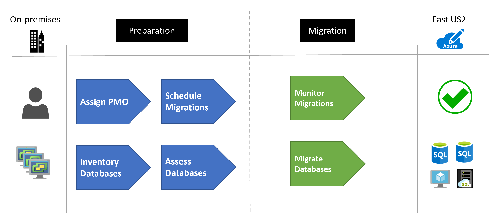
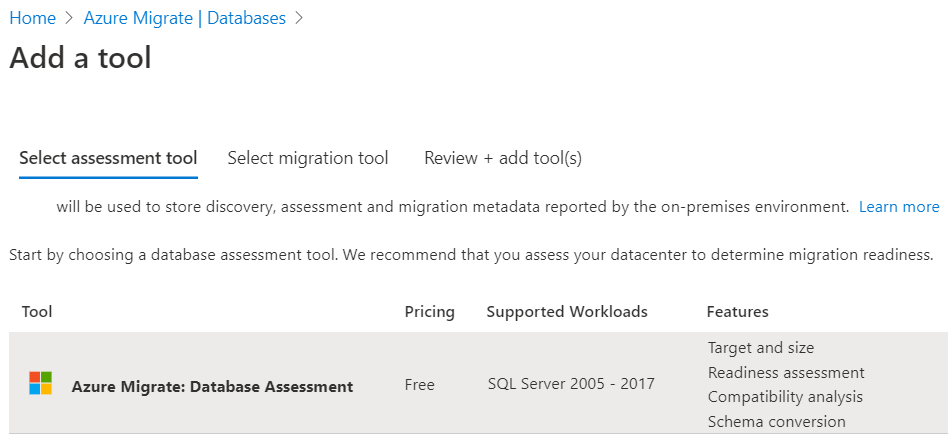
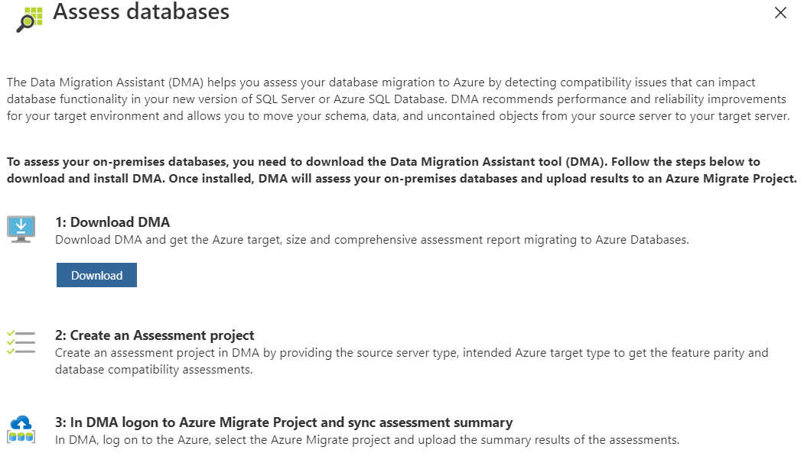
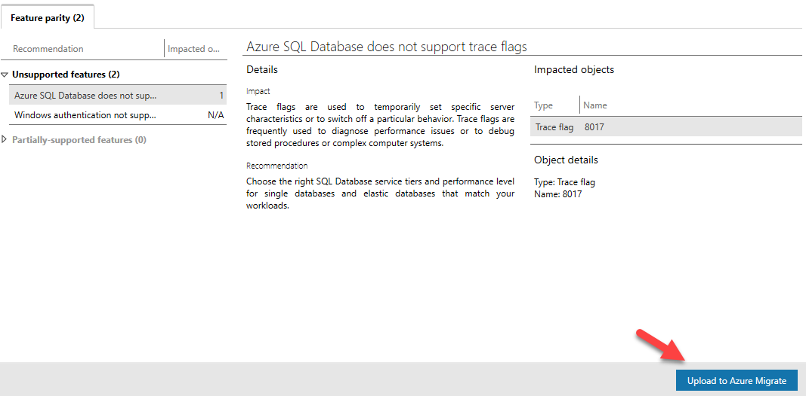

# Migrating SQL Server Databases to Azure (Scenario)

This article demonstrates how a fictional company Contoso assessed, planned and migrated their various on-premises SQL Server databases to Azure.

As Contoso considers migrating to Azure, the company needs a technical and financial assessment to determine whether its on-premises workloads are good candidates for cloud migration. In particular, the Contoso team wants to assess machine and database compatibility for migration.  Additionally, it wants to estimate capacity and costs for running Contoso's resources in Azure.

## Business drivers

Contoso is having various issues with maintaining all the wide array of versions of SQL Server workloads that exist on their network. After the latest investor's meeting, the CFO and CTO have made the decision to move all these workloads to Azure. This will allow them to shift from a structured capital expense model to a fluid operating expense model.

The IT leadership team has worked closely with business partners to understand the business and technical requirements:

- **Increase security** Contoso needs to be able to monitor and protect all data resources in a more timely and efficient manner.  They would also like to get a more centralized reporting system setup on database access patterns.

- **Optimize compute resources** Contoso has deployed a large on-premises server infrastructure. They have several SQL Server instances that consume but do not really use the underlying CPU, Memory and Disk allocated in efficient ways.

- **Increase efficiency** Contoso needs to remove unnecessary procedures, and streamline processes for developers and users. The business needs IT to be fast and not waste time or money, thus delivering faster on customer requirements. Database administration should be reduced and/or minimized after the migration.

- **Increase agility**  Contoso IT needs to be more responsive to the needs of the business. It must be able to react faster than the changes in the marketplace, to enable the success in a global economy. It mustn't get in the way, or become a business blocker.

- **Scale** As the business grows successfully, Contoso IT must provide systems that are able to grow at the same pace.  There are several legacy hardware environments that cannot be upgraded any further and are past or near end of support.

- **Costs** Business and applications owners want to know they won't be stuck with high cloud costs as compared to running the applications on-premises.

## Migration goals

The Contoso cloud team has pinned down goals for the various migrations. These goals were used to determine the best migration methods.

**Requirements** | **Details**
--- | ---
**Performance** | After migration, apps in Azure should have the same performance capabilities that apps have today in Contoso's on-premises environment. Moving to the cloud doesn't mean that app performance is less critical.
**Compatibility** | Contoso needs to understand the compatibility of its applications and databases with Azure. Contoso also needs to understand its Azure hosting options.
**Data sources** | All databases will be moved to Azure with no exceptions.  Based on the database and application analysis of the SQL features being used, they will move to PaaS, IaaS or Managed Instances.  All databases must move.
**App** | Apps will need to be moved to the cloud where possible. If they cannot move, then they will be allowed to connect to the migrated database over the Azure network through private connections only.
**Costs** | Contoso wants to understand not only its migration options, but also the costs associated with the infrastructure after it moves to the cloud.
**Management** | Resource Management groups will need to be created for the various departments along with Resource Groups to managed all SQL databases that are migrated. All resources will need to be tagged with department information for charge-back requirements.
**Limitations** | Initially, not all branch offices that run applications will have a direct ExpressRoute link to Azure, so these offices will need to connect through Virtual Network Gateways.

## Solution design

Contoso has already performed a [migration assessment](https://docs.microsoft.com//azure/cloud-adoption-framework/plan/contoso-migration-assessment) of their digital estate using [Azure Migrate](https://docs.microsoft.com//azure/migrate/migrate-services-overview) with the [Service Map](https://docs.microsoft.com//azure/azure-monitor/insights/service-map) feature.

The assessment results in multiple workloads spread across multiple departments. The overall size of the migration project will require a full Project Management Office (PMO), to manage the specifics of communication, resources and schedule planning.

### Solution Review

Contoso evaluates their proposed design by putting together a pros and cons list.

**Consideration** | **Details**
--- | ---
**Pros** | Azure will provide a single pane of glass into the database workloads  Costs will be monitored via Cost Management  Business charge-back billing will be easy to perform with the Billing API  Server and software maintenance will be reduced to only the IaaS based environments.
**Cons** | Due to the requirement of IaaS-based Virtual Machines, there will still need to be management of the software on those machines.

### Budget and Management

Before the migration can occur, the necessary Azure structure is required to be in place to support the administration and billing aspects of the solution.

For the management requirements, several [management groups](https://docs.microsoft.com//azure/governance/management-groups/overview) were created to support the organizational structure.

For the billing requirements, each of the Azure Resources are then [tagged](https://docs.microsoft.com//azure/azure-resource-manager/management/tag-resources) with the appropriate billing tags.

### Migration Process

Data migrations follow a standard repeatable pattern.  This involves the following steps based on [Microsoft best practices](https://datamigration.microsoft.com/):

- Pre-migration
  - Discovery - Inventory database assets and application stack
  - Assess - Assess workloads and fix recommendations
  - Convert - Convert source schema to work in the target
- Migration
  - Migrate - Migrate the source schema, source data and objects to target
  - Sync Data - Sync Data (for minimal downtime)
  - Cutover - Cut over the source to target
- Post-migration
  - Remediate Applications - Iteratively make and necessary changes to your applications
  - Perform Tests - Iteratively run functional and performance tests
  - Optimize - Based on tests, address performance issues and then retest to confirm performance improvements
  - Retire Assets - Old VMs and hosting environments are backed up and retired

#### Step 1 - Discovery

Contoso utilized Azure Migrate with the Service Map to surface the dependencies across the Contoso environment. Azure Migrate automatically discovered application components on Windows and Linux systems and mapped the communication between services. Using the Service Map feature of Azure Migrate they surfaced the connections between Contoso servers, processes, inbound and outbound connection latency, and ports across their TCP-connected architecture.  Contoso was only required to install the [Microsoft Monitoring Agent](https://docs.microsoft.com/azure/log-analytics/log-analytics-agent-windows) and [Microsoft Dependency](https://docs.microsoft.com/azure/azure-monitor/insights/vminsights-enable-hybrid-cloud#install-the-dependency-agent-on-windows) agents.

Contoso also added the Database Migration Assessment (DMA) tool to their Azure Migrate project.  By selecting this tool they are able to assess the databases for migration to Azure.

#### Step 2 - Application Assessment

The results from the assessment provided Contoso with the visibility that they utilizes mainly .NET-based applications, however, over the years various projects have utilized other technologies such as PHP and NodeJS.  Vendor purchased systems also introduced non-.NET based applications.  They have identified the following:

- ~800 .NET applications
- ~50 PHP applications
- 25 NodeJS applications
- 10 Java applications

#### Step 3- Database Assessment

As each database workload was discovered, the Database Migration Assessment (DMA), tool was utilized to determine which features were being used. DMA helps Contoso assess their database migrations to Azure by detecting compatibility issues that can impact database functionality in a new version of SQL Server or Azure SQL Database.

Contoso followed these steps to assess their databases and then upload results data to Azure Migrate:

1. Download DMA
1. Create an Assessment Project
1. In DMA logon to the Azure Migrate Project and sync assessment summary

DMA recommends performance and reliability improvements for your target environment and allows them to move their schema, data, and uncontained objects from a source server to a target server.

Learn more about the [Data Migration Assistant](https://docs.microsoft.com/sql/dma/dma-assesssqlonprem?view=sql-server-2017)

Contoso used the DMA to run the assessment and then uploaded the data directly to Azure Migrate.

With the database information now loaded into Azure Migrate, Contoso has identified over 1,000 database instances that must be migrated. Of these instances, roughly 40% can be moved to SQL Database for Azure. Of the remaining 60%, they must be moved to either an IaaS-based approach with a SQL Server on Azure Virtual Machines or moved to Azure SQL Server Managed Instances. Of the 60%, about 10% will require a virtual machine based approach, the remaining will be moved to Managed Instances.

When DMA was not able to be executed on a data source, the following guidelines were followed on the database migrations.

> ![NOTE]
> As part of the assessment phase, Contoso discovered various Open Source databases. Separately, they followed [this guide](ossdb-to-azure.md) for their migration planning.

#### Step 4 - Migration Planning

With the information at hand, Contoso uses the following guidelines to determine which migration method to use for each database.

**Target** | **Database Usage** | **Details** | **Online Migration** | **Offline Migration** | **Max Size** | **Migration Guide**
--- | --- | --- | --- | ---| --- | --- |
**Azure SQL Database (Paas)** | ***SQL Server (Data Only)*** | These databases simply utilize basic tables, columns, stored procedures and functions | [Data Migration Service](https://docs.microsoft.com/sql/dma/dma-overview), [Transactional Replication](https://docs.microsoft.com//azure/sql-database/sql-database-managed-instance-transactional-replication) | [BACPAC](https://docs.microsoft.com/sql/relational-databases/data-tier-applications/import-a-bacpac-file-to-create-a-new-user-database), [BCP](https://docs.microsoft.com//sql/tools/bcp-utility?view=sql-server-ver15) | 1TiB | [Link](https://docs.microsoft.com//azure/dms/tutorial-sql-server-to-azure-sql)
**Azure SQL Database Managed Instance** | ***SQL Server (Advanced features)*** | These databases utilize triggers and other [advanced concepts](https://docs.microsoft.com//azure/sql-database/sql-database-managed-instance-transact-sql-information#service-broker) such as custom .NET types, service brokers, etc. | [Data Migration Service](https://docs.microsoft.com/sql/dma/dma-overview), [Transactional Replication](https://docs.microsoft.com//azure/sql-database/sql-database-managed-instance-transactional-replication) | [BACPAC](https://docs.microsoft.com/sql/relational-databases/data-tier-applications/import-a-bacpac-file-to-create-a-new-user-database), [BCP](https://docs.microsoft.com//sql/tools/bcp-utility?view=sql-server-ver15), [Native backup/restore](https://docs.microsoft.com/azure/sql-database/sql-database-managed-instance-get-started-restore)| 2TiB-8TiB| [Link](https://docs.microsoft.com//azure/dms/tutorial-sql-server-managed-instance-online)
**SQL Server on Azure Virtual Machines (IaaS)** | ***SQL Server (3rd-party integrations)*** | The SQL Server must have [non-supported Managed Instances features](https://docs.microsoft.com//azure/sql-database/sql-database-managed-instance-transact-sql-information#service-broker) (cross-instance service brokers, cryptographic providers, buffer pool, compatibility levels below 100, database mirroring, FILESTREAM, Polybase, anything that requires access to file shares, External scripts, extended stored procedures, etc)  or 3rd party software installed to support the activities of the database | [Transactional Replication](https://docs.microsoft.com//azure/sql-database/sql-database-managed-instance-transactional-replication)|[BACPAC](https://docs.microsoft.com/sql/relational-databases/data-tier-applications/import-a-bacpac-file-to-create-a-new-user-database), [BCP](https://docs.microsoft.com//sql/tools/bcp-utility?view=sql-server-ver15), [Snapshot replication](https://docs.microsoft.com//azure/sql-database/sql-database-managed-instance-transactional-replication), [Native backup/restore](https://docs.microsoft.com/azure/sql-database/sql-database-managed-instance-get-started-restore), Convert physical machine to VM |  4GiB-64TiB | [Link](https://docs.microsoft.com//azure/virtual-machines/windows/sql/virtual-machines-windows-migrate-sql)

Due to the large number of databases, Contoso setup a project management office (PMO) to keep track of every database migration instance. [Accountability and responsibilities](https://docs.microsoft.com//azure/cloud-adoption-framework/migrate/migration-considerations/assess/) were assigned to each business and application team.

Contoso also performed a [workload readiness review](https://docs.microsoft.com//azure/cloud-adoption-framework/migrate/migration-considerations/assess/evaluate). This review examined the infrastructure, database and network components.

#### Step 5 - Test Migrations

The first part of the migration preparation involved a test migration of each of the databases to the pre-setup environments. In order to save time, they scripted all of the operations for the migrations and recorded the timings for each.  In order to speed up the migration, they identified what migration operations could be run concurrently.

Any rollback procedures were identified for each of the database workloads in case of some unexpected failures.

For the IaaS-based workloads, they pre-setup all the required 3rd party software.

After the test migration, Contoso was able to utilize the various Azure [cost estimation tools](https://docs.microsoft.com//azure/cloud-adoption-framework/migrate/migration-considerations/assess/estimate) to get a more accurate picture of the future operational costs of their migration.

#### Step 6 - Migration

For the production migration, Contoso identified the time-frames for all database migrations and what could be sufficiently executed in a weekend window (midnight Friday through midnight Sunday) with minimal downtime to the business.

Based on their documented test procedures, they execute each migration via scripting as much as possible, limiting any manual tasks to minimize errors.

If any migrations fail during the window, they are rolled back and re-scheduled in the next migration window.

### Clean up after migration

Contoso identified the archival window for all database workloads.  As the window expires, the resources will be retired from the on-premises infrastructure.

This would include:

- Remove the production data from on-premises servers
- Retire the hosting server when the last workload window expires

### Review the deployment

With the migrated resources in Azure, Contoso needs to fully operationalize and secure their new infrastructure.

#### Security

- Contoso needs to ensure that their new Azure database workloads are secure. [Learn more](https://docs.microsoft.com//azure/sql-database/sql-database-security-overview).
- In particular, Contoso should review the Firewall and virtual network configurations.
- Setup [Private Link](https://docs.microsoft.comazure/azure-sql/database/private-endpoint-overview) so that all database traffic is kept inside Azure and the on-premises network
- Enable [Advanced Threat Protection](https://docs.microsoft.com/en-us/azure/azure-sql/database/threat-detection-overview) for Azure SQL Database

#### Backups

- Ensure that the Azure databases are backed up using geo-restore.  This allows backups to be used in a paired region in case of a regional outage.
- **Important** Ensure that the Azure server resource has a [resource lock](https://docs.microsoft.com/azure/azure-resource-manager/management/lock-resources) to prevent it from being deleted.  Deleted servers cannot be restored.

#### Licensing and cost optimization

- Many Azure database workloads can be scaled up or down, therefore performance monitoring of the server and databases is important to ensure you are meeting your needs but also keeping costs at a minimum.
- Both CPU and Storage have costs associated. There are several pricing tiers to select from.  Be sure the appropriate pricing plan is selected for the data workloads.
- [Elastic Pools](https://docs.microsoft.com//azure/sql-database/sql-database-service-tiers-dtu) are to be implemented for databases that have compatible resource utilization patterns
- Each read replica is billed based on the compute and storage selected
- Utilize reserved capacity to save on costs

## Conclusion

In this article, Contoso assessed, planned and migrated their Microsoft SQL Server workloads to Azure.