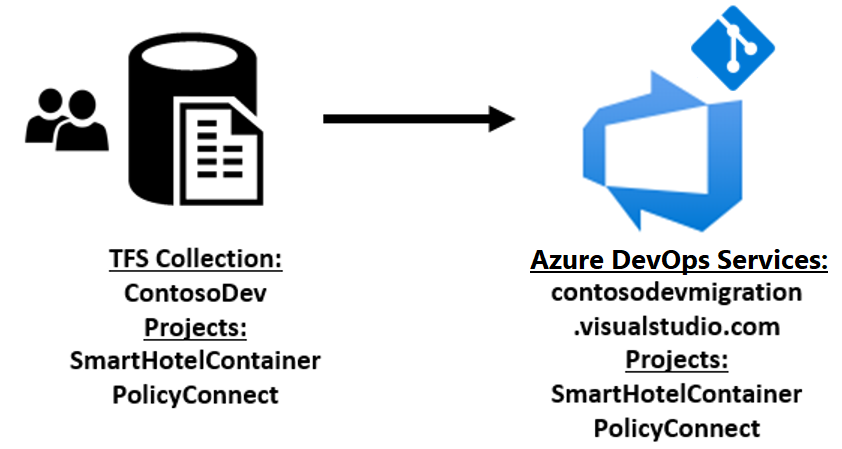
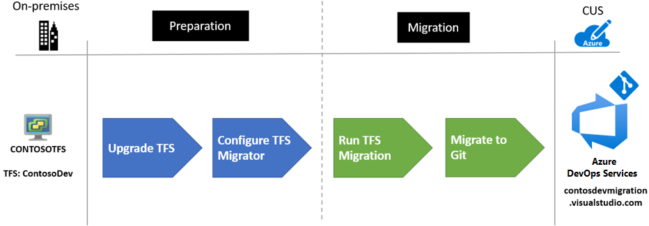
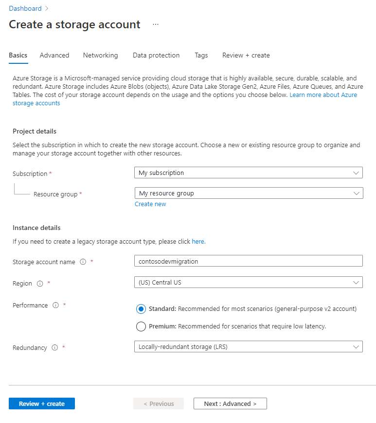
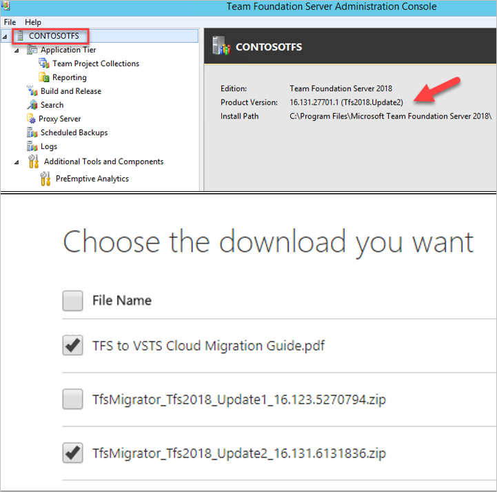
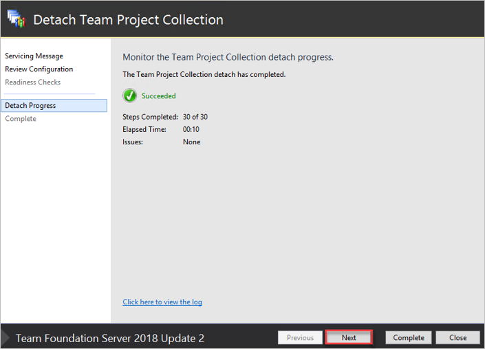
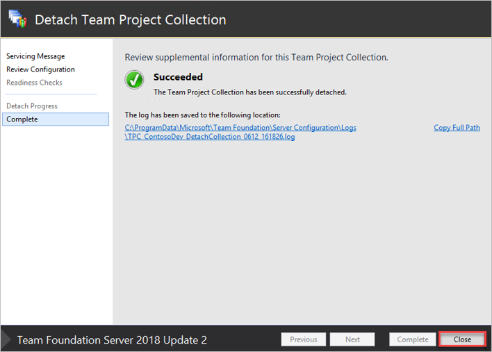
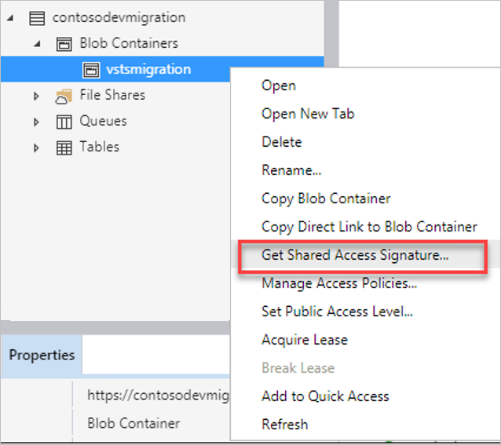
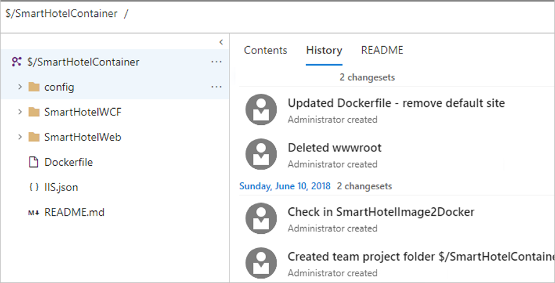
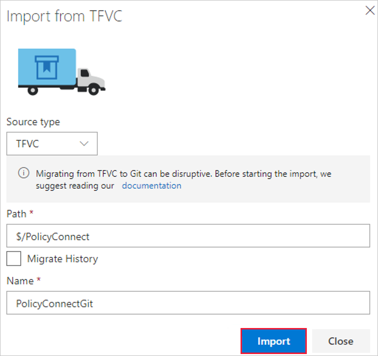

<!-- cSpell:ignore onmicrosoft visualstudio sourceconnectionstring smarthotelcontainer identitymaplog CONTOSOTFS DACPAC SQLDB SQLSERVERNAME INSTANCENAME sqlpackage SSDT azuredevopsmigration validateonly ImportType -->

# Refactor a Team Foundation Server deployment to Azure DevOps Services

This article shows how the fictional company Contoso refactors its on-premises Visual Studio Team Foundation Server deployment by migrating it to Azure DevOps Services in Azure. In this scenario, the Contoso development team has used Team Foundation Server for team collaboration and source control for the past five years. Now, the team wants to move to a cloud-based solution for developer and testing work, and for source control. Azure DevOps Services will play a key role as the Contoso team moves to an Azure DevOps model and develops new cloud-native applications.

## Business drivers

The Contoso IT leadership team has worked closely with business partners to identify their future goals. Although the partners aren't overly concerned with developer tools and technologies, the team has captured these points:

- **Software:** Regardless of their core business, all companies are now essentially software companies, including Contoso. Business leadership is interested in how Contoso IT can help lead the company with new working practices for users and new experiences for its customers.
- **Efficiency:** Contoso needs to streamline its processes and remove unnecessary procedures for developers and users. Doing so will allow the company to deliver on customer requirements more efficiently. The business needs Contoso IT to move quickly, without wasting time or money.
- **Agility:** To enable success in a global economy, Contoso needs to be more responsive to the needs of the business. It must be able to react more quickly to changes in the marketplace, and mustn't become a business blocker.

## Migration goals

The Contoso cloud team has the following goals for its migration to Azure DevOps Services:

- The team needs a tool to migrate its data to the cloud. Few manual processes should be needed.
- Work item data and history for the past year must be migrated.
- The team doesn't want to set up new user names and passwords. All current system assignments must be maintained.
- For source control, the team wants to move away from Team Foundation Version Control (TFVC) to Git.
- The transition to Git will be a tip migration that imports only the latest version of the source code. The transition will happen during a downtime, when all work will be halted as the code base shifts. The team understands that only the current main branch history will be available after the move.
- The team is concerned about the change and wants to test it before it does a full move. It wants to retain access to Team Foundation Server even after the move to Azure DevOps Services.
- The team has multiple collections and, to better understand the process, it wants to start with one that has only a few projects.
- The team understands that, because Team Foundation Server collections have a one-to-one relationship with Azure DevOps Services organizations, they have multiple URLs. This model matches its current model of separation for code bases and projects.

## Proposed architecture

- Contoso will move its Team Foundation Server projects to the cloud, and will no longer host its projects or source control on-premises.
- Team Foundation Server will be migrated to Azure DevOps Services.
- Currently, Contoso has one Team Foundation Server collection, named `ContosoDev`, which will be migrated to an Azure DevOps Services organization called `contosodevmigration.visualstudio.com`.
- The projects, work items, bugs, and iterations from the last year will be migrated to Azure DevOps Services.
- Contoso will use its Azure Active Directory (Azure AD) instance, which it set up when it [deployed its Azure infrastructure](./contoso-migration-infrastructure.md) at the beginning of the migration planning.

## Migration process

Contoso completes the migration process as follows:

1. Upgrades its Team Foundation Server implementation to a supported level.

   Contoso is currently running Team Foundation Server 2017 Update 3, but to use database migration it needs to run a supported 2018 version with the latest updates.

1. Runs the Team Foundation Server migration tool and validates its collection.

1. Builds a set of preparation files, and then does a migration dry run for testing.

1. Runs a full migration, which includes work items, bugs, sprints, and code.

1. Moves its code from TFVC to Git.

## Prerequisites

To run this scenario, Contoso must meet the following prerequisites:

| Requirements | Details |
| --- | --- |
| **Azure subscription** | Contoso created subscriptions in an earlier article in this series. If you don't have an Azure subscription, create a [free account](https://azure.microsoft.com/free/).    If you create a free account, you're the admin of your subscription and can perform all actions.    If you use an existing subscription and you're not the admin, you need to work with the admin to assign you Owner or Contributor permissions.    If you need more granular permissions, see [Manage site recovery access with Azure role-based access control (Azure RBAC)](/azure/site-recovery/site-recovery-role-based-linked-access-control). |
| **Azure infrastructure** | Contoso set up its Azure infrastructure as described in [Azure infrastructure for migration](./contoso-migration-infrastructure.md). |
| **On-premises Team Foundation Server instance** | The on-premises instance needs to either run Team Foundation Server 2018 upgrade 2 or be upgraded to it as part of this process. |

## Scenario steps

Here's how Contoso admins complete the migration:

> [!div class="checklist"]
>
> - **Step 1: Create an Azure storage account**. This storage account is used during the migration process.
> - **Step 2: Upgrade Team Foundation Server**. Contoso admins upgrade their deployment to Team Foundation Server 2018 upgrade 2.
> - **Step 3: Validate the Team Foundation Server collection**. Contoso admins validate the Team Foundation Server collection in preparation for the migration.
> - **Step 4: Build the migration files**. Contoso admins create the migration files by using the Team Foundation Server migration tool.

## Step 1: Create an Azure Storage account

1. In the Azure portal, create a storage account (`contosodevmigration`).
1. Place the account in the secondary region (`Central US`) to use for failover. Use a general-purpose standard account with locally redundant storage.

    

**Need more help?**

- [Introduction to Azure Storage](/azure/storage/common/storage-introduction).
- [Create a storage account](/azure/storage/common/storage-account-create).

<!-- docutune:casing "Server Configuration Wizard" "Configure Features Wizard" "Detach Team Project Collection Wizard" -->

## Step 2: Upgrade Team Foundation Server

Contoso admins upgrade the Team Foundation Server instance to Team Foundation Server 2018 Update 2. Before they start, they:

- Download [Team Foundation Server 2018 Update 2](https://visualstudio.microsoft.com/downloads/).
- Verify the [hardware requirements](/azure/devops/server/requirements).
- Read the [release notes](/visualstudio/releasenotes/tfs2018-relnotes) and [upgrade notes](/azure/devops/server/upgrade/get-started).

Contoso admins upgrade as follows:

1. Back up the Team Foundation Server instance, which is running on a VMware virtual machine (VM), and take a VMware snapshot.

   The Team Foundation Server installer starts

    

1. Choose the installation location. The installer requires internet access.

    

1. After the installation finishes, the Server Configuration Wizard starts.

    

1. After verification, the Server Configuration Wizard completes the upgrade.

     

1. Verify the Team Foundation Server installation by reviewing projects, work items, and code.

     

> [!NOTE]
> Some Team Foundation Server upgrades need to run the Configure Features Wizard after the upgrade finishes. [Learn more](/previous-versions/azure/devops/reference/upgrade/configure-features-after-upgrade?view=azure-devops&preserve-view=true&viewFallbackFrom=vsts).

**Need more help?**

Learn about [upgrading Team Foundation Server](/azure/devops/server/upgrade/get-started).

## Step 3: Validate the Team Foundation Server collection

Contoso admins run the Team Foundation Server migration tool against the `contosodev` collection database to validate it before migration:

1. Download and unzip the [Team Foundation Server migration tool](https://www.microsoft.com/download/details.aspx?id=54274). It's important to download the version for the Team Foundation Server update that's running. The version can be checked in the admin console.

    

1. Run the tool to perform the validation by specifying the URL of the project collection, as shown in the following command:

    `TfsMigrator validate /collection:http://contosotfs:8080/tfs/ContosoDev`

    The tool shows an error.

    

1. Locate the log files in the `Logs` folder, just before the tool location. A log file is generated for each major validation. `TfsMigration.log` holds the main information.

    

1. Find this entry, which is related to identity.

    

1. Run `TfsMigrator validate /help` at the command line. The command `/tenantDomainName` is required to validate identities.

     

1. They run the validation command again and include this value and their Azure AD name, `TfsMigrator validate /collection:http://contosotfs:8080/tfs/ContosoDev /tenantDomainName:contosomigration.onmicrosoft.com`.

    

1. In the Azure AD sign-in window that opens, enter the credentials of a global admin user.

     

1. The validation passes and the tool confirms it.

    

## Step 4: Build the migration files

With the validation complete, Contoso admins can use the Team Foundation Server migration tool to build the migration files.

1. Run the preparation step in the tool:

    `TfsMigrator prepare /collection:http://contosotfs:8080/tfs/ContosoDev /tenantDomainName:contosomigration.onmicrosoft.com /accountRegion:cus`

     

    The preparation step does the following:
    - Scans the collection to find a list of all users and then populates the identify map log (`IdentityMapLog.csv`).
    - Prepares the connection to Azure AD to find a match for each identity.
    - Because the Contoso admins have already deployed Azure AD and synchronized it by using Azure AD Connect, the prepare command will find the matching identities and mark them as **Active**.

1. After the Azure AD sign-in screen appears, enter the credentials of a global admin.

    

    The preparation is completed, and the tool reports that the import files have been generated successfully.

    

1. Verify that both the `IdentityMapLog.csv` file and the `import.json` file are created in a new folder.

    

   The `import.json` file provides import settings. It includes information such as the organization name and storage account details. Most of the fields are populated automatically, but some fields require user input. 

1. Open the `import.json` file and add the Azure DevOps Services organization name to be created, `contosodevmigration`.

   With this name, the Contoso Azure DevOps Services URL is `contosodevmigration.visualstudio.com`.

    

    > [!NOTE]
    > The organization must be created before the migration begins. It can be changed after the migration is completed.

1. Review the identity log map file, which shows the accounts brought into Azure DevOps Services during the import:

    - Active identities refer to identities that will become users in Azure DevOps Services after the import.
    - In Azure DevOps Services, these identities are licensed and displayed as users in the organization after migration.
    - The identities are marked as **Active** in the **Expected Import Status** column in the file.

    

## Step 5: Migrate to Azure DevOps Services

With the preparation completed, Contoso admins can focus on the migration. After they run the migration, they'll switch from using TFVC to Git for version control.

Before the Contoso admins start, they schedule downtime with the dev team, so that they can plan to take the collection offline for migration.

The Contoso admins follow this migration process:

1. **Detach the collection.** Identity data for the collection is stored in the configuration database for the Team Foundation Server instance while the collection is attached and online.

    When a collection is detached from the Team Foundation Server instance, a copy of that identity data is made and then packaged with the collection for transport. Without this data, the identity portion of the import can't be executed.

    We recommended that you keep the collection detached until the import has been completed, because changes that occur during the import can't be imported.

1. **Generate a backup.** The next step is to generate a backup that can be imported into Azure DevOps Services. The data-tier application component package (DACPAC) is a SQL Server feature that allows database changes to be packaged into a single file, and then deployed to other instances of SQL.

    The backup can also be restored directly to Azure DevOps Services, and used as the packaging method for getting collection data to the cloud. Contoso admins use the `sqlpackage.exe` tool to generate the DACPAC. This tool is included in SQL Server Data Tools.

1. **Upload to storage.** After the DACPAC is created, upload it to Azure Storage.

   After the upload, a shared access signature (SAS) is generated to allow the Team Foundation Server migration tool access to the storage.

1. **Fill out the import.** Complete the missing fields in the import file, including the DACPAC setting. To ensure that everything's working properly before the full migration, specify to perform a *dry-run* import.

1. **Perform a dry-run import.** A dry-run import helps to test the collection migration. Dry runs have a limited life, and are deleted automatically after a set duration and before a production migration runs. A success email sent after the import finishes includes a note that informs Contoso when the dry run is deleted.

1. **Complete the production migration.** With the dry-run migration completed, do the final migration by updating the `import.json` file and then running import again.

<!-- docutune:casing "Team Foundation Server Administration Console" -->

### Detach the collection

Before they detach the collection, Contoso admins take a local SQL Server instance backup and a VMware snapshot of the Team Foundation Server instance.

1. In the Team Foundation Server Administration Console, select the collection to detach, **ContosoDev**.

    

1. Select the **General** tab, and then select **Detach Collection**.

    

1. In the **Detach Team Project Collection** wizard, on the **Servicing Message** pane, provide a message for users who might try to connect to projects in the collection.

    

1. On the **Detach Progress** pane, monitor the progress. When the process finishes, select **Next**.

    

1. On the **Readiness Checks** pane, when the checks finish, select **Detach**.

    

1. After the collection has been successfully detached, select **Close**.

    

    The collection is no longer referenced in the Team Foundation Server Administration Console.

    

### Generate a DACPAC

Contoso admins create a backup, or DACPAC, to import into Azure DevOps Services.

- Contoso admins use the `sqlpackage.exe` utility in SQL Server Data Tools (SSDT) to create the DACPAC. Multiple versions of `sqlpackage.exe` are installed with SQL Server Data Tools, located under folders with names like `120`, `130`, and `140`. It's important to use the right version to prepare the DACPAC.

- Team Foundation Server 2018 imports must use `sqlpackage.exe` from the *140* folder or higher. For `CONTOSOTFS`, this file is located in `C:\Program Files (x86)\Microsoft Visual Studio\2017\Enterprise\Common7\IDE\Extensions\Microsoft\SQLDB\DAC\140`.

Contoso admins generate the DACPAC as follows:

1. Open a command prompt and go to the `sqlpackage.exe` location. To generate the DACPAC, run the following command:

    `SqlPackage.exe /sourceconnectionstring:"Data Source=SQLSERVERNAME\INSTANCENAME;Initial Catalog=Tfs_ContosoDev;Integrated Security=True" /targetFile:C:\TFSMigrator\Tfs_ContosoDev.dacpac /action:extract /p:ExtractAllTableData=true /p:IgnoreUserLoginMappings=true /p:IgnorePermissions=true /p:Storage=Memory`

    

    The following message appears:

    

1. Verify the properties of the DACPAC file.

    

### Upload the file to storage

After the admins create the DACPAC file, they upload it to the Azure Storage account.

1. Download and install [Azure Storage Explorer](https://azure.microsoft.com/features/storage-explorer/).

    

1. In Storage Explorer, connect to the subscription and then search for and select the storage account created for the migration (`contosodevmigration`). Create a new blob container, `azuredevopsmigration`.

    

1. On the **Upload files** pane, in the **Blob type** drop-down list, specify **Block Blob** for the DACPAC file upload.

    

1. After the file is uploaded, select the file name and then select **Generate SAS**. Expand the **Blob Containers** list under the storage account, select the container with the import files, and then select **Get Shared Access Signature**.

    

1. On the **Shared Access Signature** pane, accept the default settings and then select **Create**. These settings enable access for 24 hours.

    

1. Copy the shared access signature URL, so that it can be used by the Team Foundation Server migration tool.

    

> [!NOTE]
> The migration must happen within the allowed time window or the permissions will expire. Do *not* generate an SAS key from the Azure portal. Keys that are generated from the portal are account-scoped and won't work with the import.

### Fill in the import settings

Previously in this article, Contoso admins partially filled in the import specification file, `import.json`. Now, they need to add the remaining settings.

Open the `import.json` file and complete the following fields:

- **Location:** Enter the location of the SAS key that was generated previously.
- **DACPAC:** Enter the name of the DACPAC file previously uploaded to the storage account, making sure to include the *.dacpac* extension.
- **ImportType:** Enter **DryRun**.

### Perform a dry-run migration

Contoso admins perform a dry-run migration to make sure that everything's working as expected.

1. Open a command prompt, and then go to the `TfsMigrator` location (`C:\TFSMigrator`).
1. To make sure that the file is formatted properly, and that the SAS key is working, validate the import file by running the following command:

    `TfsMigrator import /importFile:C:\TFSMigrator\import.json /validateonly`

    The validation returns an error stating that the SAS key needs a longer period before it expires.

    

1. Use Azure Storage Explorer to create a new SAS key with the period before expiration set to seven days.

    

1. Update the `import.json` file and rerun the command. This time, the validation is completed successfully.

    `TfsMigrator import /importFile:C:\TFSMigrator\import.json /validateonly`

    

1. Start the dry run by running the following command:

    `TfsMigrator import /importFile:C:\TFSMigrator\import.json`

    A message displays requesting confirmation to continue with the migration. Note the seven-day period after the dry run during which the staged data will be maintained.

    

1. The Azure AD sign-in window opens. Contoso admins sign in to Azure AD with admin permissions.

    

    A message is displayed confirming that the import has been started successfully.

    

1. After 15 minutes, the following information is displayed on the website:

     

1. When the migration finishes, a Contoso dev lead signs in to Azure DevOps Services to ensure that the dry run worked properly. After authentication, Azure DevOps Services needs a few details to confirm the organization.

    

    The projects have been migrated successfully. A notice near the top of the page warns that the dry-run account will be deleted in 15 days.

    

1. The dev lead opens one of the projects, and then selects **Work Items** > **Assigned to me**. This page verifies that the work item data has been migrated successfully, along with the identity.

    

1. To confirm that the source code and history have been migrated, the dev lead checks other projects and code.

    

### Run the production migration

Now that the dry run is complete, Contoso admins move on to the production migration. They delete the dry run, update the import settings, and run import again.

1. In the Azure DevOps Services portal, delete the dry-run organization.
1. They update the `import.json` file to set the **ImportType** to **ProductionRun**.

    

1. Same as for the dry run, start the migration by running the following command:

    `TfsMigrator import /importFile:C:\TFSMigrator\import.json`.

    A message displays asking to confirm the migration. It warns that data could be held in a secure location as a staging area for up to seven days.

    

1. In the Azure AD sign-in window, specify a Contoso admin sign-in.

    

    A message displays stating that the import has started successfully.

    

1. After 15 minutes, view the following information on the web site:

    

1. After the migration finishes, a Contoso dev lead signs into Azure DevOps Services to ensure that the projects were migrated properly. 

    

1. The dev lead opens one of the projects and selects **Work Items** > **Assigned to me**. This page shows that the work item data has been migrated, along with the identity.

    

1. The dev lead confirms that the other work item data has been migrated.

    

1. To confirm that the source code and history have been migrated, the dev lead checks other projects and code.

    

### Move source control from TFVC to Git

Now that migration is complete, Contoso admins next need to move source code management from TFVC to Git. To do so, the admins import the source code that's currently in their Azure DevOps Services organization as Git repos in the same organization.

1. In the Azure DevOps Services portal, open one of the TFVC repos, `$/PolicyConnect`, and review it.

    

1. In the source **$/PolicyConnect** drop-down list, select **Import repository**.

    

1. In the **Source type** drop-down list, select **TFVC**. In the **Path** box, specify the path to the repo, and then select **Import**. Leave the **Migrate History** check box cleared.

    

    > [!NOTE]
    > Because TFVC and Git store version control information differently, we recommend that Contoso *not* migrate its repository history. 

1. After the import finishes, review the code.

    

1. Repeat the process for the second repository, `$/smarthotelcontainer`.

    

1. After the dev lead reviews the source, the migration to Azure DevOps Services is done. Azure DevOps Services now becomes the source for all development within the teams involved in the migration.

    

**Need more help?**

For more information, see [Import repositories from TFVC to Git](/azure/devops/repos/git/import-from-tfvc?view=azure-devops&preserve-view=true&viewFallbackFrom=vsts).

## Clean up after migration

With the migration now complete, the Contoso team needs to do the following tasks:

- Review the [post-import](/azure/devops/migrate/migration-post-import?view=azure-devops&preserve-view=true&viewFallbackFrom=vsts) article for information about additional import activities.
- Either delete the TFVC repos or place them in read-only mode. Don't use the code bases. Instead, reference them for their history.

## Post-migration training

The Contoso team needs to provide Azure DevOps Services and Git training for relevant team members.
