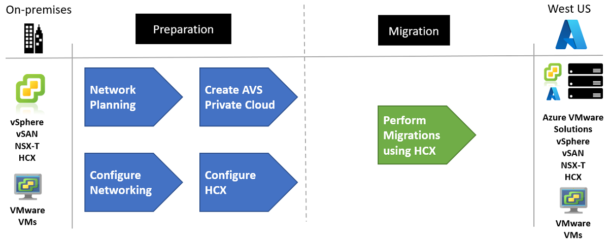
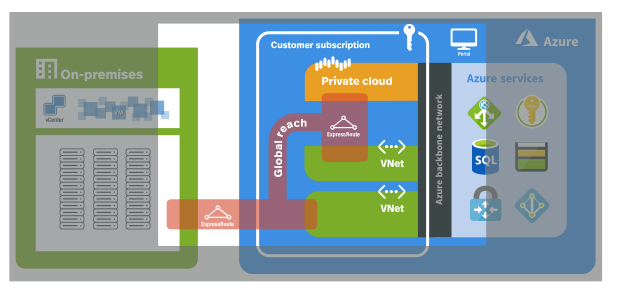
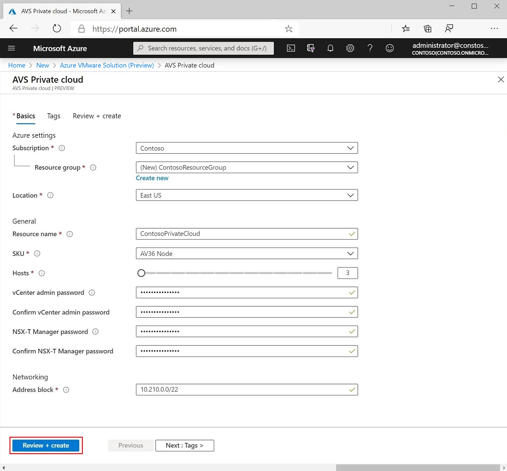
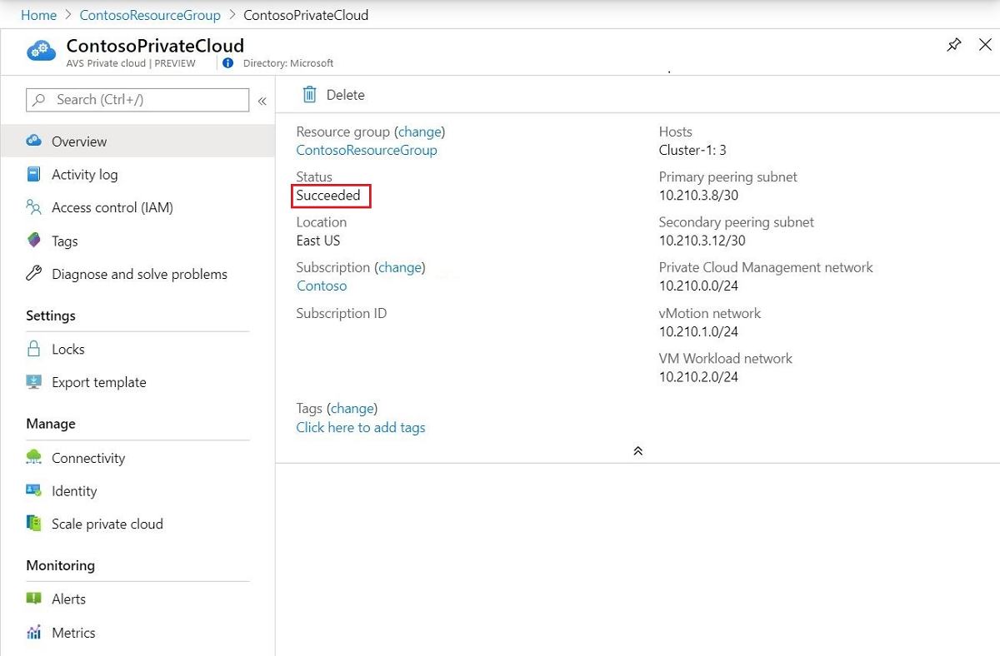
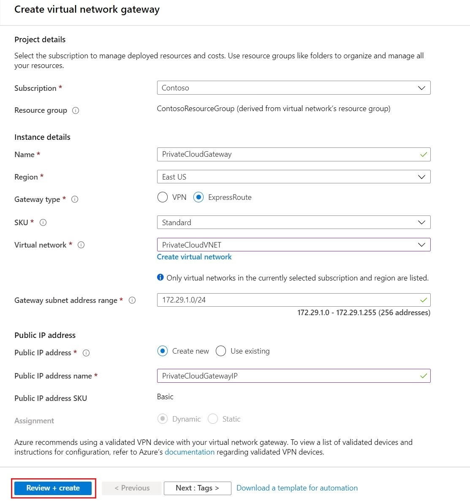
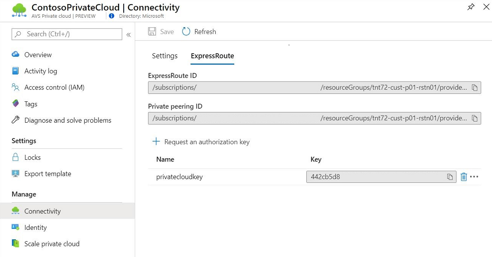
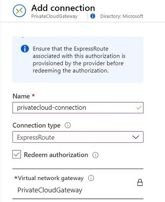
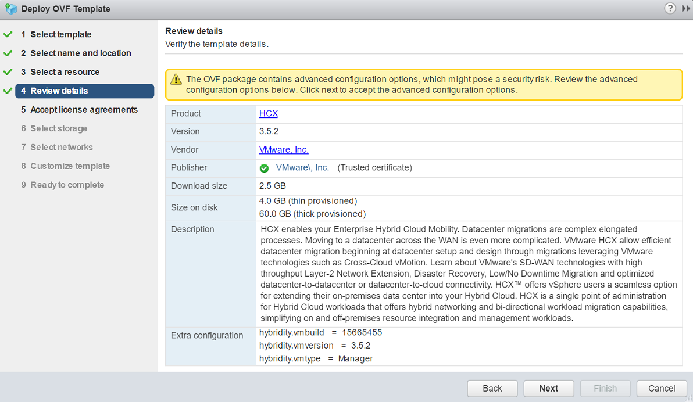
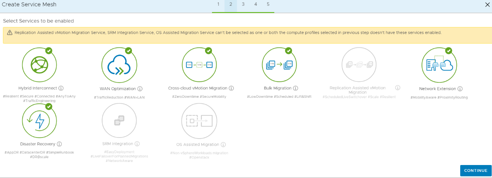
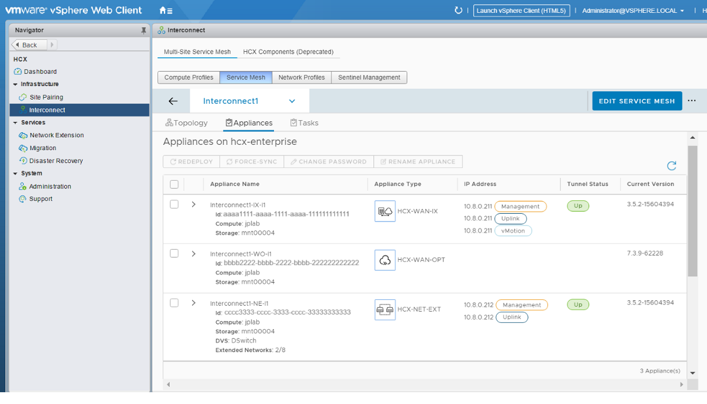

<!-- docutune:casing "HCX Bulk Migration" "HCX Cold Migration" -->

# Move on-premises VMware infrastructure to Azure

When fictional company Contoso migrates its VMware virtual machines (VMs) from an on-premises datacenter to Azure, two options are available to the team. This article focuses on Azure VMware Solution, which Contoso has determined to be the better migration option.

| Migration options | Outcome |
| --- | --- |
| [Azure Migrate](https://azure.microsoft.com/services/azure-migrate/) | <li>[Assess](/azure/migrate/tutorial-assess-vmware-azure-vm) and [migrate](/azure/migrate/tutorial-migrate-vmware) on-premises VMs. <li>Run workloads using Azure infrastructure as a service (IaaS). <li>Manage VMs with [Azure Resource Manager](https://azure.microsoft.com/features/resource-manager/). |
| [Azure VMware Solution](https://azure.microsoft.com/services/azure-vmware/) | <li>Use VMware Hybrid Cloud Extension (HCX) or vMotion to move on-premises VMs. <li>Run native VMware workloads on Azure bare-metal hardware. <li>Manage VMs using vSphere. |

In this article, Contoso uses Azure VMware Solution to create a private cloud in Azure with native access to VMware vCenter and other tools that are supported by VMware for workload migration. Contoso can confidently use Azure VMware Solution, knowing that it's a first-party Microsoft offering backed by VMware.

## Business drivers

Working closely with business partners, the Contoso IT team defines the business drivers for a VMware migration to Azure. These drivers can include:

- **Datacenter evacuation or shutdown:** Seamlessly move VMware-based workloads when they consolidate or retire existing datacenters.
- **Disaster recovery and business continuity:** Use a VMware stack deployed in Azure as a primary or secondary on-demand disaster recovery site for on-premises datacenter infrastructure.
- **Application modernization:** Tap into the Azure ecosystem to modernize Contoso applications without having to rebuild VMware-based environments.
- **Implementing DevOps:** Bring Azure DevOps tool chains to VMware environments and modernize applications at its own pace.
- **Ensure operational continuity:** Redeploy vSphere-based applications to Azure while avoiding hypervisor conversions and application refactoring. Extend support for legacy applications that run Windows and SQL Server.

## Goals for migrating VMware on-premises to VMware in the cloud

With its business drivers in mind, Contoso has pinned down a few goals for this migration:

- Continue managing its existing environments with VMware tools that are familiar to its teams, while modernizing the applications with native Azure services.
- Seamlessly move Contoso VMware-based workloads from its datacenter to Azure, and integrate the VMware environment with Azure.
- After migration, the application in Azure should have the same performance capabilities as it does today in VMware. The application remains as critical in the cloud as it is on-premises.

These goals support Contoso's decision to use Azure VMware Solution and validate it as the best migration method.

## Benefits of running VMware workloads in Azure

By using Azure VMware Solution, Contoso can now seamlessly run, manage, and secure applications across VMware environments and Azure with a common operating framework.

Contoso will capitalize on existing VMware investments, skills, and tools, including VMware vSphere, vSAN, and vCenter. At the same time, Contoso gets the scale, performance, and innovation of Azure. Additionally, it can:

- Set up VMware infrastructure in the cloud in minutes.
- Modernize applications at its own pace.
- Enhance VMware applications with dedicated, isolated, high-performance infrastructure and unique Azure products and services.
- Move or extend on-premises VMs to Azure without having to refactor its applications.
- Get scale, automation, and fast provisioning for VMware workloads on global Azure infrastructure.
- Benefit from a solution that's delivered by Microsoft, verified by VMware, and run on Azure infrastructure.

## The solutions design

After Contoso pins down its goals and requirements, the company designs and reviews a deployment solution and identifies the migration process.

### Current architecture

Contoso's current architecture features:

- VMs deployed to an on-premises datacenter that's managed by [vSphere](https://www.vmware.com/products/vsphere.html).
- Workloads deployed on a VMware ESXi host cluster that's managed with [vCenter](https://www.vmware.com/products/vcenter-server.html), [vSAN](https://www.vmware.com/products/vsan.html), and [NSX](https://www.vmware.com/products/nsx.html).

### Proposed architecture

In its proposed architecture, Contoso will:

- Deploy an [Azure VMware Solution private cloud](/azure/azure-vmware/concepts-private-clouds-clusters) to the West US Azure region.
- Connect the on-premises datacenter to Azure VMware Solution running in West US by using virtual networks and [ExpressRoute](/azure/azure-vmware/concepts-networking) with Global Reach enabled.
- Migrate VMs to dedicated Azure VMware Solution by using [VMware Hybrid Cloud Extension (HCX)](https://docs.vmware.com/en/VMware-HCX/services/user-guide/GUID-D0CD0CC6-3802-42C9-9718-6DA5FEC246C6.html).


## Solution review

Contoso evaluates its proposed design by putting together a pros and cons list, as shown in the following table:

| Consideration | Details |
| --- | --- |
| **Pros** | <li> Bare-metal VMware infrastructure with high performance. <li> Infrastructure that's fully dedicated to Contoso and is physically isolated from the infrastructure of other customers. <li> Because Contoso is using a rehost that uses VMware, there's no special configuration or migration complexity. <li> Contoso can take advantage of its investment in Software Assurance by using the [Azure Hybrid Benefit](https://azure.microsoft.com/pricing/hybrid-benefit/) and [extended security updates](/windows-server/) for legacy Windows and SQL platforms. <li> Contoso will retain full control of the application VMs in Azure. <br><br> |
| **Cons** | <li>Contoso will need to continue supporting the application as VMware VMs rather than move them to a managed service such as Azure App Service and Azure SQL Database. <li>Azure VMware Solution is set up and priced based on a minimum of three large nodes rather than individual VMs in Azure IaaS. Contoso will need to plan its capacity needs, because the company currently uses an on-premises environment that restricts it from the on-demand nature of other services in Azure. |

> [!NOTE]
> For information about pricing, see [Azure VMware Solution pricing](https://azure.microsoft.com/pricing/details/azure-vmware/).

## Migration process

Contoso will move its VMs to Azure VMware Solution by using the VMware HCX tool. The VMs will run in an Azure VMware Solution private cloud. [VMware HCX migration methods](https://docs.vmware.com/en/VMware-HCX/services/user-guide/GUID-8A31731C-AA28-4714-9C23-D9E924DBB666.html) include running a bulk or cold migration. VMware vMotion or Replication-assisted vMotion (RAV) is a method reserved for workloads that run through a live migration.

To complete the process, the Contoso team:

- Plans its networking in Azure and ExpressRoute.
- Creates the Azure VMware Solution private cloud by using the Azure portal.
- Configures the network to include the ExpressRoute circuits.
- Configures the HCX components to connect its on-premises vSphere environment to the Azure VMware Solution private cloud.
- Replicates the VMs and then moves them to Azure by using VMware HCX.

 

## Scenarios steps

> [!div class="checklist"]
>
> - **Step 1: Network planning**
> - **Step 2: Create an Azure VMware Solution private cloud**
> - **Step 3: Configure networking**
> - **Step 4: Migrate VMs using HCX**

### Step 1: Network planning

Contoso needs to plan out its networking to include Azure Virtual Network and connectivity between on-premises and Azure. The company needs to provide a high-speed connection between its on-premises and Azure-based environments, along with a connection to the Azure VMware Solution private cloud.

This connectivity is delivered through Azure ExpressRoute and will require some specific network address ranges and firewall ports for enabling the services. This high-bandwidth, low-latency connection allows Contoso to access services that run in its Azure subscription from the Azure VMware Solution private cloud environment.

Contoso will need to plan an IP address scheme that includes non-overlapping address space for its [virtual networks](/azure/virtual-network/virtual-network-vnet-plan-design-arm). The company will need to include a gateway subnet for the [ExpressRoute gateway](/azure/expressroute/expressroute-about-virtual-network-gateways).

The Azure VMware Solution private cloud is connected to Contoso's virtual network in Azure by using another Azure ExpressRoute connection. ExpressRoute Global Reach will be enabled to allow [direct connection](/azure/azure-vmware/concepts-networking#on-premises-interconnectivity) from on-premises VMs to VMs running on the Azure VMware Solution private cloud. The ExpressRoute Premium SKU is required to enable Global Reach.



Azure VMware Solution private clouds require, at minimum, a `/22` CIDR network address block for subnets. To connect to on-premises environments and virtual networks, this must be a non-overlapping network address block.

> [!NOTE]
> To learn about network planning for Azure VMware Solution, see [Networking checklist for Azure VMware Solution](/azure/azure-vmware/tutorial-network-checklist).

### Step 2: Create an Azure VMware Solution private cloud

With its network and IP address planning completed, Contoso will next focus on setting up the Azure VMware Solution service in the West US Azure region. By using Azure VMware Solution, Contoso can deploy a vSphere cluster in Azure.

An Azure VMware Solution private cloud is an isolated, VMware software-defined datacenter that supports ESXi hosts, vCenter, vSAN, and NSX. The stack runs on dedicated and isolated bare-metal hardware nodes in an Azure region. The minimum initial deployment for an Azure VMware Solution private cloud is three hosts. Additional hosts can be added one at a time, up to a maximum of 16 hosts per cluster.

For more information, see [Azure VMware Solution preview private cloud and cluster concepts](/azure/azure-vmware/concepts-private-clouds-clusters).

Azure VMware Solution private clouds are managed through the Azure VMware Solution portal. Contoso has its own vCenter Server in its own management domain.

To learn how to create Azure VMware Solution private clouds, see [Deploy an Azure VMware Solution private cloud in Azure](/azure/azure-vmware/tutorial-create-private-cloud).

1. The Contoso team first registers the Azure VMware Solution provider with Azure by running the following command:

    ```bash
    az provider register -n Microsoft.AVS --subscription <your subscription ID>
    ```

1. In the Azure portal, the team creates the Azure VMware Solution private cloud by providing the networking information from the plan. The team then selects **Review + create**. This step takes about two hours.

    

1. The team verifies that the Azure VMware Solution private cloud deployment is complete by going to the resource group and selecting the private cloud resource. The status is displayed as **Succeeded**.

    

### Step 3: Configure networking

An Azure VMware Solution private cloud requires a virtual network. Because Azure VMware Solution doesn't support an on-premises vCenter during preview, Contoso requires additional steps for integration with its on-premises environment. By setting up an ExpressRoute circuit and a virtual network gateway, the team connects its virtual networks to the Azure VMware Solution private cloud.

For more information, see [Configure networking for your VMware private cloud in Azure](/azure/azure-vmware/tutorial-configure-networking).

1. The Contoso team first creates a virtual network with a gateway subnet.

    > [!IMPORTANT]
    > The team must use an address space that *does not* overlap with the address space that it used when it created the private cloud.

1. The team creates the ExpressRoute VPN gateway, making sure to select the correct SKU, and then selects **Review + create**.

    

1. The team gets the authorization key to connect ExpressRoute to the virtual network. The key is found on the connectivity screen of the Azure VMware Solution private cloud resource in the Azure portal.

    

1. The team connects the ExpressRoute to the VPN gateway that connects the Azure VMware Solution private cloud to the Contoso virtual network. It does this by creating a connection in Azure.

    

For more information, see [Learn how to access an Azure VMware Solution private cloud](/azure/azure-vmware/tutorial-access-private-cloud).

### Step 4: Migrate by using VMware HCX

To move VMware VMs to Azure using HCX, the Contoso team will need to follow these high-level steps:

- Install and configure VMware HCX.
- Perform migrations to Azure by using HCX.

For more information, see [Install HCX for Azure VMware Solution](/azure/azure-vmware/tutorial-deploy-vmware-hcx).

#### Install and configure VMware HCX for the public cloud

[VMware HCX](https://cloud.vmware.com/vmware-hcx) is a VMware product that's part of the Azure VMware Solution default installation. HCX Advanced is installed by default, but it can be upgraded to HCX Enterprise as additional features and functionality are required.

Azure VMware Solution automates the cloud manager component of HCX in Azure VMware Solution. It provides the customer activation keys and download link to the connector HCX appliance that must be configured on the on-premises side and in a customer's vCenter domain. These elements are then paired with the Azure VMware Solution cloud appliance, so that customers can take advantage of services such as migration and Layer 2 stretch.

- The Contoso team is deploying the HCX by using an OVF package that's provided by VMware.

   

   To install and configure HCX for your Azure VMware Solution private cloud, see [Install HCX for Azure VMware Solution](/azure/azure-vmware/tutorial-deploy-vmware-hcx).

- As the team is configuring HCX, it has chosen to enable migration and other options, including disaster recovery.

   

   For more information, see [HCX installation workflow for HCX public clouds](https://docs.vmware.com/en/VMware-HCX/services/user-guide/GUID-FDE5473E-6B71-4A71-85B6-8C9BA2B73686.html).

#### Migrate VMs to Azure by using HCX

When both the on-premises datacenter (source) and the Azure VMware Solution private cloud (destination) are configured with the VMware cloud and HCX, Contoso can begin migrating its VMs. The team can move VMs to and from VMware HCX-enabled datacenters by using multiple migration technologies.

- Contoso's HCX application is online, and the status is green. The team is now ready to migrate and protect Azure VMware Solution VMs by using HCX.

  

#### VMware HCX Bulk Migration

This migration method uses the VMware vSphere replication protocols to move multiple VMs simultaneously to a destination site. Benefits include:

- This method is designed to move multiple VMs in parallel.
- The migration can be set to finish on a predefined schedule.
- The VMs run at the source site until failover begins. The service interruption is equivalent to a reboot.

#### VMware HCX vMotion live migration

This migration method uses the VMware vMotion protocol to move a single VM to a remote site. Benefits include:

- This method is designed to move one VM at a time.
- There's no service interruption when the VM state is migrated.

#### VMware HCX Cold Migration

This migration method uses the VMware near-field communication protocol. The option is automatically selected when the source VM is powered off.

#### VMware HCX Replication-assisted vMotion

VMware HCX RAV combines the benefits of VMware HCX Bulk Migration, which include parallel operations, resiliency, and scheduling, with the benefits of VMware HCX vMotion migration, which include zero downtime during VM state migration.

## Additional resources

For additional VMware technical documentation, see:

- [VMware HCX documentation](https://docs.vmware.com/en/VMware-HCX/index.html)
- [Migrate virtual machines by using VMware HCX](https://docs.vmware.com/en/VMware-HCX/services/user-guide/GUID-D0CD0CC6-3802-42C9-9718-6DA5FEC246C6.html?hWord=N4IghgNiBcIBIGEAaACAtgSwOYCcwBcMB7AOxAF8g)
