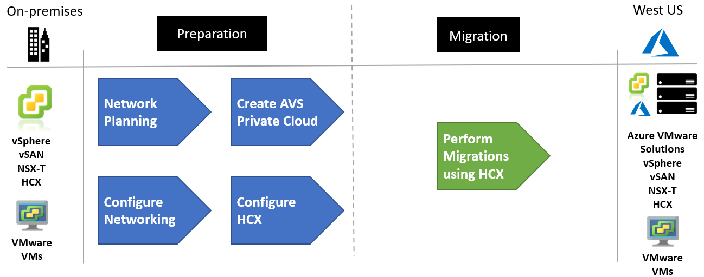

<!-- cSpell:ignore deltadan VMware contoso contoso's host vcenter -->
# Moving on-premises VMware infrastructure to Azure (Scenario)

Contoso has several options available when migrating VMware virtual machines (VMs) from an on-premises data center to Azure.

**Migration Options** | **Outcome**
--- | ---
[**Azure Migrate**](https://azure.microsoft.com//services/azure-migrate/) | [Assess](https://docs.microsoft.com//azure/migrate/tutorial-assess-vmware) and [migrate](https://docs.microsoft.com//azure/migrate/tutorial-migrate-vmware) on-premises VMs.<br/><br/>Run workloads using Azure IaaS. <br/><br/> Manage VMs with [Azure Resource Manager](https://azure.microsoft.com//features/resource-manager/).
[**Azure VMware Solutions**](https://azure.microsoft.com//overview/azure-vmware/) | Use VMware HCX or vMotion to move on-premises VMs.<br/><br/> Run native VMware workloads on Azure bare metal hardware.<br/><br/> Manage VMs using vSphere.

Azure VMware Solutions is used to create a Private Cloud in Azure with native access to VMware vCenter, and other tools supported by VMware for workload migration. Contoso can then confidently use Azure VMware Solutions, knowing that they're first-party Microsoft offerings backed by VMware.

> ![NOTE]
> This article focuses on using Azure VMware Solutions (AVS), to move on-premises VMware environment VMs to Azure.

## Business drivers

Working closely with business partners, the Contoso IT team will define the business drivers for a VMware migration to Azure.  These drivers may include:

- Data center evacuation or shutdown. Seamlessly move VMware based workloads when they consolidate or retire existing data centers.
- Disaster recovery and business continuity. Use a VMware stack deployed in Azure as a primary or secondary on-demand disaster recovery site for on-premises data center infrastructure.
- Application modernization. Tap into the Azure ecosystem to modernize Contoso's applications without having to rebuild VMware-based environments.
- Implementing DevOps. Bring Azure DevOps tool chains to VMware environments and modernize applications at their own pace.
- Ensure operational continuity. Redeploy vSphere-based applications to Azure while avoiding hypervisor conversions and application refactoring. Extend support for legacy applications running Windows and SQL Server.

## VMware on-premises to VMware in the cloud goals

With the Business drivers in mind, Contoso has pinned down goals for this migration:

- Continue managing their existing environments with VMware tools familiar to their teams, while modernizing the applications with Native Azure services.
- Seamlessly move Contoso's VMware-based workloads from their data center to Azure and integrate the VMware environment with Azure. 
- After migration, the app in Azure should have the same performance capabilities as it does today in VMware. The app will remain as critical in the cloud as it is on-premises.

These goals support the decision to leverage AVS and validate it as the best migration method for Contoso.

## Benefits of Running VMware workloads in Azure

Using Azure VMware Solutions (AVS), Contoso can now seamlessly run, manage, and secure applications across VMware environments and Microsoft Azure with a common operating framework.

Contoso will capitalize on existing VMware investments, skills, and tools, including VMware vSphere, vSAN, and vCenter, while leveraging the scale, performance, and innovation of Azure. Additional benefits may include:

- Provision VMware infrastructure in the cloud in minutes and modernize applications at their own pace.
- Enhance VMware applications with dedicated, isolated, high-performance infrastructure and unique Azure products and services.
- Move or extend on-premises VMs to Azure without refactoring applications.
- Get scale, automation, and fast provisioning for VMware workloads on global Azure infrastructure.
- Azure VMware Solutions are delivered by Microsoft, verified by VMware, and run on Azure infrastructure.

## Solutions design

After pinning down goals and requirements, Contoso designs and reviews a deployment solution, and identifies the migration process.

### Current architecture

- VMs deployed to an on-premises data center managed by [vSphere](https://www.vmware.com/products/vsphere.html).
- Workloads deployed on a VMware ESXi host cluster managed with [vCenter](https://www.vmware.com/products/vcenter-server.html), [vSan](https://www.vmware.com/products/vsan.html) and [NSX](https://www.vmware.com/products/nsx.html).

### Proposed architecture

- Deploy [AVS Private Cloud](https://docs.microsoft.com/en-us/azure/azure-vmware/concepts-private-clouds-clusters) into the West US Azure region.
- Connect the on-premises data center to AVS running in West US using Virtual networks [ExpressRoute](https://docs.microsoft.com/en-us/azure/azure-vmware/concepts-networking) with Global Reach enabled.
- Migrate VMs to dedicated Azure VMware Solutions using [VMware Hybrid Cloud Extension (HCX)](https://docs.vmware.com/en/VMware-HCX/services/user-guide/GUID-D0CD0CC6-3802-42C9-9718-6DA5FEC246C6.html).


## Solution Review

Contoso evaluates the proposed design by putting together a pros and cons list.

**Consideration** | **Details**
--- | ---
Pros | Bare metal VMware infrastructure with high performance. Infrastructure that is fully dedicated to Contoso and is physically isolated from infrastructure of other customers.<br/><br/>Since Contoso is using a rehost using VMware there is, no special configuration or migration complexity.<br/><br/>Contoso can take advantage of their investment in Software Assurance, using the [Azure Hybrid Benefit](https://azure.microsoft.com/pricing/hybrid-benefit/) and [Extended Security Updates](https://www.microsoft.com/cloud-platform/windows-server-2008) for legacy Windows and SQL platforms.<br/><br/>Contoso will retain full control of the app VMs in Azure.<br/><br/>
Cons | Contoso will need to continue supporting the app as VMware VMs rather than moving them to a managed service such as Azure App Service and Azure SQL Database.<br/><br/>Azure VMware Solutions are provisioned and priced based on a minimum of three large nodes rather than individual VMs in Azure IaaS. They will need to plan their capacity needs as they don on-premises today rather than benefits from the on-demand nature of other services in Azure.

> ![NOTE]
> Learn more about the [pricing](https://azure.microsoft.com/pricing/details/azure-vmware/) of Azure VMware Solutions.

## Migration process

Contoso will move VMs to AVS using the VMware HCX tool. The VMs will run in an AVS Private Cloud.  [VMware HCX migration types](https://docs.vmware.com/en/VMware-HCX/services/user-guide/GUID-8A31731C-AA28-4714-9C23-D9E924DBB666.html) include Bulk Migration, Cold Migration, and even while a workload is running through live migration using vMotion or Replication Assisted vMotion (RAV).

- Contoso plans their networking in Azure and ExpressRoute.
- Contoso creates the AVS Private Cloud using the Azure portal.
- The network is then configured including the ExpressRoute circuits.
- Contoso next configures the HCX components to connects their on-premises vSphere environment to the AVS Private Cloud.
- The VMs are then replicated and moved to Azure using VMware HCX.

 

## Scenarios steps

1. Network planning
1. Create an AVS private Cloud
1. Configure Networking
1. Migrate VMs using HCX

### Step 1: Network planning
Contoso needs to plan out their networking including Azure virtual networks and connectivity between on-premises and Azure. Contoso needs to provide a high speed connection between the on-premises and the Azure-based environments along with connection to AVS private cloud. 

This connectivity is delivered through Azure ExpressRoute and will require some specific network address ranges and firewall ports for enabling the services. This high bandwidth, low latency connection allows Contoso's users to access services running in their Azure subscription from the AVS private cloud environment.

Contoso will need to plan a IP Addresses scheme which includes non-overlapping address space for their [virtual networks](https://docs.microsoft.com/azure/virtual-network/virtual-network-vnet-plan-design-arm). They will need to include a GatewaySubnet for the [ExpressRoute Gateway](https://docs.microsoft.com/azure/expressroute/expressroute-about-virtual-network-gateways).

The AVS private cloud is connected to Contoso's Azure virtual network using another Azure ExpressRoute connection. ExpressRoute Global Reach will be enabled to allow [direct connection](https://docs.microsoft.com/azure/azure-vmware/concepts-networking#on-premises-interconnectivity) from on-premises to VMs running on the AVS Private Cloud. The ExpressRoute Premium SKU is required to enable Global Reach.


AVS private clouds require a minimum of a /22 CIDR network address block for subnets. In order to connect to on-premises environments and virtual networks, this must be a non-overlapping network address block.

>![NOTE]
> Learn about network planning for AVS using a [tutorial](https://docs.microsoft.com/azure/azure-vmware/tutorial-network-checklist/).

### Step 2: Create an AVS private Cloud

With their network and IP address planning completed, Contoso will next focus on provisioning the AVS service in the West US Azure region. AVS gives Contoso the ability to deploy a vSphere cluster in Azure. 

An AVS private cloud is an isolated VMware SDDC that supports ESXi hosts, vCenter, vSAN, and NSX. The stack runs on dedicated and isolated bare metal hardware nodes in an Azure region. The minimum initial deployment for an AVS private cloud is three hosts. Additional hosts can be added one at a time, up to a maximum of 16 hosts per cluster.

>![NOTE]
> Learn more about AVS [private cloud concepts](https://docs.microsoft.com/azure/azure-vmware/concepts-private-clouds-clusters).

AVS Private Clouds are managed through the AVS portal. They have their own vCenter server in its own management domain. 

>![NOTE]
> Learn to create AVS private Clouds using a [tutorial](https://docs.microsoft.com/azure/azure-vmware/tutorial-create-private-cloud).

 - Contoso first registers the AVS provider with Azure using the following command.

```azurecli-interactive
az provider register -n Microsoft.AVS --subscription <your subscription ID>
```

- Using the Azure portal, Contoso creates the AVS private cloud providing the networking information from their plan.


> [!NOTE]
> This step takes roughly two hours. 

- Contoso verifies the AVS private cloud deployment has completed by navigating to the resource group and selecting the private cloud resource. When the deployment is completed the status of shows as **Succeeded**.


### Step 3: Configure Networking

An Azure VMware Solution (AVS) private cloud requires a virtual network. Because AVS won't support your on-premises vCenter during preview, additional steps for integration with your on-premises environment are needed. Setting up an ExpressRoute circuit and a Virtual Network Gateway will connect their virtual networks to the AVS private cloud.

>![NOTE]
> Learn about configuring networking for AVS using a [tutorial](https://docs.microsoft.com/azure/azure-vmware/tutorial-configure-networking).

- Contoso first creates a virtual network with an GatewaySubnet.

> [!IMPORTANT]
> Contoso must use an address space that **does not** overlap with the address space used when they created the private cloud.

- Next, they create the ExpressRoute VPN Gateway making sure to select the correct SKU.


- They need the authorization key to connect ExpressRoute to the virtual network. This is found on the Connectivity screen of the AVS private cloud resource in the Azure portal.


- Finally, they connect the ExpressRoute to the VPN Gateway connecting the AVS private cloud to their virtual network. This is accomplished by creating an Connection in Azure.


>![NOTE]
> Learn how to access the private cloud and connect to vSphere using this [tutorial](https://docs.microsoft.com/azure/azure-vmware/tutorial-access-private-cloud).

### Step 4: Migrate using VMware HCX

To move VMware VMs to Azure using HCX, Contoso will need to follow these high-level steps:

- Install and configure VMware HCX
- Perform migrations to Azure using HCX

>![NOTE]
> Learn how to install HCX for AVS using this [tutorial](https://docs.microsoft.com/azure/azure-vmware/hybrid-cloud-extension-installation).

#### Install and configure VMware HCX for Public Cloud

[VMware HCX](https://cloud.vmware.com/vmware-hcx) is a VMware product part of the Azure VMware Solutions default installation. By default HCX Advanced is installed but can be upgraded to HCX Enterprise for more features as an additional feature. AVS automates the "Cloud Manager" component of HCX in AVS and provides the customer activation keys and download link to the "Connector" HCX appliance required to be configured on the on-premise side and in the customers vCenter domain. These will then be paired with the AVs cloud appliance and customers can start to enjoy services like migration and L2 stretch if so desired.

- Contoso is deploying the HCX using an OVA provided by VMware.


Please refer to this guide for configuring HCX for your AVS Private cloud.

>![NOTE]
> Learn how to install HCX for AVS using this [tutorial](https://docs.microsoft.com/azure/azure-vmware/hybrid-cloud-extension-installation).

- During the configuration of HCX, Contoso has selected to enable migration among other options including Disaster Recovery.


> Note: Learn more about [HCX Installation Workflow for HCX Public Clouds](https://docs.vmware.com/en/VMware-HCX/services/user-guide/GUID-FDE5473E-6B71-4A71-85B6-8C9BA2B73686.html).

#### Perform migrations to Azure using HCX

When both the on-premises data center (source), and AVS Private Cloud (destination) configured with VMware Cloud and HCX, Contoso can begin migrating VMs.  Virtual Machines can be moved to and from VMware HCX-enabled data centers using multiple migration technologies.

- Contoso's HCX application is online and the status is green. They are now ready to migrate and protect AVS VMs using HCX


#### VMware HCX Bulk Migration

This migration method uses the VMware vSphere Replication protocols to move the virtual machines to a destination site.

- The Bulk migration option is designed for moving virtual machines in parallel.
- This migration type can set to complete on a pre-defined schedule.
- The virtual machine runs at the source site until the failover begins. The service interruption with the bulk migration is equivalent to a reboot.

#### VMware HCX live vMotion

This method uses the VMware vMotion protocol to move a virtual machine to a remote site.

- The vMotion option is designed for moving a single virtual machine at a time.
- Virtual machine state is moved. There is no service interruption during the VMware HCX vMotion.

#### VMware HCX Cold Migration

This migration method uses the VMware NFC protocol. It is automatically selected when the source virtual machine is powered off.

#### VMware HCX Replication Assisted vMotion

VMware HCX Replication Assisted vMotion (RAV) combines advantages from VMware HCX Bulk Migration (parallel operations, resiliency, and scheduling) with VMware HCX vMotion (zero downtime virtual machine state migration).

> ![IMPORTANT] 
> See [VMware HCX documentation](https://docs.vmware.com/en/VMware-HCX/index.html) and [Migrating Virtual Machines with VMware HCX](https://docs.vmware.com/en/VMware-HCX/services/user-guide/GUID-D0CD0CC6-3802-42C9-9718-6DA5FEC246C6.html?hWord=N4IghgNiBcIBIGEAaACAtgSwOYCcwBcMB7AOxAF8g) in the VMware technical documentation.
