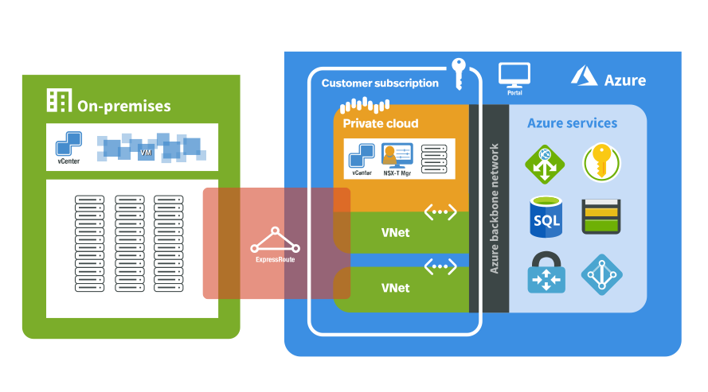

<!-- cSpell:ignore deltadan VMware contoso contoso's host vcenter -->
# Moving on-premises VMware infrastructure to Azure (Scenario)

Contoso has several options available when migrating VMware virtual machines (VMs) from an on-premises data center to Azure.

**Migration Options** | **Outcome**
--- | ---
[**Azure Migrate**](https://azure.microsoft.com//services/azure-migrate/) | [Assess](https://docs.microsoft.com//azure/migrate/tutorial-assess-vmware) and [migrate](https://docs.microsoft.com//azure/migrate/tutorial-migrate-vmware) on-premises VMs.  Run workloads using Azure IaaS.    Manage VMs with [Azure Resource Manager](https://azure.microsoft.com//features/resource-manager/).
[**Azure VMware Solutions**](https://azure.microsoft.com//overview/azure-vmware/) | Use VMware HCX or vMotion to move on-premises VMs.   Run native VMware workloads on Azure bare metal hardware.   Manage VMs using vSphere.

Azure VMware Solutions is used to create a Private Cloud in Azure with native access to VMware vCenter, and other tools supported by VMware for workload migration. Contoso can then confidently use Azure VMware Solutions, knowing that they're first-party Microsoft offerings backed by VMware.

> ![NOTE]
> This article focuses on using Azure VMware Solutions (AVS), to move on-premises VMware environment VMs to Azure.

## Business drivers

Working closely with business partners, the Contoso IT team will define the business drivers for a VMware migration to Azure.  These drivers may include:

- Data center evacuation or shutdown. Seamlessly move VMware based workloads when they consolidate or retire existing data centers.
- Disaster recovery and business continuity. Use a VMware stack deployed in Azure as a primary or secondary on-demand disaster recovery site for on-premises data center infrastructure.
- Application modernization. Tap into the Azure ecosystem to modernize Contoso's applications without having to rebuild VMware-based environments.
- Implementing DevOps. Bring Azure DevOps tool chains to VMware environments and modernize applications at their own pace.
- Ensure operational continuity. Redeploy vSphere-based applications to Azure while avoiding hypervisor conversions and application refactoring. Extend support for legacy applications running Windows and SQL Server.

## VMware on-premises to VMware in the cloud goals

With the Business drivers in mind, Contoso has pinned down goals for this migration:

- Continue managing their existing environments with VMware tools familiar to their teams, while modernizing the applications with Native Azure services.
- Seamlessly move Contoso's VMware-based workloads from their data center to Azure and integrate the VMware environment with Azure. 
- After migration, the app in Azure should have the same performance capabilities as it does today in VMware. The app will remain as critical in the cloud as it is on-premises.

These goals support the decision to leverage AVS and validate it as the best migration method for Contoso.

## Benefits of Running VMware workloads in Azure

Using Azure VMware Solutions (AVS), Contoso can now seamlessly run, manage, and secure applications across VMware environments and Microsoft Azure with a common operating framework.

Contoso will capitalize on existing VMware investments, skills, and tools, including VMware vSphere, vSAN, and vCenter, while leveraging the scale, performance, and innovation of Azure. Additional benefits may include:

- Provision VMware infrastructure in the cloud in minutes and modernize applications at their own pace.
- Enhance VMware applications with dedicated, isolated, high-performance infrastructure and unique Azure products and services.
- Move or extend on-premises VMs to Azure without refactoring applications.
- Get scale, automation, and fast provisioning for VMware workloads on global Azure infrastructure.
- Azure VMware Solutions are delivered by Microsoft, verified by VMware, and run on Azure infrastructure.

# Solutions design

After pinning down goals and requirements, Contoso designs and reviews a deployment solution, and identifies the migration process.

### Current architecture

- VMs deployed to an on-premises data center managed by [vSphere](https://www.vmware.com/products/vsphere.html).
- Workloads deployed on a VMware ESXi host cluster managed with [vCenter](https://www.vmware.com/products/vcenter-server.html), [vSan](https://www.vmware.com/products/vsan.html) and [NSX](https://www.vmware.com/products/nsx.html).

### Proposed architecture

- Deploy [AVS Private Cloud](https://docs.microsoft.com/en-us/azure/azure-vmware/concepts-private-clouds-clusters) into the West US Azure region.
- Connect the on-premises data center to AVS running in West US using Virtual networks [ExpressRoute](https://docs.microsoft.com/en-us/azure/azure-vmware/concepts-networking) with Global Reach enabled.
- Migrate VMs to dedicated Azure VMware Solutions using [VMware Hybrid Cloud Extension (HCX)](https://docs.vmware.com/en/VMware-HCX/services/user-guide/GUID-D0CD0CC6-3802-42C9-9718-6DA5FEC246C6.html).

## Solution Review

Contoso evaluates the proposed design by putting together a pros and cons list.

**Consideration** | **Details**
--- | ---
Pros | Bare metal VMware infrastructure with high performance. Infrastructure that is fully dedicated to Contoso and is physically isolated from infrastructure of other customers.  Since Contoso is using a rehost using VMware there is, no special configuration or migration complexity.  Contoso can take advantage of their investment in Software Assurance, using the Azure Hybrid Benefit and [Extended Security Updates](https://www.microsoft.com/cloud-platform/windows-server-2008) for legacy Windows and SQL platforms.  Contoso will retain full control of the app VMs in Azure.  
Cons | Contoso will need to continue supporting the app as VMware VMs rather than moving them to a managed service such as Azure App Service and Azure SQL Database.  Azure VMware Solutions are provisioned and priced based on a minimum of three large nodes rather than individual VMs in Azure IaaS. They will need to plan their capacity needs as they don on-premises today rather than benefits from the on-demand nature of other services in Azure.

> ![NOTE]
> Learn more about the [pricing](https://azure.microsoft.com/pricing/details/azure-vmware/) of Azure VMware Solutions.

## Migration process

Contoso will move VMs to AVS using the VMware HCX tool. The VMs will run in an AVS Private Cloud.  [VMware HCX migration types](https://docs.vmware.com/en/VMware-HCX/services/user-guide/GUID-8A31731C-AA28-4714-9C23-D9E924DBB666.html) include Bulk Migration, Cold Migration, and even while a workload is running through live migration using vMotion or Replication Assisted vMotion (RAV).

- As a first step, Contoso prepares the Azure components for AVS.
- Contoso creates the AVS Service using the Azure portal and then provisions the AVS Nodes.
- The AVS Private cloud is then created and the networking is configured including the ExpressRoute circuits.
- Contoso next configures the HCX components to connect their on-premises vSphere environment to the AVS Private Cloud.
- The VMs are then replicated and moved to Azure using VMware HCX.

    

> ![NOTE]
>  NSX-T is not a requirement, most environments will have standard VDS-based networking

## Scenarios steps

1. Network planning
1. Create an AVS private Cloud
1. Configure Networking
1. Migrate VMs using HCX

### Step 1: Network planning
With the AVS nodes now deployed, Contoso moves on to creating the AVS Private cloud. An AVS Private Cloud is an isolated VMware stack that supports ESXi hosts, vCenter, vSAN, and NSX.

AVS Private Clouds are managed through the AVS portal. They have their own vCenter server in its own management domain. The stack runs on dedicated nodes and isolated bare metal hardware nodes.

>![NOTE]
> Learn about network planning for AVS using a [tutorial](https://docs.microsoft.com/azure/azure-vmware/tutorial-network-checklist).

### Step 2: Create an AVS private Cloud

Contoso will provision the AVS service in the West US Azure region, where the AVS service is available. The AVS service allows them o provision nodes, reserve nodes, and create AVS Private Clouds. The AVS also service defines the edge network of Azure VMware Solution by AVS. This edge network is used by services that include VPN, ExpressRoute, and Internet connectivity to their AVS Private Clouds.

>![NOTE]
> Learn to create AVS private Clouds using a [tutorial](https://docs.microsoft.com/azure/azure-vmware/tutorial-create-private-cloud).

### Step 3: Configure Networking

From the Azure portal, Contoso follows these steps:

1. Select the AVS service to create the AVS Private Cloud.

2. From Overview, Contoso clicks Create AVS Private Cloud to open a new browser tab for AVS portal.

3. In the AVS portal, Contoso provides a name and selects the location for the AVS Private Cloud.

4. Next, they select the node type, consistent with what was provisioned on Azure, along with the node count. At least three nodes are required to create an AVS Private Cloud.

5. On the Advanced Options, they enter the CIDR range for vSphere/vSAN subnets. Contoso makes sure that the CIDR range doesn't overlap with any of their on-premises or other Azure subnets (virtual networks) or with the Gateway subnet.

>Important: IP addresses in the vSphere/vSAN CIDR range are reserved for use by the AVS Private Cloud infrastructure. The IP addresses in this range on any VMs. Learn more about [VLANS and subnets for AVS](https://docs.microsoft.com//azure/vmware-cloudsimple/cloudsimple-vlans-subnets).

After reviewing the final information, the AVS Private Cloud provisioning process starts. It can take up to two hours for the AVS Private Cloud to be provisioned.

>Note: Learn to configure an AVS Private Cloud environment using a [tutorial](https://docs.microsoft.com//azure/vmware-cloudsimple/quickstart-create-private-cloud).

### Step 4: Migrate VMs using HCX

Once the AVS Private Cloud is provisioned, Contoso will use the following steps to configure the networking:

- Create a Point to Site VPN for administrator access to vCenter
- Create VLANs/Subnets for VMware workloads
- Connect to AVS with ExpressRoute

### Point-to-Site VPN

The first step is to create a Point-to-Site connection which will allow the administrator to connect to the vCenter.

1. Contoso launches AVS portal and selects Network, VPN Gateway and then New VPN Gateway.

2. Contoso then selects Point-to-Site VPN and enters a name for the Gateway, selecting the Azure region where the AVS Private Cloud is deployed. A client subnet will used to provide DHCP addresses to clients.

3. Contoso selects the VLANs/Subnets to allow address and then clicks Add management VLANs/Subnets of AVS Private Clouds. The administrator's user accounts are selected allowing them access to vCenter.

4. Once provisioned the administrator will then use the portal to connect to the vCenter via an on-demand Point to Site connection. After launching the AVS portal and selecting Network, VPN Gateway, they select it from the Point-to-Site VPN gateway list.

5. Contoso selects Users and then clicks Download my VPN configuration.

6. Using the downloaded configuration, the administrator starts an on-demand

### Point-to-Site VPN connecting to the AVS

>Note: Learn to create a [Point-to-Site VPN](https://docs.microsoft.com//azure/vmware-cloudsimple/quickstart-create-private-cloud#create-point-to-site-vpn) connection to an AVS Private Cloud.
With the Point-to-Site connection up the Contoso administrator can now sign in to vCenter to set up virtual machines and policies.

1. To access vCenter, start from the AVS portal they will click Launch vSphere Client. Select the AVS Private Cloud and then click Launch vSphere Client on the AVS Private Cloud.

### Create VLANs/Subnets for VMware workloads

Contoso's administrator next needs to create VLANs where the VMs will be deployed.

1. From the Azure VMware Solutions portal, the administrator will use the VLANS/Subnets menu to click Create VLAN/Subnet.

2. Selecting the AVS Private Cloud for the new VLAN/subnet and then a VLAN ID from the list. Also, a Subnet name to identify the subnet along with a CIDR range and mask are entered making sure that the range doesn't overlap existing subnets. The VLAN will need to be assigned to an existing portgroup or create a new portgroup.

3. With the VLANs/Subnets created the administrators can now connect to the NSX manager to further configure the VMware networking.  This is done by locating the FQDN on the Resources page in the portal.

>Note: This is where distributed port groups or NSX-T logical switches can be configured. To learn more about how [VMware networking](https://docs.vmware.com/en/VMware-vSphere/6.5/vsphere-esxi-vcenter-server-65-networking-guide.pdf) can be configured.

### Connect to AVS with ExpressRoute

Contoso has already setup their ExpressRoute connection from their on-premises data center to the West US region and established a [private peering](https://docs.microsoft.com//azure/expressroute/expressroute-howto-routing-portal-resource-manager#private) to their virtual network.  Now they are ready to connect their on-premises networks to the AVS environment.

Connecting Contoso's on-premises network to the AVS Private Cloud network allows them to use the AVS Private Cloud in various ways, including the following scenarios:

- Access the AVS Private Cloud network without creating a Site-to-Site VPN connection.
- Use the on-premises Active Directory as an identity source on your AVS Private Cloud.
- Migrate virtual machines running on-premises to the AVS Private Cloud.
- Use the AVS Private Cloud as part of a disaster recovery solution.
- Consume on-premises resources on the AVS Private Cloud workload VMs.

AVS provides Contoso with an ExpressRoute circuit for the AVS Private Cloud. This allows for creating a connection between the on-premises ExpressRoute to the AVS Private Cloud.

To do this, Contoso will use Azure feature called Global Reach that allows two ExpressRoute circuits to connect with each other. This method establishes a secure, private, high bandwidth, low latency connection between the two environments.

>Note: Learn more about [ExpressRoute Global Reach](https://docs.microsoft.com//azure/expressroute/expressroute-global-reach) used to connect the on-premises ExpressRoute to the AVS Private Clouds ExpressRoute.

Contoso completes the following steps to connect ExpressRoute:

1. Using the portal, they create an ExpressRoute authorization.

2. Contoso creates a [support ticket](https://portal.azure.com/#blade/Microsoft_Azure_Support/HelpAndSupportBlade/newsupportrequest) with the VMware Solutions (AVS) team providing the requested information and authorization key for the connection to be created.

>Note: Learn more about connecting [AVS and ExpressRoute](https://docs.microsoft.com//azure/vmware-cloudsimple/on-premises-connection).

## Step 5: Migrate using VMware HCX

To move VMware VMs to Azure using HCX, Contoso will need to follow these high-level steps:

1. Install and configure VMware HCX
2. Perform migrations to Azure using HCX

### Install and configure VMware HCX for Public Cloud

[VMware HCX](https://cloud.vmware.com/vmware-hcx) is an add-on to the VMware Cloud (VMC) and Software-Defined Data Center (SDDC). After enabling the HCX add-on from the VMC console, the HCX Cloud components are deployed and the HCX plug-in is available in the vSphere Client.

In order to use HCX for migrations administrators [must install the HCX plug-in](https://docs.vmware.com/en/VMware-HCX/services/user-guide/GUID-A26BFB16-FA94-426F-8E18-15BAD4BF840E.html) on both the Source and Target data center vSphere.  In public cloud deployments, HCX is installed and configured by the public cloud provider.

> Note: Learn more about [HCX Installation Workflow for HCX Public Clouds](https://docs.vmware.com/en/VMware-HCX/services/user-guide/GUID-FDE5473E-6B71-4A71-85B6-8C9BA2B73686.html).

#### Perform migrations to Azure using HCX

When both the on-premises data center (source), and AVS Private Cloud (destination) configured with VMware Cloud and HCX, Contoso can begin migrating VMs.  Virtual Machines can be moved to and from VMware HCX-enabled data centers using multiple migration technologies.

#### VMware HCX Bulk Migration

This migration method uses the VMware vSphere Replication protocols to move the virtual machines to a destination site.

- The Bulk migration option is designed for moving virtual machines in parallel.
- This migration type can set to complete on a pre-defined schedule.
- The virtual machine runs at the source site until the failover begins. The service interruption with the bulk migration is equivalent to a reboot.

#### VMware HCX live vMotion

This method uses the VMware vMotion protocol to move a virtual machine to a remote site.

- The vMotion option is designed for moving a single virtual machine at a time.
- Virtual machine state is moved. There is no service interruption during the VMware HCX vMotion.

#### VMware HCX Cold Migration

This migration method uses the VMware NFC protocol. It is automatically selected when the source virtual machine is powered off.

#### VMware HCX Replication Assisted vMotion

VMware HCX Replication Assisted vMotion (RAV) combines advantages from VMware HCX Bulk Migration (parallel operations, resiliency, and scheduling) with VMware HCX vMotion (zero downtime virtual machine state migration).

>Note: Learn more about [migrating VMs using HCX](https://docs.vmware.com/en/VMware-HCX/services/user-guide/GUID-D0CD0CC6-3802-42C9-9718-6DA5FEC246C6.html).