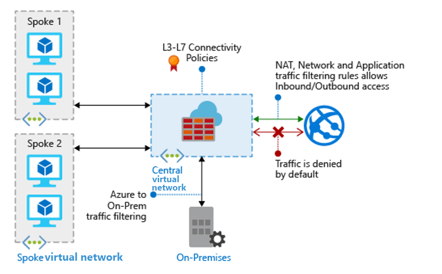

<!-- cSpell:ignore NSGs CIDR FQDNs BGP's ACLs WAFs -->

# Best practices to set up networking for workloads migrated to Azure

As you plan and design for migration, in addition to the migration itself, one of the most critical steps is the design and implementation of Azure networking. This article describes best practices for networking when you're migrating to infrastructure as a service (IaaS) and platform as a service (PaaS) implementations in Azure.

> [!IMPORTANT]
> The best practices and opinions described in this article are based on the Azure platform and service features available at the time of writing. Features and capabilities change over time. Not all recommendations might be applicable for your deployment, so select those that work for you.

## Design virtual networks

Azure provides virtual networks with these capabilities:

- Azure resources communicate privately, directly, and securely with each other over virtual networks.
- You can configure endpoint connections on virtual networks for VMs and services that require internet communication.
- A virtual network is a logical isolation of the Azure cloud that's dedicated to your subscription.
- You can implement multiple virtual networks within each Azure subscription and Azure region.
- Each virtual network is isolated from other virtual networks.
- Virtual networks can contain private and public IP addresses defined in [RFC 1918](https://datatracker.ietf.org/doc/html/rfc1918), expressed in classless inter-domain routing (CIDR) notation. Public IP addresses specified in a virtual network's address space aren't directly accessible from the internet.
- Virtual networks can connect to each other by using virtual network peering. Connected virtual networks can be in the same region or different regions; resources in one virtual network can connect to resources in other virtual networks.
- By default, Azure routes traffic between subnets within a virtual network, connected virtual networks, on-premises networks, and the internet.

When planning your virtual network topology, you should consider how to arrange IP address spaces, how to implement a hub and spoke network topology, how to segment virtual networks into subnets, setting up DNS, and implementing Azure Availability Zones.

## Best practice: Plan IP addressing

When you create virtual networks as part of your migration, it's important to plan out your virtual network IP address space.

You should assign an address space that isn't larger than a CIDR range of `/16` for each virtual network. Virtual networks allow for the use of 65,536 IP addresses. Assigning a smaller prefix than `/16`, such as a `/15`, which has 131,072 addresses, will result in the excess IP addresses becoming unusable elsewhere. It's important not to waste IP addresses, even if they're in the private ranges defined by RFC 1918.

Other tips for planning are:

- The virtual network address space shouldn't overlap with on-premises network ranges.
- Overlapping addresses can cause networks that can't be connected, and routing that doesn't work properly.
- If networks overlap, you'll need to redesign the network.
- If you absolutely can't redesign the network, network address translation (NAT) can help but should be avoided or limited as much as possible.

**Learn more:**

- Read the [Azure Virtual Network overview](/azure/virtual-network/virtual-networks-overview).
- Review the [Azure Virtual Network FAQ](/azure/virtual-network/virtual-networks-faq).
- Learn about [Azure networking limits](/azure/azure-resource-manager/management/azure-subscription-service-limits).

## Best practice: Implement a hub and spoke network topology

A hub and spoke network topology isolates workloads while sharing services, such as identity and security. The hub is an Azure virtual network that acts as a central point of connectivity. The spokes are virtual networks that connect to the hub virtual network by using peering. Shared services are deployed in the hub, while individual workloads are deployed as spokes.

Consider the following:

- Implementing a hub and spoke topology in Azure centralizes common services, such as connections to on-premises networks, firewalls, and isolation between virtual networks. The hub virtual network provides a central point of connectivity to on-premises networks, and a place to host services used by workloads hosted in spoke virtual networks.
- A hub and spoke configuration is typically used by larger enterprises. Smaller networks might consider a simpler design to save on costs and complexity.
- You can use spoke virtual networks to isolate workloads, with each spoke managed separately from other spokes. Each workload can include multiple tiers, and multiple subnets that are connected with Azure load balancers.
- You can implement hub and spoke virtual networks in different resource groups, and even in different subscriptions. When you peer virtual networks in different subscriptions, the subscriptions can be associated to the same, or different, Azure Active Directory (Azure AD) tenants. This allows for decentralized management of each workload, while sharing services maintained in the hub network.

*Figure 1: Hub and spoke topology.*

**Learn more:**

- Read about a [hub and spoke topology](/azure/architecture/reference-architectures/hybrid-networking/hub-spoke).
- Get network recommendations for running [Windows VMs](/azure/architecture/reference-architectures/n-tier/windows-vm) and [Linux VMs](/azure/architecture/reference-architectures/n-tier/linux-vm) in Azure.
- Learn about [virtual network peering](/azure/virtual-network/virtual-network-peering-overview).

## Best practice: Design subnets

To provide isolation within a virtual network, you segment it into one or more subnets, and allocate a portion of the virtual network's address space to each subnet.

- You can create multiple subnets within each virtual network.
- By default, Azure routes network traffic between all subnets in a virtual network.
- Your subnet decisions are based on your technical and organizational requirements.
- You create subnets by using CIDR notation.

When you're deciding on network range for subnets, be aware that Azure retains five IP addresses from each subnet that can't be used. For example, if you create the smallest available subnet of `/29` (with eight IP addresses), Azure will retain five addresses. In this case, you only have three usable addresses that can be assigned to hosts on the subnet. For most cases, use `/28` as the smallest subnet.

**Example:**

The table shows an example of a virtual network with an address space of `10.245.16.0/20` segmented into subnets, for a planned migration.

| Subnet | CIDR | Addresses | Usage |
| --- | --- | --- | --- |
| `DEV-FE-EUS2` | `10.245.16.0/22` | 1019 | Front-end or web-tier VMs |
| `DEV-APP-EUS2` | `10.245.20.0/22` | 1019 | Application-tier VMs |
| `DEV-DB-EUS2` | `10.245.24.0/23` | 507 | Database VMs |

**Learn more:**

- Learn about [designing subnets](/azure/virtual-network/virtual-network-vnet-plan-design-arm#segmentation).
- Learn how Contoso, a fictional company, [prepared their networking infrastructure for migration](../index.md).

## Best practice: Set up a DNS server

Azure adds a DNS server by default when you deploy a virtual network. This allows you to rapidly build virtual networks and deploy resources. But this DNS server only provides services to the resources on that virtual network. If you want to connect multiple virtual networks together, or connect to an on-premises server from virtual networks, you need additional name resolution capabilities. For example, you might need Active Directory to resolve DNS names between virtual networks. To do this, you deploy your own custom DNS server in Azure.

- DNS servers in a virtual network can forward DNS queries to the recursive resolvers in Azure. This enables you to resolve host names within that virtual network. For example, a domain controller that runs in Azure can respond to DNS queries for its own domains, and forward all other queries to Azure.
- DNS forwarding allows VMs to see both your on-premises resources (via the domain controller) and Azure-provided host names (using the forwarder). You can access the recursive resolvers in Azure by using the virtual IP address `168.63.129.16`.
- DNS forwarding also enables DNS resolution between virtual networks, and allows on-premises machines to resolve host names provided by Azure.
  - To resolve a VM host name, the DNS server VM must reside in the same virtual network, and be configured to forward host name queries to Azure.
  - Because the DNS suffix is different in each virtual network, you can use conditional forwarding rules to send DNS queries to the correct virtual network for resolution.
- When you use your own DNS servers, you can specify multiple DNS servers for each virtual network. You can also specify multiple DNS servers per network interface (for Azure Resource Manager), or per cloud service (for the classic deployment model).
- DNS servers specified for a network interface or cloud service take precedence over DNS servers specified for the virtual network.
- In Azure Resource Manager, you can specify DNS servers for a virtual network and a network interface, but the best practice is to use the setting only on virtual networks.

    
    *Figure 2: DNS servers for a virtual network.*

**Learn more:**

- Learn about [name resolution when you use your own DNS server](../index.md).
- Learn about [DNS naming rules and restrictions](../../ready/azure-best-practices/naming-and-tagging.md).

## Best practice: Set up Availability Zones

Availability Zones increase high-availability to protect your applications and data from datacenter failures. Availability Zones are unique physical locations within an Azure region. Each zone is made up of one or more datacenters equipped with independent power, cooling, and networking. To ensure resiliency, there's a minimum of three separate zones in all enabled regions. The physical separation of Availability Zones within a region protects applications and data from datacenter failures.

Here are a few additional points to be aware of as you set up Availability Zones:

- Zone-redundant services replicate your applications and data across Availability Zones to protect from single points of failure.

- With Availability Zones, Azure offers an SLA of 99.99 percent for VM uptime.

    

    *Figure 3: Availability Zones.*

- You can plan and build high-availability into your migration architecture by colocating compute, storage, networking, and data resources within a zone, and replicating them in other zones. Azure services that support Availability Zones fall into two categories:
  - **Zonal services:** You associate a resource with a specific zone, such as VMs, managed disks, or IP addresses.
  - **Zone-redundant services:** The resource replicates automatically across zones, such as zone-redundant storage or Azure SQL Database.
- To provide zonal fault tolerance, you can deploy a standard Azure Load Balancer instance with internet-facing workloads or application tiers.

    
    *Figure 4: Load balancer.*

**Learn more:**

- Read the [Availability Zones overview](/azure/availability-zones/az-overview).

## Design hybrid cloud networking

For a successful migration, it's critical to connect on-premises corporate networks to Azure. This creates an always-on connection known as a hybrid-cloud network, where services are provided from the Azure cloud to corporate users. There are two options for creating this type of network:

- **Site-to-Site VPN:** You establish a Site-to-Site VPN connection between your compatible on-premises VPN device and an Azure VPN gateway that's deployed in a virtual network. Any authorized, on-premises resource can access virtual networks. Site-to-Site communications are sent through an encrypted tunnel over the internet.
- **Azure ExpressRoute:** You establish an Azure ExpressRoute connection between your on-premises network and Azure, through an ExpressRoute partner. This connection is private, and traffic doesn't go over the internet.

**Learn more:**

- Learn more about [hybrid-cloud networking](/azure/architecture/reference-architectures/hybrid-networking/vpn).

## Best practice: Implement a highly available Site-to-Site VPN

To implement a Site-to-Site VPN, you set up a VPN gateway in Azure.

- A VPN gateway is a specific type of virtual network gateway. It sends encrypted traffic between an Azure virtual network and an on-premises location over the public internet.
- A VPN gateway can also send encrypted traffic between virtual networks in Azure over the Microsoft network.
- Each virtual network can have only one VPN gateway.
- You can create multiple connections to the same VPN gateway. When you create multiple connections, all VPN tunnels share the available gateway bandwidth.

Every Azure VPN gateway consists of two instances in an active-standby configuration:

- For planned maintenance or unplanned disruption to the active instance, failover occurs and the standby instance takes over automatically. This instance resumes the Site-to-Site or network-to-network connection.
- The switchover causes a brief interruption.
- For planned maintenance, connectivity should be restored within 10 to 15 seconds.
- For unplanned issues, the connection recovery takes longer, up to 1.5 minutes in the worst case.
- Point-to-Site VPN client connections to the gateway are disconnected, and users need to reconnect from client machines.

When setting up a Site-to-Site VPN:

- You need a virtual network whose address range doesn't overlap with the on-premises network to which the VPN will connect.
- You create a gateway subnet in the network.
- You create a VPN gateway, specify the gateway type (VPN), and whether the gateway is policy-based or route-based. A route-based VPN is considered more capable and future-proof.
- You create a local network gateway on-premises, and configure your on-premises VPN device.
- You create a failover Site-to-Site VPN connection between the virtual network gateway and the on-premises device. Using route-based VPN allows for either active-passive or active-active connections to Azure. The route-based option also supports both Site-to-Site (from any computer) and Point-to-Site (from a single computer) connections, concurrently.
- You specify the gateway SKU that you want to use. This depends on your workload requirements, throughput, features, and SLAs.
- Border Gateway Protocol (BGP) is an optional feature. You can use it with Azure ExpressRoute and route-based VPN gateways to propagate your on-premises BGP routes to your virtual networks.

*Figure 5: Site-to-Site VPN.*

**Learn more:**

- Review [compatible on-premises VPN devices](/azure/vpn-gateway/vpn-gateway-about-vpn-devices).
- Read the [Azure VPN gateways overview](/azure/vpn-gateway/vpn-gateway-about-vpngateways).
- Learn about [highly available VPN connections](/azure/vpn-gateway/vpn-gateway-highlyavailable).
- Learn about [planning and designing a VPN gateway](/azure/vpn-gateway/vpn-gateway-about-vpngateways).
- Review [VPN gateway settings](/azure/vpn-gateway/vpn-gateway-about-vpn-gateway-settings#gwsku).
- Review [gateway SKUs](/azure/vpn-gateway/vpn-gateway-about-vpngateways#gwsku).
- Read about [setting up BGP with Azure VPN gateways](/azure/vpn-gateway/vpn-gateway-bgp-overview).

### Best practice: Configure a gateway for VPN gateways

When you create a VPN gateway in Azure, you must use a special subnet named `GatewaySubnet`. When you create this subnet, note these best practices:

- `GatewaySubnet` can have a maximum prefix length of 29 (for example, `10.119.255.248/29`). The current recommendation is that you use a prefix length of 27 (for example, `10.119.255.224/27`).
- When you define the address space of the gateway subnet, use the very last part of the virtual network address space.
- When you're using the Azure gateway subnet, never deploy any VMs or other devices, such as Azure Application Gateway, to the gateway subnet.
- Don't assign a network security group (NSG) to this subnet. It will cause the gateway to stop functioning.

## Best practice: Implement Azure Virtual WAN for branch offices

For multiple VPN connections, Azure Virtual WAN is a networking service that provides optimized and automated, branch-to-branch connectivity through Azure.

- Virtual WAN allows you to connect and configure branch devices to communicate with Azure. You can do this manually, or by using preferred provider devices through an Azure Virtual WAN partner.
- Using preferred provider devices allows for simple use, connectivity, and configuration management.
- The Azure Virtual WAN built-in dashboard provides instant troubleshooting insights that save time, and provide an easy way to track large-scale, site-to-site connectivity.

**Learn more:** Learn about [Azure Virtual WAN](/azure/virtual-wan/virtual-wan-about).

### Best practice: Implement ExpressRoute for mission-critical connections

The Azure ExpressRoute service extends your on-premises infrastructure into the Microsoft cloud, by creating private connections between the virtual Azure datacenter and on-premises networks. Here are a few implementation details:

- ExpressRoute connections can be over an any-to-any (IP VPN) network, a point-to-point Ethernet network, or through a connectivity provider. They don't go over the public internet.
- ExpressRoute connections offer higher security, reliability, and higher speeds (up to 10 Gbps), along with consistent latency.
- ExpressRoute is useful for virtual datacenters, as customers can get the benefits of compliance rules associated with private connections.
- With ExpressRoute Direct, you can connect directly to Microsoft routers at 100 Gbps, for larger bandwidth needs.
- ExpressRoute uses BGP to exchange routes between on-premises networks, Azure instances, and Microsoft public addresses.

Deploying ExpressRoute connections usually involves engaging with an ExpressRoute service provider. For a rapid start, it's common to initially use a Site-to-Site VPN to establish connectivity between the virtual datacenter and on-premises resources. Then you migrate to an ExpressRoute connection when a physical interconnection with your service provider is established.

**Learn more:**

- Read an [overview](/azure/expressroute/expressroute-introduction) of ExpressRoute.
- Learn about [ExpressRoute Direct](/azure/expressroute/expressroute-erdirect-about).

### Best practice: Optimize ExpressRoute routing with BGP communities

When you have multiple ExpressRoute circuits, you have more than one path to connect to Microsoft. As a result, suboptimal routing can happen and your traffic might take a longer path to reach Microsoft, and Microsoft to your network. The longer the network path, the higher the latency. Latency directly affects application performance and the user experience.

**Example:**

Let's review an example:

- You have two offices in the US, one in Los Angeles and one in New York City.
- Your offices are connected on a WAN, which can be either your own backbone network or your service provider's IP VPN.
- You have two ExpressRoute circuits, one in `West US` and one in `East US`, which are also connected on the WAN. Obviously, you have two paths to connect to the Microsoft network.

**Problem:**

Now imagine that you have an Azure deployment (for example, Azure App Service) in both `West US` and `East US`.

- You want users in each office to access their nearest Azure services for an optimal experience.
- Thus, you want to connect users in Los Angeles to Azure `West US`, and users in New York to Azure `East US`.
- This works for east coast users, but not for those on the west coast. The problem is:
  - On each ExpressRoute circuit, we advertise both prefixes in Azure: `East US` (`23.100.0.0/16`) and Azure `West US` (`13.100.0.0/16`).
  - Without knowing which prefix is from which region, prefixes aren't treated differently.
  - Your WAN network can assume that both prefixes are closer to `East US` than `West US`, and thus route users from both offices to the ExpressRoute circuit in `East US`. This provides a worse experience for users in the Los Angeles office.

*Figure 6: BGP communities unoptimized connection.*

**Solution:**

To optimize routing for both offices, you need to know which prefix is from Azure `West US` and which prefix is from Azure `East US`. You can encode this information by using BGP community values.

- You assign a unique BGP community value to each Azure region. For example, 12076:51004 for `East US`; 12076:51006 for `West US`.
- Now that it's clear which prefix belongs to which Azure region, you can configure a preferred ExpressRoute circuit.
- Because you're using BGP to exchange routing information, you can use BGP's local preference to influence routing.
- In our example, you assign a higher local preference value to `13.100.0.0/16` in `West US` than in `East US`. Similarly, you assign a higher local preference value to `23.100.0.0/16` in `East US` than in `West US`.
- This configuration ensures that when both paths to Microsoft are available, users in Los Angeles connect to the `West US` region by using the west circuit, and users in New York connect to the `East US` region by using the east circuit.

*Figure 7: BGP communities optimized connection.*

**Learn more:**

- Learn about [optimizing routing](/azure/expressroute/expressroute-optimize-routing).

## Secure virtual networks

The responsibility for securing virtual networks is shared between Microsoft and you. Microsoft provides many networking features, as well as services that help keep resources secure. When you're designing security for virtual networks, it's best to implement a perimeter network, use filtering and security groups, secure access to resources and IP addresses, and implement attack protection.

**Learn more:**

- Read an [overview of best practices for network security](/azure/security/fundamentals/network-best-practices).
- Learn how to [design for secure networks](/azure/virtual-network/virtual-network-vnet-plan-design-arm#security).

<!-- docutune:casing "IDS/IPS" -->

## Best practice: Implement an Azure perimeter network

Although Microsoft invests heavily in protecting the cloud infrastructure, you must also protect your cloud services and resource groups. A multilayered approach to security provides the best defense. Putting a perimeter network in place is an important part of that defense strategy.

- A perimeter network protects internal network resources from an untrusted network.
- It's the outermost layer that's exposed to the internet. It generally sits between the internet and the enterprise infrastructure, usually with some form of protection on both sides.
- In a typical enterprise network topology, the core infrastructure is heavily fortified at the perimeters, with multiple layers of security devices. The boundary of each layer consists of devices and policy enforcement points.
- Each layer can include a combination of the network security solutions, such as firewalls, denial of service (DoS) prevention, intrusion detection/intrusion protection systems (IDS/IPS), and VPN devices.
- Policy enforcement on the perimeter network can use firewall policies, access control lists (ACLs), or specific routing.
- As incoming traffic arrives from the internet, it's intercepted and handled by a combination of defense solutions. The solutions block attacks and harmful traffic, while allowing legitimate requests into the network.
- Incoming traffic can route directly to resources in the perimeter network. The perimeter network resource can then communicate with other resources deeper in the network, moving traffic forward into the network after validation.

Here's an example of a single subnet perimeter network in a corporate network, with two security boundaries.

*Figure 8: Perimeter network deployment.*

**Learn more:**

- Learn how to [deploy a perimeter network between Azure and your on-premises datacenter](/azure/architecture/reference-architectures/dmz/secure-vnet-dmz).

## Best practice: Filter virtual network traffic with NSGs

Network security groups (NSGs) contain multiple inbound and outbound security rules that filter traffic going to and from resources. Filtering can be by source and destination IP address, port, and protocol.

- NSGs contain security rules that allow or deny inbound network traffic to (or outbound network traffic from) several types of Azure resources. For each rule, you can specify source and destination, port, and protocol.
- NSG rules are evaluated by priority by using five-tuple information (source, source port, destination, destination port, and protocol), to allow or deny the traffic.
- A flow record is created for existing connections. Communication is allowed or denied based on the connection state of the flow record.
- A flow record allows an NSG to be stateful. For example, if you specify an outbound security rule to any address over port 80, you don't need an inbound security rule to respond to the outbound traffic. You only need to specify an inbound security rule if communication is initiated externally.
- The opposite is also true. If inbound traffic is allowed over a port, you don't need to specify an outbound security rule to respond to traffic over the port.
- Existing connections aren't interrupted when you remove a security rule that enabled the flow. Traffic flows are interrupted when connections are stopped, and no traffic is flowing in either direction, for at least a few minutes.
- When creating NSGs, create as few as possible, but as many as necessary.

### Best practice: Secure north/south and east/west traffic

To secure virtual networks, consider attack vectors. Note the following points:

- Using only subnet NSGs simplifies your environment, but only secures traffic into your subnet. This is known as north/south traffic.
- Traffic between VMs on the same subnet is known as east/west traffic.
- It's important to use both forms of protection, so that if a hacker gains access from the outside, they'll be stopped when trying to attack machines located in the same subnet.

### Use service tags on NSGs

A service tag represents a group of IP address prefixes. Using a service tag helps minimize complexity when you create NSG rules.

- You can use service tags instead of specific IP addresses when you create rules.
- Microsoft manages the address prefixes associated with a service tag, and automatically updates the service tag as addresses change.
- You can't create your own service tag, or specify which IP addresses are included within a tag.

Service tags take the manual work out of assigning a rule to groups of Azure services. For example, if you want to allow a subnet containing web servers to access to Azure SQL Database, you can create an outbound rule to port 1433, and use the **Sql** service tag.

- This **Sql** tag denotes the address prefixes of the Azure SQL Database and Azure SQL Data Warehouse services.
- If you specify **Sql** as the value, traffic is allowed or denied to SQL.
- If you only want to allow access to **Sql** in a specific region, you can specify that region. For example, if you want to allow access only to Azure SQL Database in the East US region, you can specify **Sql.EastUS** for the service tag.
- The tag represents the service, but not specific instances of the service. For example, the tag represents the Azure SQL Database service, but doesn't represent a particular SQL Database or server.
- All address prefixes represented by this tag are also represented by the **Internet** tag.

**Learn more:**

- Read about [network security groups (NSGs)](/azure/virtual-network/network-security-groups-overview).
- Review the [service tags available for NSGs](/azure/virtual-network/network-security-groups-overview#service-tags).

## Best practice: Use application security groups

Application security groups enable you to configure network security as a natural extension of an application structure.

- You can group VMs and define network security policies based on application security groups.
- Application security groups enable you to reuse your security policy at scale, without manual maintenance of explicit IP addresses.
- Application security groups handle the complexity of explicit IP addresses and multiple rule sets, allowing you to focus on your business logic.

**Example:**

*Figure 9: Application security group example.*

| Network interface | Application security group |
| --- | --- |
| `NIC1` | `AsgWeb` |
| `NIC2` | `AsgWeb` |
| `NIC3` | `AsgLogic` |
| `NIC4` | `AsgDb` |

In our example, each network interface belongs to only one application security group, but in fact an interface can belong to multiple groups, in accordance with Azure limits. None of the network interfaces have an associated NSG. `NSG1` is associated with both subnets, and contains the following rules:

| Rule name | Purpose | Details |
| --- | --- | --- |
| `Allow-HTTP-Inbound-Internet` | Allow traffic from the internet to the web servers. Inbound traffic from the internet is denied by the `DenyAllInbound` default security rule, so no additional rule is needed for the `AsgLogic` or `AsgDb` application security groups. | Priority: `100`   Source: `internet`    Source port: `*`    Destination: `AsgWeb`    Destination port: `80`    Protocol: `TCP`    Access: `Allow` |
| `Deny-Database-All` | `AllowVNetInBound` default security rule allows all communication between resources in the same virtual network. This rule is needed to deny traffic from all resources. | Priority: `120`    Source: `*`    Source port: `*`    Destination: `AsgDb`    Destination port: `1433`    Protocol: `All`    Access: `Deny` |
| `Allow-Database-BusinessLogic` | Allow traffic from the `AsgLogic` application security group to the `AsgDb` application security group. The priority for this rule is higher than the `Deny-Database-All` rule, so this rule is processed first. Therefore, traffic from the `AsgLogic` application security group is allowed, and all other traffic is blocked. | Priority: `110`    Source: `AsgLogic`    Source port: `*`    Destination: `AsgDb`    Destination port: `1433`    Protocol: `TCP`    Access: `Allow` |

The rules that specify an application security group as the source or destination are only applied to the network interfaces that are members of the application security group. If the network interface isn't a member of an application security group, the rule is not applied to the network interface, even though the network security group is associated with the subnet.

**Learn more:**

- Learn about [application security groups](/azure/virtual-network/network-security-groups-overview#application-security-groups).

### Best practice: Secure access to PaaS by using virtual network service endpoints

Virtual network service endpoints extend your virtual network private address space and identity to Azure services over a direct connection.

- Endpoints allow you to secure critical Azure service resources to your virtual networks only. Traffic from your virtual network to the Azure service always remains on the Azure backbone network.
- Virtual network private address space can be overlapping, and thus can't be used to uniquely identify traffic originating from a virtual network.
- After you enable service endpoints in your virtual network, you can secure Azure service resources by adding a virtual network rule to the service resources. This provides improved security by fully removing public internet access to resources, and allowing traffic only from your virtual network.

*Figure 10: Service endpoints.*

**Learn more:**

- Learn about [virtual network service endpoints](/azure/virtual-network/virtual-network-service-endpoints-overview).

## Best practice: Control public IP addresses

Public IP addresses in Azure can be associated with VMs, load balancers, application gateways, and VPN gateways.

- Public IP addresses allow internet resources to communicate inbound to Azure resources, and Azure resources to communicate outbound to the internet.
- Public IP addresses are created using either a Basic SKU or Standard SKU. Standard SKUs can be assigned to any service, but are usually configured on VMs, load balancers, and application gateways.
- A Basic public IP address doesn't have an NSG automatically configured. You need to configure your own, and assign rules to control access. Standard SKU IP addresses have an NSG, and rules assigned by default.
- As a best practice, VMs shouldn't be configured with a public IP address.
  - If you need a port opened, it should only be for web services, such as port 80 or 443.
  - Standard remote management ports, such as SSH (22) and RDP (3389), along with all other ports, should be set to deny by using NSGs.
- A better practice is to put VMs behind Azure Load Balancer or Azure Application Gateway. Then, if you need access to remote management ports, you can use just-in-time VM access in Azure Security Center.

**Learn more:**

- [Public IP addresses in Azure](/azure/virtual-network/public-ip-addresses#public-ip-addresses)
- [Manage virtual machine access by using just-in-time](/azure/security-center/security-center-just-in-time)

## Take advantage of Azure security features for networking

Azure has platform-level security features, including Azure Firewall, Azure Web Application Firewall (WAF), and Azure Network Watcher.

## Best practice: Deploy Azure Firewall

Azure Firewall is a managed, cloud-based, network security service that helps protect your virtual network resources. It's a fully stateful, managed firewall, with built-in high availability and unrestricted cloud scalability.

*Figure 11: Azure Firewall.*

Here are a few points to be aware of if you deploy the service:

- Azure Firewall can centrally create, enforce, and log application and network connectivity policies across subscriptions and virtual networks.
- Azure Firewall uses a static, public IP address for your virtual network resources. This allows outside firewalls to identify traffic originating from your virtual network.
- Azure Firewall is fully integrated with Azure Monitor for logging and analytics.
- When you're creating Azure Firewall rules, it's best to use the FQDN tags.
  - An FQDN tag represents a group of FQDNs associated with well-known Microsoft services.
  - You can use an FQDN tag to allow the required outbound network traffic through the firewall.
- For example, to manually allow Windows Update network traffic through your firewall, you would need to create multiple application rules. By using FQDN tags, you create an application rule, and include the Windows Update tag. With this rule in place, network traffic to Microsoft Windows Update endpoints can flow through your firewall.

**Learn more:**

- Read the [Azure Firewall overview](/azure/firewall/overview).
- Learn about [FQDN tags in Azure Firewall](/azure/firewall/fqdn-tags).

## Best practice: Deploy Web Application Firewall

Web applications are increasingly targets of malicious attacks that exploit commonly known vulnerabilities. Exploits include SQL injection attacks and cross-site scripting attacks. Preventing such attacks in application code can be challenging, and can require rigorous maintenance, patching, and monitoring at multiple layers of the application topology.

Web Application Firewall (WAF), a feature of Azure Application Gateway, helps make security management much simpler, and helps application administrators guard against threats or intrusions. You can react to security threats faster, by patching known vulnerabilities at a central location, instead of securing individual web applications. You can easily convert existing application gateways to Application Gateway that is enabled for Web Application Firewall.

Here are some additional notes about WAF:

- WAF provides centralized protection of your web applications from common exploits and vulnerabilities.
- You don't need to modify your code to make use of WAF.
- It can protect multiple web apps at the same time, behind Application Gateway.
- WAF is integrated with Azure Security Center.
- You can customize WAF rules and rule groups to suit your application requirements.
- As a best practice, you should use a WAF in front of any web-facing application, including applications on Azure VMs or in Azure App Service.

**Learn more:**

- Learn about [WAF](/azure/web-application-firewall/ag/ag-overview).
- Review [WAF limitations and exclusions](/azure/web-application-firewall/ag/application-gateway-waf-configuration).

## Best practice: Implement Network Watcher

Network Watcher provides tools to monitor resources and communications in an Azure virtual network. For example, you can monitor communications between a VM and an endpoint, such as another VM or FQDN. You can also view resources and resource relationships in a virtual network, or diagnose network traffic issues.

*Figure 12: Network Watcher.*

Here are a few more details:

- With Network Watcher, you can monitor and diagnose networking issues without signing into VMs.
- You can trigger packet capture by setting alerts, and gain access to real-time performance information at the packet level. When you see an issue, you can investigate it in detail.
- As a best practice, use Network Watcher to review NSG flow logs.
  - NSG flow logs in Network Watcher allow you to view information about ingress and egress IP traffic through an NSG.
  - Flow logs are written in JSON format.
  - Flow logs show outbound and inbound flows on a per-rule basis, and the network interface (NIC) to which the flow applies. They also show 5-tuple information about the flow (source/destination IP, source/destination port, and protocol), and whether the traffic was allowed or denied.

**Learn more:**

- Read the [Network Watcher overview](/azure/network-watcher/).
- Learn more about [NSG flow logs](/azure/network-watcher/network-watcher-nsg-flow-logging-overview).

## Use partner tools in Azure Marketplace

For more complex network topologies, you might use security products from Microsoft partners, in particular network virtual appliances (NVAs).

- An NVA is a VM that performs a network function, such as a firewall, WAN optimization, or other network function.
- NVAs bolster virtual network security and network functions. They can be deployed for highly available firewalls, intrusion prevention, intrusion detection, WAFs, WAN optimization, routing, load balancing, VPN, certificate management, Active Directory, and multi-factor authentication.
- NVAs are available from numerous vendors in [Azure Marketplace](https://azuremarketplace.microsoft.com).

## Best practice: Implement firewalls and NVAs in hub networks

In the hub, you normally manage the perimeter network (with access to the internet) through Azure Firewall, a firewall farm, or a WAF. The following table provides comparisons of these.

| Firewall type | Details |
| --- | --- |
| WAFs | Web applications are common, and tend to suffer from vulnerabilities and potential exploits. WAFs are designed to detect attacks against web applications (HTTP/HTTPS). Compared with traditional firewall technology, WAFs have a set of specific features that protect internal web servers from threats. |
| Azure Firewall | Like NVA firewall farms, Azure Firewall uses a common administration mechanism and a set of security rules to protect workloads hosted in spoke networks. Azure Firewall also helps control access to on-premises networks. Azure Firewall has built-in scalability. |
| NVA firewalls | Like Azure Firewall, NVA firewall farms have a common administration mechanism and a set of security rules to protect workloads hosted in spoke networks. NVA firewalls also help control access to on-premises networks. NVA firewalls can be manually scaled behind a load balancer.    Though an NVA firewall has less specialized software than a WAF, it has broader application scope to filter and inspect any type of traffic in egress and ingress. |

We recommend using one set of Azure firewalls (or NVAs) for traffic originating on the internet, and another for traffic originating on-premises. Using only one set of firewalls for both is a security risk, as it provides no security perimeter between the two sets of network traffic. Using separate firewall layers reduces the complexity of checking security rules, and it's clear which rules correspond to which incoming network request.

**Learn more:**

- Learn about [using NVAs in an Azure virtual network](/azure/architecture/reference-architectures/dmz/secure-vnet-dmz).

## Next steps

Review other best practices:

- [Best practices](./migrate-best-practices-security-management.md) for security and management after migration.
- [Best practices](./migrate-best-practices-costs.md) for cost management after migration.
