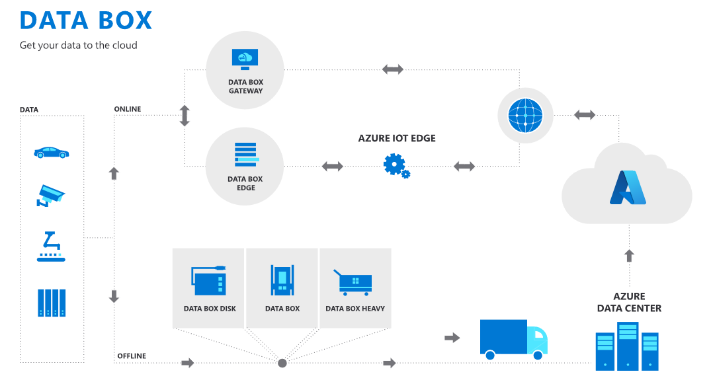

<!-- cSpell:ignore HDFS databox VHDX -->

# Best practices when data requirements exceed network capacity during a migration effort

In a cloud migration, you replicate and synchronize assets over the network between the existing datacenter and the cloud. It's not uncommon for the existing data size requirements of various workloads to exceed network capacity. In such a scenario, the process of migration can be radically slowed, or in some cases, stopped entirely. The following guidance expands the scope of the [Azure migration guide](../azure-migration-guide/index.md) to provide a solution that works around network limitations.

## General scope expansion

Most of the effort required in this scope expansion occurs during the prerequisite planning, assessment, and migration phases of a migration.

## Suggested prerequisites

**Validate network capacity risks:** [Digital estate rationalization](../../digital-estate/rationalize.md) is a highly recommended prerequisite, especially if there are concerns of overburdening the available network capacity. During digital estate rationalization, you collect an [inventory of digital assets](../../digital-estate/inventory.md). That inventory should include existing storage requirements across the digital estate.

As outlined in [Replication risks: physics of replication](../migration-considerations/migrate/replicate.md#replication-risks---physics-of-replication), you can use that inventory to estimate total migration data size, which can be compared to total available migration bandwidth. If that comparison doesn't align with the required time to business change, then this article can help accelerate migration velocity reducing the time required to migrate the datacenter.

**Offline transfer of independent data stores:** The following diagram shows examples of both online and offline data transfers with Azure Data Box. You can use these approaches to ship large volumes of data to the cloud, prior to workload migration. In an offline data transfer, you copy source data to Azure Data Box, which is then physically shipped to Microsoft for transfer into an Azure Storage account as a file or a blob. Prior to other migration efforts, you can use this process to ship data that isn't directly tied to a specific workload. Doing this reduces the amount of data that needs to be shipped over the network and supports completing a migration within network constraints.

You can use this approach to transfer data from HDFS, backups, archives, file servers, and applications. Existing technical guidance explains how to use this approach to transfer data from an [HDFS store](/azure/storage/blobs/data-lake-storage-migrate-on-premises-hdfs-cluster) or from disks by using [SMB](/azure/databox/data-box-deploy-copy-data), [NFS](/azure/databox/data-box-deploy-copy-data-via-nfs), [rest](/azure/databox/data-box-deploy-copy-data-via-rest), or [data copy service](/azure/databox/data-box-deploy-copy-data-via-copy-service) to Data Box.

There are also third-party partner solutions that use Azure Data Box for a migration. With these solutions, you move a large volume of data via an offline transfer, but you synchronize it later at a lower scale over the network.

## Assess process changes

If the storage requirements of a workload (or workloads) exceed network capacity, then you can still use Azure Data Box in an offline data transfer.

Network transmission is the recommended approach unless the network is unavailable. The speed of transferring data over the network, even when bandwidth is constrained, is typically faster than physically shipping the data by using an offline transfer mechanism.

If connectivity to Azure is available, you should conduct an analysis before using Data Box, especially if migration of the workload is time sensitive. Data Box is only advisable when the time to transfer the necessary data exceeds the time to populate, ship, and restore it.

### Suggested action during the assess process

**Network capacity analysis:** When workload-related data transfer requirements are at risk of exceeding network capacity, the cloud adoption team adds an additional analysis task to the assess process called network capacity analysis. During this analysis, a member of the team estimates the amount of available network capacity and required data transfer time. Note that this team member should have subject matter expertise regarding the local network and network connectivity.

Available capacity is compared to the storage requirements of all assets to be migrated during the current release. If the storage requirements exceed the available bandwidth, then assets supporting the workload are selected for offline transfer.

> [!IMPORTANT]
> At the conclusion of the analysis, you might need to update the release plan to reflect the time required to ship, restore, and synchronize the assets to be transferred offline.

**Drift analysis:** Analyze each asset to be transferred offline for storage and configuration drift. *Storage drift* is the amount of change in the underlying storage over time. *Configuration drift* is change in the configuration of the asset over time. From the time the storage is copied to the time the asset is promoted to production, any drift might be lost. If that drift needs to be reflected in the migrated asset, you'll need to synchronize the local asset and the migrated asset. Flag this for consideration during migration execution.

## Migration process changes

When you're using offline transfer mechanisms, [replication processes](../migration-considerations/migrate/replicate.md) aren't typically required, whereas [synchronization processes](../migration-considerations/migrate/replicate.md) might still be necessary. If an asset is being transferred offline, understanding the drift analysis results from the assess process will inform the tasks required during migration.

### Suggested action during the migration process

**Copy storage:** You can use this approach to transfer data of HDFS, backups, archives, file servers, or applications. Existing technical guidance explains how to use this approach to transfer data from an [HDFS store](/azure/storage/blobs/data-lake-storage-migrate-on-premises-hdfs-cluster) or from disks by using [SMB](/azure/databox/data-box-deploy-copy-data), [NFS](/azure/databox/data-box-deploy-copy-data-via-nfs), [rest](/azure/databox/data-box-deploy-copy-data-via-rest), or [data copy service](/azure/databox/data-box-deploy-copy-data-via-copy-service) to Data Box.

There are also third-party partner solutions that use Azure Data Box for a migration. With these solutions, you move a large volume of data via an offline transfer, but you synchronize it later at a lower scale over the network.

**Ship the device:** After you copy the data, you can [ship the device to Microsoft](/azure/databox/data-box-deploy-picked-up). After the data is received and imported, it's available in an Azure Storage account.

**Restore the asset:** [Verify that the data](/azure/databox/data-box-deploy-picked-up#verify-data-upload-to-azure) is available in the storage account. If so, you can use the data as a blob or in Azure Files. If the data is a VHD/VHDX file, you can convert the file to managed disks. Those managed disks can then be used to instantiate a virtual machine, which creates a replica of the original on-premises asset.

**Synchronization:** If synchronization of drift is a requirement for a migrated asset, you can use one of the third-party partner solutions to synchronize the files until the asset is restored.

## Optimize and promote process changes

Optimize activities aren't likely to be affected by this change in scope.

## Secure and manage process changes

Secure and manage activities aren't likely to be affected by this change in scope.

## Next steps

Return to the checklist to ensure that your migration method is fully aligned.

> [!div class="nextstepaction"]
> [Migration best practices checklist](./index.md)
