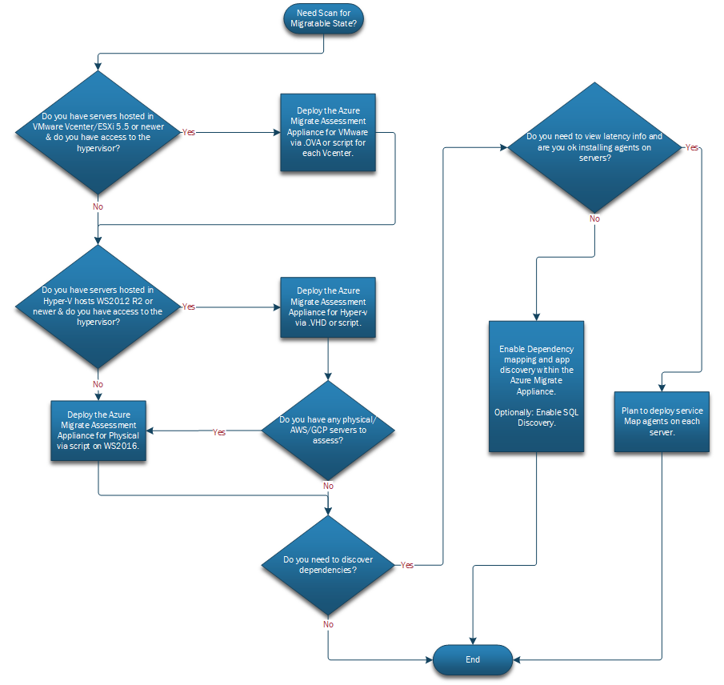

<!-- docutune:casing "Tassels Parallel Sets Slicer" -->

# Assessment and migration planning with Azure Migrate for servers

Migration of workloads to Azure can be a challenging project. Preparing well for a migration project helps drive success and reduces the complexity of the project.

This article shows how the fictional company Tailwind Traders uses Azure Migrate to plan for migration. Tailwind does discovery and assessment of their existing environment, which is targeted for migration to Azure.

When using this example to help plan your own infrastructure migration efforts, keep in mind that the provided sample plan and deployment is specific to Tailwind. Review your organization's business needs, structure, and technical requirements when making important infrastructure migration decisions.

Whether you need all the elements described in this article depends on your migration strategy and needs. For example, you might find it's better to discover workload dependencies using existing network monitoring tools or get recommended VM sizes using Movere or other third-party tools.

## Overview

In order for Tailwind to prepare for migration to Azure, it's critical to plan for the right set of discovery and assessment tools and activities. Deploying and running discovery tools enables Tailwind to gather critical information on the environment targeted for migration to Azure.

The information gathered will enable Tailwind to:

- Build an up-to-date inventory (servers and workloads) of their datacenter environments.
- Determine server readiness for migration to Azure.
- Perform an assessment to get recommended sizing and storage for Azure VMs.
- Get cost estimation for Azure VMs (compute and storage).
- Analyze server and workload dependencies.
- Assess application compatibility with Azure.
- Assess migration options for existing SQL Server instances.
- Assess options for migrating applications to Azure App Service.
- Plan for migration waves.

For successful migration planning, Tailwind needs to think about following areas:

> [!div class="checklist"]
>
> - **Step 1: Set up tooling for discovery and assessment.** How many discovery appliances or agents will you need? What are best practices to run discovery of your environments? Do I need dependency mapping and application discovery?
> - **Step 2: Perform assessment.** How do I select parameters for assessment? How do I know whether my servers are ready for migration to Azure? How do I estimate costs of migrated servers?
> - **Step 3: Dependency analysis and migration planning.** Which servers are used for a specific application workload? What other components does the workload depend on? What are the dependencies between servers and its workloads?
> - **Step 4: Plan for migration waves.** Are my servers ready for migration to Azure? How do I prioritize and group servers and associated workloads across migration waves?

## Before you start

Before diving deep into infrastructure discovery and assessment, consider reading some background information relevant to Azure Migrate discovery and assessment:

- Review the [Azure Migrate: Discovery and assessment tool overview](/azure/migrate/migrate-services-overview#azure-migrate-discovery-and-assessment-tool).
- Review the deployment scenarios and requirements for the Azure Migrate appliance that performs discovery, [Azure Migrate appliance](/azure/migrate/migrate-appliance#deployment-scenarios).
- Review the [Azure Migrate assessment overview](/azure/migrate/concepts-assessment-calculation).
- Optionally, complete the Microsoft Learn training, [Migrate virtual machines and applications using Azure Migrate](/learn/paths/m365-azure-migrate-virtual-machine/).

## Step 1: Set up tooling for discovery and assessment

Tailwind first needs to determine the Azure Migrate appliances needed for discovery and assessment.

### Discovery tooling: Planning and implementation

To start gathering data required for assessment, Tailwind needs to prepare to deploy the appliances and agents needed for discovery of their on-premises server infrastructure.

Using the following workflow, Tailwind can define the server discovery tools required to gather information from on-premises servers and their dependencies.

*Figure 1: Discovery appliances and agents workflow.*

For more information on Azure Migrate, see:

- [Discover VMware VMs](/azure/migrate/tutorial-discover-vmware#set-up-the-appliance)
- [Discover Hyper-V VMs](/azure/migrate/tutorial-discover-hyper-v#set-up-the-appliance)
- Other VMs:
  - [Discover physical or other hypervisors](/azure/migrate/tutorial-discover-physical#set-up-the-appliance)
  - [Discover AWS VMs](/azure/migrate/tutorial-discover-aws#set-up-the-appliance)
  - [Discover GCP VMs](/azure/migrate/tutorial-discover-gcp#set-up-the-appliance)
- Discovery:
  - [Dependency analysis via Azure Migrate (agentless)](/azure/migrate/how-to-create-group-machine-dependencies-agentless)
  - [Application discovery](/azure/migrate/how-to-discover-applications)
  - [SQL Server discovery](/azure/migrate/how-to-discover-sql-existing-project)
- [Dependency analysis via Service Map (agent-based)](/azure/migrate/how-to-create-group-machine-dependencies)

> [!NOTE]
> You can discover up to 10,000 servers in a VMware environment, up to 5,000 servers in a Hyper-V environment, and up to 1,000 physical servers by using a single appliance. If your environment exceeds those limits, read about [scaling a Hyper-V assessment](/azure/migrate/scale-hyper-v-assessment), [scaling a VMware assessment](/azure/migrate/scale-vmware-assessment), or [scaling a physical server assessment](/azure/migrate/scale-physical-assessment).

Based on the preceding workflow and following relevant Azure Migrate documentation, Tailwind deploys the required appliances or agents for discovery. During deployment, Tailwind must provide server credentials to perform software inventory (installed applications, roles, and features), agentless dependency analysis, agent-based dependency analysis, and discovery of SQL Server instances and databases. Tailwind's migration team will collaborate with the server infrastructure and SQL Server database administrator teams to prepare required credentials for discovery. After deployment and configuration, Tailwind regularly verifies that data is being collected by the appliance and visible in the Azure Migrate project.

As a best practice, Tailwind gathers data over a prolonged period of time, such as five weeks. The goal is to gather server performance data and dependencies over a period of time, which ensures collection of metrics about monthly infrastructure consumption spikes, such as month end transactions (payroll application), weekly batch processes, and data import or export.

## Step 2: Perform assessment

After discovery of the on-premises servers has been running for at least a day, Tailwind can start creating assessments in the Azure Migrate project through the Azure portal. Their plan will be to create an assessment per environment (production and nonproduction).

Tailwind can choose to run various assessments such as a [Azure VM assessment](/azure/migrate/concepts-assessment-calculation), [Azure SQL Database assessment](/azure/migrate/concepts-azure-sql-assessment-calculation), or [AVS assessment](/azure/migrate/concepts-azure-vmware-solution-assessment-calculation). Tailwind starts with the VM assessment by following the [assessment best practices](/azure/migrate/best-practices-assessment) and executes an Azure SQL Database assessment later. As a discovery source, Tailwind chooses servers discovered through the Azure Migrate appliance.

Tailwind understands that the Azure Migrate appliance will continue to collect performance data of their on-premises infrastructure and send it over to Azure Migrate, therefore Tailwind has the opportunity to recalculate Azure Migrate assessment at any future point in time to ensure the latest data sets are being included as migration execution approximates.

> [!NOTE]
> For server infrastructure that cannot be discovered via the Azure Migrate appliance, Tailwind will create a CSV file with the required data and upload it to Azure Migrate. For more information, see [Assess servers using an imported CSV file](/azure/migrate/tutorial-discover-import).

### Assessment properties

Tailwind plans to tune their assessments and plans to specify [custom parameters](/azure/migrate/how-to-modify-assessment). For both production and nonproduction assessments, it specifies its primary Azure region as the target location, as well as same sizing criteria, comfort factor, pricing, and licensing. However, in terms of compute and storage, Tailwind plans to have VM SKUs and storage types specified differently in the assessments.

For production, Tailwind clears the VM SKU options for A-series and sets the storage type to Standard SSD and Premium SSD-managed disks. For nonproduction, Tailwind ensures all VM-series is select and storage type is set to automatic.

Tailwind plans to migrate to Azure and observe behavior for at least a few months before making purchase arrangements for reserved instances. If Tailwind wants to purchase reserved instances in advance, then for the assessments, after discussing with business on selecting right reserved capacity (compute) option, Tailwind will select the VM-series or specific VM SKUs, which are within the reserved instances purchased scope.

Tailwind selects performance-based sizing criteria and sets performance history to one month. This configuration will enable Tailwind to find recommended VM sizes and managed disks based on actual server requirements that were gathered during the discovery phase. Thus, resulting in optimization of infrastructure as a result of the migration. Tailwind understands that Azure Migrate assessment will recommend VM SKUs based on CPU and memory utilization. For disk types, Azure Migrate will base the recommendations on IOPS and throughput of the existing disks in the on-premises servers assessed.

Further, as resource usage for existing workloads is expected to increase slightly over time, Tailwind sets the comfort factor to **1.1x**. This configuration will add 10 percent more resources to VM requirements based on the gathered performance data, and recommended VM sizes will include this 10 percent buffer.

Based on the Azure offer associated with Tailwind's subscription, the appropriate offer or licensing program and currency is selected. Tailwind is eligible for [Azure Hybrid Benefit](https://go.microsoft.com/fwlink/?LinkId=859786), so it sets **Already have a Windows Server license** to **yes**. Tailwind understands that not configuring Azure Hybrid Benefit might result in extra billing of Windows Server licenses that were already purchased. Tailwind also understands that Azure Hybrid Benefit primarily applies to Windows operating systems, so for any servers running Linux or other non-Windows operating systems, Tailwind should consult on license portability separately.

After saving assessment properties, Tailwind needs to select servers to assess. Tailwind creates a new [server group](/azure/migrate/how-to-create-a-group) that includes all discovered servers from all discovery appliances and creates assessments for each specific environment. Although Tailwind considered creating a server group and assessment for each specific application, while the ideal scenario, it was decided to create server groups at a later stage, closer to wave migration planning, as more time is needed to analyze dependencies between servers.

> [!NOTE]
> Tailwind can create multiple assessments. Each assessment can have different properties and a different group of servers. Multiple assessments can be run against the same set of servers or groups. All assessments are stored in the Azure Migrate project. This allows Tailwind to compare different assessments and decide what migration options are best for their needs and business case (such as VM sizing, storage type, and reserved capacity) and estimate the monthly cost.

### Azure readiness

Azure Migrate can calculate assessment results in a few minutes after creating the assessment. Once the assessment results are available, Tailwind reviews Azure readiness for all servers that were assessed. Azure Migrate provides visualization that enables Tailwind to drill down on servers readiness details for each server. Assessment details include recommended VM SKU, storage type, networking configuration, and most importantly, Azure readiness.

Tailwind spends some time reviewing the reasons why some servers are conditionally ready for migration to Azure and why some servers aren't. Tailwind refers to the list of [assessment readiness issues](/azure/migrate/troubleshoot-assessment#assessment-readiness-issues), which provides insights on the steps needed to mitigate Azure readiness issues. After a thorough review, Tailwind prepares a plan of action to fix readiness issues where possible (upgrading the OS, changing the boot type, removing unused disks, and so on). For servers with issues that can't be easily mitigated, Tailwind considers other migration approaches, such as whether to replatform, modernize, replace, or retire.

> [!NOTE]
> Although the server is marked as **Ready** and Azure infrastructure will support the necessary configuration, the replication appliance or agents may not always support the replication of the server (such as Windows Server Failover Clustering with shared disks). It's also important to review the [Azure Migrate appliance (VMware agentless)](/azure/migrate/migrate-support-matrix-vmware-migration#vm-requirements-agentless), replication appliance ([VMware agent-based](/azure/migrate/migrate-support-matrix-vmware-migration#vm-requirements-agent-based), [physical and other clouds](/azure/migrate/migrate-support-matrix-physical-migration#physical-server-requirements)), and [replication agents (Hyper-V)](/azure/migrate/migrate-support-matrix-hyper-v-migration#hyper-v-vms) supported VM configurations. If an unsupported VM configuration is identified and confirmed, consider a different migration approach such as redeployment of the application or database in a new Azure VM.

### Database assessment

Tailwind is running SQL Server in their on-premises environment. As part of the migration project to Azure, Tailwind would like to understand extra options and modernization approaches for migrating SQL Server workloads to Azure SQL Database or SQL Managed Instance. Although Tailwind's primary migration approach is rehosting to Azure VMs via server replication using Azure Migrate, Tailwind would like to explore what modernization is possible given their current server configurations. This stage is exploratory for Tailwind, in order to keep focus on the current migration strategy.

Azure Migrate supports creating assessments for migration to Azure SQL Database and SQL Managed Instance, which Tailwind finds as insightful assessments to create. For the target location, Tailwind chooses their primary Azure region and for target deployment type Tailwind selects **Recommended** to determine whether Azure SQL Database or SQL Managed Instance is a better fit for their databases. Tailwind set the comfort factor to **1.1x** to account for planned future workload growth. In the pricing section Tailwind chooses options that are aligned with their Azure offer and licensing programs. Tailwind reuses the prior groups created and runs assessment for this group.

### Azure cost details

Azure Migrate assessment results include cost estimation for assessed servers. Tailwind can estimate total compute and storage costs for migration, or drill down for compute and storage cost estimation per individual server. Tailwind understands that after migration to Azure, the server might incur other costs related to networking, monitoring, backup, and so on. Those extra costs are not part of the assessment cost details. For these cost details scenarios, Tailwind resorts to using the [Azure calculator](https://azure.microsoft.com/pricing/calculator/).

## Step 3: Dependency analysis and migration planning

To perform a successful migration to Azure, it's critical for Tailwind to understand workload details in the context of their dependencies during migration planning. As a best practice, Tailwind migration team needs to identify application owners of the workloads running on each of the server assessed for the migration. Tailwind uses their CMDB data to link discovered servers to various business applications and identify respective applications owners, their development, and support teams. After application owners are identified, Tailwind migration team schedules review meetings (interviews) with them.

The migration team is now better prepared to [group servers](/azure/migrate/how-to-create-a-group) for workload-specific assessment based on the application tiers and initial dependencies given the application owner interviews and analysis.

### Dependency analysis

To further validate server groups and plan for migration waves, Tailwind needs to understand dependencies between workloads and its servers. Tailwind uses the results of the [dependency analysis](/azure/migrate/concepts-dependency-visualization), which ran during the assessment phase. Tailwind exports dependency results and uses [Power BI to visualize network connections](/azure/migrate/how-to-create-group-machine-dependencies-agentless#visualize-network-connections-in-power-bi).

To perform effective dependency analysis, Tailwind takes the following steps:

1. Clean up the dependency mapping scan to show unique dependencies based on a one-month period of time by using the PowerShell script as described in [Analyze server dependencies (agentless)](/azure/migrate/how-to-create-group-machine-dependencies-agentless#visualize-network-connections-in-power-bi). This script works as-is for agentless dependency mapping. For agent-based dependency mapping, KQL queries must be created in order to perform the same task. With agent-based dependency mapping, the longest period of time available is one hour.

2. Filter out the noise from the dependency mapping scan by removing well-known dependencies such as:

   - Known system processes
   - Known internet-based endpoints (non-RFC 1918)
   - Known internal endpoints (RFC 1918) such as domain controllers, file servers, network appliances such as load balancers, and management infrastructure (such as SCCM, System Center Operations Manager, backup, and antimalware).

3. Integrate dependency scan into visualization tooling like Power BI. Helpful visualizations include:

   - [Sankey diagram](https://powerbi.microsoft.com/blog/visual-awesomeness-unlocked-sankey-diagram/)
   - [Network Navigator chart](https://appsource.microsoft.com/product/power-bi-visuals/WA104380795)
   - [Tassels Parallel Sets Slicer](https://appsource.microsoft.com/product/power-bi-visuals/WA200000311)

### Review data collected with application owners

As preparation continues for the migration, Tailwind realizes that extra workload details must be gathered from application owners. Based on those details, the migration team reviews complexity, criticality, and dependencies of each server group or workload, and then finalizes the prioritization of server groups for their migration wave schedules. As Tailwind schedules extra interviews with application owners, it ensures collection of the following data points:

- Business criticality
- Workload architecture (all servers and other components such as load balancers that are required for workload to run)
- Number and type of users (internal, external)
- Data classification
- SLA requirements
- Downtime window
- Backup mechanism
- Monitor mechanism
- Patching mechanism
- Licensing mechanism (OS and software, dependency on MAC/IP address)
- Firewall rules (host and network): Ports and protocols
- Effect of changing the server's IP address

As a best practice, Tailwind reviews server assessment results with application owners. During the review, Tailwind will:

- Validate assessment sizing recommendations (such as VM size and storage configuration).
- Identify any components that need optimization or replacement in Azure (such as load balancers or clusters).
- Verify all dependencies are discovered and validated with application owners.
- Confirm SLA requirements are met.
- Review SQL assessment results and review options for rehosting your SQL Server databases on Azure SQL Database or SQL Managed Instance.
- Review cost estimates.

### Document the migration plan

Based on the final assessment results and application owner interviews, the Tailwind migration team finalizes the migration approach. They document the migration steps including details from assessment, dependency analysis, and inputs from the application owner interviews. This captures extra configurations like load balancers, DNS updates, database connection strings, licenses, and any extra steps the application team or vendor might need to execute as part of pre-migration and post-migration steps.

## Step 4: Plan for migration waves

Tailwind now needs to finalize prioritization of the migration waves based on workload criticality, dependencies, business requirements, and so on.

### Server grouping

Based on the interviews and dependency mapping data, Tailwind continues to refine their server groups based on the application architecture (multitier) and server dependencies. Tailwind's initial server groups are as follows:

- Server group 1 (LOB application 1): Five servers
- Server group 2 (LOB application 2): 30 servers
- Server group 3 (LOB application 3): 50 servers

### Migration wave planning

Tailwind plans to start with smaller migration waves, which include standalone servers and workloads that aren't business critical. Starting with single-instance servers as part of the initial migration wave, it will be easier to resolve any issues, verify migration process end-to-end, and build confidence in the migration strategy. During subsequent migration waves, Tailwind plans to include multiple nonproduction workloads. Once finalized with nonproduction, Tailwind's migration waves will include production workloads. The most complex production workloads will be left until the end within the last migration wave schedules.

A migration wave can be a single large business application running on multiple web, application, and database servers or a few smaller, independent workloads. In tightly coupled environments, server groups might need to be split into different migration waves, such as a server group of 100+ servers. Since it contains shared servers across multiple applications (such as shared databases, shared web servers, or shared file servers) the number of interdependent servers is large.

In the scenario where a server group (interdependent servers) has to be split and not all servers are migrated in a single wave, Tailwind will:

- Identify which connections are the most latency-sensitive connections to dependencies and prioritize these dependencies for the migration wave.
- Reschedule the left-out servers to be migrated on the next immediate migration wave or as part of an interim migration wave.

Tailwind reviews the guidance in [Build a migration plan with Azure Migrate](/azure/migrate/concepts-migration-planning#prioritize-workloads) to prioritize server groups and workloads when assigning them to migration waves. These best practices include:

- Start with server groups with the least number of servers.
- Start with server groups based on lowest business criticality. For example:
  - Prioritize environments with lower business impact (nonproduction vs. production).
  - Prioritize workloads with lower SLA and highest RTO/RPO.
  - Prioritize workloads with less restrictive data classification.
  - Prioritize workloads with newer operating systems, since older operating systems tend to have more issues booting in Azure or in supporting Azure management extensions.

Tailwind understands some migration waves will change migration execution progresses, so the migration team reviews and modifies waves periodically. The migration team incorporates learnings from executed waves to improve assessment and migration planning, such as capturing any missing network requirements, performing pre-migration testing, implementing post-migration tweaks, and reviewing permissions.

## Conclusion

In this article, Tailwind sets up Azure Migrate tools for discovery and assessment and executes steps required to build a migration plan, server groups, and prioritization of server groups in migration waves.

Not every step taken here is required for building a migration plan. However, as good migration planning is often key to successful migration project, Tailwind invests time in developing a proper migration plan by executing all steps as described above. It's also important to review and continuously improve the process based on previous migration wave and feedback from key stakeholders teams.

### Next steps

As a next step, Tailwind will begin deploying the infrastructure required to execute migration. To review best practices for migration execution, see [Plan and deploy Azure Migrate for servers](./tailwind-migration-rehost-server-replication.md).
