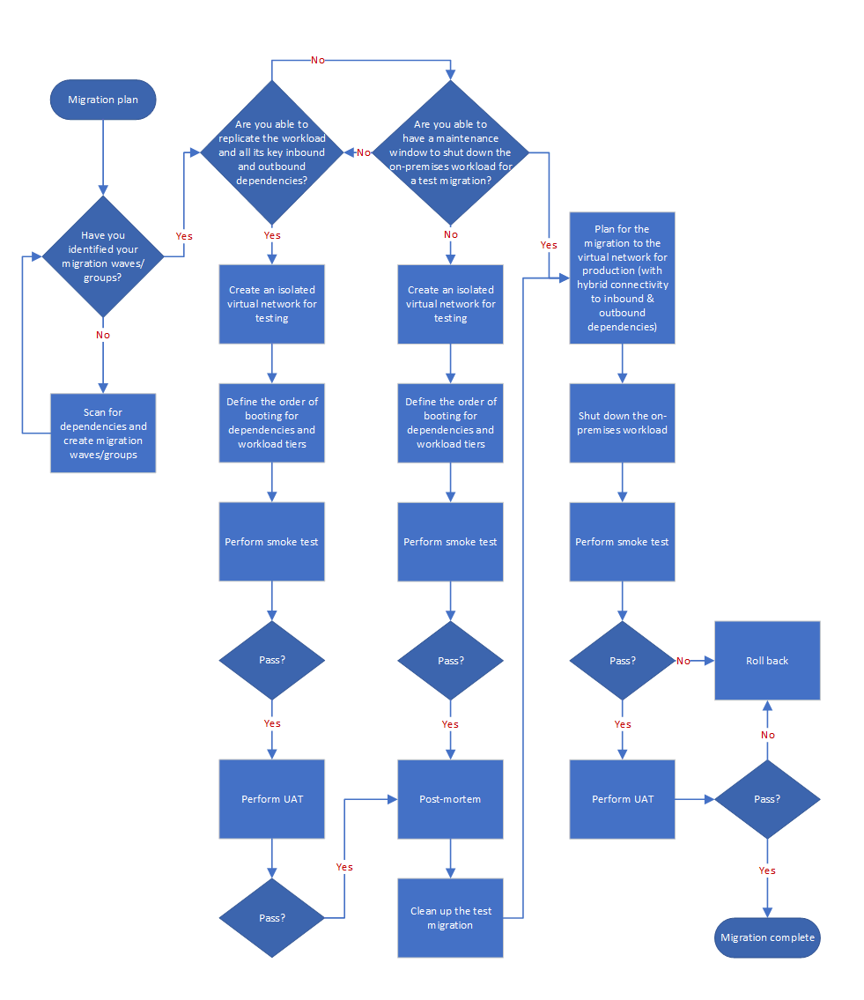

# Migration execution with Azure Migrate for servers

This article shows how the fictional company Tailwind Traders prepares its deployment plan for on-premises infrastructure migration using the server replication features of Azure Migrate.

When you use this example to help plan your own infrastructure migration efforts, keep in mind that the provided sample plan and deployment is specific to Tailwind. Review your organization's business needs, structure, and technical requirements when making important infrastructure migration decisions.

Whether you need all the elements described in this article depends on your migration strategy and needs. For example, you might prefer to redeploy a VM in Azure and redeploy the application instead of replicating the on-premises server to Azure.

## Overview

In order for Tailwind to migrate to Azure, it's critical to plan for the migration toolset and activities. Generally, Tailwind needs to think about 3 areas:

> [!div class="checklist"]
>
> - **Step 1: Tooling and replication.** How many replication appliances will you need? What are best practices to enable replication?
>
> - **Step 2: Migration cutover preparation.** What activities will resources need to execute before and after the migration? What value is provided, and when should I plan for a test migration? What are the constraints when testing in an isolated VNet?
>
> - **Step 3: Migration cutover execution.** How does cutover look like? What happens after cutover?

## Before you start

Before we start diving deep in infrastructure migration planning and deployment, consider reading some background information relevant to Azure Migrate server replication:

- Review the [Azure Migrate: Server Migration tool overview](/azure/migrate/migrate-services-overview#azure-migrate-server-migration-tool).
- Review the differences between the [Azure Migrate appliance](/azure/migrate/common-questions-appliance), [replication appliance](/azure/migrate/migrate-replication-appliance), and [Hyper-V migration architecture](/azure/migrate/hyper-v-migration-architecture).
- Optionally, complete the Microsoft Learn training, [Migrate virtual machines and applications using Azure Migrate](/learn/paths/m365-azure-migrate-virtual-machine/) training.

## Step 1: Tooling and replication

Tailwind needs to determine considerations on the number of appliances needed for replication and replication traffic impact.

### Capacity planning for core quotas

In order to proactively ensure that the target migration Azure subscriptions will be able to host the virtual machines created during test migration or production migration, subscriptions core quotas need to be available for the target VM SKUs. Ensure [subscription quotas](/azure/azure-portal/supportability/per-vm-quota-requests) for specific VM SKUs have been increased for the specific target region.

### Server migration tooling planning and implementation

After increasing the subscription core quotas, Tailwind needs to prepare to deploy the appliances or agents needed for replication of their on-premises server infrastructure.

Using the following workflow, Tailwind can identify the server migration tools required to enable replication of on-premises servers. This will aid Tailwind in proactively identifying necessary infrastructure requests to successfully enable replication of their migratable estate.

*Figure 1: Replication appliances and agents workflow.*

For more information, see these Azure Migrate topics:

- [Support matrix for VMware migration](/azure/migrate/migrate-support-matrix-vmware-migration#vm-requirements-agentless).
- [Migrate VMware VMs to Azure (agent-based)](/azure/migrate/tutorial-migrate-vmware-agent).
- [Migrate VMware VMs to Azure (agentless) via PowerShell](/azure/migrate/tutorial-migrate-vmware-powershell).
- [Migrate Hyper-V VMs to Azure](/azure/migrate/tutorial-migrate-hyper-v).
- Other hypervisors:
  - [Migrate machines as physical servers to Azure](/azure/migrate/tutorial-migrate-physical-virtual-machines)
  - [Discover, assess, and migrate Amazon Web Services VMs to Azure](/azure/migrate/tutorial-migrate-aws-virtual-machines)
  - [Discover, assess, and migrate Google Cloud Platform VMs to Azure](/azure/migrate/tutorial-migrate-gcp-virtual-machines)

As a best practice, Tailwind works closely with their virtualization administrators to ensure careful monitoring of key performance counters for CPU, memory and, disk space of the deployed appliances and hypervisor hosts. This ensures that virtualization infrastructure has enough resources to handle additional load from replication appliances and agents.

### Replication

#### Enable and monitor replication

With replication appliances and agents configured, Tailwind can start planning the replication of their on-premises servers. A collection of applications and their dependencies which must be migrated during the same time window is commonly referred to as a migration wave or migration group. Tailwind will use the term *migration wave* to maintain consistency across planning activities.

As a best practice, Tailwind plans to enable initial replication for only a subset of their migration waves, cautious about their available bandwidth. Tailwind understands the initial replication is a full copy of the servers and consumes more bandwidth versus ongoing (delta) replications. Given Tailwind's bandwidth constraint considerations, Tailwind will enable replication for just migration waves that are only a few weeks from test migration and cutover dates.

Tailwind will also monitor initial and ongoing replication closely to ensure healthy and stable replication before enabling replication for additional servers. If errors or warnings arise, Tailwind can proactively detect and act on it before test migration or cutover dates.

#### Replication tuning

Based on the observed initial and ongoing replications bandwidth patterns, Tailwind will tune their replication strategy based on the following queries:

- How much bandwidth is needed and available for replications?
- How many VMs, on average, can be initially replicated at the same time?
- How many VMs, on average, can be left replicating (delta replication) at the same time?
- Is there an need to throttle replication within the replication appliances or agents?

## Step 2: Migration cutover preparation

Given the success in replication toolset deployment and planning for a subset of their migration waves, Tailwind decides to start planning their testing needs and pre-migration and post-migration activities.

Tailwind understands that the migrations are an orchestration of both business and technical groups. Therefore, the following activities are defined as pre-migration and post-migration activities.

### Business

In order to prepare the business and its stakeholders for the migration activities, Tailwind defines the following items:

- A maintenance window for each of the applications to migrate.
- Communications on application downtime and impact to business.
- Points of contact (POCs) that can provide support for the following key areas during migration testing and cutover:
  - Network administrators
  - Backup administrators
  - Server administrators
  - Identity administrators
  - Application owners (frontend and backend)
  - Microsoft Support
  - Partner (if available)
- A soak period after the cutover of the application to Azure. During the soak period, if any issues arise then the rollback plan must be executed. After the soak period has expired, rollback of the application cannot be performed.

### Technical: Pre-migration

In order to plan for best practice pre-migration activities, Tailwind defines the following activities to be executed prior to a migration failover:

- A rollback plan.
- Latest backup of the servers.
- Opening of firewall prefixes, ports and protocols for necessary traffic between on-premises to Azure and within Azure VNets and subnets.
- Obtain local administrator credentials or keys for server sign-in purposes.
- Review [manual changes needed for Windows and Linux](/azure/migrate/prepare-for-migration#verify-required-changes-before-migrating)
  - For legacy Linux distributions, instructions to install Hyper-V drivers are available in [Supported Linux and FreeBSD virtual machines for Hyper-V on Windows](/windows-server/virtualization/hyper-v/supported-linux-and-freebsd-virtual-machines-for-hyper-v-on-windows).
  - For legacy Windows versions such as Windows Server 2003 or Windows Server 2008, instructions to install Hyper-V drivers are available in [Prepare Windows Server 2003 machines for migration](/azure/migrate/prepare-windows-server-2003-migration).
- Prepare isolated virtual networks for test migrations.
  - Plan for secure management access via RDP or SSH into this environment, using services like [Azure Bastion](/azure/bastion/bastion-overview).
  - Plan for an isolated virtual network in each subscription containing the migrated VMs. The test migration functionality in Azure Migrate must use a virtual network in the same subscription where the migrated VM will reside.

### Technical: Post-migration

 Further, Tailwind defines the following activities to be executed after the migration failover:

- Review the documented Azure Migrate post-migration activities based on the source environments:

  - [VMware agentless](/azure/migrate/tutorial-migrate-vmware#complete-the-migration)
  - [VMware agent-based](/azure/migrate/tutorial-migrate-vmware-agent#complete-the-migration)
  - [Hyper-V](/azure/migrate/tutorial-migrate-hyper-v#complete-the-migration)
  - [Physical](/azure/migrate/tutorial-migrate-physical-virtual-machines#complete-the-migration)
  - [AWS](/azure/migrate/tutorial-migrate-aws-virtual-machines#complete-the-migration)
  - [GCP](/azure/migrate/tutorial-migrate-gcp-virtual-machines#complete-the-migration)

- In addition, Tailwind adds the following post-migration activities as best practices:

  - Validate sign-in with local credentials or keys for RDP or SSH.
  - Verify that DNS resolves and DNS servers are configured in TCP/IP network settings for the OS.
  - Verify that an IP address has been assigned to the server via DHCP in TCP/IP network settings for the OS.
  - Verify that access to OS licensing is activated and there is access to cloud-based licensing endpoints (such as Azure endpoints for key management services).
  - Validate sign-in with domain credentials.
  - Verify that the application has access to dependencies (such as target URLs or connection strings).
  - Verify installation or update required Azure agents:
    - Azure VM agents for Windows or Linux.
    - Log Analytics agent for Windows or Linux.
    - Service Map agent for Windows or Linux.
    - SQL Server IaaS Agent extension.
  - Validate VM monitoring via a new or existing service.
  - Validate VM patching via a new or existing service.
  - Validate VM backup via a new or existing service.
  - Validate VM antivirus and endpoint protection via a new or existing service.
  - Tag Azure resources.
  - Update any existing configuration management database (CMDB).
  - Conduct a post-mortem and document learnings.

#### Test migration and actual migration

Moving forward, Tailwind now looks to understand the need for a test migration, what test cases make sense, and which virtual networks to use as targets for the test migration and actual migration.

##### Define a smoke test

As a first step, Tailwind realizes there's a need to perform a smoke test to validate that servers identified to migrate will boot in Azure. You should perform this smoke test in an isolated VNet for all servers to be migrated. Tailwind will follow this recommendation and is especially focused on the smoke test for servers which are legacy, highly customized, or contain hardened operating systems. Additionally, Tailwind is also eager to run a smoke test for servers that have been marked as **Conditionally Ready** by their Azure Migrate assessments.

Tailwind defines a smoke test to be successful when basic server functionality and properties are validated. For example, smoke testing may include:

- The server boots in Azure.
- The administrator can sign in to the server using local credentials.
- TCP/IP settings for DNS, IPv4 and default gateways assignment are updated to the values provided by the Azure VNet via DHCP.
- OS licensing is activated.

Typically this test is led by the server administrators or the migration partner.

##### Define user acceptance testing

As a second step, Tailwind now looks to perform user acceptance testing (UAT) to ensure that the applications are functional and accessible by expected users. Tailwind is aware that UAT will help find missed configuration changes necessary for a successful migration which may include hardcoded IP addresses.

Tailwind defines UAT to be successful when application functionality and access to dependencies is validated. For example, UAT may include:

- Validate sign-in with domain credentials.
- Verify that the application has access to dependencies (such as target URLs or connection strings).
- Validate application functionality with test users.

Typically, this is usually led by application owners.

#### Identify testing and migration workflow

Now that test cases have been defined, Tailwind develops the following workflow to encompass the various scenarios it might encounter based on the needs of each application or server.

The majority of Tailwind's scenarios require the second and fifth paths in the following workflow. Tailwind has many legacy servers and other servers marked as **Ready with Conditions**, which might not boot in Azure. Therefore, Tailwind will test each of those servers in an isolated VNet to ensure that each server passes the smoke test. For this, Tailwind will perform a test migration in Azure Migrate which allows for the option for automated clean up of created resources such as VMs and NICs.

Further, Tailwind's environment is tightly coupled which means there's a large amount of servers which are interdependent with one another, thus resulting in large migration waves. Tailwind has decided to split their large migration waves and migrate servers together which have the most strict latency requirements. As a result, some application dependencies must remain on-premises for a given migration wave. Tailwind determines that it should migrate directly into the production VNet, since that network already has connectivity back to their on-premises dependencies. In this path, Tailwind will perform necessary smoke tests in an isolated VNet and perform UAT in the production VNet. If successful, Tailwind will conclude the migration as a final cutover for the servers.

Nonetheless, Tailwind does find value in considering the remainder paths only for scenarios where it's possible to migrate all dependencies to an isolated VNet in order to perform UAT, or where UAT is not enforced.

*Figure 2: Testing and migration workflow.*

## Step 3: Final step

As a final step, Tailwind is now ready to confidently perform the production migrations. The envision that during cutover all hands on deck will be required to ensure end-to-end support. Furthermore, after the soak period concludes, Tailwind is looking forward to close-out and call for a successful migration to Azure.

### Cutover

With the migration activities and workflow defined, Tailwind irons out the final plans for cutover by:

- Identifying a more specific cutover window, which is planned for a Friday evening or weekend. Each cutover window will last at a minimum for 4 hours.
- Notifying the business and those affected by the migration of the maintenance window. The maintenance window should include a meeting invite that includes the migration plan and a conference bridge to discuss any open items during the migration.
- Contacting the network administrators, backup administrators, server administrators, identity administrators, application owners, Microsoft support resources, and partners to ensure that each party is available during cutover.
- Ensuring a backup of the server has been committed prior to cutover.
- Ensuring the rollback plan is defined and ready for execution if needed.
- Ensure the migration handover to the operations team by setting expectations that day-2 operations must commence for Azure server backup, patching, monitoring, and so on.

### Post-go-live

Once the cutover successfully concludes, Tailwind prepares for decommission of the source servers. Tailwind decides that server decommissioning will be executed after the soak period timeline is concluded.

After each migration wave, Tailwind also conducts a brief retrospective to discuss what went well and what can be improved for future migration waves. Tailwind understands these incremental learnings and improvements will ensure a smoother migration for all subsequent migration waves.

## Conclusion

In this article, Tailwind sets up Azure Migrate: Server Migration tools and plans for their infrastructure migration activities and workflow.

Not every step taken here is required for a server migration. In this case, Tailwind planned for a migration workflow, test plans and pre-migration and post-migration activities which can be accomplished by proactive and reliable replication.
