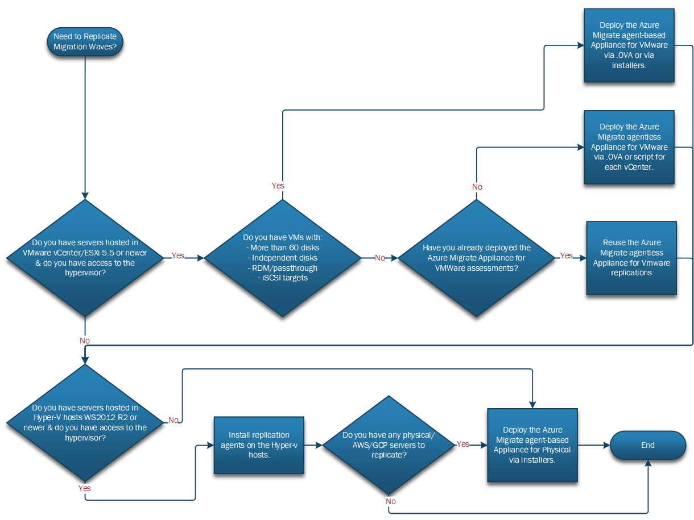

# Plan and Deploy Azure Migrate for Servers

This article shows how the fictional company Tailwind Traders prepares its deployment plan for on-premises infrastructure migration using Azure Migrate's server replication features.

When you use this example to help plan your own infrastructure migration efforts, keep in mind that the provided sample plan and deployment is specific to Tailwind. Review your organization's business needs, structure, and technical requirements when making important infrastructure migration decisions.

Whether you need all the elements described in this article depends on your migration strategy and needs. For example, you might find it's better to re-deploy a VM in Azure and redeploy the application instead of replicating the on-premises server to Azure.

## Overview

In order for Tailwind to migrate to Azure, it's critical to plan for the migration toolset and activities. Generally, Tailwind needs to think about 3 areas:

> [!div class="checklist"]
>
> - **Step 1: Tooling & Replication.** How many replication appliances will you need? What are the best practices to enable replication?
> - **Step 2: Testing and Pre/Post Migration Activities.** What pre/post migration activities will resources need to execute? What is the value and when should I plan for a test migration? What are the constraints when testing in an isolated vnet?
> - **Step 3: Cutover and Post-Go-Live.** How does cutover look like? What happens after cutover?

## Before you start

Before we start diving deep in infrastructure migration planning and deployment, consider reading some background information relevant to Azure Migrate Server replication:

- Review Azure Migrate [Server Migration Tool Overview](https://docs.microsoft.com/en-us/azure/migrate/migrate-services-overview#azure-migrate-server-migration-tool).
- Review the differences between the [Azure Migrate appliance](https://docs.microsoft.com/en-us/azure/migrate/common-questions-appliance), [Replication Appliance](https://docs.microsoft.com/en-us/azure/migrate/migrate-replication-appliance), and [Hyper-V migration architecture](https://docs.microsoft.com/en-us/azure/migrate/hyper-v-migration-architecture).
- Optionally, walkthrough MS Learn's [Migrate virtual machines and apps using Azure Migrate](https://docs.microsoft.com/en-us/learn/paths/m365-azure-migrate-virtual-machine/) Training.

## Step 1: Tooling & Replication

Tailwind needs to figure out considerations on the number of appliances needed for replication and replication traffic impact.

### Capacity Planning for Core Quotas

In order to pro-actively ensure that the target migration Azure subscriptions will be able to host the virtual machines created during test migration or production migration, subscriptions core quotas need to be available for the target VM SKUs. Ensure [subscription quotas](https://docs.microsoft.com/en-us/azure/azure-portal/supportability/per-vm-quota-requests) for specific VM SKUs have been increased for the specific target region.

### Server Migration Tooling Planning and Implementation

After increasing the subscription core quotas, Tailwind needs to prepare to deploy the appliances and/or agents needed for replication of their on-premises server infrastructure.

Using the below workflow, Tailwind is able to define the server migration tools required to enable replication of on-premises servers. This will aid Tailwind in pro-actively identifying necessary infrastructure requests to successfully enable replication of their migrateable estate.

*Figure 1: Replication Appliances and Agents Workflow.*

Further details can be found in the reference links below from the Azure Migrate documentation:

- [Reference Link A](https://docs.microsoft.com/en-us/azure/migrate/migrate-support-matrix-vmware-migration#vm-requirements-agentless).
- [Reference Link B](https://docs.microsoft.com/en-us/azure/migrate/tutorial-migrate-vmware-agent).
- [Reference Link C](https://docs.microsoft.com/en-us/azure/migrate/tutorial-migrate-vmware-powershell).
- [Reference Link D](https://docs.microsoft.com/en-us/azure/migrate/tutorial-migrate-hyper-v).
- Reference Links E:
    - [Physical/Other Hypervisors](https://docs.microsoft.com/en-us/azure/migrate/tutorial-migrate-physical-virtual-machines)
    - [AWS](https://docs.microsoft.com/en-us/azure/migrate/tutorial-migrate-aws-virtual-machines)
    - [GCP](https://docs.microsoft.com/en-us/azure/migrate/tutorial-migrate-gcp-virtual-machines)

As a best practice, Tailwind works closely with their virtualization administrators to ensure careful monitoring of key performance counters for CPU, memory and disk space of the deployed appliances and hypervisor hosts. This will ensure virtualization infrastructure has enough resources to handle additional load from replication appliances and agents.

### Replication

#### Enabling and Monitoring Replication

With replication appliances and agents configured, Tailwind can start planning the replication of their on-premises servers. A colleciton of applications and their dependencies which must be migrated during the same time window is commonly referred to as a migration wave or migration group. Tailwind will use the term migration wave to maintain consistency across planning activities.

As a best practice, Tailwind will plan to enable initial replication for a subset of their migration waves in order to be cautious of their available bandwidth. Tailwind understands the initial replication is a full copy of the servers and consumes more bandwidth versus ongoing (delta) replications. Given Tailwind's bandwidth constraint considerations, Tailwind will only enable replication for migration waves which are close to 1-2 weeks from test migration and cutover dates.

Further, Tailwind will monitor initial and ongoing replication closely to ensure healthy and stable replication before enabling replication for additional servers. If errors or warnings should arise, Tailwind can pro-actively detect and act on it prior to test migration or cutover dates.

#### Replication Tuning

Based on the observed initial and ongoing replications bandwidth patterns, Tailwind will tune their replication strategy based on the below queries:

- How much bandwidth is needed and available for replications?
- How many VMs, on average, can be initially replicated at the same time?
- How many VMs, on average, can be left replicating (delta replication) at the same time?
- Is there an need to throttle replication within the replication appliances or agents?

## Step 2: Testing and Pre/Post Migration Activities

Given the success in replication toolset deployment and planning for a subset of their migration waves, Tailwind decides to start planning their testing needs and pre/post migration activities.

Tailwind understands the migrations are an orchestration of both business and technical groups. Therefore, the below activities are defined as pre and post migration activities.

#### Business

In order to prepare the business and its stakeholders for the migration activities, Tailwind defines the below items:

- A maintenance window for each of the applications to migrate.
- Communications on application downtime and impact to business.
- Points of Contacts (POCs) which can provide support for the below key areas during migration testing and cutover:
    - Network Administrators
    - Backup Administrators
    - Server Administrators
    - Identity Administrators
    - Application Owners (Frontend and Backend)
    - Microsoft Support
    - Partner (if available)
- Soak Period after the cutover. During the Soak Period after application cutover to Azure, if any issues arise the rollback plan must be executed. After the Soak Period has expired, rollback of the application cannot be committed.

#### Technical: Pre-Migration

In order to plan for best practice pre-migration activities, Tailwind defines the below activities to be executed prior to a migration failover:

- A Rollback Plan.
- Latest backup of the servers.
- Opening of firewalls prefixes, ports and protocols for necessary traffic between on-premises to Azure and within Azure vnets and subnets.
- Attain local administrator credentials or keys for server login purposes.
- [Manual changes needed for Windows and Linux](https://docs.microsoft.com/en-us/azure/migrate/prepare-for-migration#verify-required-changes-before-migrating)
    - For more legacy Linux distributions, instructions to install Hyper-V drivers can be found within the [Hyper-V documentation](https://docs.microsoft.com/en-us/windows-server/virtualization/hyper-v/supported-linux-and-freebsd-virtual-machines-for-hyper-v-on-windows).
    - For legacy Windows versions (E.G. WS2003 or WS2008), instructions to install Hyper-V drivers can be found in the [Azure Migrate documentation](https://docs.microsoft.com/en-us/azure/migrate/prepare-windows-server-2003-migration).
- Prepare isolated virtual networks for test migrations.
    - Plan for secure management access (e.g. RDP, SSH) into this environment leveraging services like [Azure Bastion](https://docs.microsoft.com/en-us/azure/bastion/bastion-overview).
    - Plan for an isolated virtual network in each subscription containing migrated VMs. The Test Migration functionality in Azure Migrate must use a virtual network in the same subscription where the migrated VM will exist.

#### Technical: Post-Migration
 Further, Tailwind defines the below activities to be executed after the migration failover:

- Review Azure Migrate's documented post-migration activities based on the source environments below:
    - [VMware Agentless](https://docs.microsoft.com/en-us/azure/migrate/tutorial-migrate-vmware#complete-the-migration)
    - [VMware Agent-based](https://docs.microsoft.com/en-us/azure/migrate/tutorial-migrate-vmware-agent#complete-the-migration)
    - [Hyper-V](https://docs.microsoft.com/en-us/azure/migrate/tutorial-migrate-hyper-v#complete-the-migration)
    - [Physical](https://docs.microsoft.com/en-us/azure/migrate/tutorial-migrate-physical-virtual-machines#complete-the-migration), [AWS](https://docs.microsoft.com/en-us/azure/migrate/tutorial-migrate-aws-virtual-machines#complete-the-migration), [GCP](https://docs.microsoft.com/en-us/azure/migrate/tutorial-migrate-gcp-virtual-machines#complete-the-migration)

- In addition, Tailwind adds the below activities as best practice post-migration activities:

    - Validate login with local credentials/keys for RDP or SSH.
    - Validate DNS resolves and DNS servers are configured in network settings (E.G. TCP/IP settings) for the OS.
    - Validate IP address has been assigned to server in network settings via DHCP (E.G. TCP/IP settings) for the OS.
    - Validate access to OS licensing is activated and there is access to cloud-based licensing endpoints (E.G. Azure KMS endpoints).
    - Validate login with domain credentials.
    - Validate application has access to dependencies (E.G. accessing target URLs or connection strings).
    - Validate Install or Update necessary Azure agents:
        - Windows and/or WALinux VM agent.
        - Windows and/or Linux Log Analytics agent/extension.
        - Windows and/or Linux Dependency Map agent/extension.
        - Windows SQL Server IaaS Extension.
    - Validate VM monitoring via new or existing service.
    - Validate VM patching via new or existing service.
    - Validate VM backup via new or existing service.
    - Validate VM antivirus/endpoint protection via new or existing service.
    - Tag Azure resources.
    - Update any existing CMDB
    - Postmortem and Learnings.

#### Test Migration and Migration

Moving forward Tailwind now looks to understand the need for a test migration, what test cases make sense, and which vnets to leverage as targets for the test migration and migration.

##### Define Smoke Test

As a first step, Tailwind realizes there's a need to perform a smoke test to validate that servers identified to migrate will boot in Azure. It is recommended to perform this smoke test in an isolated vnet for all servers to be migrated. Tailwind will follow this recommendation and is especially focused on the smoke test for servers which are legacy, highly customized or contain hardened operating systems. Additionally, Tailwind is also keen to run a smoke test for servers which have been marked as "Conditionally Ready" by their Azure Migrate assessments.

Tailwind defines a smoke test to be successful when basic server functionality and properties are validated. For example, Smoke testing may include:

- The server boots in Azure.
- The administrator is able to login to the server using local credentials.
- TCP/IP settings for DNS, IPv4 and default gateways assignment are updated to the values provided by the Azure vnet via DHCP.
- OS licensing is activated.

Typically this test is led by the server administrators or the migration partner.

##### Define User Acceptance Testing

As second step, Tailwind now looks to perform UAT (User Acceptance Testing) to ensure that the applications are functional and accessible by expected users. Tailwind is aware that UAT will help surface missed configuration changes necessary for a successful migration which may include hardcoded IP addresses.

Tailwind defines UAT to be successful when application functionality and access to dependencies is validated. For example, UAT may include:

- Validate login with domain credentials.
- Validate application has access to dependencies (E.G. accessing target URLs or connection strings).
- Validate application functionality with test users.

Typically, this is usually led by application owners.

#### Identify Testing and Migration Workflow

Now that test cases have been defined, Tailwind developes the below workflow to encompass the various scenarios they may encounter based on each applications and servers needs.

The majority of Tailwind's scenarios require the second and fifth paths in the workflow below. Tailwind has quite the amount of legacy servers and servers marked as "Ready with Conditions" which they are unsure will boot in Azure. Therefore, they will test each of those servers in an isolated vnet to ensure each pass the Smoke Test. For this, Tailwind will perform a test migration in Azure Migrate which allows for the option for automated clean up of created resources such as VMs and NICs.

Further, Tailwind's environment is tightly coupled which means there's a large amount of servers which are interdependent with one another, thus resulting in large migration waves. Tailwind has decided to split their large migration waves and migrate servers together which have the most strict latency requirements. As a result, some application dependencies must remain on-premises for a given migration wave. Tailwind finds it's best they migrate directly into the production vnet given that the production vnet already has connectivity back to their on-premises dependencies. In this path, Tailwind will perform necessary smoke tests in an isolated vnet and perform UAT in the production vnet. If all is successful, Tailwind will conclude the migration as a final cutover for the servers.

Nonetheless, Tailwind does find value in considering the remainder paths only for scenarios where they find possible migrating all dependencies to an isolated vnet in order to perform UAT or where UAT is not enforced.

*Figure 2: Testing and Migration Workflow.*

## Step 3: Cutover and Post-Go-Live

As a final step, Tailwind is now ready and confident to perform the production migrations. The envision that during Cutover all hands on deck will be required to ensure end-to-end support. Furthermore, after the soak period concludes, Tailwind is looking forward to close-out and call for a successful migration to Azure.

### Cutover

With the migration activities and workflow defined, Tailwind irons out the final plans for cutover by:

- Identifying more specific cutover window, which they have planned for a Friday evening or weekend. Each cutover window will last at a minimum for 4 hours.
- Announce to the business and those impacted by the migration of the maintenance window. The maintenance window should include a meeting invite that includes the migration plan and a conference bridge to discuss any open items during the migration.
- Reached out to the Network Admins, Backup Admins, Server Admins, Identity Admins, App Owners,   Microsoft support and resources and partner to ensure they are available during cutover.
- Ensure a backup of the server has been committed prior to cutover.
- Ensure rollback plan is defined and ready for execution if needed
- Ensure migration handover to operations team by settings expectations that day 2 operations must commence with regards to Azure server backup, patching, monitoring, etc.

### Post-Go Live

Once the cutover successfully concludes, Tailwind prepares for decommission of the source servers. Tailwind decides that server decommissioning will be executed after the soak period timeline is concluded.

After each migration wave, Tailwind also has a brief retrospective to discuss what went well and what could be improved for future migration waves. Tailwind understands these incremental learnings and improvements will ensure a smoother migration for all subsequent migration waves.

## Conclusion

In this article, Tailwind sets up Azure Migrate Server Migration tools and plans for their infrastructure migration activities and workflow.

Not every step taken here is required for a server migration. In this case, Tailwind planned for a migration workflow, test plans and pre/post migration activities which can be accomplished by  pro-active and reliable replication.