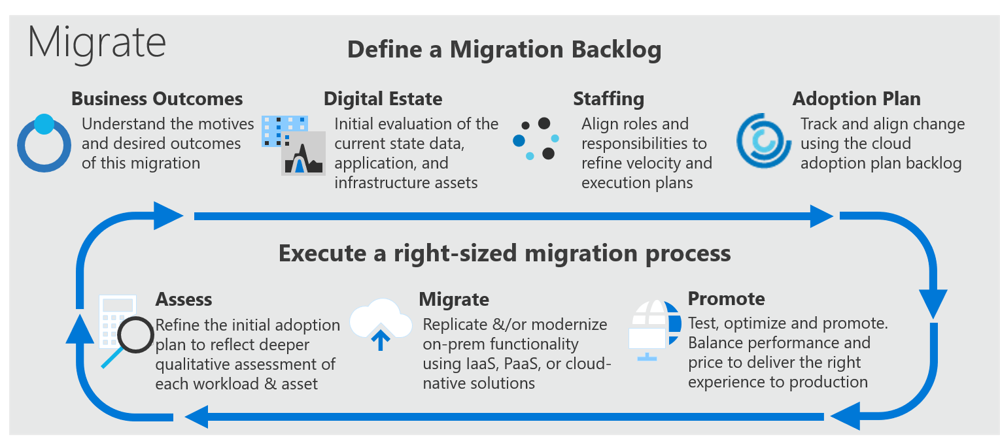

# VMware host migration best practices for Azure

Migrating VMware host to Azure can accelerate the standard methodology outlined in the Cloud Adoption Framework, and pictured here.

*Figure 1*

The table of contents on the left outlines best practices across multiple Microsoft web properties. These best practices can guide the execution of your VMware host migration to Azure VMware Solution. Bookmark this page to quickly reference the full list of best practices.
