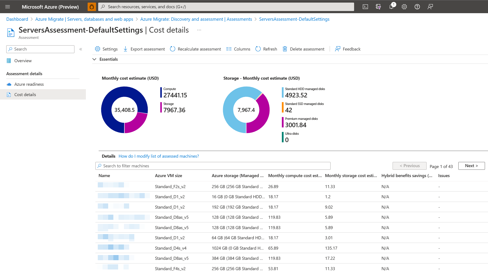

# Migration-focused cost control mechanisms

The cloud introduces a few shifts in how we work, regardless of our role on the technology team. Cost is a great example of this shift. In the past, only finance and IT leadership were concerned with the cost of IT assets (infrastructure, apps, and data). The cloud empowers every member of IT to make and act on decisions that better support the end user. However, with that power comes the responsibility to be cost conscious when making those decisions.

This article introduces the tools that can help make wise cost decisions before, during, and after migrating workloads to Azure.

The tools in this article include:

> - Azure Migrate
> - Azure pricing calculator
> - Azure TCO calculator
> - Azure Cost Management + Billing
> - Azure Advisor

The processes described in this article may also require a partnership with IT managers, finance, or line-of-business application owners.

<!-- markdownlint-disable MD024 -->

## [Estimate VM costs prior to migration](#tab/EstimateVMCosts)

Prior to migration of any asset (infrastructure, app, or data), there is an opportunity to estimate costs and refine sizing based on observed performance criteria for those assets. Estimating costs serves two purposes: it allows for cost control, and it provides a checkpoint to ensure that current budgets account for necessary performance requirements.

### Cost calculators

For manual cost calculations, there are two handy calculators that can provide a quick cost estimate based on the architecture of the workload to be migrated.

- The [Azure pricing calculator](https://azure.microsoft.com/pricing/calculator/) provides cost estimates for the Azure products you select.
- Sometimes decisions require a comparison of the future cloud costs and the current on-premises costs. The [total cost of ownership (TCO) calculator](https://azure.microsoft.com/pricing/tco/calculator/) can provide such a comparison.

These manual cost calculators can be used on their own to forecast potential spend and savings. They can also be used in conjunction with the cost forecasting tools of Azure Migrate to adjust the cost expectations to fit alternative architectures or performance constraints.

### Azure Migrate calculations

**Prerequisites:** The remainder of this tab assumes the reader has already populated Azure Migrate with a collection of assets (infrastructure, apps, and data) to be migrated. The prior article on assessments provides instructions on collecting the initial data. Once the data is populated, follow the next few steps to estimate monthly costs based on the data collected.

Azure Migrate calculates monthly cost estimates based on data captured by the collector and Service Map. The following steps will load the cost estimates:

1. Navigate to **Azure Migrate assessment** in the portal.
1. In the project **Overview** page, select **+ Create assessment**.
1. Select **View all** to review the assessment properties.
1. Create the group, and specify a group name.
1. Select the machines that you want to add to the group.
1. Select **Create assessment**, to create the group and the assessment.
1. After the assessment is created, view it in **Overview** > **Dashboard**.
1. In the **Assessment details** section of the portal navigation, select **Cost details**.

The resulting estimate, pictured below, identifies the monthly costs of compute and storage, which often represent the largest portion of cloud costs.

*Figure 1: Diagram of the cost details view of an assessment in Azure Migrate.*

### Additional resources

- [Set up and review an assessment with Azure Migrate](/azure/migrate/tutorial-assess-vmware-azure-vm#set-up-an-assessment)
- For a more comprehensive plan on cost management across larger numbers of assets (infrastructure, apps, and data), see the [Cloud Adoption Framework governance model](../../govern/guides/index.md). In particular, see [Cost Management discipline guidance](../../govern/cost-management/index.md) and [Cost Management discipline improvement](../../govern/guides/complex/cost-management-improvement.md).

## [Estimate and optimize VM costs during and after migration](#tab/EstimateOptimize)

Estimating cost prior to migration provides a solid target for cost expectations. It also provides opportunities to consider the performance and cost needs of each asset (infrastructure, apps, and data) to be migrated. However, it is still an estimate. Once the asset is migrated and under load, more accurate cost calculations can be made, based on actual or synthesized load.

### Azure Advisor cost recommendations

Within 24 hours of migrating assets (infrastructure, apps, and data) to Azure, Azure Advisor begins monitoring each asset's performance to provide you with feedback on the asset. One item of feedback collected relates to the balance between cost and utilization.

The following steps provide cost recommendations for assets (infrastructure, apps, and data) within your current subscriptions:

1. Navigate to **Azure Advisor** in the portal. To do so, select **Advisor** in the left navigation pane of the Azure portal. If you do not see Advisor in the left pane, select **All services**. In the service menu pane, under **Monitoring and Management**, select **Advisor**.
2. The Advisor dashboard will display a summary of your recommendations for all selected subscriptions. You can choose the subscriptions that you want recommendations to be displayed for using the subscription filter dropdown.
3. To see cost recommendations, select the **Cost** tab.

### Azure Cost Management + Billing

Azure Cost Management + Billing can provide a more holistic view of spending habits, including detailed view of costs and spending trends over time. For large or complex migrations, this view may provide the insights needed to make broad sweeping cost management decisions.

**Prerequisites:** The remainder of this tab assumes the reader has completed setup of Azure Cost Management + Billing during completion of the Azure setup guide. For more information on configuring Azure Cost Management + Billing, see [Manage costs and billing for Azure resources](../../ready/azure-setup-guide/manage-costs.md) in the Azure setup guide. Once the data is populated, follow the next few steps to estimate monthly costs based on the data collected.

The following steps will load Azure Cost Management + Billing cost analysis data for your subscriptions:

1. Navigate to **Cost Management + Billing** in the portal. If you do not see **Cost Management + Billing** in the left pane, select **All services**. In the service menu pane, under **Monitoring and Management**, select **Cost Management + Billing**.
2. In **Cost Management + Billing**, select **Cost Management** in the left navigation pane to begin analyzing and optimizing cloud costs.
3. In **Cost Management**, select **Cost analysis**.
    1. Use the **Scope** pill to switch to a different scope in cost analysis.

This analysis will allow you to review total costs, budget (if available), and accumulated costs. Each calculation can be viewed by service, by resource, and over time. Most importantly, costs can be analyzed by tags. Properly naming and tagging assets (infrastructure, apps, and data) is the fundamental starting point of all sound governance and cost management processes. Proper tags allow for better management of costs and clearer impacts of performance and cost optimizations.

### Additional resources

- For a more comprehensive plan on cost management across larger numbers of assets (infrastructure, apps, and data), see the [Cloud Adoption Framework governance model](../../govern/guides/index.md). In particular, see the [Cost Management discipline](../../govern/cost-management/index.md) and [Cost Management discipline improvement](../../govern/guides/complex/cost-management-improvement.md).
- For more information about Azure Advisor, see [Reducing service costs using Azure Advisor](/azure/advisor/advisor-cost-recommendations).
- For more information about Azure Cost Management + Billing, see [Understand and work with scopes](/azure/cost-management-billing/costs/understand-work-scopes) and [explore and analyze costs with cost analysis](/azure/cost-management-billing/costs/quick-acm-cost-analysis).

## [Tips and tricks to optimize costs](#tab/TipsTricks)

In addition to the tools mentioned in this article, there are some tips and tricks that can help quickly reduce overall cloud costs. The following are a few high-level tips to be aware of:

### Avoid unnecessary spending

Most assets (infrastructure, apps, and data) in an existing datacenter could theoretically be migrated to the cloud. However, that doesn't mean they should be. During assessment of each workload, validate that the workload should be migrated. The Cloud Adoption Framework article on [incremental rationalization](../../digital-estate/rationalize.md) can help determine which assets should be migrated.

### Reduce waste

After you've deployed your infrastructure in Azure, it's important to make sure it is being used. The easiest way to start saving immediately is to review your resources and remove any that aren't being used.

### Reduce overprovisioning

Even with the best approaches to estimation, there are likely to be overprovisioned and underutilized assets (infrastructure, apps, and data). Review of those assets using the tools in the prior two tabs will identify potential means of reducing asset sizing to better match performance requirements and reduce costs.

### Take advantage of available discounts

Speak with your Microsoft account representative to understand how you can take advantage of current discount options. The following are a few examples of discounts that are commonly used to reduce costs.

### Azure Reservations

[Azure Reservations](/azure/cost-management-billing/reservations/save-compute-costs-reservations) allow you to prepay for one year or three years of virtual machine or SQL Database compute capacity. Prepaying will allow you to get a discount on the resources you use. Reservations can significantly reduce your virtual machine or SQL Database compute costs, up to 72 percent on pay-as-you-go prices with either a one-year or three-year upfront commitment. Reservations provide a billing discount and don't affect the runtime state of your virtual machines or SQL databases.

### Use Azure Hybrid Benefit

If you already have Windows Server or SQL Server licenses in your on-premises deployments, you can use the [Azure Hybrid Benefit](https://azure.microsoft.com/pricing/hybrid-benefit/) program to save in Azure. With the Windows Server benefit, each license covers the cost of the OS (up to two virtual machines), and you only pay for base compute costs. You can use existing SQL Server licenses to save up to 55 percent on vCore-based SQL Database options. Options include SQL Server in Azure Virtual Machines and SQL Server Integration Services.

### Low-priority VMs with batch

For lower priority background processes, batch offers a means of managing the background service VMs and reducing costs. However, it is important to understand the performance impact of [low-priority VMs with batch](/azure/batch/batch-low-pri-vms) before choosing this discounted option.

### Additional resources

For a more comprehensive plan for cost management across larger numbers of assets (infrastructure, apps, and data), see the [Cloud Adoption Framework governance model](../../govern/guides/index.md). In particular, see the [Cost Management discipline](../../govern/cost-management/index.md) and [Cost Management discipline improvement](../../govern/guides/complex/cost-management-improvement.md).
