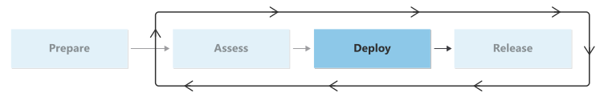

# Migration deployment checklist

In the deploy phase of your adoption journey, you begin the technical implementation of the migration. You can use the workload architecture and assessment materials from the assess phase to begin deployment and remediation of problems. You can also begin to replicate servers to Azure, prepare them for migration, and run your technical tests.

This phase can be the most technically demanding. It's important to make sure you complete your remediation activities and do detailed testing. You should have a clear understanding of how your services operate together. By the end of this phase, you should have high confidence that your workload is ready to operate in Azure and that you're ready to plan for the workload release.

## Checklist

The following table provides an overview of the activities in this phase and the roles that are responsible for each activity.

|Activity|Description|Responsible roles|
|---|---|---|
|[Deploy supporting services](./deploy-supporting-services.md)|Guidance about how to plan for and deploy non-server resources for your workload|<li>Migration Engineer|
|[Remediate assets](./remediate.md)|Guidance to help build your remediation plan based on assets|<li>Migration Architect <li>Migration Engineer <li>Project Manager|
|[Replicate assets](./replicate.md)|Guidance for replicating source servers to the cloud|<li>Migration Engineer|
|[Prepare for management](./prepare-for-management.md)|Guidance on planning for management as part of the migration|<li>Cloud Operations Manager <li>Migration Engineer <li>Workload Architect|
|[Test your migration](./migration-test.md)|Guidance on how to do technical migration testing before doing business testing|<li>Project Manager <li>Workload Architect <li>Migration Engineer|

## Next step

> [!div class="nextstepaction"]
> [Deploy supporting services](./deploy-supporting-services.md)
