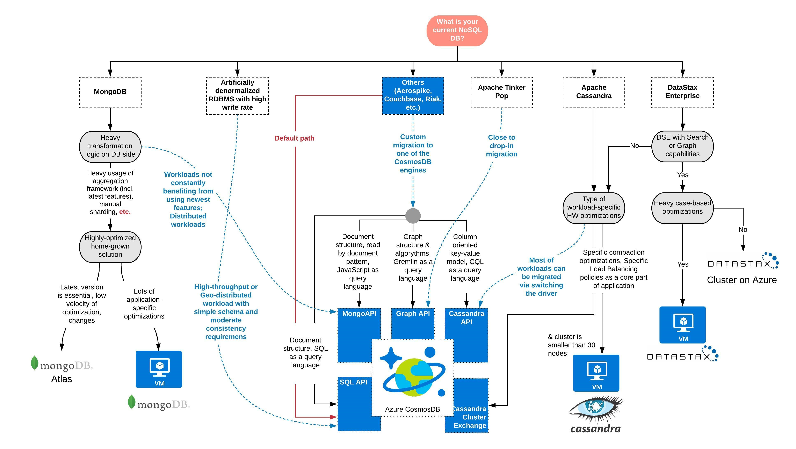

# NoSQL migration decision tree

The following decision tree outlines options available for migrating a NoSQL data structure to various data platforms in Azure.
This reference can aid in determining the most appropriate migration path for NoSQL.

