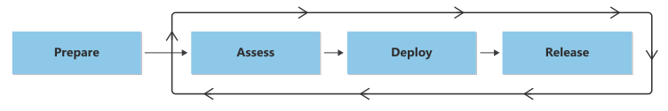

# Migrate overview

This article describes how to use the Cloud Adoption Framework for Azure to migrate a workload to the cloud and offers guidance for a smooth transition. The migration process includes four stages: prepare, assess, deploy, and release. This approach is vendor-neutral, so you can migrate workloads to any cloud service.

## Migration disciplines

A cloud migration typically requires both good preparation and good implementation. The Cloud Adoption Framework migration methodology relies on proven guidance to help you prepare for and carry out your migration efforts.

To start a cloud migration, you first need to prepare and fulfill any prerequisites:

- **Prepare**: Focus on organizational alignment. Define clear owners for the migration process and ensure that your teams have the required skills. In this phase, you build on the work from the [strategy](../strategy/index.md), [plan](../plan/index.md), and [ready](../ready/index.md) guidance of the Cloud Adoption Framework. This step is critical to the success of your migration effort.

After you fulfill and prepare the prerequisites, you can start the migration process. The migration process is an iterative process that includes the following phases:

- **Assess workloads**: Assess workloads to evaluate cost, modernization, and deployment tooling. This process focuses on validating or challenging assumptions. You make these assumptions during discovery and assessments by looking closely at rationalization options. During this process, you also study user patterns and dependencies closely to ensure the technical success of workloads after migration.

- **Deploy workloads**: After you assess workloads, you replicate or improve the existing workload functionality in the cloud. This replication could involve a *lift and shift* or *rehost* to the cloud. But more commonly, you might modernize many of the assets that support these workloads to capitalize on the benefits of the cloud.
- **Release workloads**: After you replicate workload functionality to the cloud, you can test, optimize, document, and release workloads for ongoing operations. You must review the migrated workloads and hand them off during this process. This step is critical to governance, operations management, and security teams for ongoing workload support.

## Cloud migration checklist

| &nbsp; | Migration phase | Activity |
|---|---|---|
| &#9744; | [Prepare](./prepare/index.md) | <li>Ready your landing zone for migration <li>Prepare tools and backlog <li>Select Azure regions for a migration <li>Align roles and responsibilities <li> Learn skills that are relevant to migration projects |
| &#9744; | [Assess](./assess/index.md) | <li>Classify workloads <li>Evaluate workload readiness <li>Architect workloads|
| &#9744; | [Deploy](./deploy/index.md) | <li>Deploy supporting services <li>Remediate assets <li>Replicate assets <li>Prepare for management <li>Test the migration |
| &#9744; | [Release](./release/index.md) | <li>Begin change communication <li>Conduct business testing <li>Complete the migration <li>Optimize costs after the migration <li>Conduct retrospectives |

For more details, see the articles for each phase.

## Audience

The Migrate methodology addresses various roles and functions, for example:

- **Business decision makers**: Understand the motivations for migrations. Make informed decisions that relate to your overall budget and cloud investments. Learn about relevant skills that your organization needs to migrate workloads and how to get assistance from partners.
- **IT decision makers**: Understand the considerations for migrating into multiple regions or multiple datacenters. Explore the recommended migration tools and skills required to migrate.
- **Platform owners or platform architects**: Learn how to prepare your Azure landing zones for migration. Also explore other technical preparations for your Azure estate that you might need to implement before you initiate a migration project.
- **Cloud engineers or cloud architects**: Assess existing workloads and solutions, deploy required infrastructure in the cloud, and release workloads into production.

## Next step

Familiarize yourself with the prepare discipline to get started.

> [!div class="nextstepaction"]
> [Prepare](./prepare/index.md)
