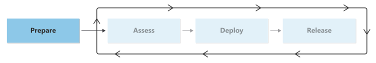

# Migration preparation checklist

Before you plan individual workload migrations, you must ready your organization and cloud resources to support the migration. Consider the decisions you need to make and the processes you need to incorporate to ready your environment. Some of these considerations are covered earlier in the Cloud Adoption Framework for Azure, and those decisions can affect future migration activities.

The following section provides guidance about creating a secure foundation and plan for your migrations.

**It's important to prepare**. If you fail to prepare for migrations, you might run into setbacks if you have to retroactively incorporate changes. If the process becomes too intensive, you might even have to abandon the migration and resume it at a later date, after tasks are completed. To avoid this scenario, make sure that you have a plan for addressing all the readiness activities.

## Checklist

The following table provides an overview of the articles that describe the activities for migration preparation. It also shows the roles that are responsible for each activity.

|Activity|Description|Responsible roles|
|---|---|---|
|[Prepare tools and an initial migration backlog](./tools-backlog.md)|Learn how to prepare the right tools and build a migration backlog from your digital estate planning.|<li>Project sponsor <li> Migration architect <li>Project manager|
|[Select Azure regions for a migration](./select-regions-migration.md)|Learn how to plan for and select the Azure cloud regions for your workload migration to Azure. Find suggested actions for assessment, migration, and other processes.|<li>Migration architect <li>Landing zone architect <li>Cloud operations manager|
|[Align roles and responsibilities](./roles-responsibilities.md)|Learn about the roles and functions that you need for a migration project.|<li>Project manager <li>Stakeholder|
|[Incorporate skills readiness for migration](./skills-support.md)|Find out about the resources and training that your team needs to build essential migration skills.|<li>Project manager <li>Organizational change manager|

## Next steps

Understand how to prepare your landing zone for migrations.

> [!div class="nextstepaction"]
> [Prepare your landing zone](./ready-azure-landing-zone.md)
