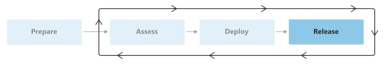

# Migration release checklist

This phase guides you through releasing your deployed workloads to production use. It includes the technical processes of taking your final migration steps, communicating to the business, making final change approvals, cleaning up resources, and learning from the migration.

## Conduct the migration

When you reach this phase, you have your resources deployed into Azure, either as new resources with replicated data in a properly configured state or as a replicated server through a migration tool. From a technical perspective, all that remains to do is to start the final migration tasks and send traffic over to the new location.

However, you need to do more to make sure the migration is successful. Clear communication with the business and support teams is critical, as is finalizing activities, including a proper retrospective, after the migration.

Failure to communicate, test, or successfully migrate resources can create outages and business disruptions. A failure to decommission retired assets or optimize workloads can lead to a failure to achieve the business outcomes of the migration. To avoid these problems, you need to finish the migration strong.

## Checklist

The following table gives an overview of the activities that are documented in this phase and the roles that are responsible for carrying out each activity.

|Activity|Description|Responsible roles|
|---|---|---|
|[Plan change communication](./change-communication.md)|Contains guidance and examples for how to communicate the upcoming change to the business and IT teams.|<li>Project Manager <li>Organizational Change Manager|
|[Conduct business testing](./business-test.md)|Contains guidance on how to conduct business testing to ensure that the functionality and usability of the workload remains the same after you migrate it to the cloud.|<li>Project Manager <li>Workload Business Owner <li>Workload Architect <li>User Acceptance Tester|
|[Complete the migration](./complete-migration.md)|Contains guidance for how to conduct your migration release window.|<li>Migration Architect <li>Migration Engineer|
|[Optimize costs after the migration](./optimize-cost-after-migration.md)|Contains resources for optimizing workload costs after the migration.|<li>Workload Architect <li>Cloud Operations Manager <li>Project Manager|
|[Conduct a retrospective](./retrospective.md)|Contains guidance on how to do retrospectives to improve the migration of future workloads.|<li>Workload Architect <li>Cloud Operations Manager|

## Next step

Now that you have a general understanding of the optimization process, you're ready to begin communicating the changes.

> [!div class="nextstepaction"]
> [Change communication](./change-communication.md)
