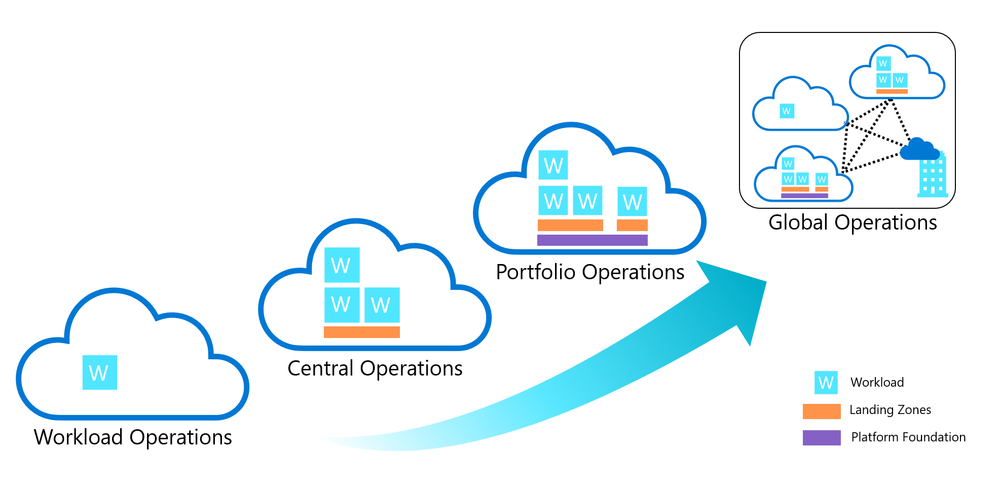
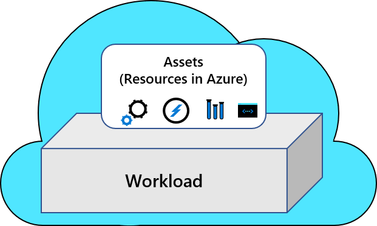
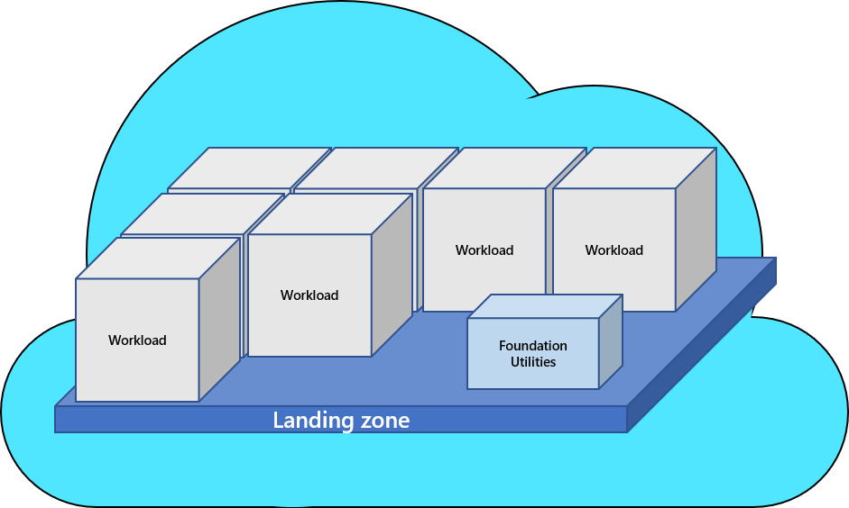
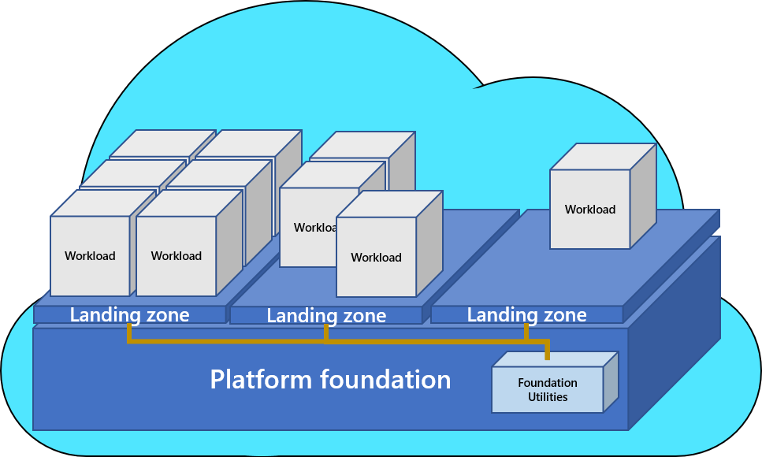
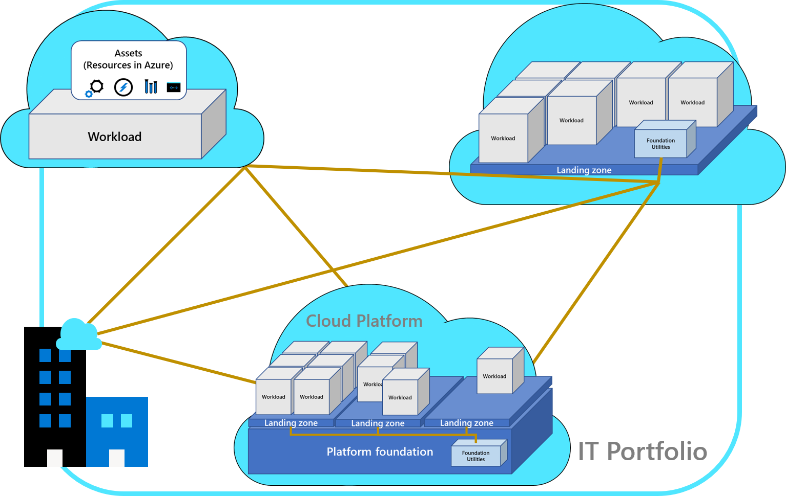

# Review and compare common cloud operating models

Operating models are unique and specific to the business they support, based on their current requirements and constraints. But operating models aren't *snowflakes*. There are several common patterns in customer operating models; this article outlines the four most common patterns.

## Operating model comparison

The following image maps common operating models based on the range of complexity, from least complex (decentralized) to most complex (global operations). The following tables compare the same operating models based on the relative value of a few other attributes.

### Priorities or scope

A cloud operating model is primarily driven by two factors:

- Strategic priorities or motivations
- Scope of the portfolio to be managed

|  | Decentralized operations (ops) | Centralized operations (ops) | Enterprise operations (ops) | Distributed operations (ops) |
|--|--|--|--|--|
| **Strategic priorities or motivations** | Innovation | Control | Democratization | Integration |
| **Portfolio scope** | Workload | Landing zone | Cloud platform | Full portfolio |
| **Workload environment** | High complexity | Low complexity | Medium complexity | Medium or variable complexity |
| **Landing zone** | N/A | High complexity | Medium to low complexity | Low complexity |
| **Foundation utilities** | N/A | N/A or low support | Centralized and more support | Most support |
| **Cloud foundation** | N/A | N/A | Hybrid, provider specific, or regional foundations | Distributed and synchronized |

- Strategic priorities or [motivations](../strategy/motivations.md): Each operating model delivers the typical [strategic motivations for cloud adoption](../strategy/motivations.md). But some operating models simplify specific motivations.

- [Portfolio scope](../resources/fundamental-concepts/hosting-hierarchy.md): The portfolio scope identifies the largest scope that a specific operating model design supports. For example, centralized operations are designed for a few landing zones. But the operating model decision might create operational risks for an organization. Operational risks result when trying to manage a large complex portfolio. These portfolios might require many landing zones or variable complexity in landing zone design.

> [!IMPORTANT]
> Adopting the cloud often triggers reflection on the current operating model and might lead to a shift from one common operating model to another. But cloud adoption isn't the only trigger. Business priorities and the scope of cloud adoption can change how the portfolio needs to be supported. Also, there could be other shifts in the most-appropriately aligned operating model. When the board, or other executive teams, develop 5 to 10 year business plans, those plans often include a requirement (explicit or implied) to adjust the operating model. Operating models are a good reference for guiding decisions. These models might change or need to be customized to meet your requirements and constraints.

### Accountability alignment

Many teams and individuals are responsible for supporting different functions. But each common operating model assigns final accountability for decision outcomes to one team or individual. This approach affects how the operating model is funded and what level of support is provided for each function.

|  | Decentralized ops | Centralized ops | Enterprise ops | Distributed ops |
|--|--|--|--|--|
| **Business alignment** | [Workload team](../organize/cloud-adoption.md) | [Central cloud strategy](../organize/cloud-strategy.md) | [CCoE](../organize/cloud-center-of-excellence.md) | Variable - [form a broad cloud strategy team?](../get-started/team/cloud-strategy.md) |
| **[Cloud operations](../organize/cloud-operations.md)** | [Workload team](../organize/cloud-adoption.md) | [Central IT](../organize/central-it.md) | [CCoE](../organize/cloud-center-of-excellence.md) | Based on portfolio analysis - see [Business alignment](../manage/considerations/business-alignment.md) and [Business commitments](../manage/considerations/commitment.md) |
| **[Cloud governance](../organize/cloud-governance.md)** | [Workload team](../organize/cloud-adoption.md) | [Central IT](../organize/central-it.md) | [CCoE](../organize/cloud-center-of-excellence.md) | [Multiple layers of governance](../govern/guides/complex/multiple-layers-of-governance.md) |
| **[Cloud security](../secure/teams-roles.md)** | [Workload team](../organize/cloud-adoption.md) | [Security operations center (SOC) / DevSecOps function](../secure/teams-roles.md) | [CCoE](../organize/cloud-center-of-excellence.md) + [SOC](../secure/teams-roles.md) | Mixed - see [Define a security strategy](../strategy/define-security-strategy.md) |
| **[Cloud automation and DevOps](../organize/cloud-automation.md)** | [Workload team](../organize/cloud-adoption.md) | [Central IT](../organize/central-it.md) or N/A | [CCoE](../organize/cloud-center-of-excellence.md) | Based on portfolio analysis - see [Business alignment](../manage/considerations/business-alignment.md) and [Business commitments](../manage/considerations/commitment.md) |

### Accelerate operating model implementation in Azure

As discussed in [Define your operating model](./define.md), each methodology of the Cloud Adoption Framework provides a structured path for developing your operating model. These methodologies might help you overcome blockers that stem from gaps in adopting the cloud operating model.

The following table outlines ways to accelerate your operating model implementation.

|  | Decentralized ops | Centralized ops | Enterprise ops | Distributed ops |
|--|--|--|--|--|
| **Starting point** | [Azure Well-Architected Framework (WAF)](/azure/architecture/framework/) | Azure landing zones: [start-small options](../ready/landing-zone/implementation-options.md) | Azure landing zones: [CAF enterprise-scale](../ready/enterprise-scale/implementation.md) | [Business alignment](../manage/considerations/business-alignment.md) |
| **Iterations** | A focus on workloads lets the team iterate within WAF. | The start-small option requires more iteration on each methodology but can be done as cloud adoption efforts mature. | As illustrated by the reference implementations, future iterations typically focus on minor configuration additions. | Review the [Azure landing zone implementation options](../ready/landing-zone/implementation-options.md) to start with the option that best meets your operations baseline. Follow the iteration path defined in that option's design principles. |

## Decentralized operations

Operations are always complex. If you limit the scope of your operations to one workload or a small collection of workloads, you control the complexity. Decentralized operations are the least complex of the common operating models. In this form of operations, all workloads operate independently by dedicated workload teams.

- **Priorities**: Your team measures innovation over centralized control or standardization across multiple workloads.
- **Distinct advantage**: Maximize speed of innovation by placing workload and business teams in full control of design, build, and operations.
- **Distinct disadvantage**: Reduction in cross-workload standardization, economies of scale through shared services, and consistent governance centralized compliance efforts.
- **Risk**: This approach introduces risk when managing a portfolio of workloads. Workload teams might have specialized teams dedicated to central IT functions. This operating model is viewed as a high risk option by some organizations, especially companies that are required to follow third-party compliance requirements.
- **Guidance**: Decentralized operations are limited to workload-level decisions. Microsoft Azure Well-Architected Framework supports the decisions made within that scope. The processes and guidance within the Cloud Adoption Framework might add overhead that isn't required by decentralized operations.

### Advantages of decentralized operations

- **Cost management**: Cost of operations is easily mapped to a single business unit. Workload-specific operations support greater workload optimization.
- **Responsibilities**: Typically, this form of operations is highly dependent on automation to minimize overhead. Responsibilities tend to focus on DevOps and pipelines for release management. This type of operations supports faster deployments and shorter feedback cycles during development.
- **Standardization**: Use a source code and deployment pipeline to standardize the environment from release to release.
- **Operations support**: Decisions that affect operations are only concerned with the needs of that workload and simplifying operations decisions. Members of the DevOps community say that operations support is the purest form of operations because of the tighter operational scope.
- **Expertise**: DevOps and development teams are most empowered by this approach and experience the least resistance to driving market change.
- **Landing zone design**: No specific operational advantage.
- **Foundational utilities**: No specific operational advantage.
- **Separation of duties**: No specific operational advantage.

### Disadvantages of decentralized operations

- **Cost management**: Enterprise costs are harder to calculate. Lack of centralized governance teams makes it harder to implement uniform cost controls or optimization. At scale, this model can be costly, because each workload might have duplication in deployed assets and staffing assignments.
- **Responsibilities**: Lack of centralized support means that the workload team is entirely responsible for governance, security, operations, and change management. The lack of support is problematic when those tasks haven't been automated in code review and release pipelines.
- **Standardization**: Standardization across a portfolio of workloads is variable and inconsistent.
- **Operations support**: Scale efficiencies are often missed while creating best practices across multiple workloads.
- **Expertise**: Team members have a greater responsibility to make wise and ethical decisions about governance, security, operations, and change management within the application design and configuration. Consult the Microsoft Azure Well-Architected Review and Azure Well-Architected Framework frequently to improve the required expertise.
- **Landing zone design**: Landing zones aren't workload-specific and aren't considered in this approach.
- **Foundational utilities**: Few (if any) foundational services are shared across workloads, reducing scale efficiencies.
- **Separation of duties**: Higher requirements for DevOps and development teams increase usage of elevated privileges from those teams. If you require separation of duties, you might need to heavily invest in DevOps maturity to operate with this approach.

## Centralized operations

Stable state environments might not require focus on the architecture or distinct operational requirements of the individual workloads. Central operations tend to be the norm for technology environments that consist primarily of stable-state workloads. Examples of stable-state operations include things like commercial-off-the-shelf (COTS) applications, or well-established custom applications that have a slow release cadence. If a rate of change is driven by regular updates and patches, the centralization of operations might be an effective way to manage your portfolio.

- **Priorities**: Priorities are the central control over innovation, and measure the existing operational processes over the cultural shift to modern cloud operations.
- **Distinct advantage**: Centralization introduces economies of scale, best-of-breed controls, and standardized operations, and works best with the cloud environment. These environments need specific configurations to integrate cloud operations into existing operations and processes. Centralization is most advantageous with a portfolio of a few hundred workloads with modest architectural complexity and compliance requirements.
- **Distinct disadvantage**: Scaling to meet the demands of a large portfolio of workloads can place significant strain on centralized teams that make operational decisions for production workloads. If technical assets expect to scale beyond 1,000 VMs, applications, or data sources, you might consider an enterprise model if it's within 18-24 months.
- **Risk**: This approach limits centralization to a smaller number of subscriptions (often one production subscription). Significant risk is involved when refactoring later in your cloud journey, and might interfere with your adoption plans. To avoid rework, try focusing on segmentation, environment boundaries, identity tooling, and other foundational elements.
- **Guidance**: Azure landing zone implementation options that are aligned to the "start small and expand" development velocity creates a sound starting point. You can use these options to accelerate adoption efforts. But to be successful, establish clear policies to guide early adoption efforts within acceptable risk tolerances. Governing and Managing methodologies helps create processes to mature operations in parallel. Following these steps serve as stage gates that must be completed before allowing increased risk as operations mature.

### Advantages of centralized operations

- **Cost management**: Centralizing shared services across many workloads creates economies of scale and eliminates duplicated tasks. Central teams can quickly implement cost reductions through enterprise-wide sizing and scale optimizations.
- **Responsibilities**: Centralized expertize and standardization might lead to higher stability, better operational performance, and minimal change-related outages. This approach reduces broad skilling pressures on the workload focused teams.
- **Standardization**: In general, standardization and cost of operations is lowest with a centralized model because there are fewer duplicated systems or tasks.
- **Operations support**: Reducing complexity and centralizing operations makes it easier for smaller IT teams to support operations.
- **Expertise:** Centralizing supporting teams lets experts in security, risk, governance, and operations drive business-critical decisions.
- **Landing zone design**: Central IT reduces complexity by minimizing the number of landing zones and subscriptions. Landing zone designs tend to mimic the preceding datacenter designs, which reduce transition time. As adoption progresses, shared resources might be moved into a separate subscription or platform foundation.
- **Foundational utilities**: You carry existing datacenter designs into the cloud results in foundational, shared services that mimic on-premises tools and operations. When on-premises operations are your primary operating model, it might be an advantage, but beware of some disadvantages. On-premises operations reduce transition time, capitalizes on economies of scale, and supports consistent operational processes between on-premises and cloud hosted workloads. This approach can reduce short-term complexity and effort and let smaller teams support cloud operations with reduced learning curves.
- **Separation of duties**: Separation of duties is clear in central operations. Central IT maintains control of the production environments and reduces the need for any elevated permissions from other teams. This approach reduces breaches by limiting the number of accounts with elevated privileges.

### Disadvantages of centralized operations

- **Cost management**: Central teams don't always understand workload architectures to produce impactful optimizations at the workload level. This lack of understanding limits the amount of cost savings that comes from well-tuned workload operations. Not fully understanding workload architecture can affect centralized cost optimizations, which affect performance, scale and other pillars of a well-architected workload. Before you apply enterprise-wide cost changes to high profile workloads, your central IT team should understand and complete the Microsoft Azure Well-Architected Review.
- **Responsibilities**: Centralizing production support and access places high operational burden on a few people and greater pressure on each individual. The pressures placed on these individuals cause the need to perform deeper reviews of the deployed workloads, which validate adherence to detailed security governance and compliance requirements.
- **Standardization**: Central IT approaches make it difficult to scale standardization without a linear scaling of central IT staff.
- **Operations support**: The greatest disadvantages of this approach are associated with significant scale and shifts that measures innovation.
- **Expertise:** Developer and DevOps experts are at risk of being under-valued or too constrained in this type of environment.
- **Landing zone design**: Datacenter designs are based on the constraints of preceding approaches, which aren't always relevant to the cloud. Following this approach reduces the opportunities to rethink environment segmentation and empower opportunities for innovation. Lack of landing zone segmentation increases the potential effect of breach, complexity of governance and compliance adherence, and might create blockers to adoption in the cloud journey. See the risks section above.
- **Foundational utilities**: During digital transformation, cloud might become the primary operating model. Central tools, which are built for on-premises operations, reduce opportunities to modernize operations and increase operational efficiencies. Choosing not to modernize operations early in the adoption process is also an option. Modernizing might be achieved by creating a platform foundation subscription in the cloud adoption journey. That effort can be complex, costly, and time-consuming without advanced planning.
- **Separation of duties**: Central operations generally follow one of two paths and both might hinder innovation.
  - **Option 1**: Teams outside of central IT are granted limited access to development environments that mimic production. This option hinders experimentation.
  - **Option 2**: Teams develops and test in non-supported environments. This option hinders deployment processes and slows post-deployment integration testing.

## Enterprise operations

Enterprise operations are the suggested target state for all cloud operations. Enterprise operations balance the need for control and innovation by simplifying decisions and responsibilities. Central IT is replaced by a more facilitative cloud center of excellence or CCoE team, which supports workload teams. The CCoE team, holds workload teams accountable for decisions, as opposed to controlling or limiting their actions. Workload teams are granted more power and more responsibility to drive innovation, within well-defined guardrails.

- **Priorities**: Priorities are the democratization of technical decisions. Democratization of technical decisions shifts responsibilities previously held by central IT to workload teams. To deliver this shift in priorities, decisions become less dependent on human-run review processes. This approach supports automated review, governance, and enforcement, using cloud-native tools.
- **Distinct advantage**: Segmentation of environments and separation of duties allow for balance between control and innovation. Centralized operations maintain workloads that require increased compliance and stable state operations, or represent greater security risks. Conversely, this approach supports reducing centralized control of workloads and environments that require greater innovation. Larger portfolios might struggle with the balance between control and innovation. This flexibility makes it easier to scale thousands of workloads with reductions in operational pains.
- **Distinct disadvantage**: What worked on-premises might not work well in enterprise cloud operations. This approach to operations requires changes on many fronts. Cultural shifts in control and responsibility are often the biggest challenge. Operational shifts that follow the cultural shifts take time and committed efforts to implement, mature, and stabilize. Architectural shifts might be required in stable workloads, while tooling shifts are required to empower and support the cultural, operational, and architectural shifts. These shifts might require commitments to a primary cloud provider. Adoption efforts made before these changes can require significant rework that goes beyond typical refactoring efforts.
- **Risk**: This approach requires executive commitment to the change strategy. It also requires commitment from the technical teams to overcome learning curves and deliver the required change. Long-term cooperation between business, CCoE and central IT, and workload teams is required to see long-term benefits.
- **Guidance**: Azure landing zone options are defined as *enterprise-scale*. These options provide reference implementations to demonstrate how technical changes deliver using cloud-native tooling in Azure. The enterprise-scale approach guides teams through the operational and cultural shifts required to take full advantage of those implementations. That same approach might tailor the reference architecture to configure the environment to meet your adoption strategy and compliance constraints. When you implement enterprise-scale, the Govern and Manage methodologies can help define processes. These processes can expand your compliance and operations capabilities to meet your operational needs.

### Advantages of enterprise operations

- **Cost management**: Central teams act on cross-portfolio optimizations and hold individual workload teams accountable for deeper workload optimization. Workload-focused teams are empowered to make decisions and provided clarity when those decisions have a negative cost effect. Central and workload teams share accountability for cost decisions at the right level.
- **Responsibilities**: Central teams use cloud-native tools to define, enforce, and automate guardrails. Workload team efforts are accelerated through CCoE automation and practices. Workload teams are empowered to drive innovation and make decisions within those guardrails.
- **Standardization**: Centralized guardrails, and foundational services, create consistency across all environments.
- **Operations support**: Workloads that require centralized operations support are segmented to environments with stable-state controls. Segmentation and separation of duties empower workload teams to take accountability for operational support in their own dedicated environments. Automated cloud native tools ensure a minimum operations baseline for all environments with centralized operational support.
- **Expertise**: Centralizing core services such as security, risk, governance, and operations ensures proper central expertise. Clear processes and guardrails educate and empowers workload teams to make more detailed decisions. These decisions expand the effect of the centralized experts without needing to scale staff linearly with technology scale.
- **Landing zone design**: Landing zone design replicates the needs of the portfolio, creating clear security, governance, and accountability boundaries. These boundaries are required to operate workloads in the cloud. Segmentation practices are unlikely to resemble the constraints created by preceding datacenter designs. In enterprise operations, landing-zone design is less complex, allowing for faster scale and reduced barriers to self-service demand.
- **Foundational utilities**: Foundational utilities are hosted in separate centrally controlled subscriptions, known as the platform foundation. Central tools are then piped into each landing zone as utility services. Separating foundational utilities from the landing zones maximizes consistency and economy of scale. These utilities also create clear distinctions between centrally managed responsibilities and workload level responsibilities.
- **Separation of duties**: Clear separation of duties between foundational utilities and landing zones is one of the biggest advantages in the operations approach. Cloud-native tools and processes support access and proper balance of control between centralized teams and workload teams. This approach is based on the requirements of individual landing zones and workloads hosted in landing zone segments.

### Disadvantages of enterprise operations

- **Cost management**: Central teams are more dependent on workload teams to make production changes within landing zones. This shift creates a risk for potential budget overruns and slower right-sizing of actual spend. Cost control processes, clear budgets, automated controls, and regular reviews must be in place early to avoid cost surprises.
- **Responsibilities**: Enterprise operations require greater cultural and operational requirements. These requirements ensure clarity in responsibilities and accountability between central and workload teams.
- Traditional change management processes, or change advisory boards (cabs), might not maintain the pace and balance required in this operating model. Those processes are reflected in automating processes and procedures that safely scale cloud adoption.
- Lack of commitment to change materializes first in negotiation and alignment of responsibilities. Inability to align on shifts in responsibility is an indication that central IT operating models might be required during short-term cloud adoption efforts.
- **Standardization**: Lack of investment in centralized guardrails, or automation, create risks to standardization, which is more difficult to overcome through manual review processes. Operational dependencies between workloads in landing zones and shared services creates greater risks. These risks extend from standardization during upgrade cycles or future versions of foundational utilities. During platform foundation revisions, improved, or even automated testing, is required of all supported landing zones and the workloads they host.
- **Operations support**: The operations baseline provided through automation and centralized operations might be sufficient for low affect or low criticality workloads. But workload teams, or other forms of dedicated operations, might be required for complex or high criticality workloads. If so, it might create a shift in operations budgets, requiring business units to give operating expenses to those forms of advanced operations. If central IT is required to maintain sole accountability for the cost of operations, enterprise operations might be difficult to implement.
- **Expertise**: Central IT team members might be required to develop expertise in automating central controls previously delivered via manual processes. Also, these teams might develop proficiency for infrastructure-as-code approaches to defining the environment, and understand branching, merging, and deployment pipelines. At minimum, a platform automation team might need decision-making skills to understand decisions made by cloud center of excellence or central operation teams. Workload teams might be required to develop more knowledge related to the controls and processes that govern their decisions.
- **Landing zone design**: Landing zone design is dependent on foundational utilities. Workload teams should understand what's in the design and what's forbidden to include. This understanding might help avoid duplication of efforts, errors, or conflicts. To create flexibility, you can factor in exception processes to your landing zone designs.
- **Foundational utilities**: Centralizing foundational utilities takes time. These utilities eventually consider options and develop solutions that might scale to meet various adoption plans. Delays in early adoption efforts are possible. Delays might be offset in the long term due to accelerations and blocker avoidance later in the process.
- **Separation of duties**: Ensuring clear separation of duties requires mature identity management processes. There might be more maintenance associated with the proper alignment of users, groups, and onboarding and off-boarding activities. You might need to adopt new processes to accommodate just-in-time access via elevated privileges.

## Distributed operations

The existing operating model might be too engrained for the entire organization to shift to a new operating model. For others, global operations and various compliance requirements might prevent specific business units from making a change. In this case, it might require a distributing operations approach. This approach is by far the most complex, as it requires integrating one or more of the previously mentioned operating models.

While heavily discouraged, this operations approach might be required for some organizations. The approach mainly relates to organizations that have a loose collection of disparate business units, a diverse base of customer segments, or regional operations.

- **Priorities**: Integrate multiple existing operating models.
- Transitional state with a focus on moving the entire organization to one of the previously mentioned operating models.
- Longer term operational approach when the organization is too large or too complex to align to a single operating model.
- **Distinct advantage**: Integrate common operating model elements from each business unit. This approach creates a vehicle to group operating units into a hierarchy that helps them mature operations using consistent repeatable processes.
- **Distinct disadvantage**: Consistency and standardization across multiple operating models is difficult to maintain for extended periods. This operational approach requires deep awareness of the portfolio and how various segments of the technology portfolio operate.
- **Risk**: Lack of commitment to a primary operating model could lead to confusion across teams. Use this operating model when there's no way to align to a single operating model.
- **Guidance**: Start with a thorough review of the portfolio, which uses the approach outlined in the [business alignment](../manage/considerations/business-alignment.md) articles. Try to group the portfolio by the state operating model (decentralized, centralized, or enterprise).
- Develop a management group hierarchy that reflects the operating model groupings. This arrangement includes other organizational patterns for region, business unit, or other criteria that map the workload clusters from least common to most common buckets.
- Evaluate the alignment of workloads to operating models to find the most relevant operating model cluster to start with. Follow the guidance that's mapped to the operating model for all workloads under the node and management group hierarchy.
- Use Govern and Manage methodologies to find common corporate policies, including required operational management practices at various points of the hierarchy. Apply common Azure policies to automate the shared corporate policies.
- As you test Azure policies with various deployments, attempt to move them higher in the management group hierarchy. The policies can be applied to many workloads, which might find commonalities and distinct operation needs.
- Over time, this approach might help you define a model that scales across various operating models. This approach might also unify teams through a set of common policies and procedures.

Advantages and disadvantages of this approach are purposefully blank. After you complete the business alignment of your portfolio, see the predominant operating model section above for clarity on advantages and disadvantages.

## Next steps

Learn the terminology associated with operating models. The terminology helps you understand how an operating model fits into the bigger theme of corporate planning.

> [!div class="nextstepaction"]
> [Operating model terminology](./terms.md)

Learn how a landing zone provides the basic building block of any cloud adoption environment.

> [!div class="nextstepaction"]
> [What is a landing zone?](../ready/landing-zone/index.md)
