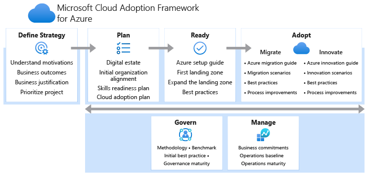

# Define your cloud operating model

Cloud operating models are complex. Countless customers become blocked by minor details while defining their cloud operating model. It's easy to fall into a series of circular references. To avoid circular references, the Cloud Adoption Framework provides a series of complimentary and incremental methodologies that decompose the volume of decisions into smaller exercises.

## Cloud Adoption Framework alignment

To help you define the cloud operating model for your business, the Cloud Adoption Framework breaks down each aspect of the operating model into methodologies. Each methodology and the associated actionable exercises are designed to help you define your future state operations.

### Support to develop your operating model

The following areas of the Cloud Adoption Framework are incremental methodologies designed to help grow areas of your operating model.

- [Manage](../manage/index.md): Align ongoing processes for operational management of the technology to maximize value attainment and minimize disruptions.
- [Govern](../govern/index.md): Ensure consistency across adoption efforts. Align to governance or compliance requirements to maintain a cross-cloud environment.
- [Security strategy](../strategy/define-security-strategy.md): Help for defining your overall security strategy.
- [Organize](../organize/index.md): Outlines the functions needed in the cloud. Also defines ways to organize people and align responsibilities.

### Collective output of the operating model

Your environment should represent how you want to operate. As you define your operating model, environmental readiness should match your operations, governance, security, and organizational requirements.

- [Ready](../ready/index.md): Azure landing zones provide deployment guidance and reference implementations to act on operating model decisions in the form of environmental configuration.

> [!NOTE]
> The Ready methodology provides several implementation options to Azure landing zones:
>
> - **Start small and expand:** Designed to build your cloud platform as you define each aspect of your operating model.
> - **Enterprise-scale:** Build out an enterprise ready architecture based on a set of defined operating-model decisions.

### Dependencies and inputs to operating model decisions

The business strategy and collective cloud adoption plans are inputs that should be considered when defining your operating model.

- [Strategy](../strategy/index.md): Guidance to capture business strategy and map those to efforts that can be enabled by a cloud adoption strategy.
- [Plan](../plan/index.md): Agile-based change management guidance to establish backlogs and align ongoing change.

## Next steps

Before engaging any of the above methodologies, use the next article to compare common cloud operating models and find a model that closely matches your requirements. That article will help establish the most actionable starting point and set of exercises to move you towards the desired operating model across your cloud platform.

> [!div class="nextstepaction"]
> [Compare common cloud operating models](./compare.md)
