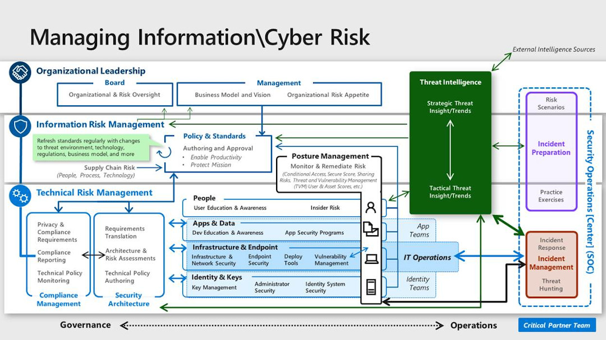

# Cloud security functions

Security is often thrown to the CISO and security team. Numerous organizational functions are required to manage information security risk in an enterprise. This article addresses those functions and helps clarify how a thread of security is often owned by all parts of an organization. These organizational functions collectively form the human portion of an overall cybersecurity system. Each function may be performed by one or more people, and each person may perform one or more functions, depending on various factors such as culture, budget, and available resources.

The following diagram and documentation represent an ideal view of the functions of an enterprise security team. The diagram represents an aspirational view for smaller organizations or smaller security teams who might not have significant resources and formal responsibilities defined around all of these functions.

**Security is a team sport:** Its critical that individuals on the security team see each other as part of a whole security team, part of the whole organization, and part of a larger security community defending against the same adversaries. This holistic view enables the team to work well in general. It's especially important as the teams work through any unplanned gaps and overlaps discovered during the evolution of roles and responsibilities.

## Security functions

Each of the following articles provide information about each function. Each article provides a summary of objectives, how the function can evolve because of the threat environment or cloud technology changes, and the relationships and dependencies that are critical to its success.

- [Policy and standards](./cloud-security-policy-standards.md)
- [Security operations](./cloud-security-operations-center.md)
- [Security architecture](./cloud-security-architecture.md)
- [Security compliance management](./cloud-security-compliance-management.md)
- [People security](./cloud-security-people.md)
- [Application security and DevSecOps](./cloud-security-application-security-devsecops.md)
- [Data security](./cloud-security-data-security.md)
- [Infrastructure and endpoint security](./cloud-security-infrastructure-endpoint.md)
- [Identity and key management](./cloud-security-identity-keys.md)
- [Threat intelligence](./cloud-security-threat-intelligence.md)
- [Posture management](./cloud-security-posture-management.md)
- [Incident preparation](./cloud-security-incident-preparation.md)
