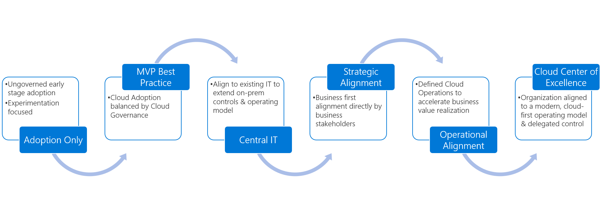

# Manage organizational alignment

Cloud adoption can't happen without well-organized people. Successful cloud adoption is the result of properly skilled people doing the appropriate types of work, in alignment with clearly defined business goals, and in a well-managed environment. To deliver an effective operating model for the cloud, it's important to establish appropriately staffed organizational structures. This article outlines an approach to establishing and maintaining the proper organizational structures in four steps.

The following exercises will help guide the process of creating a landing zone to support cloud adoption.

| &nbsp; | &nbsp; |
|--|--|
|   :::image type="icon" source="../_images/icons/1.png"::: |   [Structure type](#structure-type): Define the type of organizational structure that best fits your operating model. |
|   :::image type="icon" source="../_images/icons/2.png"::: |   [Cloud functions](#understand-required-cloud-functions): Understand the cloud functionality required to adopt and operate the cloud. |
|   :::image type="icon" source="../_images/icons/3.png"::: |   [Mature team structures](./organization-structures.md): Define the teams that can provide various cloud functions. |
|   :::image type="icon" source="../_images/icons/4.png"::: |   [RACI matrix](./raci-alignment.md): Clearly defined roles are an important aspect of any operating model. Use the provided RACI matrix to map responsibility, accountability, consulted, and informed roles to each of the teams for various functions of the cloud operating model. |

## Structure type

The following organizational structures do not necessarily have to map to an organizational chart (org chart). Org charts generally reflect command and control management structures. Conversely, the following organizational structures are designed to capture alignment of roles and responsibilities. In an agile, matrix organization, these structures may be best represented as virtual teams. There is no limitation suggesting that these organizational structures couldn't be represented in an org chart, but it is not necessary in order to produce an effective operating model.

The first step of managing organizational alignment is to determine how the following organizational structures will be fulfilled:

- **Org chart alignment:** Management hierarchies, manager responsibilities, and staff alignment will align to organizational structures.
- **Virtual teams:** Management structures and org charts remain unchanged. Instead, virtual teams will be created and tasked with the required functions.
- **Mixed model:** More commonly, a mixture of org chart and virtual team alignment will be required to deliver on transformation goals.

## Understand required cloud functions

The following is a list of functions that are required to succeed at cloud adoption and longer-term operating models. After you become familiar with these, they can be aligned to organizational structures based on staffing and maturity:

- [Cloud strategy](./cloud-strategy.md): Align technical change to business needs.
- [Cloud adoption](./cloud-adoption.md): Deliver technical solutions.
- [Cloud governance](./cloud-governance.md): Manage risk.
- [Central IT team](./central-it.md): Support from existing IT staff.
- [Cloud operations](./cloud-operations.md): Support and operate adopted solutions.
- [Cloud center of excellence](./cloud-center-of-excellence.md): Improve quality, speed, and resiliency of adoption.
- [Cloud platform](./cloud-platform.md): Operate and mature the platform.
- [Cloud automation](./cloud-automation.md): Accelerate adoption and innovation.
- [Cloud data](./cloud-data.md): Manage data and enable analytics solutions.
- [Cloud security](./cloud-security.md): Manage information security risk.

To some degree, each of these functions are delivered in every cloud adoption effort, either explicitly or in accordance with a defined team structure.

As adoption needs grow, so does the need to create balance and structure. To meet those needs, companies often follow a process of maturing organizational structures.

The article on [determining organizational structure maturity](./organization-structures.md) provides additional detail regarding each level of maturity.

To track organization structure decisions over time, download and modify the [RACI template](https://raw.githubusercontent.com/microsoft/CloudAdoptionFramework/master/organize/raci-template.xlsx).
