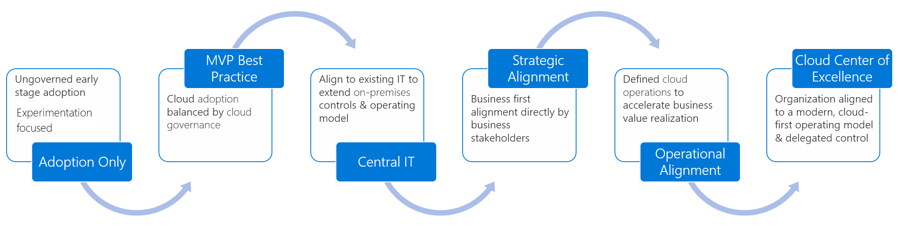

# Manage organizational alignment

Cloud adoption can't happen without well-organized people. Successful cloud adoption comes from skilled people doing appropriate types of work. This work is in alignment with clearly defined business goals in a well-managed environment. To deliver an effective operating model for the cloud, it's important to establish appropriately staffed organizational structures. This article outlines an approach to establishing and maintaining the proper organizational structures in four steps.

## Structure type

The following organizational structures don't necessarily have to map to an organizational chart, or org chart. Org charts generally reflect command and control management structures. Conversely, the following organizational structures are designed to capture alignment of roles and responsibilities. In an agile, matrix organization, these structures might be best represented as virtual teams. There's no limitation suggesting that these organizational structures can't be represented in an org chart. However, it's not necessary to produce an effective operating model.

The first step of managing organizational alignment is to determine how the following organizational structures will be fulfilled:

- **Org chart alignment:** Management hierarchies, manager responsibilities, and staff alignment will align to organizational structures.
- **Virtual teams:** Management structures and org charts remain unchanged. Instead, virtual teams will be created and tasked with the required functions.
- **Mixed model:** More commonly, a mixture of org chart and virtual team alignment will be required to deliver on transformation goals.

## Understand required cloud functions

As adoption needs grow, so does the need to create balance and structure. To meet those needs, companies often follow a process of maturing organizational structures.

The article on [determining organizational structure maturity](./organization-structures.md) provides more details about each level of maturity. To track organization structure decisions over time, download and modify the [RACI template](https://raw.githubusercontent.com/microsoft/CloudAdoptionFramework/master/organize/raci-template.xlsx).
