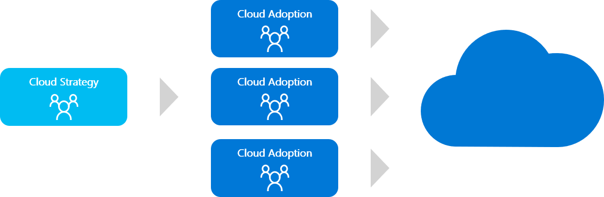
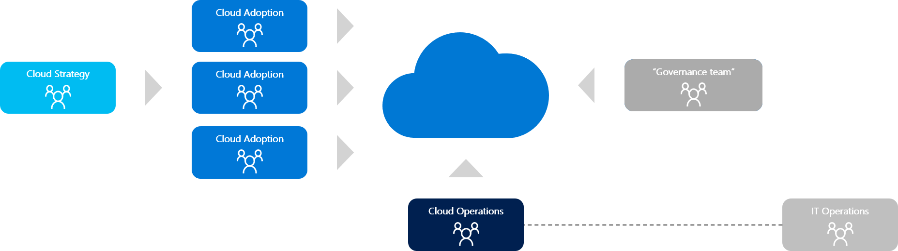

# Mature team structures

Every cloud function is provided by someone during every cloud adoption effort. These assignments and team structures can develop organically, or they can be intentionally designed to match a defined team structure.

As adoption needs grow, so does the need for balance and structure. Watch this video to get an overview of common team structures at various stages of organizational maturity.

<!-- markdownlint-disable MD034 -->

> [!VIDEO https://www.microsoft.com/videoplayer/embed/RE4wvTS]

<!-- markdownlint-enable MD034 -->

The following graphic and list outline those structures based on typical maturation stages. Use these examples to find the organizational structure that best aligns with your operational needs.

Organizational structures tend to move through the common maturity model that's outlined here:

1. [Cloud adoption team only](#cloud-adoption-team-only)
2. [MVP best practice](#best-practice-minimum-viable-product-mvp)
3. [Central IT team](#central-it-team)
4. [Strategic alignment](#strategic-alignment)
5. [Operational alignment](#operational-alignment)
6. [Cloud center of excellence (CCoE)](#cloud-center-of-excellence)

Most companies start with little more than a *cloud adoption team*. But we recommend that you establish an organizational structure that more closely resembles the [MVP best practice](#best-practice-minimum-viable-product-mvp) structure.

## Cloud adoption team only

The nucleus of all cloud adoption efforts is the cloud adoption team. This team drives the technical changes that enable adoption. Depending on the objectives of the adoption effort, this team might include a diverse range of team members who handle a broad set of technical and business tasks.

For small-scale or early-stage adoption efforts, this team might be as small as one person. In larger-scale or late-stage efforts, it's common to have several cloud adoption teams, each with around six engineers. Regardless of size or tasks, the consistent aspect of any cloud adoption team is that it provides the means to onboarding solutions into the cloud. For some organizations, this might be a sufficient organizational structure. The [cloud adoption team](./cloud-adoption.md) article provides more insight into the structure, composition, and function of the cloud adoption team.

> [!WARNING]
> Operating with **only** a cloud adoption team (or multiple cloud adoption teams) is considered an antipattern and should be avoided. At a minimum, consider the [MVP best practice](#best-practice-minimum-viable-product-mvp).

## Best practice: Minimum viable product (MVP)

We recommend that you have two teams to create balance across cloud adoption efforts. These two teams are responsible for various functions throughout the adoption effort.

- **Cloud adoption team:** This team is accountable for technical solutions, business alignment, project management, and operations for solutions that are adopted.
- **Cloud governance team:** To balance the cloud adoption team, a cloud governance team is dedicated to ensuring excellence in the solutions that are adopted. The cloud governance team is accountable for platform maturity, platform operations, governance, and automation.

This proven approach is considered an MVP because it might not be sustainable. Each team is wearing many hats, as outlined in the [*responsible, accountable, consulted, informed* (RACI) charts](./raci-alignment.md).

The following sections describe a fully staffed, proven organizational structure along with approaches to aligning the appropriate structure to your organization.

## Central IT team

As adoption scales, the cloud governance team might struggle to keep pace with the flow of innovation from multiple cloud adoption teams. This is especially true in environments that have heavy compliance, operations, or security requirements. At this stage, it is common for companies to shift cloud responsibilities to an existing central IT team. If that team can reassess tools, processes, and people to better support cloud adoption at scale, then including the central IT team can add significant value. Bringing in subject matter experts from operations, automation, security, and administration to modernize the central IT team can drive effective operational innovations.

Unfortunately, the central IT team phase can be one of the riskiest phases of organizational maturity. The central IT team must come to the table with a strong growth mindset. If the team views the cloud as an opportunity to grow and adapt, then it can provide great value throughout the process. But if the central IT team views cloud adoption primarily as a threat to their existing model, then the central IT team becomes an obstacle to the cloud adoption teams and the business objectives they support. Some central IT teams have spent months or even years attempting to force the cloud into alignment with on-premises approaches, with only negative results. The cloud doesn't require that everything change within the central IT team, but it does require significant change. If resistance to change is prevalent within the central IT team, this phase of maturity can quickly become a cultural antipattern.

Cloud adoption plans heavily focused on platform as a service (PaaS), DevOps, or other solutions that require less operations support are less likely to see value during this phase of maturity. On the contrary, these types of solutions are the most likely to be hindered or blocked by attempts to centralize IT. A higher level of maturity, like a [cloud center of excellence (CCoE)](#cloud-center-of-excellence), is more likely to yield positive results for those types of transformational efforts. To understand the differences between centralized IT in the cloud and a CCoE, see [Cloud center of excellence](./cloud-center-of-excellence.md).

## Strategic alignment

As the investment in cloud adoption grows and business values are realized, business stakeholders often become more engaged. A defined cloud strategy team, as the following image illustrates, aligns those business stakeholders to maximize the value realized by cloud adoption investments.

When maturity happens organically, as a result of IT-led cloud adoption efforts, strategic alignment is usually preceded by a governance or central IT team. When cloud adoption efforts are lead by the business, the focus on operating model and organization tends to happen earlier. Whenever possible, business outcomes and the cloud strategy team should both be defined early in the process.

## Operational alignment

Realizing business value from cloud adoption efforts requires stable operations. Operations in the cloud might require new tools, processes, or skills. When stable IT operations are required to achieve business outcomes, it's important to add a defined cloud operations team, as shown here.

Cloud operations can be delivered by the existing IT operations roles. But it's not uncommon for cloud operations to be delegated to other parties outside of IT operations. Managed service providers, DevOps teams, and business unit IT often assume the responsibilities associated with cloud operations, with support and guardrails provided by IT operations. This is increasingly common for cloud adoption efforts that focus heavily on DevOps or PaaS deployments.

## Cloud center of excellence

At the highest state of maturity, a cloud center of excellence aligns teams around a modern cloud-first operating model. This approach provides centralized IT functions like governance, security, platform, and automation.

The primary difference between this structure and the central IT team structure above is a strong focus on self-service and democratization. The teams in this structure organize with the intent of delegating control as much as possible. Aligning governance and compliance practices to cloud-native solutions creates guardrails and protection mechanisms. Unlike the central IT team model, the cloud-native approach maximizes innovation and minimizes operational overhead. For this model to be adopted, mutual agreement to modernize IT processes will be required from business and IT leadership. This model is unlikely to occur organically and often requires executive support.

## Next steps

After aligning to a certain stage of organizational structure maturity, you can use [RACI charts](./raci-alignment.md) to align accountability and responsibility across each team.

> [!div class="nextstepaction"]
> [Align the appropriate RACI chart](./raci-alignment.md)
