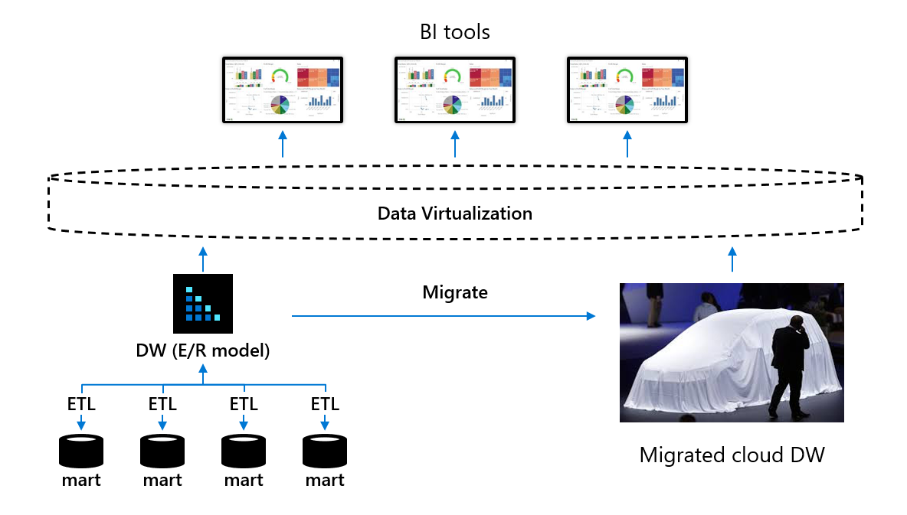

# Plan a data warehouse migration

A data warehouse migration is a challenge for any company. In order to do this well and avoid any unwelcome surprises and unplanned costs you need to thoroughly research the challenge, mitigate risk and plan your migration ensure you are ready as possible. At a high level, your plan should cover the core data warehouse migration process steps and any tasks within them. The main process steps are:

- Preparation
- Migration strategy and execution
- Post migration

For example, preparation includes things like readying your data warehouse migration team in terms of skills training and technology familiarization. It also includes setting up a proof of concept lab, understanding how you will manage test and production environments, gaining appropriate clearance to migrate your data and a production system outside of the corporate firewall and setting up migration software in your data center to enable migration to proceed.

For a data warehouse migration to proceed smoothly your plan should seek to establish a clear understanding of:

- Your business case – drivers for doing it, business benefits and risks
- Migration team roles and responsibilities
- Required skill sets and training needed to enable successful migration
- Allocated budget for the complete migration
- Your migration strategy
- How you can de-risk the migration project to avoid delays and/or rework
- Your existing data warehouse system, its architecture, schema, data volumes, data flows, security, and operational dependencies
- Differences between your existing on premises data warehouse DBMS and Azure Synapse, for example, data types, SQL functions, logic
- What needs to be migrated and priorities
- The migration tasks, approaches, order, and deadlines
- How you will control migration
- How to prevent user disruption while undertaking the migration
- What you need to do on-premises to avoid delays and enable migration
- Tools to enable secure migration of schemas, data, and ETL processing to Azure
- Data model design changes needed during and post migration
- Any pre or post migration technology changes and how to minimize rework
- Post migration technology deprecation
- How you will implement testing and quality assurance to prove success
- Your checkpoints to assess progress and enable decisions to be made
- Your contingency plan and points of rollback in case things go wrong

In order to do achieve this we need to prepare and set certain wheels in motion before any migration starts. Let’s look at what that entails in more detail.

## Pre-migration preparation

There are several things that should be addressed before you even begin a data warehouse migration.

### Key roles in a data warehouse migration team

Key roles in a migration project include:

- Business owner
- Project manager (with agile methodology experience, for example, scrum)
- Project coordinator
- Cloud engineer
- Database administrator (existing data warehouse DBMS and Azure Synapse)
- Data modeler(s)
- ETL developers
- Data virtualization specialist (could be a DBA)
- Testing engineer
- Business analysts (to help test BI tool queries, reports and analyses)

In addition the team need the support of your on-premises infrastructure team.

### Skills and training to ready the team for migration

With respect to skills, expertise is important in a data warehouse migration. Therefore, ensure the appropriate members of your migration team are trained in Azure cloud fundamentals, Azure Blob Store, Azure Data Lake Storage, Azure Data box, Azure ExpressRoute, Azure identity management, Azure Data Factory and Azure Synapse. Your data modelers will most likely need to fine-tune your Microsoft Azure Synapse data model(s) once migration from your existing data warehouse has occurred.

### Assessing your existing data warehouse

Another part of preparing to migrate is the need for a full assessment of your existing data warehouse to fully understand the architecture, data stores, schema, business logic, data flows, the DBMS functionality utilized, warehouse operation and the dependencies. The more understanding is gained here the better. A detailed knowledge of how the system works helps to communicate and cover off all bases.

The purpose of the assessment is not just to ensure detailed understanding of the current set-up across the migration team but also to understand strengths and weaknesses in the current setup. The outcome of an assessment of your current data warehouse therefore can impact your migration strategy in terms of ‘lift and shift’ versus something more than that. For example, if the outcome of an assessment is that your data warehouse is at end of life then clearly the strategy would be more of a data migration to a newly designed data warehouse on Azure Synapse versus a lift and shift approach.

### On-premises preparation for data migration

In addition to preparing and readying your migration team for your target environment, and assessing your current setup, it is equally important to also set things in motion on-premises as production data warehouses tend to be heavily controlled by IT procedures and approval processes. So as not to be delayed by these formalities, it is important to ensure that your data center infrastructure and operations teams are ready for the migration of your data, schema, ETL jobs, and so on, to the Azure cloud. Data migration can occur via:

- AzCopy to Azure Blob Store
- Microsoft Azure ExpressRoute to transfer compressed data directly to Azure
- File export to Microsoft Azure Data box

The main factors influencing which of these options is selected are data volume size (in Terabytes) and network speed (in Mbps). A calculation is needed to determine how long it would take to migrate the data via the network bearing in mind that data may be compressed in your data warehouse and become uncompressed when you export it. This can slow data transfer. It is best to recompressing data (via Gzip) when moving data by any of the above methods as PolyBase can process gzipped data directly.

Large data volumes will likely be migrated via Azure Data box if it is going to take too long to move the data.

In addition, in order for Azure Data Factory to control the execution of exports of your existing data warehouse data from Azure, self-hosted integration run-time software will need to be installed in your data center to enable migration to proceed. Given these requirements if formal approval is needed to make this possible, then starting the appropriate approval processes early to enable this to happen will help avoid delays down the line.

### Azure preparation for schema and data migration

In terms of preparation on the Azure side, data import will need to be managed either via Microsoft Azure ExpressRoute or Microsoft Azure Data box. Azure Data Factory pipelines are an ideal way to load your data into Azure Blob Storage and then load from there into Azure Synapse using PolyBase. Therefore preparation is needed on the Azure side to develop such a pipeline.

The alternative is to use your existing ETL tool on Azure if it supports Azure Synapse which means setting up the tool on Azure from Azure Marketplace and readying a pipeline to import your data and load it into Azure Blob Storage.

## Defining a migration strategy

### Migration goals

In any strategy, there needs to be a set of objectives or goals that should be defined to indicate success. Targets can then be set to achieve these goals and people given responsibility for reaching them. Examples of migration goals and corresponding metrics to set targets for in a cloud data warehouse migration project are shown in the table below:

Types of goal and metric examples:

**Improve overall performance**:

- Data migration performance
- ELT performance
- Data Loading performance
- Complex Query performance
- Number of concurrent users

**Run at lower costs**:

- Cost of compute by workload, for example, number of compute hours x cost per hour for:
  - Standard reporting
  - Ad hoc queries
  - Batch ELT processing
- Cost of storage (staging, production tables, indexes, temporary space)

**Operate with better availability and service levels**:

- Service level agreements
- High availability

**Improve productively**:

- Tasks automated, administrative headcount

A successful data warehouse migration could therefore be interpreted as a data warehouse that runs as fast or faster and at lower cost than the legacy system you migrated from. Assigning owners of these goals creates accountability for reaching them. It also ensures that testing in a proof of concept lab (as defined in the derisking section in this guide) will be deemed successful if the tests identify ways that the goals can be achieved.

### Migration approach

With respect to strategy, you have a number of choices when migrating your existing data warehouse to Azure Synapse. These are:

- Lift and shift your existing data warehouse as-is  
- Simplify your existing data warehouse and then migrate it  
- Complete redesign on Azure Synapse and migrate your data

The outcome from the assessment of your existing data warehouse will have a significant bearing on this. A good outcome may indicate a lift and shift strategy, a mediocre outcome stemming from a low agility rating may indicate that simplification is needed before migration, whereas a poor outcome may indicate a complete redesign is needed.

Lift and shift will leave your architecture as is, trying to minimize the work in moving your existing system. If your existing ETL tool already supports Azure Synapse you may be able to change the target with minimal effort. Nevertheless there will be differences in table types, data types, SQL functions, views, stored procedure business logic etc. These differences and ways around them are detailed in lower-level documents in this migration series.

Simplifying your existing data warehouse prior to migration is about reducing complexity to ease migration. It could include:

- Removing / archiving unused tables before migrating to avoid migrating data that is not used
- Converting physical data marts to virtual data marts using data virtualization software to reduce what you have to migrate. This would also improve agility and reduce total cost of ownership and so could be considered as modernization during migration.

It is of course possible to simplify first and lift and shift what remains after this.  

### Migration scope

Whichever of these you decide upon, it is important to clearly define the scope of the migration that is, what exactly you are going to migrate and whether you migrate incrementally or all at once. An example of incremental migration could be to migrate your data marts first followed by your data warehouse. This allows you to focus on high priority business areas while allowing your team to incrementally build up expertise as each mart is individually migrated before migrating the data warehouse itself.  

### Defining what has to be migrated

With regards to the migration itself, it's important to make an inventory of what needs to be migrated. This includes schema, data, ETL processes (Pipelines), authorization privileges, users, BI tool semantic access layers, and analytic applications. A detail understanding of what is involved in migrating the inventory, is given in each of the lower-level migration documents in this series. Links to these are shown below:

- Schema migration, design and performance considerations
- Data migration, ETL processing and load
- Access security and data warehouse operations
- Migration of visualization and reports
- Minimizing the impact of SQL issues
- Third-party tools to help you in your data warehouse migration

If you are uncertain about the best way to do things, then conduct tests in a proof of concept lab (see section on de-risking your DW migration project) to identify optimal techniques.

### Migration control

Data warehouse migration to Azure Synapse involves tasks that need to be conducted:

- On-premises, for example, data export
- On the network, for example, data transfer
- In the Azure cloud, for example, data transformation, integration, and load

The problem is that managing these tasks can be complicated if scripts and utilities are all being developed, tested and run independently in both on-premises and Azure environments. It adds complexity especially if version control, test management and migration execution are not coordinated.

Ideally, it is best to avoid these complexities and control these from a common place with a source control repository to manage change from development to test and production. Also migration execution will involve tasks that need to be performed on-premises, on the network and on Azure. Given that Azure Synapse is the target environment, controlling migration execution from Azure would make things a lot easier to manage. A good way to do this is to use Azure Data Factory (ADF) to create a migration control pipeline to control execution both on-premises and on Azure. This would introduce automation and minimize room for error. ADF therefore becomes a migration orchestration tool and not just and enterprise data integration tool.

Other options to control migration available from Microsoft partners running on Azure include data warehouse automation tools to try to automate migration. Vendors like WhereScape and Attunity for example. Most of these automation tools are aimed at a lift and shift approach to migration. Even then, there may be some things that may not be supported by such tools, for example, stored procedures. These products and several others are detailed in a separate guide dedicated to third-party tools to help you migrate to Azure Synapse.  

### Migration testing

The first thing you need for testing is to define a series of tests and a set of required outcomes for each test that need to be run to verify and indicate success. It is important to ensure that all aspects are tested and compared across your existing and migrated systems including:

- Schema
- Data types converted where necessary
- Use user-defined schema in Azure Synapse to distinguish between data warehouse and data mart tables
- Users
- Roles and assignments of users to those roles
- Data access security privileges
- Data privacy – for example, for GDPR compliance
- Privileges that govern administration capabilities
- Data quality and integrity
- ETL processing that populates Azure Synapse both into the data warehouse and from the data warehouse to any data marts. This includes testing
- All rows are correct in all tables including history
- Slowly changing dimension processing
- Change data capture processing
- Calculations and aggregations that leverage functions that could differ across systems
- Results of all known queries, reports and dashboards
- Performance and scalability
- Analytical functionality
- Costs in what is a new ‘pay as you go’ environment

It is also best practice to automate testing as much as possible, in order to make each test repeatable and to allow a consistent approach to evaluating results. If reports and dashboards are inconsistent, then having the ability to compare metadata lineage across original and migrated systems is extremely valuable during migration testing as it can highlight differences and pinpoint where they occurred when these are not easy to detect.  

In terms of security the best way to do this is to create roles, assign access privileges to roles and then attach users to roles. To access to your newly migrated data warehouse, set up an automated process to create new users and to do role assignment. Do the same to detach uses from roles.  

It is also important to communicate the cut-over to all users, so they know what’s changing and what to expect.

## De-risking your DW migration project

Another critical factor in data warehouse migration is de-risking the project in order to maximize the likelihood of a success. There are several things that can be done to de-risk a data warehouse migration. They include:

- Establishing a proof of concept (POC) lab to enable your team to try things, conduct tests, understand any issues and identify fixes and optimizations that help that validate migration approaches, improve performance and lower costs. It also helps establish ways to automate tasks, leverage built-in tools and build templates to capture best practice, learn from the experience and keep track of lessons learned. It is an invaluable way to mitigate risk and increase your chances of success. In addition, you can assign owners to tests who are accountable for achieving migration goals and targets as defined in your migration strategy
- Introduce data virtualization between BI tools and your data warehouse and data marts. Introduce user transparency using data virtualization to reduce risk in a data warehouse migration, and hide the migration from users by using data virtualization BI tools, as shown in the following diagram.

The purpose of this is to break the dependency between business users utilizing self-service BI tools and the physical schema of the underlying data warehouse and data marts that are being migrated. By introducing data virtualization, any schema alternations made during data warehouse and data mart migration to Azure Synapse (for example, to optimize performance) can be hidden from business users because they only access virtual tables in the data virtualization layer. If structural change is needed, only the mappings between the data warehouse or data marts and any virtual tables would need to be changed so that users remain unaware of those changes and unaware of the migration.

- Look to archive any existing tables identified as never used prior to data warehouse migration as there is little point migrating tables that are not used. One possible way of doing this is to archive the unused data to Azure blob storage or to Azure Data Lake and create external tables in Azure Synapse to that data so that it is still online.
- Consider the possibility of introducing a virtual machine (VM) on Azure with a development version (usually free) of the existing legacy data warehouse DBMS running on this VM. This allows you to quickly move existing data warehouse schema to the VM and them move it on into Azure Synapse while working entirely on the Azure cloud.
- Define migration order and dependencies
- Ensure your infrastructure and operations teams are ready for the migration of your data as early as possible into the migration project
- Identify the differences in DBMS functionality and where proprietary business logic could become a problem, for example, using stored procedures for ELT processing is highly likely to not migrate easily and will not contain any metadata lineage as the transformations are buried in code.
- Considering a strategy to migrate data marts first followed by the data warehouse that is the source to the data marts. The reason for this is that it enables incremental migration, it makes it more manageable and it is possible to prioritize migration based on business needs
- Considering the possibility of using data virtualization to simplify your current data warehouse architecture before you migrate, for example, to replace data marts with virtual data marts so that you can eliminate physical data stores and ETL jobs for data marts without losing any functionality prior to migration. Doing this would reduce the number of data stores to migrate, reduce copies of data, reduce the total cost of ownership and improve agility. This requires switching from physical to virtual data marts before migrating your data warehouse. In many ways you could consider this a data warehouse modernization step prior to migration.

## Next step

For more information on data warehouse migrations, attend a virtual [Azure Analytics workshop with Informatica](https://now.informatica.com/Microsoft_CDW_Workshops.html#fbid=uqwtl_SXNFV).
