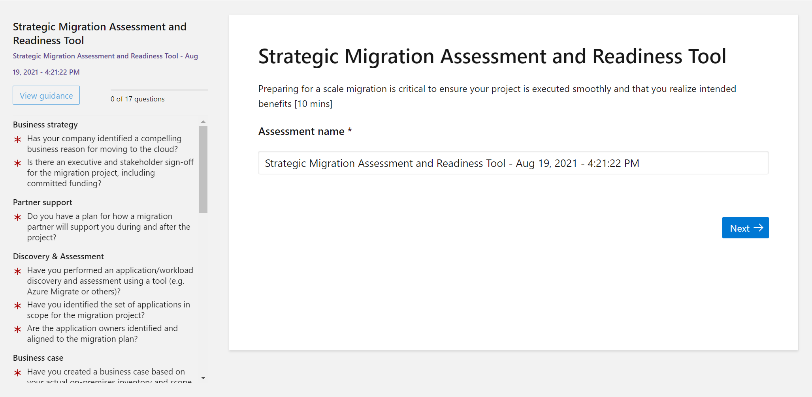
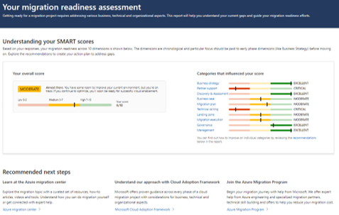
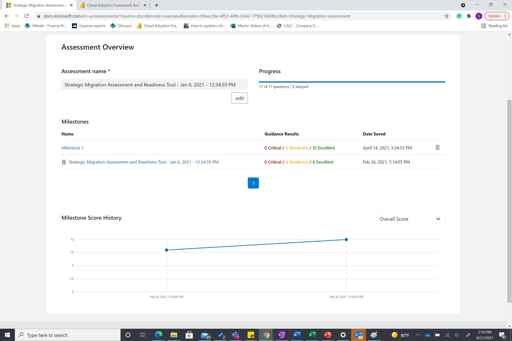

# Strategic Migration and Readiness Tool (SMART) assessment

From business planning to training to security and governance, find out what you need to do to prepare for your Microsoft Azure migration with the Strategic Migration and Readiness Tool (SMART).

## Access the assessment

You can start the assessment by visiting [aka.ms/SMARTTool](/assessments/?id=strategic-migration-assessment).

The skills necessary to fill the gaps in your organization's digital transformation typically won't be confined to a single role or even a single department. Skills will have relationships and dependencies that can span a single role or multiple roles. Those roles might exist in several departments. For example, a workload owner might require someone in an IT role to create core resources like subscriptions and resource groups.

To ensure quality results, there are two ways we recommend you approach the 17 questions to ensure a smooth experience. The first option is to complete the assessment with a Microsoft account member. The second option is to set aside about 30 minutes with experts in each respective category and then complete the assessment yourself.

## Results

After you complete the Strategic Migration and Readiness Tool (SMART) assessment, a results page will generate. The results page offers tailored recommendations and next steps to improve your score in each category. There's a tool to export the results to a CSV file that allows you to see scores offline.

There's a matrix that shows your areas of strength and your opportunities for growth based on how you score in each area. You receive a grade across all 10 dimensions that give you a better understanding of what to do next. There's a **Recommended next steps** and individual recommendations for each category.

To review your answers, you can go to the answer summary. The answer summary can help you understand why you received specific recommendations or what contributed to the individual scores.

## Assessment milestones

The milestone feature in the Strategic Migration and Readiness Tool (SMART) allows you to measure your growth and improvement as you take the assessment multiple times. When you use the new milestone feature, you can look at how you improved individually in each area.

You can compare across all 10 dimensions to see resources that contributed to your evolution.

## Next steps

[Strategic Migration and Readiness Tool (SMART) assessment](/assessments/?id=strategic-migration-assessment)
[Find out how ready you are to start migrating—the SMART way](https://azure.microsoft.com/migration/#overview)
