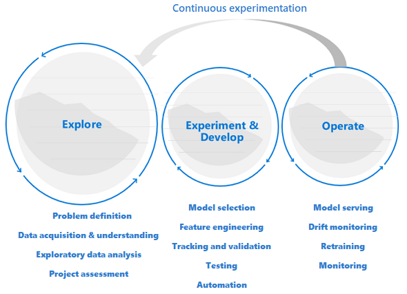
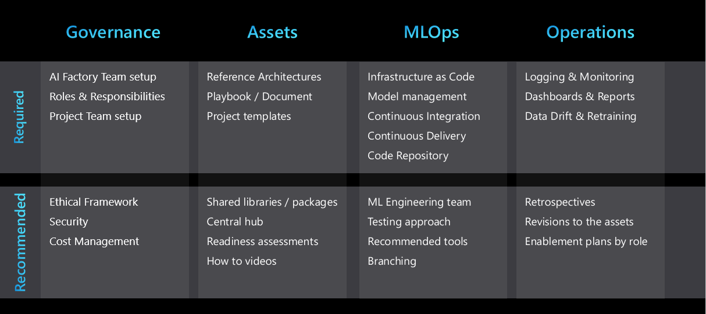

# Machine learning DevOps guide

Machine learning DevOps (MLOps) is an organizational change that relies on a combination of people, process, and technology to deliver machine learning solutions in a robust, scalable, reliable, and automated way. This guide provides a balanced view across the three areas of people, process, and technology. It summarizes best practices and learnings from adopting machine learning DevOps in the enterprise with Azure Machine Learning.

This article is subdivided into three sections:

- **An introduction to machine learning DevOps (MLOps):** A conceptual introduction that provides a balanced view across the three areas of people, process, and technology to anyone new to machine learning DevOps.
- **MLOps best practices with Azure Machine Learning:** Key considerations and recommendations to apply MLOps practices scoped to a single machine learning project.
- **MLOps at organizational scale: AI factories:** Key considerations and recommendations to drive organizational change with MLOps in an enterprise environment.

## An introduction to machine learning DevOps (MLOps)

### Why MLOps?

Modern machine learning algorithms and frameworks make it increasingly easy to develop models that can make accurate predictions.

You might have built a machine learning model that exceeds all of your accuracy expectations and impresses your business sponsors. Now it’s time to deploy the model into production and it might not be as easy as you had expected. There are likely many things to put in place before your model can be used. 

Over time, you or one of your colleagues might develop a new model that can do better than the old model. The question you must ask is, can you implement it without disrupting your business? It might be necessary for regulatory purposes to re-create the model and explain the model's predictions if unusual or biased predictions are made. Data inputted to your training and model can change over time. Because of these changes, it might be necessary to retrain the model periodically to maintain the accuracy of its predictions. Who is responsible to feed the data, monitor the performance, retrain the model, and fix it should it fail?

If you experience these challenges, you might want to consider implementing a machine learning DevOps (MLOps) strategy for your project. At a high level, MLOps refers to the application of DevOps principles to AI-infused applications. Consider a common use case: Suppose you have an application that serves a model's predictions via a REST API. Even a simple use case such as this can face many issues in production. Some MLOps tasks fit well in the general DevOps framework. For example, to set up unit tests and integration tests, or track changes through version control. Other tasks are more unique to MLOps that include how to:

- Enable continuous experimentation and comparison against a baseline model
- Monitor the incoming data to detect [data drift](/azure/machine-learning/how-to-monitor-datasets?tabs=python)
- Trigger model retraining and set-up a rollback just in case
- Create reusable data pipelines that can be applied for both training and scoring

Ultimately, the goal of MLOps is to close the gap between development and production and deliver value to customers faster. To achieve this goal, you must rethink how things are done in development and in production. The extent to which data scientists are involved in MLOps is an organizational choice. The role of Data Scientist is defined differently across different organizations. We recommend you review the [MLOps maturity model](/azure/architecture/example-scenario/mlops/mlops-maturity-model) to see where your organization is and where your organization wants to be on the maturity scale.

### How machine learning DevOps is different than DevOps

#### Exploration precedes development and operations

Data science projects are different from application development or data engineering projects. Data science projects may or may not make it to production. After an initial analysis, it might become clear that the business outcome can’t be achieved with the available datasets. Because of this reason, an exploration phase is usually the first step in a data science project. The goal in this phase is to define and refine the problem and run exploratory data analysis, in which statistics and visualizations are used to confirm or falsify the problem hypotheses. There needs to be a common understanding that the project might not extend beyond this phase. It’s important to make this phase as seamless as possible to have a quick turnaround. Unless there's an element of security, which enforces processes and procedures, they should be avoided and the Data Scientist should be allowed to work with the tool and data of their choice. Real data is needed for data exploration work.

The experimentation and development stage usually begins when there is enough confidence that the data science project is feasible and can provide real business value. This stage is when development practices become increasingly important. It’s a good practice to capture metrics for all of the experiments that are done at this stage. It’s also important to incorporate source control so that it’s possible to compare models and toggle between different versions of the code if needed. Development activities include the refactoring, testing, and automation of exploration code into repeatable experimentation pipelines, and the creation of model serving applications and pipelines. Refactoring code into more modular components and libraries helps increase reusability and testability, and it allows for performance optimization. Finally, what is deployed into staging and production environments is the model serving application or batch inference pipelines. Next to monitoring of infrastructure reliability and performance, similar to what's done for a regular application with traditional DevOps, the quality of the data, the data profile, and the model must be continuously monitored at the risk of degradation or drift. Machine learning models require retraining over time to stay relevant in a changing environment.

#### Data science lifecycle requires an adaptive way of working

If you apply a typical DevOps way of working to a data science project, you might not find success because of the uncertain nature of data quality and its correlatively. Exploration and experimentation are recurring activities and needs throughout a machine learning project. The teams at Microsoft follow a project lifecycle and working process that was developed to reflect data science-specific activities. The [Team Data Science Process](/azure/machine-learning/team-data-science-process/overview) and [The Data Science Lifecycle Process](https://github.com/dslp/dslp) are examples of reference implementations.

#### Data quality requirements and data availability constrain the work environment

For a machine learning team to effectively develop machine learning-infused applications, production data access is desirable across work environments. If production data access isn’t possible because of compliance requirements or technical constraints, consider implementing [Azure role-based access control (RBAC) with Azure Machine Learning](/azure/machine-learning/how-to-assign-roles), [Just-in-Time access](/azure/security-center/security-center-just-in-time), or [data movement pipelines](/azure/data-factory/) to create production data replicas and enable user productivity.

#### Machine learning requires a greater operational effort

Unlike traditional software, a machine learning solution is constantly at risk of degradation because of its dependency on data quality. To maintain a qualitative solution once in production, [continuous monitoring and re-evaluation of data and model quality](/azure/machine-learning/how-to-enable-app-insights) is critical. It's expected that a production model requires timely retraining, redeployment, and tuning. These tasks come on top of day-to-day security, [infrastructure monitoring](/azure/machine-learning/monitor-azure-machine-learning), or compliance requirements and require special expertise.

#### Machine learning teams requires specialists and domain experts

While data science projects share roles with regular IT projects, the success of a machine learning team highly depends on a group of machine learning technology specialists and domain subject matter experts. Where the technology specialist has the right background to do end-to-end machine learning experimentation, the domain expert can support the specialist to analyze and synthesize the data, or qualify the data for use.

Common technical roles that are unique to data science projects are Domain Expert, Data Engineer, Data Scientist, AI Engineer, Model Validator, and Machine Learning Engineer. To learn more about roles and tasks within a typical data science team, also refer to the [Team Data Science Process](/azure/machine-learning/team-data-science-process/roles-tasks).

### Seven principles for machine learning DevOps

When you plan to adopt MLOps for your next machine learning project, consider applying the following core principles as the foundation to any project.

- **Version control code, data, and experimentation outputs:** Unlike traditional software, data has a direct influence on the quality of machine learning models. Along with versioning your experimentation code base, version your datasets to ensure you can reproduce experiments or inference results. Versioning experimentation outputs like models can save effort and the computational cost of recreation.

- **Use multiple environments:** To segregate development and testing from production work, [replicate](./ai-machine-learning-resource-organization.md) your infrastructure in at least two environments. Access control for users might differ in each environment.

- **Manage infrastructure and configurations-as-code:** When you create and update infrastructure components in your work environments, use [infrastructure as code](/azure/architecture/framework/devops/automation-infrastructure) to prevent inconsistencies between environments. Manage machine learning experiment job specifications as code, so that you can easily rerun and reuse a version of your experiment across environments.

- **Track and manage machine learning experiments:** Track the performance KPIs and other artifacts of your machine learning experiments. When you keep a history of job performance, it allows for a quantitative analysis of experimentation success, and enables greater team collaboration and agility.

- **Test code, validate data integrity, model quality:** [Test](/azure/architecture/framework/scalability/test-checklist) your experimentation code base that includes correctness of data preparation functions, feature extraction functions, checks on data integrity, and obtained model performance.

- **Machine learning continuous integration and delivery:** Use [continuous integration](/azure/architecture/framework/devops/release-engineering-ci) to automate test execution in your team. Include model training as part of continuous training pipelines, and include A/B testing as part of your [release](/azure/architecture/framework/devops/release-engineering-cd), to ensure that only a qualitative model might land in production.

- **Monitor services, models, and data:** When you serve machine learning models in an operationalized environment, it's critical to monitor these services for their infrastructure uptime and compliance, and for model quality. [Set up monitoring](/learn/modules/monitor-data-drift-with-azure-machine-learning/) to identify data and model drift, to understand whether retraining is required, or to set up triggers for automatic retraining.

## Machine learning DevOps (MLOps) best practices with Azure Machine Learning

Azure Machine Learning offers several asset management, orchestration, and automation services to help you manage the lifecycle of your model training and deployment workflows. This section discusses best practices and recommendations to apply MLOps across the areas of people, process, and technology supported by Azure Machine Learning.

### People

- Work in project teams to best utilize specialist and domain knowledge in your organization. [Organize and set up Azure Machine Learning Workspaces](./ai-machine-learning-resource-organization.md) on a project basis to comply with use case segregation requirements.
- Define a set of responsibilities and tasks in your organization as a role, where one team member on an MLOps project team could fulfill multiple roles. Use Custom Roles in Azure to define a set of granular [Azure RBAC operations for Azure Machine Learning](/azure/role-based-access-control/resource-provider-operations#microsoftmachinelearningservices) that each role can perform.
- Standardize on a project lifecycle and agile methodology. The [Team Data Science Process](/azure/machine-learning/team-data-science-process/overview) provides a reference lifecycle implementation.
- Balanced teams can execute all MLOps stages from exploration to development to operations.

### Process 

- Standardize on a code template to allow for code reuse and increase ramp up time at project start or when a new team member joins the project. [Azure Machine Learning pipelines](/azure/machine-learning/concept-ml-pipelines) and [job submissions script](/python/api/azureml-core/azureml.core.scriptrun), and [CI/CD pipelines](/azure/machine-learning/how-to-github-actions-machine-learning) lend themselves well for the creation of templates.
- Use version control. Jobs that are submitted from a Git-backed folder [automatically track repo metadata](/azure/machine-learning/concept-train-model-git-integration) with the job in Azure Machine Learning for reproducibility.
- Version experiment inputs and outputs to enable reproducibility. Use [Azure Machine Learning datasets](/azure/machine-learning/how-to-version-track-datasets), [model management](/azure/machine-learning/concept-model-management-and-deployment), and [environment management](/azure/machine-learning/concept-environments) capabilities to facilitate.
- Build up a [run history](/azure/machine-learning/how-to-manage-runs?tabs=python) of experiment runs to allow for comparison, planning, and collaboration. Use an experiment tracking framework like [MLflow](/azure/machine-learning/how-to-use-mlflow) for metric collection.
- Continuously measure and control the quality of your team's work through [continuous integration](/azure/architecture/microservices/ci-cd) on the full experimentation code base.
- Early-terminate training when a model doesn't converge. Use an experiment tracking framework in combination with the [run history](/azure/machine-learning/how-to-manage-runs?tabs=python) in Azure Machine Learning to monitor job execution.
- Define an experiment and model management strategy. Consider using a name like *Champion* to refer to the current baseline model, or refer to *Challenger* models for candidate models, which could outperform the *Champion* model in production. Apply tags in Azure Machine Learning to mark experiment and models as appropriate. In some scenarios, such as sales forecasting, it can take months to determine whether the model's predictions are accurate.
- Elevate [continuous integration](/azure/architecture/microservices/ci-cd) to continuous training by including model training as part of the build. For example, start model training on the full dataset with each pull request.
- Shorten the time-to-feedback on the quality of machine learning pipeline by running an automated build on a sample of the data. Use [Azure Machine Learning pipeline parameters](/azure/machine-learning/how-to-use-pipeline-parameter) to parameterize input [datasets](/azure/machine-learning/how-to-train-with-datasets).
- Use [continuous deployment for machine learning models](/azure/machine-learning/how-to-deploy-continuously-deploy) to automate the deployment and testing of real time scoring services across your Azure environments (development, test, production).
- In some regulated industries, model validation steps might be required before a machine learning model can be used in a production environment. By automating validation steps, to an extent, you might accelerate time to delivery. When manual review or validation steps are still the bottleneck, consider whether it’s possible to certify the automated model validation pipeline. Use resource tags in Azure Machine Learning to indicate asset compliance, candidates for review, or as triggers for deployment.
- Don't retrain in production and directly replace the production model without any integration testing. Even though model performance and functional requirements are good, among other potential issues, a model might have grown its environment footprint, breaking the serving environment.
- When production data access is only available in production, use [Azure RBAC](/azure/role-based-access-control/resource-provider-operations#microsoftmachinelearningservices) and [custom roles](/azure/machine-learning/how-to-assign-roles) to give a select number of machine learning practitioners the read access they require, for example for data exploration. Alternatively, make a data copy available in the non-production environments.
- Agree on naming conventions and tags for Azure Machine Learning [experiments](/python/api/azureml-core/azureml.core.experiment.experiment) to differentiate retraining baseline machine learning pipelines from experimental work.

### Technology

- When you submit jobs via the studio user interface (UI) or CLI interface, instead of submitting jobs via the SDK, use the CLI or [Azure DevOps Machine Learning tasks](https://marketplace.visualstudio.com/items?itemName=ms-air-aiagility.vss-services-azureml) to configure automation pipeline steps. This process might reduce the code footprint by reusing the same job submissions directly from automation pipelines.
- Use event-based programming. For example, trigger an offline model testing pipeline using an Azure Function once a new model gets registered. Or send a notification to an `Ops` email alias when a critical pipeline fails to run. Azure Machine Learning [produces events to Event Grid](/azure/machine-learning/how-to-use-event-grid) that you can subscribe to.
- When you use Azure DevOps for automation, use [Azure DevOps Tasks for Machine Learning](https://marketplace.visualstudio.com/items?itemName=ms-air-aiagility.vss-services-azureml) to use machine learning models as pipeline triggers.
- When you develop Python packages for your machine learning application, you can host them in an Azure DevOps repository as artifacts and publish them as a feed. This approach [allows you to integrate](/azure/machine-learning/how-to-use-private-python-packages) the DevOps workflow for building packages with your Azure Machine Learning workspace.
- Consider the use of a staging environment to system integration test machine learning pipelines with upstream or downstream application components.
- Create unit and integration tests for your inference endpoints for enhanced debugging and accelerated time to deployment.
- To trigger retraining, use [dataset monitors](/azure/machine-learning/how-to-monitor-datasets) and use [event-driven workflows](/azure/machine-learning/how-to-use-event-grid) to subscribe to data drift events and automate the trigger of [machine learning pipelines for retraining](/azure/machine-learning/how-to-retrain-designer).

## MLOps at organizational scale: AI factories

A data science team might decide they can manage a handful of machine learning use cases internally. The adoption of machine learning DevOps (MLOps) helps set up project teams for better quality, reliability, and maintainability of solutions through balanced teams, supported processes, and technology automation. This adoption allows the team to scale and focus on the development of new use cases.

As the number of use cases grows in an organization, the management burden of supporting these use cases grows linearly, or even more. The challenge becomes how to use organizational scale to accelerate time-to-market, quicker assessment of use case feasibility, enable repeatability, and how to best utilize the available resources and skillsets across the full range of projects.

An AI factory is the development of repeatable business process, and a collection of standardized artifacts to accelerate the development and deployment of a large set of machine learning use cases by optimizing team set-up, recommended practices, MLOps strategy, architectural patterns, and reusable templates tailored to business requirements.

### Standardize on repeatable architectural patterns

Repeatability is a key part of developing a factory process. Data science teams can accelerate project development and improve consistency across projects by developing a few repeatable architectural patterns that cover most of the machine learning use cases for their organization. Once these patterns are in place, most projects can use these patterns and reap the following benefits:

- Accelerated design phase
- Accelerated approvals from IT and security teams when they reuse tools across projects
- Accelerated development due to reusable infrastructure as code templates and project templates, which are covered in more detail in the next section

The architectural patterns can include but aren't limited to the following topics:

- Preferred services for each stage of the project
- Data connectivity and governance
- A machine learning DevOps (MLOps) strategy tailored to the requirements of the industry, business, or data classification
- Experiment management process *Champion* or *Challenger* models

### Facilitate cross-team collaboration and sharing

Shared code repositories and utilities can accelerate the development of machine learning solutions. These repositories can be developed in a modular way during project development so they are generic enough to be used by other projects. They can be made available in a central repository that all data science teams can access.

#### Share and reuse of intellectual property

At the beginning of a project, the following intellectual property should be reviewed to maximize code reuse:

- Internal code, such as packages and modules, which have been designed for reuse within the organization.
- Datasets, which have been created in other machine learning projects or that are available in the Azure ecosystem.
- Existing data science projects with similar architecture and business problem.
- GitHub or open-source repos that can accelerate the project.

Project retrospectives should include an action item to review if there are elements of the project can be shared and generalized for broader reuse, so that the list of assets listed above organically grows with time.

To help sharing and discovery, many companies have introduced shared repositories for the organization of code snippets and machine learning artifacts. Artifacts in Azure Machine Learning can be defined-as-code, including [datasets](/azure/machine-learning/how-to-create-register-datasets), [models](/azure/machine-learning/how-to-create-register-datasets), [environments](/python/api/azureml-core/azureml.core.environment(class)), and [pipelines](/python/api/azureml-pipeline-core/azureml.pipeline.core.pipeline(class)), that allows you to share efficiently across projects and workspaces.

#### Project templates

To accelerate the migration of existing solutions, and maximize code reuse when starting a new project, many companies have standardized on a project template to kick start a new project. Examples of project templates recommended for use with Azure Machine Learning are [Azure Machine Learning examples](https://github.com/Azure/azureml-examples), [Data science lifecycle process](https://github.com/dslp/dslp), and [Team data science process](https://github.com/Azure/Azure-TDSP-ProjectTemplate).

#### Central data management

The process to get access to data for exploration or production usage can be time-consuming. Many companies centralize their data management to bring data producers and data consumers together and to help with easier data access for machine learning experimentation.

#### Shared utilities

Enterprise-wide centralized dashboards can be implemented to consolidate logging and monitoring information, such as error logging, service availability and telemetry, and model performance monitoring.

Use Azure Monitor metrics for Azure Machine Learning and associated services like Azure Storage to build a dashboard to keep track of experimentation progress, compute infrastructure health or GPU quota utilization.

### Create a specialist machine learning engineering team

Many companies have implemented the role of the machine learning engineer who specializes in the creation and operation of robust machine learning pipelines, drift monitoring and retraining workflows, monitoring dashboards, and drives overall responsibility for industrializing the machine learning solution from development to production. They work closely with data engineering, architects, and security and operations to ensure all the necessary controls are in place.

While data science requires deep domain expertise, machine learning engineering as a discipline is more technical in focus. This difference makes the machine learning engineer more flexible to work across various projects and business departments. Large data science practices can benefit from a specialist machine learning engineering team that drives repeatability and reuse of automation workflows across various use cases and business departments.

### Enablement and documentation

It's important to provide clear guidance on the AI factory process to new and existing teams and users. This guidance will ensure consistency and reduce the amount of effort required of the machine learning engineering team when they industrialize a project. Consider designing content specifically for the various roles in your organization.

Everyone has a unique learning style, so a mixture of the following types of documents can help accelerate the adoption of the AI factory framework.

- Central hub with links to all artifacts. For example, this hub can be a Teams team or a SharePoint site
- Training and enablement plan designed for each role
- High-level summary presentation of the approach along with a companion video
- Detailed document or playbook
- How-to videos
- Readiness assessments

#### Azure MLOps Video Series

In this section, these [Azure MLOps video series](https://www.youtube.com/playlist?list=PLiQS6N-W1p3m9squzZ2cPgGdH5SBhjY6f) show how to enable MLOps for your machine learning solution from your initial developemnt to production.

### Ethics

Ethics play an instrumental role in the design of an AI solution. If ethical principles aren't implemented, trained models can exhibit the same bias present in the data they were trained on. This issue can result in the project being discontinued and more importantly, it can risk the organization's reputation.

To ensure that the key ethical principles that the company stands for are implemented across projects, a list of these principles, along with ways of validating them from a technical perspective during the testing phase, should be provided. Use the machine learning features in Azure Machine Learning to learn what responsible machine learning is, and to learn ways you can put it into practice.

### Summary

An AI factory relies on building repeatable processes and reusable assets that can help an organization scale from tens of use cases to thousands of use cases in a scalable way.

The following figure summarizes key elements of an AI factory:

Not every organization's machine learning DevOps (MLOps) requirements are the same. The MLOps architecture for a large multinational enterprise is unlikely to fit a small startup. Organizations start small and build up as their maturity, model catalog, and experience grows.

## Next steps

To learn more about how to organize and set up Azure Machine Learning environments, see [Organize and set up Azure Machine Learning environments](./ai-machine-learning-resource-organization.md). Also, you can watch hands-on [Azure MLOps video series](https://www.youtube.com/playlist?list=PLiQS6N-W1p3m9squzZ2cPgGdH5SBhjY6f).

> [!div class="nextstepaction"]
> [Organize and set up Azure Machine Learning environments](./ai-machine-learning-resource-organization.md)

To learn more about how to manage budgets, quota and cost with Azure Machine Learning, see [Manage budgets, costs, and quota for Azure Machine Learning at organizational scale](./optimize-ai-machine-learning-cost.md).

> [!div class="nextstepaction"]
> [Manage budgets, costs, and quota for Azure Machine Learning at organizational scale](./optimize-ai-machine-learning-cost.md)
