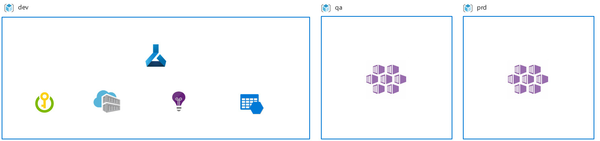
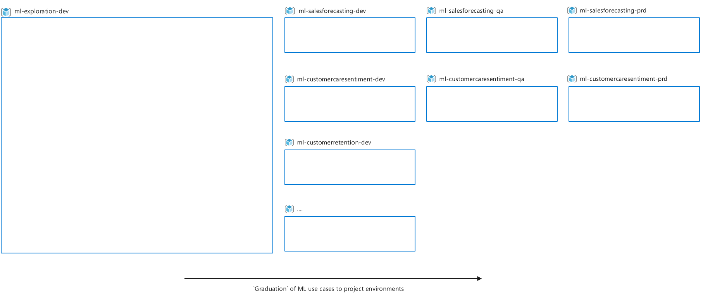

# Organize and set up Azure Machine Learning environments 

When planning an Azure Machine Learning deployment for an enterprise environment, there are some common decision points that affect how you create the workspace:

- **Team structure:** The way your Data Science teams are organized and collaborate on projects given use case and data segregation, or cost management requirements.

- **Environments:** The environments used as part of your development and release workflow to segregate development from production.

- **Region:** The location of your data and the audience you need to serve your Machine Learning solution to.

## Team structure and workspace setup

The workspace is the top-level resource in Azure Machine Learning. It stores the artifacts produced when working with Machine Learning and the managed compute and pointers to attached and associated resources. From a manageability standpoint, the workspace as an Azure Resource Manager resource allows for Azure role-based access control (Azure RBAC), management by Policy, and can be used as a unit for cost reporting.

Organizations typically choose one or a combination of the following solution patterns to follow manageability requirements.

**Workspace per team**: Choose to use one workspace for each team when all members of a team require the same level of access to data and experimentation assets. For example, an organization with three machine learning teams might create three workspaces, one for each team.

The benefit of using one workspace per team is that all Machine Learning artifacts for the team's projects are stored in one place. Productivity increases can be realized because team members can easily access, explore, and reuse experimentation results. Organizing your workspaces by team reduces your Azure footprint and simplifies cost management by team. Because the number of experimentation assets can grow quickly, you can keep your artifacts organized by following naming and tagging conventions. For recommendations about how to name resources, see [Develop your naming and tagging strategy for Azure resources](./naming-and-tagging.md).

A consideration for this approach is each team member must have similar data access level permissions. Granular RBAC and access control lists (ACL) for data sources and experimentation assets are limited within a workspace. You can't have use case data segregation requirements.

**Workspace per project:** Choose to use one workspace for each project if you require segregation of data and experimentation assets by project, or have cost reporting and budgeting requirements at a project level. For example, an organization with four machine learning teams that each runs three projects, might create 12 workspace instances.

The benefit of using one workspace per project is that costs can be managed at the project level. Teams typically create a dedicated resource group for Azure Machine Learning and associated resources for similar reasons. When you work with external contributors, for example, a project-centered workspace simplifies collaboration on a project because external users only need to be granted access to the project resources, not the team resources.

A consideration with this approach is the isolation of experimentation results and assets. The discovery and reuse of the assets might be more difficult because of assets being spread across multiple workspace instances.

**Single Workspace:** Choose to use one workspace for non-team or non-project related work, or when costs can't be directly associated to a specific unit of billing, for example with R&D.

The benefit of this setup is the cost of individual, non-project related work can be decoupled from project-related costs. When you set up a single workspace for all users to do their individual work, you reduce your Azure footprint.

A consideration for this approach is the workspace might become cluttered quickly when many Machine Learning practitioners share the same instance. Users might require UI-based filtering of assets to effectively find their resources. You can create shared Machine Learning workspaces for each business division to mitigate scale concerns or to segment budgets.

## Environments and workspace setup

An environment is a collection of resources that deployments target based on their stage in the application lifecycle. Common examples of environment names are Dev, Test, QA, Staging, and Production.

The development process in your organization affects requirements for environment usage. Your environment affects the setup of Azure Machine Learning and associated resources, for example attached compute. For example, data availability might put constraints on the manageability of having a Machine Learning instance available for each environment. The following solution patterns are common:

**Single environment workspace deployment:** When you choose a single environment workspace deployment, Azure Machine Learning is deployed to one environment. This setup is common for research-centered scenarios, where there is no need to release Machine Learning artifacts based on their lifecycle stage, across environments. Another scenario where this setup makes sense is when only inferencing services, and not Machine Learning pipelines, are deployed across environments.

The benefit of a research-centered setup is a smaller Azure footprint and minimal management overhead. This way of working implies no need to have an Azure Machine Learning workspace deployed in each environment.

A consideration for this approach is a single environment deployment is subject to data availability. Caution is required with the Datastore set up. If you set up extensive access, for example, writer access on production data sources, you might unintentionally harm data quality. If you bring work to production in the same environment where development is done, the same RBAC restrictions apply for both the development work and the production work. This setup might make both environments too rigid or too flexible.

**Multiple environment workspace deployment:** When you choose a multiple environment workspace deployment, a workspace instance is deployed for each environment. A common scenario for this setup is a regulated workplace with a clear separation of duties between environments, and for users who have resource access to those environments.

The benefits of this setup are:

- Staged rollout of Machine Learning workflows and artifacts. For example, models across environments, with the potential of enhancing agility and reducing time-to-deployment.

- Enhanced security and control of resources because you have the ability to assign more access restrictions in downstream environments.

- Training scenarios on production data in non-development environments because you can give a select group of users access.

A consideration for this approach is you are at risk for more management and process overhead since this setup requires a fine-grained development and rollout process for Machine Learning artifacts across workspace instances. Additionally, data management and engineering effort might be required to make production data available for training in the development environment. Access management is required for you to give a team access to resolve and investigate incidents in production. And finally, Azure DevOps and Machine Learning engineering expertise is needed on your team to implement automation workflows.

**One environment with limited data access, one with production data access:** When you choose this setup, Azure Machine Learning is deployed to two environments: one with limited data access and one with production data access. This setup is common if you need to segregate development and production environments. For example, you might be working under organizational constraints to make production data available in any environment, or you might want to segregate development work from production work without duplicating data more than required due to the high cost of maintenance.

The benefit of this setup is the clear separation of duties and access between development and production environments. Another benefit is lower resource management overhead when compared to a multi-environment deployment scenario.

A consideration for this approach a defined development and rollout process for Machine Learning artifacts across workspaces is required. Another consideration is data management and engineering effort might be required to make production data available for training in a development environment. However, it might require relatively less effort than a multi-environment workspace deployment.

## Regions and resource setup

The location of your resources, data, or users might require you to create Azure Machine Learning workspace instances and associated resources in multiple Azure regions. For example, one project might span its resources across the West Europe and East US Azure regions for performance, cost, and compliance reasons. The following scenarios are common:

**Regional training:** The machine learning training jobs run in the same Azure region as where the data is located. In this setup, a Machine Learning workspace is deployed to each Azure region where data is located. It's a common scenario when you are acting under compliance, or when you have data movement constraints across regions.

The benefit of this setup is experimentation can be done in the data center where the data is located with the least network latency. A consideration for this approach is when a Machine Learning pipeline is run across multiple workspace instances, it adds more management complexity. It becomes challenging to compare experimentation results across instances and adds overhead to quota and compute management.

If you want to attach storage across regions, but use compute from one region, Azure Machine Learning supports the scenario of attaching storage accounts in a region rather than the workspace. Metadata, for example metrics, will be stored in the workspace region.

**Regional serving:** Machine Learning services are deployed close to where the target audience lives. For example, if target users are in Australia and the main storage and experimentation region is West Europe, deploy the Machine Learning workspace for experimentation in West Europe, and deploy an AKS cluster for inference endpoint deployment in Australia.

The benefits of this setup are the opportunity for inferencing in the data center where new data is ingested, minimizing latency and data movement, and compliance with local regulations.

A consideration for this approach is a multi-region setup provides several advantages, it also adds more overhead on quota and compute management. When there is a requirement for batch inferencing, regional serving might require a multi-workspace deployment. Data collected through inferencing endpoints might require to be transferred across regions for retraining scenarios.

**Regional fine-tuning:** A base model is trained on an initial dataset, for example, public data or data from all regions, and is later fine-tuned with a regional dataset. The regional dataset might only exist in a particular region because of compliance or data movement constraints. For example, base model training might be done in a workspace in region A, while fine tuning might be done in a workspace in region B.

The benefit of this setup is experimentation is available in compliance with the data center where the data resides, and still takes advantage of base model training on a larger dataset in an earlier pipeline stage.

A consideration is this approach provides the ability for complex experimentation pipelines, however it might create more challenges. For example, comparing experiment results across regions and more adding more overhead to quota and compute management.

## Reference implementation

To illustrate the deployment of Azure Machine Learning in a larger setting, this section outlines how the organization 'Contoso' has set up Azure Machine Learning given their organizational constraints, reporting, and budgeting requirements:

- Contoso creates resource groups on a solution basis for cost management and reporting reasons.
- IT administrators only create resource groups and resources for funded solutions to meet budget requirements.
- Because of the exploratory and uncertain nature of Data Science, users need a place to experiment and work for use case and data exploration. Often, exploratory work can't be directly associated to a particular use case, and can be associated only to an R&D budget. Contoso wants to fund some Machine Learning resources centrally that anyone can use for exploration purposes.
- Once a Machine Learning use case proves to be successful in the exploratory environment, teams can request resource groups. For example, Dev, QA, and Prod for iterative experimentation project work, and access to production data sources can be set up.
- Data segregation and compliance requirements don't allow live production data to exist in development environments.
- Different RBAC requirements exist for various user groups by IT policy per environment, for example access is more restrictive in production.
- All data, experimentation, and inferencing is done in a single Azure region.

To adhere to the above requirements, Contoso has set up their resources in the following way:

- Azure Machine Learning workspaces and resource groups are scoped per project to follow budgeting and use case segregation requirements.
- A multiple-environment setup for Azure Machine Learning and associated resources to address cost management, RBAC, and data access requirements.
- A single resource group and Machine Learning workspace that is dedicated for exploration.
- Azure Active Directory groups that are different per user role and environment, for example operations that a data scientist can do in a production environment are different than in the development environment, and access levels might differ per solution.
- All resources are created in a single Azure region. 

## Next steps

To learn about best practices on Machine Learning DevOps with Azure Machine Learning, see [Machine learning DevOps guide](./ai-machine-learning-mlops.md).
> [!div class="nextstepaction"]
> [Machine learning DevOps guide](./ai-machine-learning-mlops.md)

To learn about considerations when managing budgets, quota and cost with Azure Machine Learning, see [Manage budgets, costs, and quota for Azure Machine Learning at organizational scale](./optimize-ai-machine-learning-cost.md).
> [!div class="nextstepaction"]
> [Manage budgets, costs, and quota for Azure Machine Learning at organizational scale](./optimize-ai-machine-learning-cost.md)
