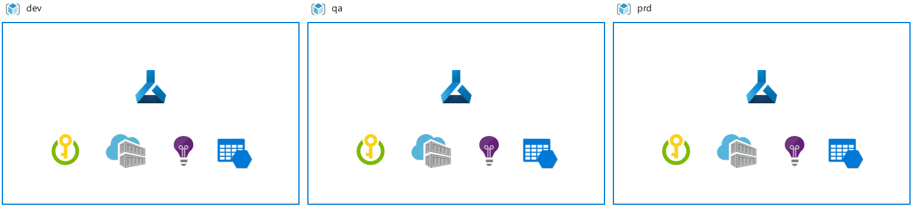
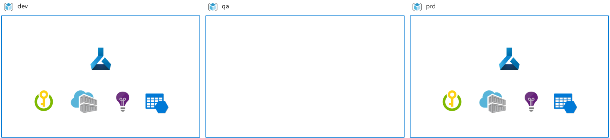
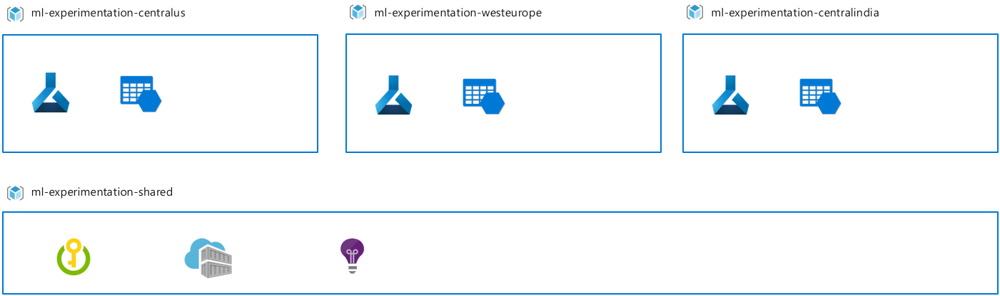
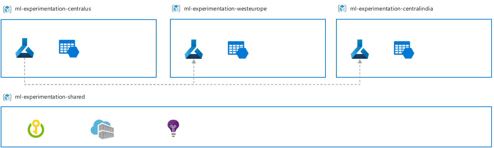

This article discusses decision points when creating a Workspace. When planning an Azure Machine Learning deployment for an enterprise environment, there are some common decision points or scenarios that impact how you create the Workspace. These decision points are:

* Team structure, meaning the way your Machine Learning teams are organized and collaborate on projects given use case and data segregation, or cost management requirements.
* Environments used as part of your development and release workflow to segregate development from production.
* Regionality of your data or the audience you need to serve your ML solution to.

# How does team structure impact Workspace set up?

The Workspace is the top-level resource in Azure Machine Learning, holding Azure Machine Learning artifacts produced when working with Azure ML, as well as managed compute and pointers to attached and associated resources. From a manageability standpoint, the Workspace as an ARM-resource allows for Role Based Access Control, management by Policy, and can be used as a unit for cost reporting.  

Organizations typically choose for one or a combination of the below solution patterns to comply with manageability requirements.

1. A **Workspace per team** is typically chosen when all members of team require the same level of access to data and experimentation assets.   For instance, an organization with three ML-teams might create three workspaces, one for each team.

    Benefits: As a result, all ML-related artefacts for all projects run by that team are found in a single place. This can boost productivity since it makes exploration of experimentation results from peers on the team accessible and more easily reusable. Organization by team typically means a low Azure resource footprint and allows for cost management per team. Since experimentation assets can grow fast, follow proper naming and tagging conventions to keep artifacts organized.

    To consider: Since granular RBAC and “ACL”'ing of data sources and experimentation assets is limited within a Workspace, each user of the Workspace must have similar data access level permissions and no use case data segregation requirements must exists.

1. A **Workspace per project** is common for teams that require segregation of data and experimentation assets by project or face cost reporting and budgeting requirements on a project-level. For instance, an organization with four ML teams that each runs three projects, might create 12 Workspace instances in total.

    Benefits: As a result, cost can be managed on a project-level. Teams typically choose to create a dedicated resource group for Azure ML and associated resources for similar reasons. When working with external contributors, the project-centered Workspace set up also allows for easier collaboration on a project, since external users only need to be granted access to the project resources and not for the team.

    To consider: The isolation of experimentation results and assets might make discovery and reuse more difficult within the organization due to assets being scattered across multiple Workspace instances.

1. A **Single Workspace** for every user is typically chosen for non-team or non-project related work, or when costs cannot be directly associated to a specific unit of billing like is the case with R&D.

    Benefits: As a result, cost of individual non-project related work can be decoupled from project-related cost. When setting up a single workspace for all users to do individual work, this means a significantly lower Azure resource footprint compared to a set up where N workspaces would exist for N users to facilitate individual work.

    To consider: The Workspace might become cluttered quickly when many ML practitioners share the same instance. Users possibly require UI-based filtering of assets to effectively find one's own resources. Consider creating shared ML Workspaces per business division to mitigate scale concerns or to segment budgets.

# How to reflect multiple environments (dev/test/prod), in the Workspace setup?

An environment is a collection of resources that can be targeted by deployments, where an environment for instance segregates resources by their application lifecycle stage. Typical examples of environment names are Dev, Test, QA, Staging, and Production.

Dependent on the development process in your organization, requirements to environment usage might vary and hence also the setup of Azure Machine Learning and associated resources such as attached compute. For instance, data availability might put constraints on the manageability of having an Azure Machine Learning instance available for each environment. The following solution patterns are common.

1. A **single environment Workspace deployment**. While multiple environments may typically be used for regular application development in your organization, in this setup Azure Machine Learning is deployed only to a single environment. This setup is common for research-centered scenarios, where there are is no need to release ML artifacts in a multi-stage way across environments. Another scenario where this setup is chosen for is when only inferencing services, and not ML pipelines, are deployed across environments.

    Benefits: if your scenario is research-centered, this setup allows for a low Azure resource footprint and minimal management overhead, since the way of working implies no need to have an Azure Machine Learning Workspace deployed in each environment.

    To consider: feasibility of a single environment deployment is subject to data availability. Caution is required with the Datastore set up, since too extensive access (writer access) on production data sources might unintentionally harm data quality. When intending to bring work to production in the same environment as where development happens, same RBAC restrictions will apply for development and production work, which might make both 'environments' be too rigid or too flexible.

    

1. A **multi-environment Workspace deployment**. In this set up a Workspace instance is deployed for each environment. A common scenario for this setup is a regulated workplace with a clear separation of duties between environments, as well as for those who have resource access to those environments.

    Benefits: this setup enables a way of working with a staged roll out of ML workflows and artifacts such as Models across environments, with potential of enhancing agility and reducing time-to-deployment. There is the opportunity of enhanced security and control of resources since additional access restrictions can be assigned in downstream environments. This set up also enables training scenarios on production data in non-dev environments where only a select group of users have access.

    To consider: there is a risk of management and process overhead since this setup requires a fine-grained development and roll out process for ML artifacts across Workspace instances. Moreover, data management and engineering effort might be required to make production data available for training in the development environment. Access management is required to enable a team to resolve and investigate incidents in production. Moreover, DevOps and ML Engineering expertise is needed on the team to be able to implement automation workflows.

    

1. **One environment with limited data access, one with production data access** is a special variant of #2. While multiple environments may typically be used for regular application development in your organization, in this setup Azure Machine Learning is deployed only to two environments – one environment where there is limited data access, and an environment where there is live production data access. This setup is common when there is a requirement to segregate development and production environments, but when acting either under organizational constraints to make production data available in any environment or when looking for a set up to segregate dev from production work in the leanest way without duplicating data more than required e.g. because the cost of maintenance is to high.

    Benefits: as a result, this set up allows for a clear separation of duties and access between dev and production environments with lower resource management than in the regular multi-environment deployment scenario.

    To consider: this set up requires a defined development and roll out process of ML artifacts across Workspace instances. Data management and engineering effort might be required to make production data available for training in a dev environment but might be relatively less in effort than is the case with #2.

    

# How does regionality impact resource set up?

Regionality of resources, data, or users, might impose the requirement to create Azure Machine Learning Workspace instances and associated resources in multiple Azure regions. For instance, one project might span its resources across the West Europe and East US Azure regions for performance, cost and/or compliance reasons. The below scenarios are common.

1. **Regional training** means that machine learning training jobs run in the same Azure region as where the data resides. In this setup an Azure Machine Learning workspace is deployed to each Azure region where data is located. It is a typical scenario when acting under compliance, or when there are data movement constraints across regions.

    Benefits: as a result, experimentation is enabled in the data center where the data resides and with least network latency.

    To consider: at the downside, when a ML pipeline is run across multiple Workspace instances, this imposed additional management complexity. It becomes harder to compare experimentation results across instances and adds an overhead to quota and compute management.

    If you are looking to attach storage across regions, but use compute from one region, note that Azure ML supports the scenario of attaching storage accounts in a region other than the workspace. Metadata such as metrics however will be stored in the region of the Workspace.

    

1. **Regional serving** means deploying Machine Learning services close to where the target audience lives. For instance, when target users reside in Australia and the main storage and experimentation region is West Europe, deploy the ML Workspace for experimentation in West Europe, and deploy an AKS cluster for inference endpoint deployment in Australia.

    Benefits: as a result, this enables inferencing in the data center where new data is ingested, minimizing latency and data movement, and/or enabling complying with local regulations.

    To consider: while a multi-region set up brings several advantages, it also imposes an overhead on quota and compute management. When there is a requirement for batch inferencing, regional serving might require a multi-Workspace deployment. Moreover, data collected via inferencing endpoints might still require to be transferred across regions for retraining scenarios.

    

1. **Regional finetuning** is a variant of regional training. In this case, a base model is trained on an initial dataset e.g. public data or data from all regions, and is later finetuned with a regional dataset. This latter dataset might only exist in a particular region due to compliance or data movement constraints.  Base model training might in this case be executed in a Workspace in region A, while finetuning is executed in a Workspace in region B.

    Benefits: as a result, experimentation is enabled in compliance in the data center where the data resides, while there can still be taken advantage of base model training on a larger dataset in an earlier pipeline stage.

    To consider: while this set up enables complex experimentation pipelines, it imposes challenges on comparing experiment results across regions and adds an overhead to quota and compute management.

    

# Reference implementation

To illustrate the deployment of Azure Machine Learning in a larger setting, this section outlines how the organization `Contoso` has set up Azure Machine Learning given their organizational constraints, reporting and budgeting requirements:

* Only IT administrators can create resource groups and Azure resources on a project/solution basis and only for projects that are already funded due to budgeting requirements.
* Due to the explorative and uncertain nature of Data Science, there’s a need for users to have a dedicated place for them to use Azure Machine Learning for data and use case explorative work. Exploration entails understanding if an idea is feasible in terms of data availability and data quality. This work cannot be associated to a project or solution. Idea is that everyone in the organization has access to these resources and budgeting is done centrally across business departments from R&D budget.
* At Contoso, each funded solution gets allocated its own resource groups in three Azure environments (Dev, QA, Prod), including ML Solutions.
* Once a ML use case proves itself to be successful in the explorative environment, resource group(s) can be set up for iterative experimentation project work, and access to production data sources will be provided once permitted by the data owner.
* Data segregation and compliance requirements disallow live production data to exists in dev environments.
* Different RBAC requirement exist for various user groups by IT policy per environment e.g. access is more restrictive in prod.
* Since ML use cases are bound to a business department, costs for dev, qa and prod environments yielding from these use cases is to be funded by those departments.
* Explorative work is funded centrally across departments through R&D budget.
* All data, experimentation and inferencing takes place in a single Azure region.

To adhere to the above requirements, Contoso has set up their resources in the following way:

* Azure Machine Learning workspaces and resource groups scoped per Project to comply with budgeting and use case segregation requirements.
* A multiple-environment set up for Azure ML and associated resources to address cost managment, RBAC and data access requirements. 
* A single resource group and ML Workspace that is dedicated for Exploration -- the so-called ‘Exploration’ environment.

