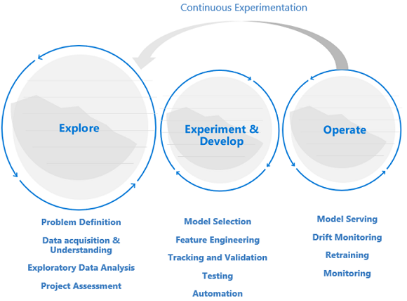
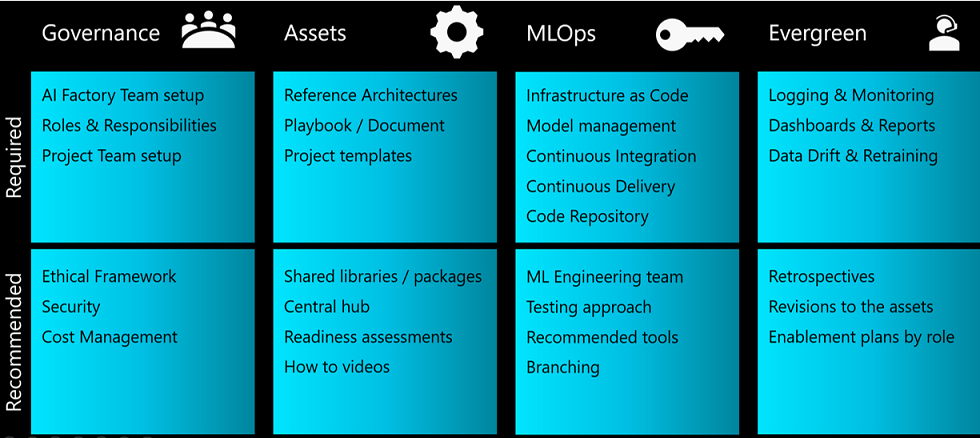

# Machine Learning DevOps Guide

Machine Learning DevOps (MLOps) is an organizational change that relies on a combination of People, Process &amp; Technology to deliver Machine Learning solutions in a robust, scalable, reliable, and automated way. This guide aims at providing a balanced view across the three areas, collating best practices and learnings from adopting MLOps in the Enterprise with Azure Machine Learning.

This article is sub-divided into three sections:

- **An introduction to MLOps** - A conceptual introduction, providing a balanced view across the three areas of People, Process and Technology to anyone new to MLOps.
- **MLOps Best Practices with Azure Machine Learning** – Key considerations and recommendations in applying MLOps practices scoped to single ML Project.
- **MLOps at organizational scale: AI Factories** – Key considerations and recommendations for driving organizational change with MLOps in an enterprise environment.

## An introduction to MLOps

### Why MLOps?

Modern machine learning algorithms and frameworks are making it increasingly easy to develop models that can make accurate predictions.

You may have built a fantastic machine learning model that exceeds all your accuracy expectations and impresses your business sponsors so it is now time to deploy the model into production. Unfortunately, it is not as easy as you had anticipated: there are likely many things to put in place before your model can finally be put to use.

Over time, you or one of your colleagues may develop a new model that could perform better than the old model, but can you carefully implement it without potentially disrupting business? It may also be necessary for regulatory purposes to recreate the model and explain the model's predictions when unusual or biased predictions are made. Data inputted to your training and model can change over time and it may be necessary to retrain the model periodically to maintain the accuracy of its predictions. Who will have responsibility to feed the data, monitor the performance, retrain the model and fix it should it fail?

If you experience these problems, you may want to consider implementing an MLOps strategy for your project. At a high level MLOps refers to the application of DevOps principles to AI-infused applications. Let's consider one very common use case: Suppose we have an application that serves a model's predictions via a REST API. Even such a simple use case can face many issues in production. Some MLOps tasks fit well in the general DevOps framework, such as setting up unit tests and integration tests, or tracking changes through version control. Other tasks are more unique to MLOps, including the following.

- How to enable continuous experimentation and comparison against a baseline model.
- How to monitor the incoming data to detect [data drift](https://docs.microsoft.com/azure/machine-learning/how-to-monitor-datasets?tabs=python).
- How trigger model retraining and set up a rollback just in case.
- How to create reusable data pipelines that can be leveraged for both training and scoring.

Ultimately, the goal of MLOps is to close the gap between development and production and deliver value to customers faster. To achieve this, we need to rethink how things are done in development and in production. To what extent Data Scientists specifically are expected to be involved in MLOps is an organizational choice, as the role of Data Scientist itself is defined differently across different organizations. We recommend you check out the [MLOps maturity model](https://docs.microsoft.com/azure/architecture/example-scenario/mlops/mlops-maturity-model#:~:text=Maturity%20model%20%20%20%20Level%20%20,model%20performa%20...%20%201%20more%20rows%20) to see where you are and where you want to be on the maturity scale.

### How Machine Learning DevOps is different than DevOps

#### Exploration precedes development and operations

Data Science projects are different from App Dev or Data Engineering projects. **Data Science projects may or may not make it to production.** After an initial analysis, it might become clear that the business outcome cannot be achieved with the available datasets. Due to this reason, an exploration phase is usually the first step in a Data Science project. The objective in this phase is to define and refine the problem and run exploratory data analysis, in which statistics and visualizations are used in order to confirm or falsify the problem hypotheses. There needs to be a common understanding that the project may not extend beyond this phase. It is important to make this phase as seamless as possible in order to have a quick turnaround. Unless there is an element of security which enforces processes and procedures, they should be avoided and the Data Scientist should be allowed to work with the tool and data of their choice. Real data is needed for data exploration work.

The experimentation and development stage usually begin when there is enough confidence that the Data Science project is feasible and can provide real business value. Hence it is the stage at which dev practices become increasingly important. It is a good practice to capture metrics for all the experiments that are done at this stage, and to incorporate source control so that it is possible to compare models and go back and forth between various versions of the code if needed. Development activities include the refactoring, testing and automation of exploration code into repeatable experimentation pipelines, as well the creation of model serving applications and pipelines. Refactoring code into more modular components and libraries helps increase reusability and testability, and it allows for performance optimization. Finally, what is deployed into staging and production environments is the model serving application or batch inference pipelines. Next to monitoring of infrastructure reliability and performance, similarly to what's done for a regular application with traditional DevOps, the quality of the data, the data profile, and model must be continuously monitored at the risk of degradation or drift. ML models require retraining over time to stay relevant in a changing environment.

#### Data science lifecycle requires an adaptive way of working

One who tries to apply a typical DevOps way of working to a data science project might not find success due to the uncertain nature of data quality and its correlativity. Exploration and experimentation are recurring activities and needs throughout a machine learning project. Teams at Microsoft follow a project lifecycle and working process that was developed to reflect data science specific activities. The [Team Data Science Process](https://docs.microsoft.com/azure/machine-learning/team-data-science-process/overview) and [The Data Science Lifecycle Process](https://github.com/dslp/dslp) are examples of reference implementations.

#### Data quality requirements and data availability constrain the work environment

For a machine learning team to effectively develop ML-infused applications, production data access is desirable across work environments. In case production data access is not possible due to compliance requirements or technical constraints, consider implementing [Azure RBAC with Azure Machine Learning](https://docs.microsoft.com/azure/machine-learning/how-to-assign-roles), [Just-in-Time access](https://docs.microsoft.com/azure/security-center/security-center-just-in-time?tabs=jit-config-asc%2Cjit-request-asc) or [data movement pipelines](https://docs.microsoft.com/azure/data-factory/#:~:text=Azure%20Data%20Factory%20documentation.%20Azure%20Data%20Factory%20is,and%20run%20them%20with%20full%20compatibility%20in%20) to create production data replicas and enable user productivity.

#### Machine learning requires a greater operational effort

Unlike traditional software, a machine learning solution is constantly at risk of degradation due to its dependency on data quality. To maintain a qualitive solution once in production, [continuous monitoring and reevaluation of data and model quality](https://docs.microsoft.com/azure/machine-learning/how-to-enable-app-insights) is critical. It can be expected that a production model requires timely retraining, redeployment and tuning. These tasks come on top of day-to-day security, [infrastructure monitoring](https://docs.microsoft.com/azure/machine-learning/monitor-azure-machine-learning) or compliance requirements and require special expertise.

#### Machine learning teams requires specialists and domain experts

While data Science projects share many roles in common with regular IT projects, the success of a machine learning team depends highly on a group of ML technology specialists and domain subject matter experts. Where the technology specialist has the right background to do end-to-end machine learning experimentation, the domain experts are able to support the specialist in analyzing and synthesizing the data or qualifying for use.

Common technical roles that are unique to Data Science projects are the Domain Expert, Data Engineer, Data Scientist, AI Engineer, Model Validator and ML Engineer. To learn more about roles and tasks within a typical Data Science team, also refer to the [Team Data Science Process](https://docs.microsoft.com/azure/machine-learning/team-data-science-process/roles-tasks).

### Seven principles to Machine Learning DevOps

When looking to adopt MLOps for your next machine learning project, consider applying the following core principles as the foundation to any project.

1. _Version control code, data and experimentation outputs_

    Unlike traditional software, data has a direct influence on the quality of machine learning models. Besides versioning your experimentation code base, version your datasets to ensure reproducibility of experiments or inferencing results. Versioning experimentation outputs like models can save effort and the computational cost of recreation.

1. _Use multiple environments_

    To segregate development and testing from production work, [replicate](https://docs.microsoft.com/azure/cloud-adoption-framework/ready/azure-best-practices/ai-machine-learning-resource-organization?branch=pr-en-us-1541) your infrastructure in at least two environments. Access control for users might differ in each environment.

1. _Manage infrastructure and configurations-as-code_

    When creating and updating infrastructure components in your work environments, make use of [infrastructure-as-code](https://docs.microsoft.com/azure/architecture/framework/devops/automation-infrastructure) to prevent inconsistencies between environments. In addition, manage machine learning experiment job specifications as code, so that you can easily rerun and reuse a version of your experiment across environments.

1. _Track and manage machine learning experiments_

    Track the performance KPIs and other artifacts of your machine learning experiments. Keeping a history of job performance allows for a quantitative analysis of experimentation success and enables for greater team collaboration and agility.

1. _Test code, validate data integrity, model quality_

    [Test](https://docs.microsoft.com/azure/architecture/framework/scalability/test-checklist) your experimentation code base including correctness of data preparation functions, featurizers, checks on data integrity, as well as obtained model performance.

1. _Machine Learning Continuous Integration and Delivery_

    Use [continuous integration](https://docs.microsoft.com/azure/architecture/framework/devops/release-engineering-ci) to automate test execution in your team. Include model training as part of continuous training pipelines, and include A/B testing as part of your [release](https://docs.microsoft.com/azure/architecture/framework/devops/release-engineering-cd), to ensure that only a qualitative model may land in production.

1. _Monitor Services, Models and Data_

    When serving machine learning models in an operationalized environment, it is critical to monitor these services for their infrastructure uptime and compliance, as well as for model quality. [Set up monitoring](https://docs.microsoft.com/learn/modules/monitor-data-drift-with-azure-machine-learning/) to identify data and model drift, to understand whether retraining is required or to set up triggers for automatic retraining.

## MLOps Best Practices with Azure Machine Learning

Azure Machine Learning offers several asset management, orchestration, and automation services to help you manage the lifecycle of your model training and deployment workflows. This section discusses best practices and recommendations in applying MLOps across the areas of People, Process and Technology supported by Azure Machine Learning.

### People

- Work in project teams to best utilize specialist and domain knowledge in your organization. [Organize and set up Azure ML Workspaces](https://docs.microsoft.com/azure/cloud-adoption-framework/ready/azure-best-practices/ai-machine-learning-resource-organization?branch=pr-en-us-1541) on a project basis to comply with use case segregation requirements.
- Define a set of responsibilities and tasks in your organization as a role, where one team member on an MLOps project team could fulfill multiple roles. Use Custom Roles in Azure to define a set of granular [Azure RBAC operations for Azure Machine Learning](https://docs.microsoft.com/azure/role-based-access-control/resource-provider-operations#microsoftmachinelearningservices) that each role can perform.
- Standardize on a project lifecycle and agile methodology. The [Team Data Science Process](https://docs.microsoft.com/azure/machine-learning/team-data-science-process/overview#:~:text=%20What%20is%20the%20Team%20Data%20Science%20Process%3F,resources%20for%20data%20science%20projects.%20The...%20More%20) provides a reference lifecycle implementation.
- Balanced teams can execute all MLOps stages from exploration to development to operations.

### Process

- Standardize on a code template to allow for code reuse and increase ramp up time at project start or when a new team member joins the project. [Azure ML pipelines](https://docs.microsoft.com/azure/machine-learning/concept-ml-pipelines) and [job submissions script](https://docs.microsoft.com/python/api/azureml-core/azureml.core.scriptrun?view=azure-ml-py), as well as [CI/CD pipelines](https://docs.microsoft.com/azure/machine-learning/how-to-github-actions-machine-learning?view=azure-ml-py) lend themselves well for templatization.
- Use version control. Jobs that are submitted from a Git-backed folder [automatically track repo metadata](https://docs.microsoft.com/azure/machine-learning/concept-train-model-git-integration?view=azure-ml-py) with the job in Azure ML for reproducibility.
- Version experiment inputs and outputs to enable reproducibility. Use [Azure ML Datasets](https://docs.microsoft.com/azure/machine-learning/how-to-version-track-datasets?view=azure-ml-py), [Model management](https://docs.microsoft.com/azure/machine-learning/concept-model-management-and-deployment?view=azure-ml-py) and [Environment management](https://docs.microsoft.com/azure/machine-learning/concept-environments) capabilities to facilitate.
- Build up a [run history](https://docs.microsoft.com/azure/machine-learning/how-to-manage-runs?tabs=python) of experiment runs to allow for comparison, planning and collaboration. Make use of an experiment tracking framework like [MLFlow](https://docs.microsoft.com/azure/machine-learning/how-to-use-mlflow?view=azure-ml-py) for metric collection.
- Continuously measure and control the quality of your team's work through [continuous integration](https://docs.microsoft.com/azure/architecture/microservices/ci-cd) on the full experimentation code base.
- Early-terminate training when a Model does not converge. Use an experiment tracking framework in combination with the [run history](https://docs.microsoft.com/azure/machine-learning/how-to-manage-runs?tabs=python) in Azure Machine Learning to monitor job execution.
- Define an experiment and model management strategy. Consider using naming e.g. &quot;Champion&quot; to refer to the current baseline model, or refer to &quot;Challenger' models for candidate models which could outperform the &quot;Champion&quot; model in production. Leverage tags in Azure Machine Learning to mark experiment and models as appropriate. In some scenarios, such as sales forecasting it can take months to determine whether the model's predictions are accurate.
- Elevate [Continuous Integration](https://docs.microsoft.com/azure/architecture/microservices/ci-cd) to Continuous Training by including model training as part of the build. For instance, initiate model training on the full dataset with each pull request.
- Shorten time-to-feedback on the quality of machine learning pipeline by running automated build just on a sample of the data. Use [Azure ML Pipeline parameters](https://docs.microsoft.com/azure/machine-learning/how-to-use-pipeline-parameter) to parameterize input [Datasets](https://docs.microsoft.com/azure/machine-learning/how-to-train-with-datasets).
- Use [Continuous Deployment for Machine Learning models](https://docs.microsoft.com/azure/machine-learning/how-to-deploy-continuously-deploy) to automate the deployment and testing of real time scoring services across your Azure environments (dev, test, prod).
- In some regulated industries, model validation steps may be required before a machine learning model can be used in a production environment. By automating validation steps (to an extent) one might be able to accelerate time to delivery. When manual review or validation steps are still the bottleneck, consider whether it is possible to certify the automated model validation pipeline. Use resource Tags in Azure Machine Learning to indicate asset compliance, candidates for review, or as triggers for deployment.
- Do not retrain in production and directly replace the production model without any integration testing. Even though model performance and functional requirements are good, amongst other potential issues, a model might have grown in footprint breaking the serving environment.
- When production data access is only available in production, use [Azure RBAC](https://docs.microsoft.com/azure/role-based-access-control/resource-provider-operations#microsoftmachinelearningservices) and [custom roles](https://docs.microsoft.com/azure/machine-learning/how-to-assign-roles) to give a select number of ML practitioners the read access they require e.g. for data exploration. Alternatively, make a data copy available in the non-production environments.
- Agree on naming conventions and tags for Azure Machine Learning [Experiments](https://docs.microsoft.com/python/api/azureml-core/azureml.core.experiment.experiment?view=azure-ml-py) to differentiate retraining baseline machine learning pipelines from experimental work.

### Technology

- When typically submitting jobs via the studio UI or CLI interface, instead of submitting jobs via the SDK, use the CLI or [Azure DevOps Machine Learning Tasks](https://marketplace.visualstudio.com/items?itemName=ms-air-aiagility.vss-services-azureml) to configure automation pipeline steps. This might reduce code footprint by reusing the same job submissions directly from automation pipelines.
- Use event-based programming. For instance, trigger an offline model testing pipeline using an Azure Function once a new model gets registered. Or send a notification to an `Ops` email alias when a critical pipeline fails to run. Azure ML [produces events to Event Grid](https://docs.microsoft.com/azure/machine-learning/how-to-use-event-grid) that you can subscribe to.
- When using Azure DevOps for automation, make use of [Azure DevOps Tasks for Machine Learning](https://marketplace.visualstudio.com/items?itemName=ms-air-aiagility.vss-services-azureml) to use Machine Learning models as pipeline triggers.
- When you are developing Python packages for your machine learning application, you can host them in an Azure DevOps repository as artifacts and publish them as a feed. This approach [allows you to integrate](https://docs.microsoft.com/azure/machine-learning/how-to-use-private-python-packages) the DevOps workflow for building packages with your Azure Machine Learning Workspace.
- Consider using a staging environment to system integration test ML pipelines with upstream or downstream application components.
- Create unit and integration test for your Inference Endpoints for enhanced debuggability and accelerated time to deployment.
- To trigger retraining, make use of [Dataset Monitors](https://docs.microsoft.com/azure/machine-learning/how-to-monitor-datasets?tabs=python) and use [event-driven workflows](https://docs.microsoft.com/azure/machine-learning/how-to-use-event-grid) to subscribe to Data drift Events and automate the triggering of [machine learning pipelines for retraining](https://docs.microsoft.com/azure/machine-learning/how-to-retrain-designer).

## MLOps at organizational scale: AI Factories

A data science team may decide that they can manage a handful of machine learning use cases internally. Adopting MLOps helps set project teams up for better quality, reliability, and maintainability of solutions through balanced teams, supporting process and technology automation. This allows the team to scale and focus on the development of new use cases.

As the number of use cases grows in an organization, the management burden of supporting these use cases grows linearly or even more. The challenge becomes how to leverage organizational scale to accelerate time-to-market, quicker assess use case feasibility, enable repeatability, and best utilize the available resources and skill sets across the full range of projects.

An `AI Factory` refers to the development of repeatable business process, and a collection of standardized artifacts to accelerate the development and deployment of a large set of ML use cases by optimizing team set up, recommended practices, MLOps strategy, architectural patterns, and reusable templates tailored to business requirements.

### Standardize on repeatable Architectural Patterns

Repeatability is a key part of developing a factory process. Data Science teams can accelerate project development and improve consistency across projects by developing a few repeatable architectural patterns that cover most of the Machine Learning use cases for their organization. Once these patterns are in place, most projects can use these patterns and reap the following benefits:

- Accelerated design phase
- Accelerated approvals from IT and security teams when reusing tools across projects
- Accelerated development due to reusable infrastructure as code templates and project templates (which are covered in more detail in the next section)

The architectural patterns can include but are not limited to the following topics:

- Preferred services for each stage of the project
- Data connectivity and governance
- An MLOps strategy tailored to the requirements of the industry, business or data classification
- Experiment management process champion / Challenger models

### Facilitate cross-team collaboration and sharing

Shared code repositories and utilities can accelerate the development of ML solutions.

#### Sharing and reuse of intellectual property

At the beginning of a project, the following should be reviewed to maximize code reuse:

1. Internal code (packages/modules) which have been designed for reuse within the organization.
2. Datasets which have been created in other ML projects or that are available in the Azure ecosystem.
3. Existing data science projects with similar architecture and business problem.
4. GitHub / open-source repos that can accelerate the project.

Project retrospectives should include an action item to review if there are elements of the project can be shared / generalized for broader reuse, so that the list of assets listed above organically grows with time.

To facilitate sharing and discovery, many companies have introduced shared repositories for the organization of code snippets and ML artifacts. Artifacts in Azure Machine Learning can be defined-as-code, including [Datasets](https://docs.microsoft.com/azure/machine-learning/how-to-create-register-datasets), [Models](https://docs.microsoft.com/azure/machine-learning/how-to-create-register-datasets), [Environments](https://docs.microsoft.com/python/api/azureml-core/azureml.core.environment(class)?view=azure-ml-py) and [Pipelines](https://docs.microsoft.com/python/api/azureml-pipeline-core/azureml.pipeline.core.pipeline(class)?view=azure-ml-py) allowing for efficient sharing across projects and Workspaces.

#### Project Templates

To accelerate the migration of existing solutions, and maximize code reuse when starting a new project, many companies have standardized on a project template to kick start a new project. Examples of project templates for recommend use with Azure Machine Learning are [Azure ML Examples](https://github.com/Azure/azureml-examples), [Data Science Lifeycle Process](https://github.com/dslp/dslp) and [Team Data Science Process](https://github.com/Azure/Azure-TDSP-ProjectTemplate).

#### Central data management

Getting access to data for exploration or production usage can be time-consuming. Many companies are centralizing their data management to bring data producers and data consumers together and facilitate easier data access for machine learning experimentation.

#### Shared utilities

Enterprise-wide centralized dashboards are often implemented to consolidate logging and monitoring information, such as error logging, service availability and telemetry and model performance monitoring.

Make use of Azure Monitor metrics for Azure Machine Learning and associated services like Azure Storage to build a dashboard to keep track of experimentation progress, compute infrastructure health or GPU quota utilization.

### Create a specialist ML Engineering team

Many companies have implemented the role of the ML Engineer who specializes in creating and operating robust ML pipelines, drift monitoring and retraining workflows, monitoring dashboards, and drive overall responsibility for industrializing the ML solution from development to production. They work closely with data engineering, architects, and security and operations to ensure that all the necessary controls are in place.

While data science requires deep domain expertise, ML engineering as a discipline is more technical focused. This makes the ML engineer more flexible to work across various projects and business departments. Large Data Science practices can benefit from a specialist ML Engineering team that drives repeatability and reuse of automation workflows across various use cases and business departments.

### Enablement &amp; Documentation

It's important to provide clear guidance on the AI Factory process to new and existing teams and users. This will ensure consistency and reduce the amount of effort that the ML Engineering team will need to put when they industrialize a project. Consider designing content specifically for the various roles in your organization.

Everyone has a unique learning style, so a mixture of the following types of documents can help accelerate the adoption of the AI Factory framework.

- Central hub with links to all artifacts (for example, this can be a Teams team or a SharePoint site)
- Training and enablement plans specifically designed for each role
- High level summary presentation of the approach along with a companion video
- Detailed Document / Playbook
- &quot;How-to&quot; videos
- Readiness assessments

### Ethics

Ethics play an instrumental role in the design of an AI solution. Without implementing ethical principles, trained models can exhibit the same bias present in the data they were trained on. This can result in the project being discontinued and more importantly, it can risk the organization's reputation.

In order to ensure that the key ethical principles that the company stands for are implemented across projects, a list of these principles along with ways of validating them from a technical perspective during the testing phase should be provided. Consider making use of the [Responsible ML](https://docs.microsoft.com/azure/machine-learning/concept-responsible-ml) features in Azure Machine Learning.

### Summary

AI Factory, as the name suggests relies on building repeatable processes and reusable assets that can help the organization scale from tens of use cases to thousands of use cases in a scalable way.

The following figure summarizes key elements of an AI Factory:

Note that not all MLOps requirements are the same: The MLOps architecture for a large multi-national enterprise is unlikely to fit a small startup. Organizations may prefer to start small and build up as their maturity, model catalog and experience grows.
