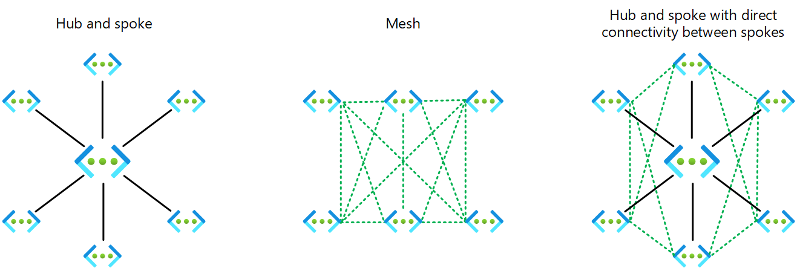

# Azure Virtual Network Manager in Azure landing zones

The Azure landing zones conceptual architecture recommends one of two networking topologies: a network topology that's based on Virtual WAN or a network topology that's based on a traditional hub-and-spoke architecture. As your business requirements change over time (for example, a migration of on-premises applications to Azure that requires hybrid connectivity), you can use Virtual Network Manager to expand and implement networking changes. In many cases, you can do so without disrupting what's already deployed in Azure.  

You can use Virtual Network Manager to create three types of [topologies](/azure/virtual-network-manager/concept-connectivity-configuration) across subscriptions for both existing and new virtual networks:

- Hub-and-spoke topology
- Hub-and-spoke topology with direct connectivity between spokes
- Mesh topology (in preview)

>[!NOTE]
> Virtual Network Manager doesn't support Virtual WAN hubs as part of a network group or as the hub in a topology. For more information, see [Azure Virtual Network Manager FAQ](/azure/virtual-network-manager/faq).

When you create a hub-and-spoke topology with direct connectivity in Virtual Network Manager, where the spokes are connected to each other directly, direct connectivity between spoke virtual networks in the same [network group](/azure/virtual-network-manager/concept-network-groups) is automatically enabled, bi-directionally, via the [Connected group](/azure/virtual-network-manager/concept-connectivity-configuration#connected-group) feature. 

You can use Virtual Network Manager to statically or dynamically add virtual networks to specific [network groups](/azure/virtual-network-manager/concept-network-groups). Doing so defines and creates the desired topology, based on your connectivity configuration in Virtual Network Manager.

You can create multiple network groups to isolate groups of virtual networks from direct connectivity. Each network group provides the same region and multi-region support for spoke-to-spoke connectivity. Be sure to stay within the limits defined for Virtual Network Manager, which are described in [Azure Virtual Network Manager FAQ](/azure/virtual-network-manager/faq#limits).

From a security perspective, Virtual Network Manager provides an efficient way of applying [security admin rules](/azure/virtual-network-manager/concept-security-admins) to deny or allow traffic flows centrally, regardless of what's defined in NSGs. This capability allows network security administrators to enforce access controls and enable application owners to manage their own lower-level rules in NSGs.

You can use Virtual Network Manager to group virtual networks. You can then apply configurations to the groups rather than to individual virtual networks.
This functionality enables more efficient management of connectivity, configuration and topology, security rules, and deployment to one or more regions simultaneously without losing fine-grained control.

You can segment networks by environments, teams, locations, lines of business, or some other function that suits your needs. You can define network groups statically or dynamically by creating a set of conditions that govern group membership.

You can use Virtual Network Manager to implement Azure landing zone design principles to accommodate all application migration, modernization, and innovation at scale.

### Design considerations

- In a traditional hub-and-spoke deployment, virtual network peering connections are manually created and maintained. Virtual Network Manager introduces a layer of automation for virtual network peering, which makes large and complex network topologies like mesh easier to manage at scale. For more information, see [Network group overview](/azure/virtual-network-manager/concept-network-groups).
- The security requirements of various business functions determine the need for creating network groups. A network group is a set of virtual networks that's selected manually or via conditional statements, as described earlier in this document. When you create a network group, you need to specify a policy, or Virtual Network Manager can create a policy if you explicitly allow it to. This policy enables Virtual Network Manager to be notified about changes. To update existing Azure policy initiatives, you need to deploy changes to the network group within the Virtual Network Manager resource.
- To design appropriate network groups, you should evaluate which parts of your network share common security characteristics. For example, you can create network groups for Corporate and Online to manage their connectivity and security rules at scale.
- When multiple virtual networks across your organization's subscriptions share the same security attributes, you can use Virtual Network Manager to apply them efficiently. You should, for example, place all systems used by a business unit like HR or Finance in a separate network group because you need to apply different admin rules to them.
- Virtual Network Manager can centrally apply security admin rules, which have higher priority than NSG rules that are applied at the subnet level. (This feature is in preview.) This feature enables network and security teams to effectively enforce company policies and create security guardrails at scale, but enables product teams to simultaneously maintain control of NSGs within their landing zone subscriptions.
- You can use the Virtual Network Manager [security admin rules](/azure/virtual-network-manager/concept-security-admins) feature to explicitly allow or deny specific network flows regardless of NSG configurations at the subnet or network interface levels. You can use this capability, for example, to allow management services network flows to always be permitted. NSGs controlled by application teams can't override these rules.
- A virtual network can be a part of as many as two connected groups.

### Design recommendations

- Define the [scope of Virtual Network Manager](/azure/virtual-network-manager/concept-network-manager-scope). Apply security admin rules that enforce organization-level rules at the root management group (the tenant). Doing so hierarchically applies rules automatically to existing and new resources and to all associated management groups.
- Create a Virtual Network Manager instance in the Connectivity subscription with a [scope](/azure/virtual-network-manager/concept-network-manager-scope) of the intermediate root management group (for example, Contoso). Enable the security admin feature on this instance. This configuration allows you to define security admin rules that apply across all virtual networks and subnets in your Azure landing zone hierarchy and helps you democratize NSGs to application landing zone owners and teams.
- Segment networks by grouping virtual networks either statically (manually) or dynamically (policy-based).
- Enable direct connectivity between spokes when selected spokes need to communicate frequently, with low latency and high throughput, with each other, in addition to accessing common services or NVAs in the hub.
- Enable global mesh when all virtual networks across regions need to communicate with each other.  
- Assign a priority value to each security admin rule in your rule collections. The lower the value, the higher the priority of the rule. 
- Use [security admin rules](/azure/virtual-network-manager/concept-security-admins) to explicitly allow or deny network flows, regardless of NSG configurations that are controlled by application teams. Doing so also enables you to fully delegate the control of NSGs and their rules to application teams.
