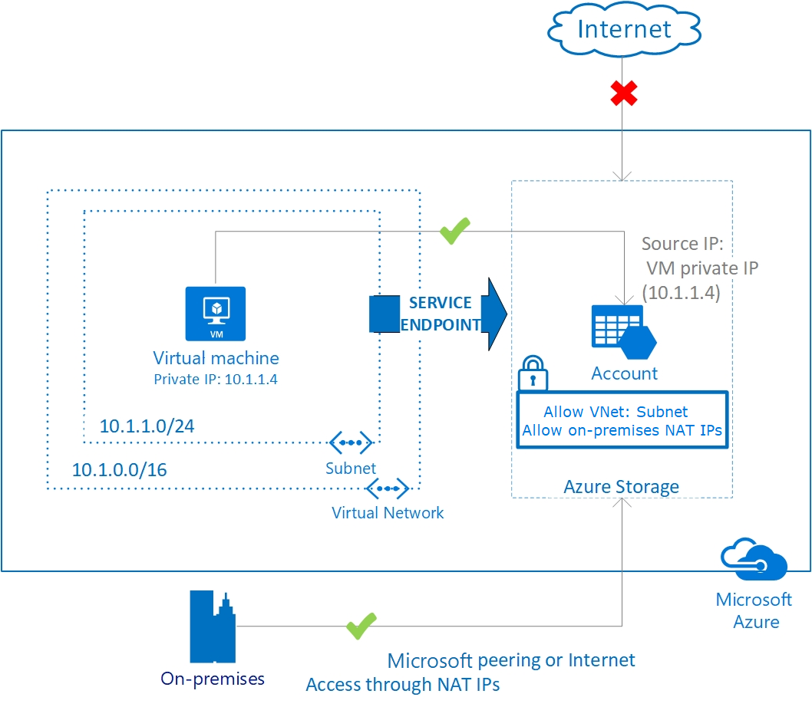

# Connectivity to Azure PaaS services

This article provides recommended connectivity approaches for using Azure PaaS services.

## Design considerations

- Azure PaaS services are, in their default configuration, generally accessed over publicly available endpoints via the Microsoft Global Network. Some customers may have requirements to reduce the usage of public endpoints, therefore the Azure platform provides optional capabilities for securing these endpoints or even making them entirely private.

  - Some PaaS services allow public access restrictions based on **Resource Instance** system-assigned managed identity E.g. [Azure Storage](/azure/storage/common/storage-network-security?tabs=azure-portal#grant-access-from-azure-resource-instances)

  - Many PaaS services allow public access restrictions based on **Trusted Azure Services** E.g. [Azure Container Registry](/azure/container-registry/allow-access-trusted-services#trusted-services)
  
  - **Virtual network injection** provides [dedicated private deployments](/azure/virtual-network/virtual-network-for-azure-services) for supported services. Management plane traffic still flows through public IP addresses.

  

  - Some PaaS services are compatible with [Azure **Private Link**](/azure/private-link/private-endpoint-overview#private-link-resource) which allows private access via an IP address within a customer. For more information, see [Key benefits of Private Link](/azure/private-link/private-link-overview#key-benefits).

  - [Virtual network **service endpoints**](/azure/virtual-network/virtual-network-service-endpoints-overview) provide service-level access from selected subnets to selected PaaS services. Azure Storage offers [Service Endpoint Policies](/azure/virtual-network/virtual-network-service-endpoint-policies-overview) which allow further restricting the use of Service Endpoints to specific Storage Account. It is also possible to utilize Network Virtual Appliances (NVA) to perform Layer-7 inspection and FQDN filtering in combination with Service Endpoints, but this approach comes with additional performance and scaling considerations.

> [What is the difference between service endpoints and private endpoints?](/azure/private-link/private-link-faq#what-is-the-difference-between-service-endpoints-and-private-endpoints-) offers an explanation of differences between Private Link endpoints and VNet service endpoints.

## Design recommendations

- For Azure PaaS services that support virtual network injection, if you require access to resources within your private network (either virtual networks or on-premises via a virtual network gateway), consider enabling the virtual network injection feature. Also consider that these services injected into a virtual network still perform management plane operations by using service specific public IP addresses. Connectivity must be guaranteed for the service to operate correctly. Use UDRs and NSGs to lock down this communication within the virtual network. You can use [Service Tags in UDR](/azure/virtual-network/virtual-networks-udr-overview#service-tags-for-user-defined-routes) to reduce the number of necessary routes and to override default routes if used.

- When data exfiltration protection and use of only Private IP addressing are firm requirements, consider the use of Azure Private Link [where available](/azure/private-link/private-link-overview#availability).

- Consider the use of virtual network service endpoints to secure access to Azure PaaS services from within your virtual network in scenarios where data exfiltration is less of a concern, Private Link is unavailable, or you have a requirement for large data ingest that requires cost optimization. (Azure Service Endpoints do not incur any costs, contrasted to Azure Private Link which includes a cost component based on per GB of network data).

- If access to Azure PaaS services is required from on-premises utilize the following options:

  -  Use the PaaS service's default public endpoint via the Internet and the Microsoft Global Network if no private access is required and the on-premises Internet bandwidth is sufficient.
  -  Use a private hybrid connection ([ExpressRoute with private peering](/azure/expressroute/expressroute-circuit-peerings#privatepeering) or Site-to-Site VPN) with either virtual network injection or Azure Private Link.

- Don't enable virtual network service endpoints by default on all subnets. Follow the above considered approach on a case-by-case basis dependent on the PaaS service feature availability and your own performance and security requirements.

- Where possible, avoid the use of forced tunneling (directing Internet-bound traffic from an Azure virtual network via on-premises by advertising a default route over a private hybrid connection) as this can increase the complexity of managing control-plane operations with some Azure PaaS services E.g. [Application Gateway V2](/azure/application-gateway/configuration-infrastructure).
