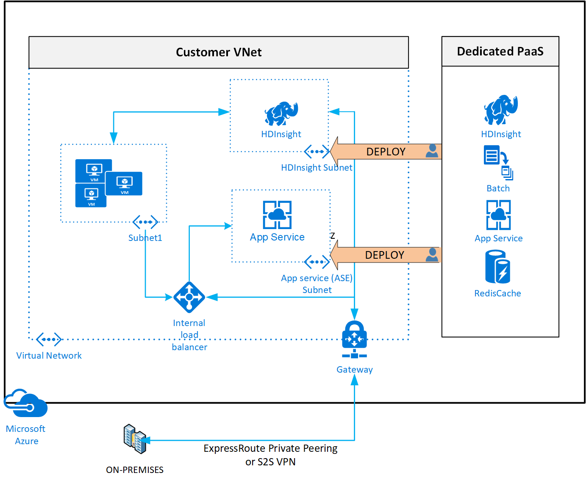

# Connectivity to Azure PaaS services

This article provides recommended connectivity approaches for using Azure PaaS services.

## Design considerations

- Azure PaaS services are typically accessed over public endpoints. The Azure platform provides capabilities for securing these endpoints or even making them entirely private.

  - Virtual network injection provides [dedicated private deployments](/azure/virtual-network/virtual-network-for-azure-services) for supported services. Management plane traffic still flows through public IP addresses.

  

  - [Azure Private Link](/azure/private-link/private-endpoint-overview#private-link-resource) provides dedicated access by using private IP addresses for Azure PaaS instances or custom services behind Azure Load Balancer Standard tier. For more information, see [Key benefits of Private Link](/azure/private-link/private-link-overview#key-benefits).

  - [Virtual network service endpoints](/azure/virtual-network/virtual-network-service-endpoints-overview) provide service-level access from selected subnets to selected PaaS services. Review the list of supported services at the link previously provided in this paragraph.

  - [What is the difference between service endpoints and private endpoints?](/azure/private-link/private-link-faq#what-is-the-difference-between-service-endpoints-and-private-endpoints-) offers an explanation of differences between Private Link endpoints and VNet service endpoints.

- Enterprises often have concerns about public endpoints for PaaS services that must be appropriately mitigated.

- For [supported services](/azure/private-link/private-link-overview#availability), Private Link addresses data exfiltration concerns associated with VNet service endpoints. As an alternative, you can use outbound filtering via network virtual appliances (NVAs) to provide steps to mitigate data exfiltration.

## Design recommendations

- Use virtual network injection for supported Azure services to make them available from within your virtual network.

- Azure PaaS services injected into a virtual network still perform management plane operations by using service specific public IP addresses. Connectivity must be guaranteed for the service to operate correctly. Use UDRs and NSGs to lock down this communication within the virtual network. You can use [Service Tags in UDR](/azure/virtual-network/virtual-networks-udr-overview#service-tags-for-user-defined-routes) to reduce the number of necessary routes and to override default routes if used.

- Use Private Link [where available](/azure/private-link/private-link-overview#availability) for shared Azure PaaS services. Private Link is generally available for several services, and is in public preview for other services.

- Access Azure PaaS services from on-premises through [ExpressRoute with private peering](/azure/expressroute/expressroute-circuit-peerings#privatepeering). Use either virtual network injection for dedicated Azure services or Azure Private Link for available shared Azure services. To access Azure PaaS services from on-premises when virtual network injection or Private Link isn't available, use [ExpressRoute with Microsoft peering](/azure/expressroute/expressroute-circuit-peerings#microsoftpeering), which lets you avoid transiting over the public internet.

  - Accessing Azure PaaS services from on-premises via ExpressRoute with Microsoft peering doesn't prevent access to the public endpoints of the PaaS service. You must configure and restrict that separately as required.

- Use virtual network service endpoints to secure access to Azure PaaS services from within your virtual network, but only when Private Link isn't available and there are no data exfiltration concerns. To address data exfiltration concerns with service endpoints, use NVA filtering or use virtual network service endpoint policies for Azure Storage.

- Don't enable virtual network service endpoints by default on all subnets.

- Unless you use NVA filtering, don't use virtual network service endpoints when there are data exfiltration concerns.

- Don't implement forced tunneling to enable communication from Azure to Azure resources.
