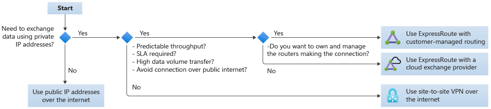
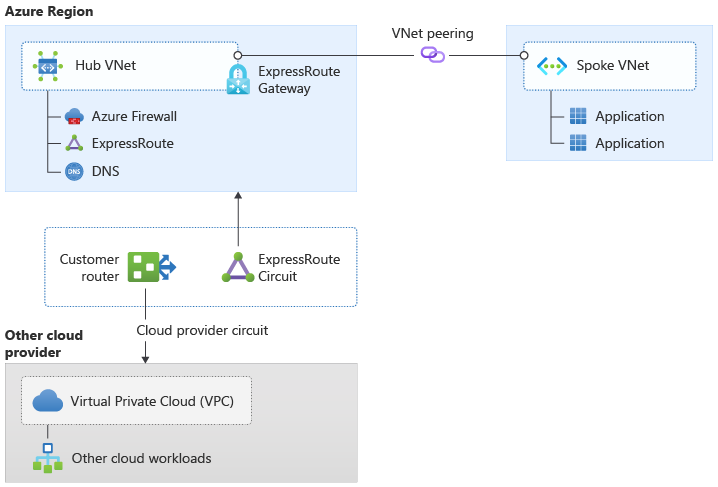
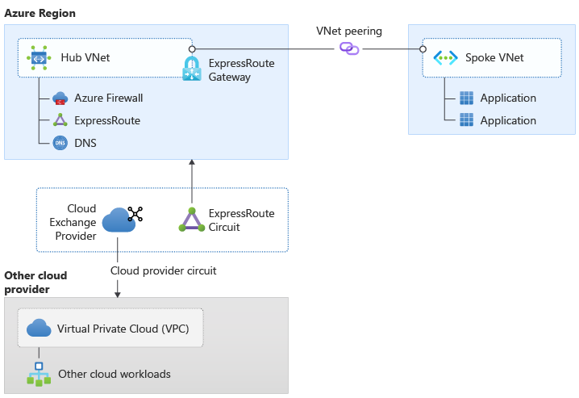
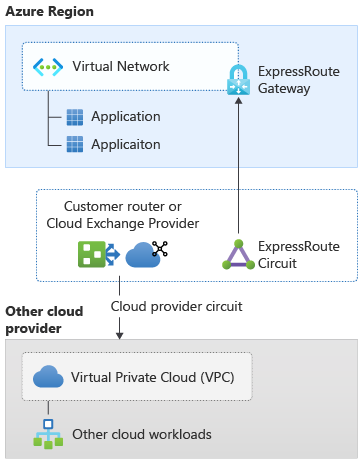
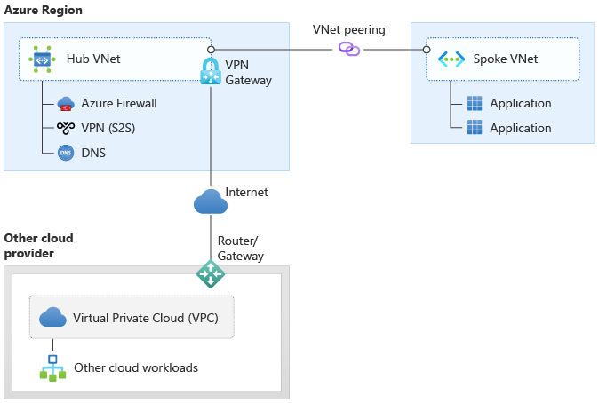

# Connectivity to other cloud providers

This guidance discusses ways to connect an Azure enterprise-scale landing zone architecture to other cloud providers, such as Amazon Web Services (AWS) and Google Cloud Platform (GCP).

The various options differ in speed, latency, reliability, service level agreements (SLAs), complexity, and costs. This article considers options and makes recommendations.

> [!Note]
> Microsoft and Oracle partnered to provide high-throughput, low-latency cross-connections between Azure and Oracle Cloud Infrastructure (OCI). For more information, see [Connectivity to Oracle Cloud Infrastructure](connectivity-to-other-providers-oci.md).

## Design considerations

- We consider the following options to connect Azure to another cloud:
  - **Option 1** - Connect Azure ExpressRoute and the other cloud provider's equivalent private connection. The customer manages routing.
  - **Option 2** - Connect ExpressRoute and the other cloud provider's equivalent private connection. A cloud exchange provider handles routing.
  - **Option 3** - Use site-to-site VPN over the Internet. For more information, see [Connect on-premises networks to Azure by using site-to-site VPN gateways (Learn)](/learn/modules/connect-on-premises-network-with-vpn-gateway/2-connect-on-premises-networks-to-azure-using-site-to-site-vpn-gateways).

   You can use the following cross-cloud connectivity flow chart as an aid to choosing an option:

    
    
    *Figure 1: Cross-cloud connectivity flow chart*

- You can only connect an Azure virtual network to another cloud provider's virtual private cloud (VPC) if the private IP address spaces don't overlap.
- Site-to-site VPN might have lower throughput and higher latency than the ExpressRoute options.
- Site-to-site VPN is the fastest deployment option if Azure ExpressRoute and the other cloud provider equivalent aren't already in use.
- Routing complexity of Azure ExpressRoute and other cloud provider equivalent with customer-managed routing can be high if not done through a cloud exchange     provider.
- You might need to provide DNS resolution between Azure and the other cloud provider. This configuration might incur extra costs.
- The FastPath feature of ExpressRoute improves data path performance between Azure and on-premises networks, and between Azure and other cloud providers. When enabled, FastPath sends network traffic directly to virtual machines in the virtual network, bypassing the ExpressRoute gateway. For more information, see [About ExpressRoute FastPath](/azure/expressroute/about-fastpath).
- FastPath is available on all ExpressRoute circuits.
- FastPath still requires a virtual network gateway to be created for route exchange purposes. The virtual network gateway must use either the Ultra Performance SKU or the ErGw3AZ SKU for the ExpressRoute gateway to enable route management.
- There are configurations that FastPath doesn't support, such as virtual network peering. For more information, see [Limitations](/azure/expressroute/about-fastpath#limitations) in About ExpressRoute FastPath.

## Design recommendations

- Use option 1 or option 2 to avoid use of the public internet, if you require an SLA, if you want predictable throughput, or need to handle heavy data traffic. Consider whether to use a customer-managed routing or a cloud exchange provider if you haven't implemented ExpressRoute already.
- Create the ExpressRoute circuits for option 1 and option 2 in the connectivity subscription.
- Use the ExpressRoute circuit of option 1 or option 2 to connect to the hub of a hub-and-spoke architecture, or to the hub virtual network or virtual WAN hub of an Azure virtual WAN-based network. For more information, see Figure 2 and Figure 3.

    
    
    *Figure 2: Cross-cloud connectivity with customer-managed routing (Option 1)*

    
    
    *Figure 3: Cross-cloud connectivity with a cloud exchange provider (Option 2)*

- If you need to minimize latency between Azure and another cloud provider, consider deploying your application in a single virtual network with an ExpressRoute gateway, and enable FastPath.

    )

    *Figure 4: Cross-cloud connectivity with FastPath enabled*

- If ExpressRoute isn't required or not available, you can use site-to-site VPN over the internet to connect between Azure and another cloud provider.

    

    *Figure 5: Cross-cloud connectivity using site-to-site VPN over the Internet*

## Next steps

To learn more about connectivity to Oracle Cloud Infrastructure (OCI), see [Connectivity to Oracle Cloud Infrastructure](connectivity-to-other-providers-oci.md).
