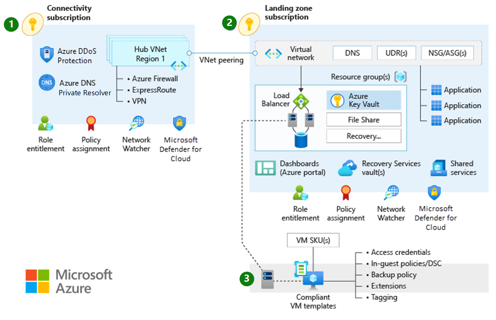

# Define an Azure network topology

Network topology is a critical element of the enterprise-scale architecture because it defines how applications can communicate with each other. This section explores technologies and topology approaches for Azure deployments. It focuses on two core approaches: topologies based on Azure Virtual WAN, and traditional topologies.

[Virtual WAN is used to meet large-scale interconnectivity requirements](../azure-best-practices/virtual-wan-network-topology.md). Because it is a Microsoft-managed service, it also reduces overall network complexity and helps to modernize your organization's network. A Virtual WAN topology may be most appropriate if any of the following points meet your requirements:

- Your organization intends to deploy resources across several Azure regions and requires global connectivity between VNets in these Azure regions and multiple on-premises locations.
- Your organization intends to integrate a large-scale branch network directly in to Azure, either via a software-defined WAN (SD-WAN) deployment or requires more than 30 branch sites for native IPsec termination.
- You require transitive routing between VPN and ExpressRoute. E.g. Remote branches connected via Site-to-site VPN or remote users connected via Point-to-site VPN, require connectivity to an ExpressRoute connected DC, via Azure.

[A traditional hub-and-spoke network topology](../azure-best-practices/traditional-azure-networking-topology.md) helps you build customized secure large-scale networks in Azure with routing and security managed by the customer. A traditional topology may be most appropriate if any of the following points meet your requirements:

- Your organization intends to deploy resources across one or several Azure regions and while some traffic across Azure regions is expected (for example, traffic between two virtual networks across two different Azure regions), a full mesh network across all Azure regions is not required.
- You have a low number of remote or branch locations per region. That is, you need fewer than 30 IPsec Site-to-Site tunnels.
- You require full control and granularity for manually configuring your Azure network routing policy.

## Virtual WAN network topology (Microsoft-managed)

*Figure 1: Virtual WAN network topology.*

## Traditional Azure networking topology

*Figure 2: A traditional Azure network topology.*
