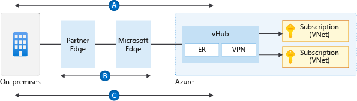

# Define network encryption requirements

This section explores key recommendations to achieve network encryption between on-premises and Azure as well as across Azure regions.

**Design considerations:**

- Cost and available bandwidth are inversely proportional to the length of the encryption tunnel between endpoints.

- When you're using a VPN to connect to Azure, traffic is encrypted over the internet via IPsec tunnels.

- When you're using ExpressRoute with private peering, traffic isn't currently encrypted.

- Configuring a Site-to-Site VPN connection over ExpressRoute private peering is now [in preview](/azure/vpn-gateway/site-to-site-vpn-private-peering).

- You can apply [media access control security (MACsec)](/azure/expressroute/expressroute-howto-MACsec) encryption to ExpressRoute Direct to achieve network encryption.

- When Azure traffic moves between datacenters (outside physical boundaries not controlled by Microsoft or on behalf of Microsoft), [MACsec data-link layer encryption](/azure/security/fundamentals/encryption-overview#encryption-of-data-in-transit) is used on the underlying network hardware. This is applicable to VNet peering traffic.

**Design recommendations:**

*Figure 1: Encryption flows.*

- When you're establishing VPN connections from on-premises to Azure by using VPN gateways, traffic is encrypted at a protocol level through IPsec tunnels. The preceding diagram shows this encryption in flow `A`.

- When you're using ExpressRoute Direct, configure [MACsec](/azure/expressroute/expressroute-howto-MACsec) in order to encrypt traffic at the layer-two level between your organization's routers and MSEE. The diagram shows this encryption in flow `B`.

- For Virtual WAN scenarios where MACsec isn't an option (for example, not using ExpressRoute Direct), use a Virtual WAN VPN gateway to establish [IPsec tunnels over ExpressRoute private peering](/azure/virtual-wan/vpn-over-expressroute). The diagram shows this encryption in flow `C`.

- For non-Virtual WAN scenarios, and where MACsec isn't an option (for example, not using ExpressRoute Direct), the only options are:

  - Use partner NVAs to establish IPsec tunnels over ExpressRoute private peering.
  - Establish a VPN tunnel over ExpressRoute with Microsoft peering.
  - Evaluate the capability to configure a Site-to-Site VPN connection over ExpressRoute private peering ([in preview](/azure/vpn-gateway/site-to-site-vpn-private-peering).

- If traffic between Azure regions must be encrypted, use global VNet peering to connect virtual networks across regions.

- If native Azure solutions (as shown in flows `B` and `C` in the diagram) don't meet your requirements, use partner NVAs in Azure to encrypt traffic over ExpressRoute private peering.
