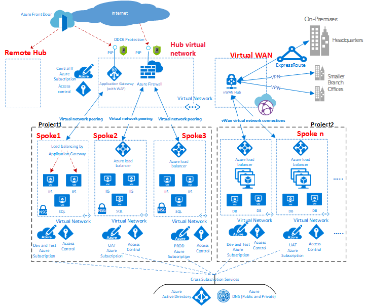

# Hub-and-spoke network topology

*Hub and spoke* is a networking model for efficiently managing common communication or security requirements. It also helps avoid Azure subscription limitations. This model addresses the following concerns:

- **Saving on costs and efficient management:** Centralize services that can be shared by multiple workloads, like network virtual appliances (NVAs) and DNS servers. With a single location for services, IT can minimize redundant resources and management effort.

- **Overcoming subscription limits:** Large cloud-based workloads might require using more resources than a single Azure subscription contains. Peering workload virtual networks from different subscriptions to a central hub can overcome these limits. For more information, see [Azure subscription limits](/azure/azure-resource-manager/management/azure-subscription-service-limits).

- **A separation of concerns:** You can deploy individual workloads between central IT teams and workload teams.

Smaller cloud estates might not benefit from the added structure and capabilities that this model offers. But larger cloud adoption efforts should consider implementing a hub-and-spoke networking architecture if they have any of the concerns listed previously.

> [!NOTE]
> The Azure reference architectures site contains example templates that you can use as the basis for implementing your own hub-and-spoke networks:
>
> - [Implement a hub-and-spoke network topology in Azure](/azure/architecture/reference-architectures/hybrid-networking/hub-spoke)
> - [Implement a hub-and-spoke network topology with shared services in Azure](/azure/architecture/reference-architectures/hybrid-networking/#hub-spoke-network-topology)

## Overview

*Figure 1: An example of a hub-and-spoke network topology.*

As shown in the diagram, Azure supports two types of hub-and-spoke design. It supports communication, shared resources, and centralized security policy (labeled as `VNet hub` in the diagram), or a design based on Azure Virtual WAN (labeled as `Virtual WAN` in the diagram) for large-scale branch-to-branch and branch-to-Azure communications.

A hub is a central network zone that controls and inspects ingress or egress traffic between zones: internet, on-premises, and spokes. The hub-and-spoke topology gives your IT department an effective way to enforce security policies in a central location. It also reduces the potential for misconfiguration and exposure.

The hub often contains the common service components that the spokes consume. Examples of common central services are:

- The Windows Server Active Directory infrastructure is required to authenticate third-party users who access untrusted networks before they access workloads in the spoke. It includes the related Active Directory Federation Services (AD FS).
- A DNS service resolves naming the workload in the spokes to access resources on-premises and on the internet if [Azure DNS](/azure/dns/dns-overview) isn't used.
- A public key infrastructure implements single sign-on for workloads.
- TCP and UDP traffic flow is controlled between the spoke network zones and the internet.
- Flow is controlled between the spokes and on-premises.
- Flow is controlled between one spoke and another, if needed.

You can minimize redundancy, simplify management, and reduce overall cost by using the shared hub infrastructure to support multiple spokes.

The role of each spoke can be to host different types of workloads. The spokes also provide a modular approach for repeatable deployments of the same workloads. Examples include dev/test, user acceptance testing, staging, and production.

The spokes can also segregate and enable different groups within your organization. An example is Azure DevOps groups. Inside a spoke, it's possible to deploy a basic workload or complex multitier workloads with traffic control between the tiers.

The Application Gateway shown in the diagram above can live in spoke with the application it's serving for better management and scale. However, corporate policy might dictate you place the Application Gateway in the hub for centralized management and segregation of duty.

## Subscription limits and multiple hubs

In Azure, every type of component is deployed in an Azure subscription. The isolation of Azure components in different Azure subscriptions can satisfy the requirements of different lines of business, such as setting up differentiated levels of access and authorization.

A single hub-and-spoke implementation can scale up to a large number of spokes, but as with every IT system, there are platform limits. The hub deployment is bound to a specific Azure subscription, which has restrictions and limits. One example is a maximum number of virtual network peerings. For more information, see [Azure subscription and service limits](/azure/azure-resource-manager/management/azure-subscription-service-limits).

When limits might be an issue, you can scale up the architecture by extending the model to a cluster of hubs and spokes. You can connect multiple hubs in one or more Azure regions by using:

- Virtual network peering
- Azure ExpressRoute
- Azure Virtual WAN
- Site-to-site VPN.

*Figure 2: A cluster of hubs and spokes.*

The introduction of multiple hubs increases the cost and management overhead of the system. This increase is only justified by:

- Scalability.
- System limits.
- Redundancy and regional replication for user performance or disaster recovery.

In scenarios that require multiple hubs, all of the hubs should strive to offer the same set of services for operational ease.

## Interconnection between spokes

It's possible to implement complex multitier workloads in a single spoke. You can implement multitier configurations by using subnets (one for every tier) in the same virtual network and by using network security groups to filter the flows.

An architect might want to deploy a multitier workload across several virtual networks. With virtual network peering, spokes can connect to other spokes in the same hub or in different hubs.

A typical example of this scenario is the case where application processing servers are in one spoke or virtual network. The database deploys in a different spoke or virtual network. In this case, it's easy to interconnect the spokes with virtual network peering and avoid transiting through the hub. Do a careful architecture and security review to ensure that bypassing the hub doesn't bypass important security or auditing points that are only in the hub.

*Figure 3: An example of spokes connecting to each other and a hub.*

Spokes can also be interconnected to a spoke that acts as a hub. This approach creates a two-level hierarchy: the spoke in the higher level (level 0) becomes the hub of lower spokes (level 1) of the hierarchy. The spokes are required to forward the traffic to the central hub. This requirement is so that the traffic can transit to its destination in either the on-premises network or the public internet. An architecture with two levels of hubs introduces complex routing that removes the benefits of a simple hub-and-spoke relationship.

## Next steps

Now that you've explored the best practices for networking, learn how to approach identity and access controls.

> [!div class="nextstepaction"]
> [Identity Management and access control security best practices](/azure/security/fundamentals/identity-management-best-practices)
