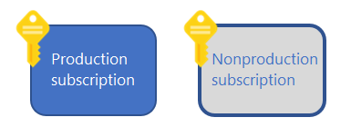
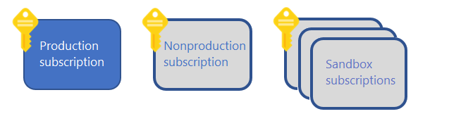
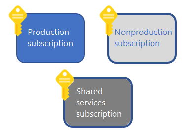

# Create your initial Azure subscriptions

Start your Azure adoption by creating an initial set of subscriptions. Learn what subscriptions you should begin with based on your initial requirements.

## Your first two subscriptions

Start by creating two subscriptions:

- Create one Azure subscription to contain your production workloads.
- Create a second subscription to serve as your nonproduction environment, using an [Azure Dev/Test offer](https://azure.microsoft.com/pricing/dev-test/) for lower pricing.

*Figure 1: An initial subscription model with keys next to boxes labeled "production" and "nonproduction".*

This approach has many benefits:

- Using separate subscriptions for your production and nonproduction environments creates a boundary that makes management of your resources simpler and safer.
- Azure Dev/Test subscription offerings are available for nonproduction workloads. These offerings provide discounted rates on Azure services and software licensing.
- Your production and nonproduction environments will likely have different sets of Azure policies. Using separate subscriptions makes it simple to apply each distinct policy at the subscription level.
- You can allow certain types of Azure resources in your nonproduction subscription for testing purposes. You can enable those resource providers in your nonproduction subscription without making them available in your production environment.
- You can use Azure Dev/Test subscriptions as isolated sandbox environments. These sandboxes allow administrators and developers to rapidly build up and tear down entire sets of Azure resources. This isolation can also help with data protection and security concerns.
- The acceptable cost thresholds that you define will likely vary between production and nonproduction environments.

## Sandbox subscriptions

If innovation goals are part of your cloud adoption strategy, consider creating one or more sandbox subscriptions. You can apply security policies to keep these test subscriptions isolated from your production and nonproduction environments. Users can easily experiment with Azure capabilities in these isolated environments. Use an Azure Dev/Test offer to create these subscriptions.

*Figure 2: A subscription model with sandbox subscriptions.*

## Shared services subscription

If you're planning to host **more than 1,000 VMs or compute instances in the cloud within 24 months**, create another Azure subscription to host shared services. This will prepare you to support your end-state enterprise architecture.

*Figure 3: A subscription model with shared services.*

## Next steps

Review the reasons why you might want to [create additional Azure subscriptions](./scale-subscriptions.md) to meet your requirements.

> [!div class="nextstepaction"]
> [Create additional subscriptions to scale your Azure environment](./scale-subscriptions.md)
