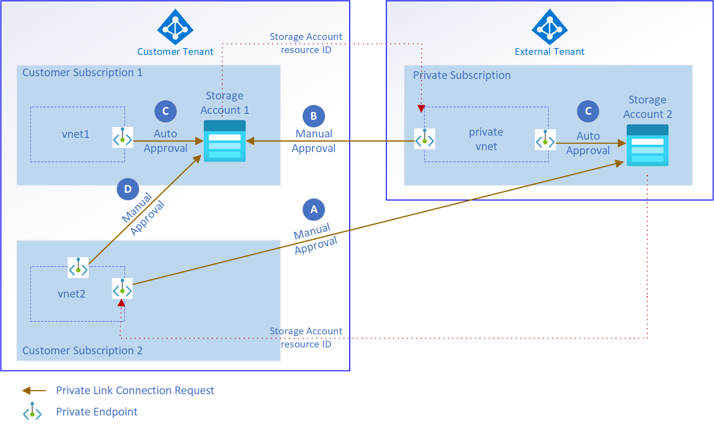

# Limit cross-tenant private endpoint connections in Azure

Customers are increasingly using private endpoints in their tenants to connect to their Azure platform as a service (PaaS) services privately and securely. Private endpoints can connect to services across Microsoft Entra tenants. For security and compliance, you might need to block cross Microsoft Entra tenants connections on your private endpoints. This guidance shows you recommended configuration options to limit or prevent cross-tenant private endpoint connections. These options help you create data leakage prevention (DLP) controls inside your Azure environment.

## Introduction to private endpoints

Use private endpoints to control the traffic within your Azure environment using an existing network perimeter. But there are scenarios where you must keep private endpoint connections within the corporate Microsoft Entra tenant only. The following examples show connections that might create security risks.

- **Connection A:** A rogue administrator creates private endpoints on the customer virtual network. These endpoints link to services that are hosted outside the customer environment, like another Microsoft Entra tenant.
- **Connection B:** A rogue administrator creates private endpoints in other Microsoft Entra tenants that link to services hosted in the customer's Microsoft Entra tenant.



*Figure 1: Illustration of private endpoint cross-tenant scenarios.*

For both scenarios, you specify the resource ID of the service and manually approve the private endpoint connection. Users also require role-based access control (RBAC) access to run these actions.

Connections C and D in Figure 1 show scenarios that customers generally want to allow. The private endpoint connections are kept within the corporate Microsoft Entra tenant. They don't represent a security risk so these two scenarios aren't covered in this article.

The following information gives you options to prevent private endpoints provisioning across Microsoft Entra tenants.

## Deny private endpoints linked to services in other tenants

**Scenario one**: A rogue administrator requires the following rights in a subscription in the customer's Microsoft Entra tenant.

- **Microsoft.Network/virtualNetworks/join/action** rights on a subnet with **privateEndpointNetworkPolicies** set to **Disabled**.
- **Microsoft.Network/privateEndpoints/write** access to a resource group in the customer environment.

With these rights, a rogue administrator can create a private endpoint in the customer's Microsoft Entra tenant. This private endpoint links to a service in a separate subscription and Microsoft Entra tenant. Figure 1 shows this scenario as connection A.

For this scenario, the user sets up an external Microsoft Entra tenant and Azure subscription. Next, they create a private endpoint in the customer environment by manually specifying the resource ID of the service. Finally, the rogue administrator approves the private endpoint on the linked service that's hosted in the external Microsoft Entra tenant to allow traffic over the connection.

After the rogue administrator approves the private endpoint connection, corporate data can be copied from the corporate virtual network to an Azure service on an external Microsoft Entra tenant. This security risk can only occur if access was granted using Azure RBAC.

### Mitigation for scenario one

Use the following [Azure Policy](https://github.com/Azure/data-management-zone/blob/main/infra/Policies/PolicyDefinitions/PrivateEndpoint/params.policyDefinition.Deny-PrivateEndpoint-PrivateLinkServiceConnections.json) to automatically block the ability to create a private endpoint in the corporate Microsoft Entra tenant that's linked to an outside Azure service.

```json
"if": {
    "allOf": [
        {
            "field": "type",
            "equals": "Microsoft.Network/privateEndpoints"
        },
        {
            "anyOf": [
                {
                    "count": {
                        "field": "Microsoft.Network/privateEndpoints/manualprivateLinkServiceConnections[*]",
                        "where": {
                            "allOf": [
                                {
                                    "field": "Microsoft.Network/privateEndpoints/manualprivateLinkServiceConnections[*].privateLinkServiceId",
                                    "notEquals": ""
                                },
                                {
                                    "value": "[split(concat(first(field('Microsoft.Network/privateEndpoints/manualprivateLinkServiceConnections[*].privateLinkServiceId')), '//'), '/')[2]]",
                                    "notEquals": "[subscription().subscriptionId]"
                                }
                            ]
                        }
                    },
                    "greaterOrEquals": 1
                },
                {
                    "count": {
                        "field": "Microsoft.Network/privateEndpoints/privateLinkServiceConnections[*]",
                        "where": {
                            "allOf": [
                                {
                                    "field": "Microsoft.Network/privateEndpoints/privateLinkServiceConnections[*].privateLinkServiceId",
                                    "notEquals": ""
                                },
                                {
                                    "value": "[split(concat(first(field('Microsoft.Network/privateEndpoints/privateLinkServiceConnections[*].privateLinkServiceId')), '//'), '/')[2]]",
                                    "notEquals": "[subscription().subscriptionId]"
                                }
                            ]
                        }
                    },
                    "greaterOrEquals": 1
                }
            ]
        }
    ]
},
"then": {
    "effect": "Deny"
}
```

This policy denies any private endpoints created outside of the subscription of the linked service, like connections A and D. The policy also provides the flexibility to use `manualPrivateLinkServiceConnections` and `privateLinkServiceConnections`.

You can update this policy so private endpoints are only created in a certain set of subscriptions. You can make this change by adding a `list` parameter and use the `"notIn": "[parameters('allowedSubscriptions')]"` construct. But this approach isn't recommended, because it means that you'd have to constantly maintain the list of subscriptions for this policy. Whenever a new subscription is created inside your tenant, the subscription ID must be added to the parameter.

Instead, assign the policy to the top-level management group, and then use exemptions where required.

### Considerations for scenario one

This policy blocks the ability to create private endpoints that are in a different subscription than the service itself. If these endpoints are required for certain use cases, use policy exemptions. Create more policies for Data Factory to make sure that managed private endpoints hosted on the managed virtual network can only connect to services hosted within your Microsoft Entra tenant.

## Deny connections from private endpoints created in other tenants

**Scenario two**: A rogue administrator requires **write** access on the service in the customer environment for which a private endpoint should be created.

With this right, a rogue administrator can create a private endpoint in an external Microsoft Entra tenant and subscription. This endpoint links to a service in the customer's Microsoft Entra tenant. Figure 1 shows this scenario as connection B.

In this scenario, the rogue administrator needs to first configure an external private Microsoft Entra tenant and Azure subscription. Next, they create a private endpoint in their environment by manually specifying the resource ID and group ID of the service in the corporate Microsoft Entra tenant. Finally, they approve the private endpoint on the linked service to allow traffic over the connection across Microsoft Entra tenants.

After the rogue administrator or service owner approves the private endpoint, data is accessed from the external virtual network.

### Mitigation for scenario two

Use service-specific policies to prevent this scenario across the customer tenant. Private endpoint connections are subresources of the respective services and show up under their properties section. Deny noncompliant connections by using the following [policy definition](https://github.com/Azure/data-management-zone/blob/main/infra/Policies/PolicyDefinitions/Storage/params.policyDefinition.Deny-Storage-PrivateEndpointConnections.json):

```json
"if": {
    "allOf": [
        {
            "field": "type",
            "equals": "Microsoft.Storage/storageAccounts/privateEndpointConnections"
        },
        {
            "field": "Microsoft.Storage/storageAccounts/privateEndpointConnections/privateLinkServiceConnectionState.status",
            "equals": "Approved"
        },
        {
            "anyOf": [
                {
                    "field": "Microsoft.Storage/storageAccounts/privateEndpointConnections/privateEndpoint.id",
                    "exists": false
                },
                {
                    "value": "[split(concat(field('Microsoft.Storage/storageAccounts/privateEndpointConnections/privateEndpoint.id'), '//'), '/')[2]]",
                    "notEquals": "[subscription().subscriptionId]"
                }
            ]
        }
    ]
},
"then": {
    "effect": "Deny"
}
```

This policy shows an example for Azure Storage. Replicate the same policy definition for other services like [Key Vault](https://github.com/Azure/data-management-zone/blob/main/infra/Policies/PolicyDefinitions/KeyVault/params.policyDefinition.Deny-KeyVault-PrivateEndpointConnections.json), [Azure AI Services](https://github.com/Azure/data-management-zone/blob/main/infra/Policies/PolicyDefinitions/CognitiveServices/params.policyDefinition.Deny-CognitiveServices-PrivateEndpointConnections.json), and [SQL Server](https://github.com/Azure/data-management-zone/blob/main/infra/Policies/PolicyDefinitions/Sql/params.policyDefinition.Deny-Sql-PrivateEndpointConnections.json).

To further improve manageability, bundle the service-specific policies into an initiative. The policy denies the approval of private endpoint connections to private endpoints that are hosted outside of the subscription of the respective service. It doesn't deny the rejection or removal of private endpoint connections, which is the behavior customers want. Auto-approval workflows, such as connection C, aren't affected by this policy.

But the approval of compliant private endpoint connections within the portal is blocked with this method. This block occurs because the portal UI doesn't send the resource ID of the connected private endpoint in their payload. It's recommended to use [Azure Resource Manager](https://github.com/Azure/data-management-zone/tree/main/infra/Policies/PolicyDefinitions/Storage/SampleDeployPrivateEndpointConnection), [Azure PowerShell](/powershell/module/az.network/approve-azprivateendpointconnection), or [Azure CLI](/cli/azure/network/private-link-service/connection#az_network_private_link_service_connection_update) to approve the private endpoint connection.

Also, assign the policy to the top-level management group and use exemptions where required.

### Considerations for scenario two

Azure Data Factory offers managed virtual networks and managed private endpoints. Because of these new capabilities, the policy blocks the secure and private usage of these services.

It's recommended that you use an **Audit** effect instead of a **Deny** effect in the policy definition you use in the [scenario two mitigation](#mitigation-for-scenario-two). This change helps you keep track of private endpoints being created in separate subscriptions and tenants. You can also use policy exemptions for the respective data platform scopes.

#### Azure Data Factory

To overcome [scenario one](#deny-private-endpoints-linked-to-services-in-other-tenants) on the managed virtual network of Azure Data Factory, use the following [policy definition](https://github.com/Azure/data-management-zone/blob/main/infra/Policies/PolicyDefinitions/DataFactory/params.policyDefinition.Deny-DataFactory-ManagedPrivateEndpoints.json):

```json
"if": {
    "allOf": [
        {
            "field": "type",
            "equals": "Microsoft.DataFactory/factories/managedVirtualNetworks/managedPrivateEndpoints"
        },
        {
            "anyOf": [
                {
                    "field": "Microsoft.DataFactory/factories/managedVirtualNetworks/managedPrivateEndpoints/privateLinkResourceId",
                    "exists": false
                },
                {
                    "value": "[split(field('Microsoft.DataFactory/factories/managedVirtualNetworks/managedPrivateEndpoints/privateLinkResourceId'), '/')[2]]",
                    "notEquals": "[subscription().subscriptionId]"
                }
            ]
        }
    ]
},
"then": {
    "effect": "[parameters('effect')]"
}
```

This policy denies managed private endpoints that are linked to services, which are hosted outside the subscription of the Data Factory. You can change this policy to allow connections to services hosted in a set of subscriptions by adding a `list` parameter and by using the `"notIn": "[parameters('allowedSubscriptions')]"` construct. We recommend this change for the data platform scope inside the tenant or environments where services with managed virtual networks and managed private endpoints are extensively used.

It's recommended that you assign this policy to the top-level management group and use exemptions where required. For the data platform, make these changes and assign the policy to the set of data platform subscriptions.

## Next steps

It's important to understand the recommended connectivity models for inbound and outbound connectivity to and from the public internet. The next article reviews design considerations, design recommendations, and recommended content for further reading.

> [!div class="nextstepaction"]
> [Inbound and outbound connectivity](../landing-zone/design-area/network-topology-and-connectivity.md)
