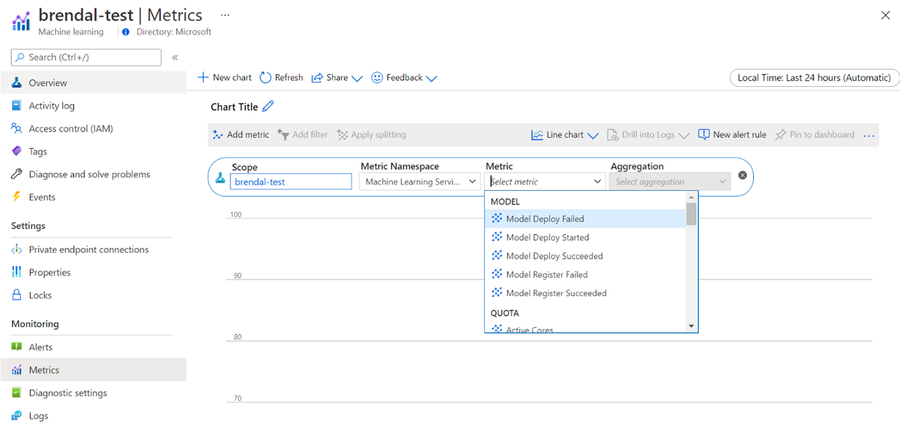

# Manage budgets, costs, and quota for Azure Machine Learning at organizational scale

When you manage compute costs incurred from Azure Machine Learning, at an organization scale with many workloads, many teams, and users, there are numerous management and optimization challenges to work through.

In this article, we present best practices to optimize costs, manage budgets, and share quota with Azure Machine Learning. It reflects the experience and lessons learned from running machine learning teams internally at Microsoft and while partnering with our customers. You'll learn how to:

- [Optimize compute resources to meet workload requirements](#optimize-compute-to-meet-workload-requirements).
- [Drive the best use of a team's budget](#drive-the-best-use-of-a-teams-budget).
- [Plan, manage and share budgets, cost, and quota at enterprise-scale](#plan-manage-and-share-budgets-cost-and-quota).

## Optimize compute to meet workload requirements

When you start a new machine learning project, exploratory work might be needed to get a good picture of compute requirements. This section provides recommendations on how you can determine the right virtual machine (VM) SKU choice for training, for inferencing, or as a workstation to work from.

### Determine the compute size for training

Hardware requirements for your training workload might vary from project to project. To meet these requirements, Azure Machine Learning compute [offers various types](/azure/machine-learning/concept-compute-target#supported-vm-series-and-sizes) of VMs:

- **General purpose:** Balanced CPU to memory ratio.
- **Memory optimized:** High memory to CPU ratio.
- **Compute optimized:** High CPU to memory ratio.
- **High performance compute:** Deliver leadership-class performance, scalability, and cost efficiency for various real-world HPC workloads.
- **Instances with GPUs:** Specialized virtual machines targeted for heavy graphic rendering and video editing, as well as model training and inferencing (ND) with deep learning.

You might not know yet what your compute requirements are. In this scenario, we recommend starting with either of the following cost effective default options. These options are for lightweight testing and for training workloads.

| **Type** | **Virtual machine size** | **Specs** |
| --- | --- | --- |
| CPU | Standard\_DS3\_v2 | 4 cores, 14 gigabytes (GB) RAM, 28-GB storage |
| GPU | Standard\_NC6 | 6 cores, 56 gigabytes (GB) RAM, 380-GB storage, NVIDIA Tesla K80 GPU |

To get the best VM size for your scenario, it might consist of trial and error. Here are several aspects to consider.

- If you need a CPU:
  - Use a [memory optimized](/azure/virtual-machines/sizes-memory) VM if you're training on large datasets.
  - Use a [compute optimized](/azure/virtual-machines/sizes-compute) VM if you're doing real-time inferencing or other latency sensitive tasks.
  - Use a VM with more cores and RAM in order to speed up training times.
- If you need a GPU:
  - Use a VM with a faster GPU in order to speed up training times. Here's the list of GPU-enabled VM families in order of speed:
    - [NC-series](/azure/virtual-machines/nc-series) (Nvidia Tesla K80)
    - [NV-series](/azure/virtual-machines/nv-series) (Nvidia Tesla M80)
    - [ND-series](/azure/virtual-machines/nd-series) (Nvidia Tesla P40)
    - [NCv2-series](/azure/virtual-machines/ncv2-series) (Nvidia Tesla P100)
    - [NCv3-series](/azure/virtual-machines/ncv3-series) (Nvidia Tesla V100)
    - [NDv2-series](/azure/virtual-machines/ndv2-series) (Nvidia Tesla V100 with NVLink connections)
    - [NCasT4\_v3-series](/azure/virtual-machines/nct4-v3-series) (Nvidia Tesla T4)
  - If you're doing distributed training, use VM sizes that have multiple GPUs.
  - If you're doing distributed training on multiple nodes, use GPUs that have NVLink connections.

While you select the VM type and SKU that best fits your workload, evaluate comparable VM SKUs as a trade-off between CPU and GPU performance and pricing. From a cost management perspective, a job might run reasonably well on several SKUs.

Certain GPUs such as the NC family, particularly NC\_Promo SKUs, have similar abilities to other GPUs such as low latency and ability to manage multiple computing workloads in parallel. They're available at discounted prices compared to some of the other GPUs. Considerately selecting VM SKUs to the workload might save cost significantly in the end.

A reminder on the importance for utilization is to sign up for a greater number of GPUs doesn't necessarily execute with faster results. Instead, make sure the GPUs are fully utilized. For example, double check the need for NVIDIA CUDA. While it might be required for high-performance GPU execution, your job might not take a dependency on it.

### Determine the compute size for inference

Compute requirements for inference scenarios differ from training scenarios. Available options differ based on whether your scenario demands offline inference in batch or requires online inference in real time.

For real-time inference scenarios consider the following suggestions:

- Use [profiling capabilities](/azure/machine-learning/how-to-deploy-profile-model?pivots=py-sdk) on your model with Azure Machine Learning to determine how much CPU and memory you need to allocate for the model when deploying it as a web service.
- If you're doing real-time inference but don't need high availability, deploy to [Azure Container Instances](/azure/machine-learning/how-to-deploy-azure-container-instance) (no SKU selection).
- If you're doing real-time inference but need high availability, deploy to [Azure Kubernetes Service](/azure/machine-learning/how-to-deploy-azure-kubernetes-service?tabs=python).
  - If you're using traditional machine learning models and receive < 10 queries/second, start with a CPU SKU. F-series SKUs often work well.
  - If you're using deep learning models and receive > 10 queries/second, try a NVIDIA GPU SKU (NCasT4\_v3 often works well) [with Triton](/azure/machine-learning/how-to-deploy-with-triton?tabs=python).

For batch inference scenarios consider the following suggestions:

- When you use Azure Machine Learning pipelines for batch inferencing, follow the guidance in [Determine the compute size for training](#determine-the-compute-size-for-training) to choose your initial VM size.
- Optimize cost and performance by scaling horizontally. One of the key methods of optimizing cost and performance is by parallelizing the workload with the help of [parallel run step](/python/api/azureml-pipeline-steps/azureml.pipeline.steps.parallelrunstep) in Azure Machine Learning. This pipeline step allows you to use many smaller nodes to execute the task in parallel, which allows you to scale horizontally. There's an overhead for parallelization though. Depending on the workload and the degree of parallelism that can be achieved, a parallel run step may or may not be an option.

### Determine the size for compute instance

For interactive development, Azure Machine Learning's compute instance is recommended. The compute instance (CI) offering brings single node compute that's bound to a single user and can be used as a cloud workstation.

Some organizations disallow the use of production data on local workstations, have enforced restrictions to the workstation environment, or restrict the installation of packages and dependencies in the corporate IT environment. A compute instance can be used as a workstation to overcome the limitation. It offers a secure environment with production data access, and runs on images that come with popular packages and tools for data science pre-installed.

When compute instance is running, user is billed for VM compute, Standard Load Balancer (included lb/outbound rules, and data processed), OS disk (Premium SSD managed P10 disk), temp disk (the temp disk type depends on the VM size chosen), and public IP address. To save costs, we recommend users consider:

- Start and stop the compute instance when it's not in use.
- Work with a sample of your data on a compute instance and scale out to compute clusters to work with your full set of data
- Submit experimentation jobs in *local* compute target mode on the compute instance while developing or testing, or when you switch to shared compute capacity when you submit jobs at full scale. For example, many epochs, full set of data, and hyperparameter search.

If you stop the compute instance, it stops billing for VM compute hours, temp disk, and Standard Load Balancer data processed costs.  Note user still pays for OS disk and Standard Load Balancer included lb/outbound rules even when compute instance is stopped. Any data saved on OS disk is persisted through stop and restarts.

### Tune the chosen VM size by monitoring compute utilization

You can view information on your Azure Machine Learning compute usage and utilization via Azure Monitor. You can view details on model deployment and registration, quota details such as active and idle nodes, run details such as canceled and completed runs, and compute utilization for GPU and CPU utilization.

Based on the insights from the monitoring details, you can better plan or adjust your resource usage across the team. For example, if you notice many idle nodes over the past week, you can work with the corresponding workspace owners to update the compute cluster configuration to prevent this extra cost. Benefits of analyzing the utilization patterns can help with forecasting costs and budget improvements.

You can access these metrics directly from the Azure portal. Go to your Azure Machine Learning workspace, and select *Metrics* under the monitoring section on the left panel. Then, you can select details on what you would like to view, such as metrics, aggregation, and time period. For more information, see [Monitor Azure Machine Learning](/azure/machine-learning/monitor-azure-machine-learning) documentation page.

### Switch between local, single-node, and multi-node cloud compute while you develop

There are varying compute and tooling requirements throughout the machine learning lifecycle. Azure Machine Learning can be interfaced with through an SDK and CLI interface from practically any preferred workstation configuration to meet these requirements.

To save costs and work productively, it's recommended to:

- Clone your experimentation code base locally by using Git and submit jobs to cloud compute using the Azure Machine Learning SDK or CLI.
- If your dataset is large, consider managing a sample of your data on your local workstation, while keeping the full dataset on cloud storage.
- Parameterize your experimentation code base so that you can configure your jobs to run with a varying number of epochs or on datasets of different sizes.
- Don't hard code the folder path of your dataset. You can then easily reuse the same code base with different datasets, and under local and cloud execution context.
- Bootstrap your experimentation jobs in *local* compute target mode while you develop or test, or when you switch to a shared compute cluster capacity when you submit jobs at full scale.
- If your dataset is large, work with a sample of data on your local or compute instance workstation, while scaling to cloud compute in Azure Machine Learning to work with your full set of data.
- When your jobs take a long time to execute, consider optimizing your code base for distributed training to allow for scaling out horizontally.
- Design your distributed training workloads for node elasticity, to allow flexible use of single-node and multi-node compute, and ease usage of compute that can be preempted.

### Combine compute types using Azure Machine Learning pipelines

When you orchestrate your machine learning workflows, you can define a pipeline with multiple steps. Each step in the pipeline can run on its own compute type. This allows you to optimize performance and cost to meet varying compute requirements across the machine learning lifecycle.

## Drive the best use of a team's budget

While budget allocation decisions might be out of the span of control of an individual team, a team is typically empowered to use their allocated budget to their best needs. By trading off job priority versus performance and cost wisely, a team can achieve higher cluster utilization, lower overall cost, and use a larger number of compute hours from the same budget. This can result in enhanced team productivity.

### Optimize the costs of shared compute resources

The key to optimize costs of shared compute resources is to ensure that they're being used to their full capacity. Here are some tips to optimize your shared resource costs:

- When you use compute instances, only turn them on when you have code to execute. Shut them down when they aren't being used.
- When you use compute clusters, set the minimum node count to 0 and the maximum node count to a number that is evaluated based on your budget constraints. Use the [Azure pricing calculator](https://azure.microsoft.com/pricing/calculator/) to calculate the cost of full utilization of one VM node of your chosen VM SKU. Autoscaling will scale down all the compute nodes when there's no one using it. It will only scale up to the number of nodes you have budget for. You can configure [autoscaling](/python/api/azureml-core/azureml.core.compute.amlcompute.scalesettings) to scale down all the compute nodes.
- Monitor your resource utilizations such as CPU utilization and GPU utilization when training models. If the resources aren't being fully used, modify your code to better use resources or scale down to smaller or cheaper VM sizes.
- Evaluate whether you can create shared compute resources for your team to avoid computing inefficiencies caused by cluster scaling operations.
- Optimize compute cluster autoscaling timeout policies based on usage metrics.
- Use workspace quotas to control the amount of compute resources that individual workspaces have access to.

### Introduce scheduling priority by creating clusters for multiple VM SKUs

Acting under quota and budget constraints, a team must trade off timely execution of jobs versus cost, to ensure important jobs run timely and a budget is used in the best way possible.

To support best compute utilization, teams are recommended to create clusters of various sizes and with *low priority* and *dedicated* VM priorities. Low-priority computes make use of surplus capacity in Azure and hence come with discounted rates. On the downside, these machines can be preempted anytime a higher priority ask comes in.

Using the clusters of varying size and priority, a notion of scheduling priority can be introduced. For example, when experimental and production jobs compete for the same *NC* GPU-quota, a production job might have preference to run over the experimental job. In that case, run the production job on the dedicated compute cluster, and the experimental job on the low priority compute cluster. When quota falls short, the experimental job will be preempted in favor of the production job.

Next to VM priority, consider running jobs on various VM SKUs. It might be that a job takes longer to execute on a VM instance with a P40 GPU than on a V100 GPU. However, since V100 VM instances might be occupied or quota fully used, the time to completion on the P40 might still be faster from a job throughput perspective. You might also consider running jobs with lower priority on less performant and cheaper VM instances from a cost management perspective.

### Early-terminate a run when training doesn't converge

When you continuously experiment to improve a model against its baseline, you might be executing various experiment runs, each with slightly different configurations. For one run, you might tweak the input datasets. For another run, you might make a hyperparameter change. Not all changes might be as effective as the other. You detect early that a change didn't have the intended affect on the quality of your model training. To detect if training does not converge, monitor training progress during a run. For example, by logging performance metrics after each training epoch. Consider early terminating the job to free up resources and budget for another trial.

## Plan, manage and share budgets, cost, and quota

As an organization grows its number of machine learning use cases and teams, it requires an increased operating maturity from IT and finance as well as coordination between individual machine learning teams to ensure efficient operations. Company-scale capacity and quota management become important to address scarceness of compute resources and overcome management overhead.

This section discusses best practices for planning, managing, and sharing budgets, cost, and quota at enterprise-scale. It's based on learnings from managing many GPU training resources for machine learning internally at Microsoft.

### Understanding resource spend with Azure Machine Learning

One of the biggest challenges as an administrator for planning compute needs is starting new with no historical information as a baseline estimate. On a practical sense, most projects will start from a small budget as a first step.

To understand where the budget is going, it's critical to know where Azure Machine Learning costs come from:

- Azure Machine Learning only charges for compute infrastructure used and doesn't add a surcharge on compute costs.
- When an Azure Machine Learning workspace is created, there are also a few other resources created to enable Azure Machine Learning: Key Vault, Application Insights, Azure Storage, and Azure Container Registry. These resources are used in Azure Machine Learning and you'll pay for these resources.
- There are costs associated with managed compute such as training clusters, compute instances, and managed inferencing endpoints. With these managed compute resources, there are the following infrastructure costs to account for: virtual machines, virtual network, load balancer, bandwidth, and storage.

### Govern and restrict compute usage by policy

When you manage an Azure environment with many workloads, it can be a challenge to keep the overview on resource spend. [Azure Policy](/azure/governance/policy/overview) can help control and govern resource spend, by restricting particular usage patterns across the Azure environment.

In specific for Azure Machine Learning, we recommend setting up policies to allow only for usage of specific VM SKUs. Policies can help prevent and control selection of expensive VMs. Policies can also be used to enforce usage of low-priority VM SKUs.

### Allocate and manage quota based on business priority

Azure allows you to set limits for quota allocation on a subscription and Azure Machine Learning workspace level. Restricting who can manage quota through [Azure role-based access control (RBAC)](/azure/role-based-access-control/overview) can help ensure resource utilization and cost predictability.

Availability of GPU quota can be scarce across your subscriptions. To ensure high quota utilization across workloads, we recommend monitoring whether quota is best used and assigned across workloads.

At Microsoft, it's determined periodically whether GPU quotas are best used and allocated across machine learning teams by evaluating capacity needs against business priority.

### Commit capacity ahead of time

If you have a good estimate of how much compute will be used in the next year or next few years, you can purchase Azure Reserved VM Instances at a discounted cost. There are one-year or three-year purchase terms. Because Azure Reserved VM Instances are discounted, there can be significant cost savings compared to pay-as-you go prices.

Azure Machine Learning supports reserved compute instances. Discounts are automatically applied against Azure Machine Learning managed compute.

### Manage data retention

Every time a machine learning pipeline is executed, intermediate datasets can be generated at each pipeline step for data caching and reuse. The growth of data as an output of these machine learning pipelines can become a pain point for an organization that is running many machine learning experiments.

Data scientists typically don't spend their time to clean up the intermediate datasets that are generated. Over time, the amount of data that is generated will add up. Azure Storage comes with a capability to enhance the management of the data lifecycle. Using [Azure Blob Storage lifecycle management](/azure/storage/blobs/storage-lifecycle-management-concepts?tabs=azure-portal), you can set up general policies to move data that is unused into colder storage tiers and save costs.

### Infrastructure cost optimization considerations

#### Networking

Azure networking cost is incurred from outbound bandwidth from Azure datacenter. All inbound data to an Azure datacenter is free. The key to reduce network cost is to deploy all your resources in the same datacenter region whenever possible. If you can deploy Azure Machine Learning workspace and compute in the same region that has your data, you can enjoy lower cost and higher performance.

You might want to have private connection between your on-premises network and your Azure network to have a hybrid cloud environment. ExpressRoute enables you to do that but considering the high cost of ExpressRoute, it might be more cost effective to move away from a hybrid cloud setup and move all resources to Azure cloud.

#### Azure Container Registry

For Azure Container Registry, the determining factors for cost optimization include:

- Required throughput for Docker image downloads from the container registry to Azure Machine Learning
- Requirements for enterprise security features, such as Azure Private Link

For production scenarios where high throughput or enterprise security is required, the Premium SKU of Azure Container Registry is recommended.

For dev/test scenarios where throughput and security are less critical, we recommend either Standard SKU or Premium SKU.

The Basic SKU of Azure Container Registry isn't recommended for Azure Machine Learning. It's not recommended because of its low throughput and low included storage, which can be quickly exceeded by Azure Machine Learning's relatively large sized (1+ GB) Docker images.

#### Consider computing type availability when choosing Azure regions

When you [pick a region for your compute](https://azure.microsoft.com/global-infrastructure/services/?products=virtual-machines), keep the compute quota availability in mind. Popular and larger regions such as East US, West US, and West Europe tend to have higher default quota values and greater availability of most CPUs and GPUs, compared to some other regions with stricter capacity restrictions in place.

## Learn more

[Track costs across business units, environments, or projects by using the Cloud Adoption Framework](./track-costs.md)

## Next steps

To learn more about how to organize and set up Azure Machine Learning environments, see [Organize and set up Azure Machine Learning environments](./ai-machine-learning-resource-organization.md).
> [!div class="nextstepaction"]
> [Organize and set up Azure Machine Learning environments](./ai-machine-learning-resource-organization.md)

To learn about best practices on Machine Learning DevOps with Azure Machine Learning, see [Machine learning DevOps guide](./ai-machine-learning-mlops.md).
> [!div class="nextstepaction"]
> [Machine learning DevOps guide](./ai-machine-learning-mlops.md)
