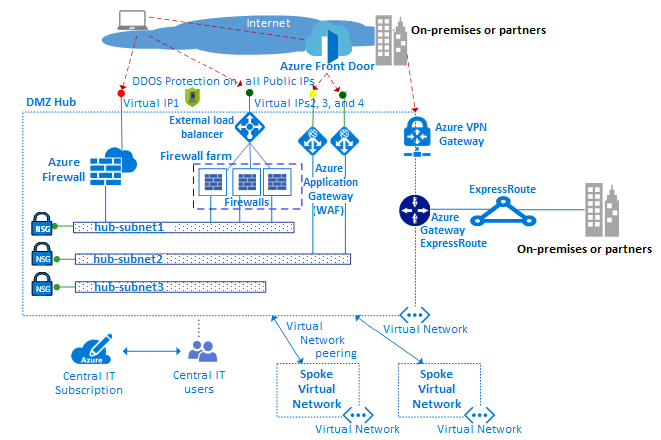

# Perimeter networks

[Perimeter networks][perimeter-network] enable secure connectivity between your cloud networks and your on-premises or physical datacenter networks, along with any connectivity to and from the internet. A perimeter network is sometimes called a demilitarized zone or DMZ.

For perimeter networks to be effective, incoming packets must flow through security appliances hosted in secure subnets before reaching back-end servers. Examples include the firewall, intrusion detection systems, and intrusion prevention systems. Before they leave the network, internet-bound packets from workloads should also flow through the security appliances in the perimeter network. The purposes of this flow are policy enforcement, inspection, and auditing.

Perimeter networks make use of the following Azure features and services:

- [Virtual networks][virtual-networks], [user-defined routes][user-defined-routes], and [network security groups][network-security-groups]
- [Network virtual appliances (NVAs)][network-virtual-appliances]
- [Azure Load Balancer][alb]
- [Azure Application Gateway][appgw] and [Web Application Firewall (WAF)][appgwwaf]
- [Public IPs][public-ip]
- [Azure Front Door][afd] with [Web Application Firewall][afdwaf]
- [Azure Firewall][azure-firewall]

> [!NOTE]
> Azure reference architectures provide example templates that you can use to implement your own perimeter networks:
>
> - [Implement a perimeter network between Azure and your on-premises datacenter](/azure/architecture/reference-architectures/dmz/secure-vnet-dmz)
> - [Implement a perimeter network between Azure and the internet](/azure/architecture/reference-architectures/dmz/secure-vnet-dmz?toc=/azure/cloud-adoption-framework/toc.json&bc=/azure/cloud-adoption-framework/_bread/toc.json)

Usually, your central IT team and security teams are responsible for defining requirements for operating your perimeter networks.

*Figure 1: Example of a hub and spoke network topology.*

The diagram above shows an example [hub and spoke network topology](./hub-spoke-network-topology.md) that implements enforcement of two perimeters with access to the internet and an on-premises network. Both perimeters reside in the DMZ hub. In the DMZ hub, the perimeter network to the internet can scale up to support many lines of business via multiple farms of WAFs and Azure Firewall instances that help protect the spoke virtual networks. The hub also allows for connectivity via VPN or Azure ExpressRoute as needed.

## Virtual networks

Perimeter networks are typically built using a [virtual network][virtual-networks] with multiple subnets to host the different types of services that filter and inspect traffic to or from the internet via NVAs, WAFs, and Azure Application Gateway instances.

## User-defined routes

By using [user-defined routes][user-defined-routes], customers can deploy firewalls, intrusion detection systems, intrusion prevention systems, and other virtual appliances. Customers can then route network traffic through these security appliances for security boundary policy enforcement, auditing, and inspection. User-defined routes can be created to guarantee that traffic passes through the specified custom VMs, NVAs, and load balancers.

In a hub and spoke network example, guaranteeing that traffic generated by virtual machines that reside in the spoke passes through the correct virtual appliances in the hub requires a user-defined route defined in the subnets of the spoke. This route sets the front-end IP address of the internal load balancer as the next hop. The internal load balancer distributes the internal traffic to the virtual appliances (load balancer back-end pool).

## Azure Firewall

[Azure Firewall][azure-firewall] is a managed cloud-based service that helps protect your Azure Virtual Network resources. It's a fully stateful managed firewall with built-in high availability and unrestricted cloud scalability. You can centrally create, enforce, and log application and network connectivity policies across subscriptions and virtual networks.

Azure Firewall uses a static public IP address for your virtual network resources. It allows outside firewalls to identify traffic that originates from your virtual network. The service interoperates with Azure Monitor for logging and analytics.

## Network virtual appliances

Perimeter networks with access to the internet are typically managed through an Azure Firewall instance or a farm of firewalls or [web application firewalls][afdwaf].

Different lines of business commonly use many web applications. These applications tend to suffer from various vulnerabilities and potential exploits. A Web Application Firewall detects attacks against web applications (HTTP/S) in more depth than a generic firewall. Compared with tradition firewall technology, web application firewalls have a set of specific features to help protect internal web servers from threats.

An Azure Firewall instance and a [network virtual appliance][nva] firewall use a common administration plane with a set of security rules to help protect the workloads hosted in the spokes and control access to on-premises networks. Azure Firewall has built-in scalability, whereas NVA firewalls can be manually scaled behind a load balancer.

A firewall farm typically has less specialized software compared with a WAF, but it has a broader application scope to filter and inspect any type of traffic in egress and ingress. If you use an NVA approach, you can find and deploy the software from the Azure Marketplace.

Use one set of Azure Firewall instances (or NVAs) for traffic that originates on the internet and another set for traffic that originates on-premises. Using only one set of firewalls for both is a security risk because it provides no security perimeter between the two sets of network traffic. Using separate firewall layers reduces the complexity of checking security rules and makes clear which rules correspond to which incoming network requests.

## Azure Load Balancer

[Azure Load Balancer][alb] offers a high-availability Layer 4 (TCP/UDP) service, which can distribute incoming traffic among service instances defined in a load-balanced set. Traffic sent to the load balancer from front-end endpoints (public IP endpoints or private IP endpoints) can be redistributed with or without address translation to a pool of back-end IP addresses (such as NVAs or VMs).

Azure Load Balancer can also probe the health of the various server instances. When an instance fails to respond to a probe, the load balancer stops sending traffic to the unhealthy instance.

As an example of using a hub and spoke network topology, you can deploy an external load balancer to both the hub and the spokes. In the hub, the load balancer efficiently routes traffic to services in the spokes. In the spokes, load balancers manage application traffic.

## Azure Front Door

[Azure Front Door][afd] is Microsoft's highly available and scalable web application acceleration platform and global HTTPS load balancer. You can use Azure Front Door to build, operate, and scale out your dynamic web application and static content. It runs in more than 100 locations at the edge of Microsoft's global network.

Azure Front Door provides your application with unified regional/stamp maintenance automation, BCDR automation, unified client/user information, caching, and service insights. The platform offers performance, reliability, and support SLAs. It also offers compliance certifications and auditable security practices that are developed, operated, and supported natively by Azure.

## Azure Application Gateway

[Azure Application Gateway][appgw] is a dedicated virtual appliance that provides a managed application delivery controller. It offers various Layer 7 load-balancing capabilities for your application.

<!-- docutune:casing "the application gateway" "single application gateway" -->

Azure Application Gateway allows you to optimize web farm productivity by offloading CPU-intensive SSL termination to the application gateway. It also provides other Layer 7 routing capabilities, including round-robin distribution of incoming traffic, cookie-based session affinity, URL path-based routing, and the ability to host multiple websites behind a single application gateway.

The Azure Application Gateway WAF SKU includes a Web Application Firewall. This SKU provides protection to web applications from common web vulnerabilities and exploits. You can configure Azure Application Gateway as an internet-facing gateway, an internal-only gateway, or a combination of both.

## Public IPs

With some Azure features, you can associate service endpoints to a [public IP][public-ip] address so that your resource can be accessed from the internet. This endpoint uses network address translation (NAT) to route traffic to the internal address and port on the Azure virtual network. This path is the primary way for external traffic to pass into the virtual network. You can configure public IP addresses to determine what traffic is passed in, and how and where it's translated onto the virtual network.

## Azure DDoS Protection Standard

[Azure DDoS Protection Standard][ddos] provides additional mitigation capabilities over the [basic service][ddos] tier that are tuned specifically to Azure Virtual Network resources. DDoS protection standard is simple to enable and requires no application changes.

You can tune protection policies through dedicated traffic monitoring and machine-learning algorithms. Policies are applied to public IP addresses associated to resources deployed in virtual networks. Examples include Azure Load Balancer, Application Gateway, and Service Fabric instances.

Real-time telemetry is available through Azure Monitor views both during an attack and for historical purposes. You can add application-layer protection by using the Web Application Firewall in Azure Application Gateway. Protection is provided for IPv4 Azure public IP addresses.

<!-- links -->

[virtual-networks]: /azure/virtual-network/virtual-networks-overview
[network-security-groups]: /azure/virtual-network/virtual-network-vnet-plan-design-arm
[user-defined-routes]: /azure/virtual-network/virtual-networks-udr-overview
[network-virtual-appliances]: /azure/architecture/reference-architectures/dmz/nva-ha
[azure-firewall]: /azure/firewall/overview
[perimeter-network]: ../../reference/networking-vdc.md
[alb]: /azure/load-balancer/load-balancer-overview
[ddos]: /azure/ddos-protection/ddos-protection-overview
[public-ip]: /azure/virtual-network/virtual-network-public-ip-address
[afd]: /azure/frontdoor/front-door-overview
[afdwaf]: /azure/web-application-firewall/afds/afds-overview
[appgw]: /azure/application-gateway/overview
[appgwwaf]: /azure/web-application-firewall/ag/ag-overview
