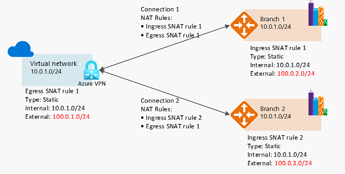

<!-- docutune:ignore "Azure VPN Gateway" -->

# Plan for IP addressing

It's vital that your organization plans for IP addressing in Azure to ensure that the IP address space doesn't overlap across on-premises locations and Azure regions.

**Design considerations:**

- Overlapping IP address spaces across on-premises and Azure regions will create major contention challenges.

- Azure VPN Gateway offers the possibility to connect overlapping on-premises sites with overlapping IP address spaces through NAT (Network Address Translation) capability. This is feature is generally available in [Azure Virtual WAN](/azure/virtual-wan/nat-rules-vpn-gateway) and in preview for standalone [Azure VPN Gateway](/azure/vpn-gateway/nat-howto).

  

- You can add address space after you create a virtual network. This process no longer requires an outage if the virtual network is already connected to another virtual network via virtual network peering. Instead each remote peering needs a [re-sync operation](/azure/architecture/networking/prefixes/add-ip-space-peered-vnet) performed after the network space has changed.

- Azure [reserves five IP addresses](/azure/virtual-network/virtual-networks-faq#are-there-any-restrictions-on-using-ip-addresses-within-these-subnets) within each subnet. Factor in those addresses when you're sizing virtual networks and encompassed subnets.

- Some Azure services require [dedicated subnets](/azure/virtual-network/virtual-network-for-azure-services#services-that-can-be-deployed-into-a-virtual-network). These services include Azure Firewall and Azure VPN Gateway.

- You can delegate subnets to certain services to create instances of a service within the subnet.

**Design recommendations:**

- Plan for non-overlapping IP address spaces across Azure regions and on-premises locations well in advance.

- Use IP addresses from the address allocation for private internets (RFC 1918).

- Don't use the following address ranges:
  - 224.0.0.0/4 (Multicast)
  - 255.255.255.255/32 (Broadcast)
  - 127.0.0.0/8 (Loopback)
  - 169.254.0.0/16 (Link-local)
  - 168.63.129.16/32 (Internal DNS)

- For environments that have limited availability of private IP addresses (RFC 1918), consider using IPv6. VNets can be IPv4-only or dual stack [IPv4+IPv6](/azure/virtual-network/ip-services/ipv6-overview).

  

- Don't create unnecessarily large virtual networks (for example, `/16`) to ensure that IP address space isn't wasted. The smallest supported IPv4 subnet is /29, and the largest is /2 (using CIDR subnet definitions). IPv6 subnets must be exactly /64 in size.

- Don't create virtual networks without planning the required address space in advance.

- Don't use public IP addresses for virtual networks, especially if the public IP addresses don't belong to your organization.
