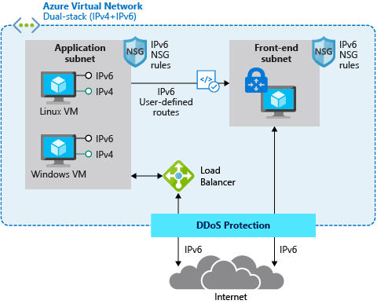

<!-- docutune:ignore "Azure VPN Gateway" -->

# Plan for IP addressing

It's important your organization plans for IP addressing in Azure. Planning ensures the IP address space doesn't overlap across on-premises locations and Azure regions.

**Design considerations:**

- Overlapping IP address spaces across on-premises and Azure regions creates major contention challenges.

- Azure VPN Gateway can connect overlapping, on-premises sites with overlapping IP address spaces through network address translation (NAT) capability. This feature is generally available in [Azure Virtual WAN](/azure/virtual-wan/nat-rules-vpn-gateway) and standalone [Azure VPN Gateway](/azure/vpn-gateway/nat-howto).

  :::image type="content" source="./media/vpn-nat.png" alt-text="{Diagram that shows how NAT works with VPN Gateway.}":::

- You can add address space after you create a virtual network. This process doesn't need an outage if the virtual network is already connected to another virtual network via virtual network peering. Instead, each remote peering needs a [resync operation](/azure/architecture/networking/prefixes/add-ip-space-peered-vnet) done after the network space has changed.

- Azure [reserves five IP addresses](/azure/virtual-network/virtual-networks-faq#are-there-any-restrictions-on-using-ip-addresses-within-these-subnets) within each subnet. Factor in those addresses when you're sizing virtual networks and encompassed subnets.

- Some Azure services require [dedicated subnets](/azure/virtual-network/virtual-network-for-azure-services#services-that-can-be-deployed-into-a-virtual-network). These services include Azure Firewall and Azure VPN Gateway.

- You can delegate subnets to certain services to create instances of a service within the subnet.

**Design recommendations:**

- Plan for non-overlapping IP address spaces across Azure regions and on-premises locations in advance.

- Use IP addresses from the address allocation for private internet, known as RFC 1918 addresses.

- Don't use the following address ranges:
  - `224.0.0.0/4` (multicast)
  - `255.255.255.255/32` (broadcast)
  - `127.0.0.0/8` (loopback)
  - `169.254.0.0/16` (link-local)
  - `168.63.129.16/32` (internal DNS)

- For environments that have limited availability of private IP addresses, consider using IPv6. Virtual networks can be IPv4-only or dual stack [IPv4+IPv6](/azure/virtual-network/ip-services/ipv6-overview).

  

- Don't create large virtual networks like `/16`. It ensures that IP address space isn't wasted. The smallest supported IPv4 subnet is `/29`, and the largest is `/2` when using classless inter-domain routing (CIDR) subnet definitions. IPv6 subnets must be exactly `/64` in size.

- Don't create virtual networks without planning the required address space in advance.

- Don't use public IP addresses for virtual networks, especially if the public IP addresses don't belong to your organization.
