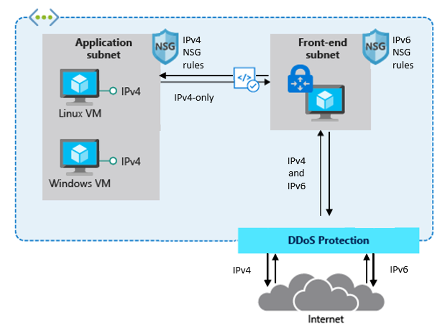
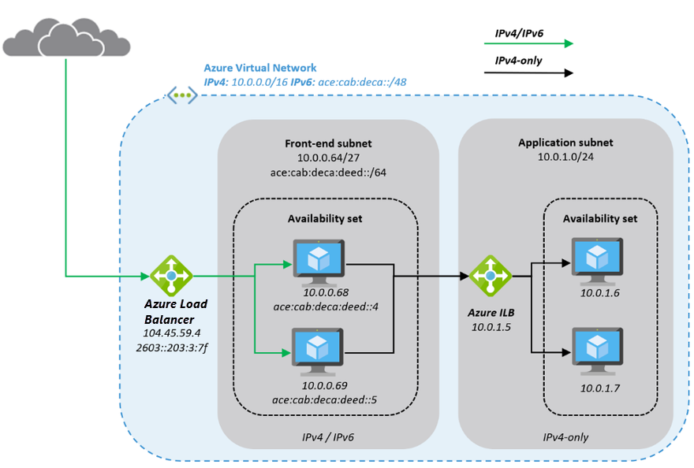
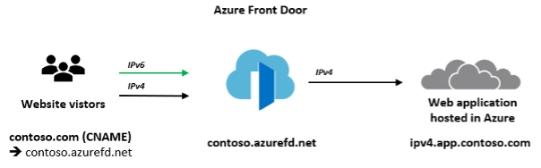

<!-- docutune:ignore "Azure VPN Gateway" -->

# Plan for IP addressing

It's important your organization plans for IP addressing in Azure. Planning ensures the IP address space doesn't overlap across on-premises locations and Azure regions.

**Design considerations:**

- Overlapping IP address spaces across on-premises and Azure regions creates major contention challenges.

- Azure VPN Gateway can connect overlapping, on-premises sites with overlapping IP address spaces through network address translation (NAT) capability. This feature is generally available in [Azure Virtual WAN](/azure/virtual-wan/nat-rules-vpn-gateway) and standalone [Azure VPN Gateway](/azure/vpn-gateway/nat-howto).

  :::image type="content" source="./media/vpn-nat.png" alt-text="{Diagram that shows how NAT works with VPN Gateway.}":::

- You can add address space after you create a virtual network. This process doesn't need an outage if the virtual network is already connected to another virtual network via virtual network peering. Instead, each remote peering needs a [resync operation](/azure/architecture/networking/prefixes/add-ip-space-peered-vnet) done after the network space has changed.

- Azure [reserves five IP addresses](/azure/virtual-network/virtual-networks-faq#are-there-any-restrictions-on-using-ip-addresses-within-these-subnets) within each subnet. Factor in those addresses when you're sizing virtual networks and encompassed subnets.

- Some Azure services require [dedicated subnets](/azure/virtual-network/virtual-network-for-azure-services#services-that-can-be-deployed-into-a-virtual-network). These services include Azure Firewall and Azure VPN Gateway.

- You can delegate subnets to certain services to create instances of a service within the subnet.

**Design recommendations:**

- Plan for non-overlapping IP address spaces across Azure regions and on-premises locations in advance.

- Use IP addresses from the address allocation for private internet, known as RFC 1918 addresses.

- Don't use the following address ranges:
  - `224.0.0.0/4` (multicast)
  - `255.255.255.255/32` (broadcast)
  - `127.0.0.0/8` (loopback)
  - `169.254.0.0/16` (link-local)
  - `168.63.129.16/32` (internal DNS)

- For environments that have limited availability of private IP addresses, consider using IPv6. Virtual networks can be IPv4-only or dual stack [IPv4+IPv6](/azure/virtual-network/ip-services/ipv6-overview).

  

- Don't create large virtual networks like `/16`. It ensures that IP address space isn't wasted. The smallest supported IPv4 subnet is `/29`, and the largest is `/2` when using classless inter-domain routing (CIDR) subnet definitions. IPv6 subnets must be exactly `/64` in size.

- Don't create virtual networks without planning the required address space in advance.

- Don't use public IP addresses for virtual networks, especially if the public IP addresses don't belong to your organization.

- Take the services you're going to use into consideration, there are some services with reserved IPs (IP Addresses), like [AKS with CNI networking](/azure/aks/configure-azure-cni#prerequisites)

- Use [nonroutable landing zone spoke virtual networks](/azure/architecture/guide/networking/ipv4-exhaustion#method-1-nonroutable-landing-zone-spoke-virtual-networks) and [Azure Private Link service](/azure/architecture/guide/networking/ipv4-exhaustion#method-2-azure-private-link-services) to prevent IPv4 exhaustion.

## IPv6 considerations

An increasing number of organizations are adopting IPv6 in their environments, driven by the public IPv4 
space exhaustion, private IPv4 scarcity, especially within large-scale networks, and the need to provide connectivity
to IPv6-only clients. 
There is no one-size-fits-all approach with IPv6; however, there are best practices Azure customers can follow to plan 
and implement IPv6 into their existing cloud networks.

[Cloud Adoption Framework](/azure/cloud-adoption-framework/) helps you understand the 
pros and cons of the decisions you make when building systems in the cloud. The five pillars of the Framework allow you 
to learn architectural best practices for designing and operating reliable, secure, efficient, cost-effective, and 
sustainable systems. Refer to [Azure Landing Zone Design Principals](/azure/cloud-adoption-framework/ready/landing-zone/design-principles)
for more guidance.  
For in-depth recommendations and best practices regarding your cloud architecture —reference architecture deployments,
diagrams, and whitepapers -- refer to the [Azure Architecture Center](/azure/architecture/).

**Design considerations:**
- Phase your IPv6 adoption -- Focus on your business needs to implement IPv6 where needed and remember that IPv4 and 
  IPv6 can be made to coexist as long as necessary.
- In scenarios where applications rely on Infrastructure-as-a-Service (IaaS) services with full IPv6 support, such as 
  Virtual Machines (VMs), native end-to-end use of IPv4 and IPv6 is possible, avoiding translation complications and 
  providing the most information to the server and application.  
  Internet-facing Azure load balancers with the Basic Azure SKU can be configured with an IPv6 address. This enables 
  native end-to-end IPv6 connectivity between the public internet and Azure Virtual Machines via the Load Balancer. 
  It also facilitates native end-to-end outbound connections between VMs and IPv6-enabled clients on the public internet.  
  It should be noted that this also requires every device in the path to handle IPv6 traffic.

The native end-to-end approach is most useful for direct server-to-server or client-to-server communication, but not 
for most web services and applications which are typically protected by firewalls, web application firewalls, or 
reverse proxies.

- For complex deployments and applications with a mix of 3rd-party services, Platform-as-a-Service (PaaS) services, 
  and backend solutions, some may not support native IPv6. In such cases, NAT/NAT64 or an IPv6 proxy solution is needed
  to enable communication between IPv6 and IPv4.
- When the complexity of the application architecture or other factors such as education and training costs are 
  considered significant, it may be desirable to keep relying on IPv4-only infrastructure in the backend and deploy a 
  3rd party Network Virtual Appliance (NVA) dual-stack IPv4/IPv6 gateway for service delivery.

A very typical deployment today, for example using an NVA, looks like this:

**Design Recommendations:**

Here is a closer look on how a typical architecture could look like:

- Deploy the NVA in Azure Availability Sets for resiliency and expose them to the internet through [Azure Load-Balancer](/azure/load-balancer/load-balancer-ipv6-overview)
  which has a Public IP address frontend.
- The NVAs accepts IPv4 and IPv6 traffic and translates it into IPv4-only traffic to access the application in the 
  Application in the subnet. The benefit of this approach is reduced complexity for the application team and a reduced 
  attack surface.
- Deploy [Azure Front Door service](https://azure.microsoft.com/en-us/services/frontdoor/#features), to provide global 
  routing for web traffic.

AFD’s capabilities include proxying IPv6 client requests and traffic to an IPv4-only backend as shown below:

The main difference between the NVA-based approach and the Azure Front Door (AFD) service is that the NVAs are 
customer-managed, work at Layer 4 of the OSI model, and can be deployed in the same Azure Virtual Network as the 
application with a private and public interface, 
while AFD is a global Azure PaaS service, operates at Layer 7 (HTTP/HTTPS), and the application backend is an 
Internet-facing service that can be locked down to only accept traffic from the AFD.
In complex environments, a combination of both may be used, where NVAs are used within a regional deployment and AFD is used to route traffic to one or more regional deployments in different Azure regions or other Internet-facing locations. To determine the best solution, it is recommended to take a closer look at the capabilities 
of [Azure Front Door](https://learn.microsoft.com/en-us/azure/frontdoor/front-door-overview) and its documentation.

**IPv6 VNet CIDR blocks**
- You can associate a single IPv6 CIDR block when you create a new VNet with an existing Azure deployment in your 
  subscription. The subnet for IPv6 must be exactly /64 in size. This ensures future compatibility should you decide to 
  enable routing of the subnet to an on-premises network since some routers can only accept /64 IPv6 routes.
- If you have an existing VNet that supports IPv4 only, and resources in your subnet that are configured to use 
  IPv4 only, you can enable IPv6 support for your VNet and resources. Your VNet can operate in dual-stack mode -- your
  resources can communicate over IPv4, or IPv6, or both. IPv4 and IPv6 communication are independent of each other.
- You cannot disable IPv4 support for your VNet and subnets; this is the default IP addressing system for Azure VNet.
- Associate an IPv6 CIDR block with your VNet and subnet or BYOIP IPv6
  Classless Inter-Domain Routing (CIDR) notation is a way of representing an IP address and its network mask. The format 
  of these addresses is as follows:
  An individual IPv4 address is 32 bits, with 4 groups of up to 3 decimal digits. For example, 10.0.1.0.
  An IPv4 CIDR block has four groups of up to three decimal digits, 0-255, separated by periods, followed by a slash 
  and a number from 0 to 32. For example, 10.0.0.0/16.
  An individual IPv6 address is 128 bits, with 8 groups of 4 hexadecimal digits. For example, 
  2001:0db8:85a3:0000:0000:8a2e:0370:7334.
  An IPv6 CIDR block has four groups of up to four hexadecimal digits, separated by colons, followed by a double colon, 
  followed by a slash and a number from 1 to 128. For example, 2001:db8:1234:1a00::/64
- Update your route tables to route IPv6 traffic, for a public traffic, create a route that routes all IPv6 traffic 
  from the subnet to VPN or ExpressRoute gateway.
- Update your security group rules to include rules for IPv6 addresses. This enables IPv6 traffic to flow to and from 
  your instances. If you've created NSG rules to control the flow of traffic to and from your subnet, 
  you must include rules for IPv6 traffic.
- If your instance type does not support IPv6, use dual stack or deploy an NVA as previously stated that does the 
  translation from IPv4 to IPv6

## IP Address Management (IPAM) tools

Using an IPAM tool can assist you with IP address planning in Azure as it provides centralized management and visibility, preventing overlaps and conflicts in IP address spaces. This section guides you through essential considerations and recommendations when adopting an IPAM tool.

**Design considerations:**

Numerous IPAM tools are available for your consideration, depending on your requirements and the size of your organization. The options spans from having a basic Excel-based inventory to open-source community-driven solution or comprehensive enterprise products with advanced features and support.

- Consider these factors when evaluating what IPAM tool to implement:
  - Minimum features required by your organization
  - Total cost of ownership (TCO), including licensing and ongoing maintenance
  - Audit trails, logging, and role-based access controls
  - Authentication and authorization through Microsoft Entra ID
  - Accessible via API
  - Integrations with other network management tools and systems
  - Active community support or the level of support from the software provider

- Consider evaluating an open-source IPAM tool like [Azure IPAM](https://azure.github.io/ipam). Azure IPAM is a lightweight solution built on the Azure platform. It automatically discovers IP address utilization within your Azure tenant and enables you to manage it all from a centralized UI or via a RESTful API.

- Consider your organizations operating model and the ownership of the IPAM tool. The goal of implementing an IPAM tool is to streamline the process of requesting new IP address spaces for application teams without dependencies and bottlenecks.

- An important part of the IPAM tool functionality is to inventory IP address space usage and logically organize it.

**Design recommendations:**

- The process of reserving non-overlapping IP address spaces should support requesting different sizes based on the needs of the individual application landing zones.
  - For example, you could adopt T-shirt sizing to make it easy for application teams to describe their needs:
    - Small - `/24` - 256 IP addresses
    - Medium - `/22` - 1,024 IP addresses
    - Large - `/20` - 4,096 IP addresses

- Your IPAM tool should have an API for reserving non-overlapping IP address spaces to support an Infrastructure as Code (IaC) approach. This feature is also crucial for seamless integration of IPAM into your [subscription vending process](../landing-zone/design-area/subscription-vending.md), thereby reducing the risk of errors and the need for manual intervention.
  - An example of an IaC approach is [Bicep](/azure/azure-resource-manager/bicep/overview?tabs=bicep) with its deployment script functionality or [Terraform](/azure/developer/terraform/overview) data sources to dynamically fetch data from the IPAM API.

- Create a systematic arrangement for your IP address spaces by structuring them according to Azure regions and workload archetypes, ensuring a clean and traceable network inventory.

- The decommissioning process for workloads should include the removal of IP address spaces that is no longer used, which can later be repurposed for upcoming new workloads, promoting efficient resource utilization.
