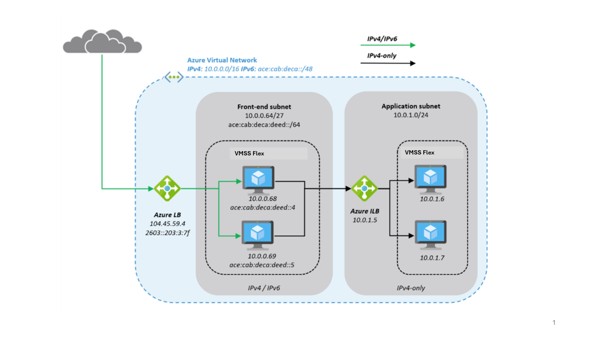

<!-- docutune:ignore "Azure VPN Gateway" -->

# Plan for IP addressing

It's important that your organization plans for IP addressing in Azure. Planning ensures the IP address space doesn't overlap across on-premises locations and Azure regions.

**Design considerations:**

- Overlapping IP address spaces across on-premises and Azure regions creates major contention challenges.

- Azure VPN Gateway can connect overlapping, on-premises sites with overlapping IP address spaces through network address translation (NAT) capability. This feature is generally available in [Azure Virtual WAN](/azure/virtual-wan/nat-rules-vpn-gateway) and standalone [Azure VPN Gateway](/azure/vpn-gateway/nat-howto).

  :::image type="content" source="./media/vpn-nat.png" alt-text="{Diagram that shows how NAT works with VPN Gateway.}":::

- You can add address space after you create a virtual network. This process doesn't need an outage if the virtual network is already connected to another virtual network via virtual network peering. Instead, each remote peering needs a [resync operation](/azure/virtual-network/update-virtual-network-peering-address-space) done after the network space has changed.

- Azure [reserves five IP addresses](/azure/virtual-network/virtual-networks-faq#are-there-any-restrictions-on-using-ip-addresses-within-these-subnets) within each subnet. Factor in those addresses when you're sizing virtual networks and encompassed subnets.

- Some Azure services require [dedicated subnets](/azure/virtual-network/vnet-integration-for-azure-services#services-that-can-be-deployed-into-a-virtual-network). These services include Azure Firewall and Azure VPN Gateway.

- You can delegate subnets to certain services to create instances of a service within the subnet.

**Design recommendations:**

- Plan for non-overlapping IP address spaces across Azure regions and on-premises locations in advance.

- Use IP addresses from the address allocation for private internet, known as RFC 1918 addresses.

- Don't use the following address ranges:
  - `224.0.0.0/4` (multicast)
  - `255.255.255.255/32` (broadcast)
  - `127.0.0.0/8` (loopback)
  - `169.254.0.0/16` (link-local)
  - `168.63.129.16/32` (internal DNS)

- For environments that have limited availability of private IP addresses, consider using IPv6. Virtual networks can be IPv4-only or dual stack [IPv4+IPv6](/azure/virtual-network/ip-services/ipv6-overview).

  

- Don't create large virtual networks like `/16`. It ensures that IP address space isn't wasted. The smallest supported IPv4 subnet is `/29`, and the largest is `/2` when using classless inter-domain routing (CIDR) subnet definitions. IPv6 subnets must be exactly `/64` in size.

- Don't create virtual networks without planning the required address space in advance.

- Don't use public IP addresses for virtual networks, especially if the public IP addresses don't belong to your organization.

- Take the services you're going to use into consideration, there are some services with reserved IPs (IP Addresses), like [AKS with CNI networking](/azure/aks/configure-azure-cni#prerequisites)

- Use [nonroutable landing zone spoke virtual networks](/azure/architecture/networking/guide/internet-protocol-version-4-exhaustion#method-1-nonroutable-landing-zone-spoke-virtual-networks) and [Azure Private Link service](/azure/architecture/networking/guide/internet-protocol-version-4-exhaustion#method-2-azure-private-link-services) to prevent IPv4 exhaustion.

## IPv6 considerations

An increasing number of organizations are adopting IPv6 in their environments. This adoption is driven by the public IPv4 space exhaustion, private IPv4 scarcity, especially within large-scale networks, and the need to provide connectivity to IPv6-only clients. 
There's no universal approach to adopting IPv6. There are, however, best practices that you can follow when you plan for IPv6 and implement it in your existing Azure networks.

The Microsoft [Cloud Adoption Framework](/azure/cloud-adoption-framework/) for Azure helps you understand the considerations to take into account when you create systems in the cloud.
To learn about architectural best practices for designing sustainable systems, see [Azure landing zone design principles](/azure/cloud-adoption-framework/ready/landing-zone/design-principles).
For in-depth recommendations and best practices regarding your cloud architecture, including reference architecture deployments, diagrams, and guides, see the [Architecture Center guide for IPv6](/azure/architecture/networking/guide/ipv6-architecture).

**Design considerations:**

- Phase your IPv6 adoption. Based on your business needs, implement IPv6 where needed. Remember that IPv4 and IPv6 can coexist as long as necessary.
- In scenarios where applications rely on infrastructure as a service (IaaS) services that have full IPv6 support, like virtual machines (VMs), native end-to-end use of IPv4 and IPv6 is possible. This configuration avoids translation complications and provides the most information to the server and application.  

   You can deploy a Standard-SKU internet-facing Azure Load Balancer with an IPv6 address. This configuration enables native end-to-end IPv6 connectivity between the public internet and Azure VMs via the load balancer. This approach also facilitates native end-to-end outbound connections between VMs and IPv6-enabled clients on the public internet. Note that this approach requires every device in the path to handle IPv6 traffic.

  The native end-to-end approach is most useful for direct server-to-server or client-to-server communication. It's not useful for most web services and applications, which are typically protected by firewalls, web application firewalls, or reverse proxies.

- Some complex deployments and applications that use a combination of third-party services, platform as a service (PaaS) services, and back-end solutions might not support native IPv6. In these cases, you need to use NAT/NAT64 or an IPv6 proxy solution to enable communication between IPv6 and IPv4.
- When the complexity of the application architecture or other factors like training costs are considered significant, you might want to keep using IPv4-only infrastructure on the back end and deploy a third-party network virtual appliance (NVA) dual-stack IPv4/IPv6 gateway for service delivery.

  A typical deployment that uses an NVA might look like this:

  

**Design recommendations:**

Here's a closer look at what a typical architecture might look like:

- Deploy the NVA in [Virtual Machine Scale Sets with Flexible orchestration](/azure/virtual-machine-scale-sets/virtual-machine-scale-sets-orchestration-modes#scale-sets-with-flexible-orchestration) (VMSS Flex) for resiliency and expose them to the internet through [Azure Standard Load Balancer](/azure/load-balancer/load-balancer-overview), which has a public IP address front end.

   The NVAs accept IPv4 and IPv6 traffic and translate it into IPv4-only traffic to access the application in the application subnet. The approach reduces complexity for the application team and reduces the attack surface.
- Deploy [Azure Front Door](/azure/frontdoor/front-door-overview) to provide global routing for web traffic.

  Azure Front Door capabilities include proxying IPv6 client requests and traffic to an IPv4-only back end, as shown here:

   

These are the main differences between the NVA approach and the Azure Front Door approach:
 
- NVAs are customer-managed, work at Layer 4 of the OSI model, and can be deployed in the same Azure virtual network as the application, with a private and public interface.
- Azure Front Door is a global Azure PaaS service and operates at Layer 7 (HTTP/HTTPS). The application back end is an internet-facing service that can be locked down to accept only traffic from Azure Front Door.

In complex environments, you can use a combination of both. NVAs are used within a regional deployment. Azure Front Door is used to route traffic to one or more regional deployments in different Azure regions or other internet-facing locations. To determine the best solution, we recommend that you review the capabilities of [Azure Front Door](/azure/frontdoor/front-door-overview) and the product documentation.

**IPv6 virtual network CIDR blocks:**

- You can associate a single IPv6 Classless Inter-Domain Routing (CIDR) block when you create a new virtual network in an existing Azure deployment in your subscription. The size of the subnet for IPv6 must be /64. Using this size ensures future compatibility if you decide to enable routing of the subnet to an on-premises network. Some routers can accept only /64 IPv6 routes.
- If you have an existing virtual network that supports only IPv4, and resources in your subnet that are configured to use only IPv4, you can enable IPv6 support for your virtual network and resources. Your virtual network can operate in dual-stack mode, which enables your resources to communicate over IPv4, IPv6, or both. IPv4 and IPv6 communication are independent of each other.
- You can't disable IPv4 support for your virtual network and subnets. IPv4 is the default IP addressing system for Azure virtual networks.
- Associate an IPv6 CIDR block with your virtual network and subnet or BYOIP IPv6. CIDR notation is a method of representing an IP address and its network mask. The formats of these addresses are as follows:
  - An individual IPv4 address is 32 bits, with four groups of as many as three decimal digits. For example, `10.0.1.0`.
  - An IPv4 CIDR block has four groups of as many as three decimal digits, from 0 through 255, separated by periods, and followed by a slash and a number from 0 through 32. For example, `10.0.0.0/16`.
  - An individual IPv6 address is 128 bits. It has eight groups of four hexadecimal digits. For example, `2001:0db8:85a3:0000:0000:8a2e:0370:7334`.
  - An IPv6 CIDR block has four groups of as many as four hexadecimal digits, separated by colons, followed by a double colon, and then followed by a slash and a number from 1 through 128. For example, `2001:db8:1234:1a00::/64`.
- Update your route tables to route IPv6 traffic. For public traffic, create a route that routes all IPv6 traffic from the subnet to VPN Gateway or an Azure ExpressRoute gateway.
- Update your security group rules to include rules for IPv6 addresses. Doing so enables IPv6 traffic to flow to and from your instances. If you have network security group rules to control the flow of traffic to and from your subnet, you must include rules for IPv6 traffic.
- If your instance type doesn't support IPv6, use dual stack or deploy an NVA, as previously described, that translates from IPv4 to IPv6.

## IP Address Management (IPAM) tools

Using an IPAM tool can assist you with IP address planning in Azure as it provides centralized management and visibility, preventing overlaps and conflicts in IP address spaces. This section guides you through essential considerations and recommendations when adopting an IPAM tool.

**Design considerations:**

Numerous IPAM tools are available for your consideration, depending on your requirements and the size of your organization. The options span from having a basic Excel-based inventory to open-source community-driven solutions or comprehensive enterprise products with advanced features and support.

- Consider these factors when evaluating what IPAM tool to implement:
  - Minimum features required by your organization
  - Total cost of ownership (TCO), including licensing and ongoing maintenance
  - Audit trails, logging, and role-based access controls
  - Authentication and authorization through Microsoft Entra ID
  - Accessible via API
  - Integrations with other network management tools and systems
  - Active community support or the level of support from the software provider

- Consider evaluating an open-source IPAM tool like [Azure IPAM](https://azure.github.io/ipam). Azure IPAM is a lightweight solution built on the Azure platform. It automatically discovers IP address utilization within your Azure tenant and enables you to manage it all from a centralized UI or via a RESTful API.

- Consider your organization's operating model and the ownership of the IPAM tool. The goal of implementing an IPAM tool is to streamline the process of requesting new IP address spaces for application teams without dependencies and bottlenecks.

- An important part of the IPAM tool functionality is to inventory IP address space usage and logically organize it.

**Design recommendations:**

- The process of reserving non-overlapping IP address spaces should support requesting different sizes based on the needs of the individual application landing zones.
  - For example, you could adopt T-shirt sizing to make it easy for application teams to describe their needs:
    - Small - `/24` - 256 IP addresses
    - Medium - `/22` - 1,024 IP addresses
    - Large - `/20` - 4,096 IP addresses

- Your IPAM tool should have an API for reserving non-overlapping IP address spaces to support an Infrastructure as Code (IaC) approach. This feature is also crucial for seamless integration of IPAM into your [subscription vending process](../landing-zone/design-area/subscription-vending.md), thereby reducing the risk of errors and the need for manual intervention.
  - An example of an IaC approach is [Bicep](/azure/azure-resource-manager/bicep/overview?tabs=bicep) with its deployment script functionality or [Terraform](/azure/developer/terraform/overview) data sources to dynamically fetch data from the IPAM API.

- Create a systematic arrangement for your IP address spaces by structuring them according to Azure regions and workload archetypes, ensuring a clean and traceable network inventory.

- The decommissioning process for workloads should include the removal of IP address spaces that are no longer used, which can later be repurposed for upcoming new workloads, promoting efficient resource utilization.