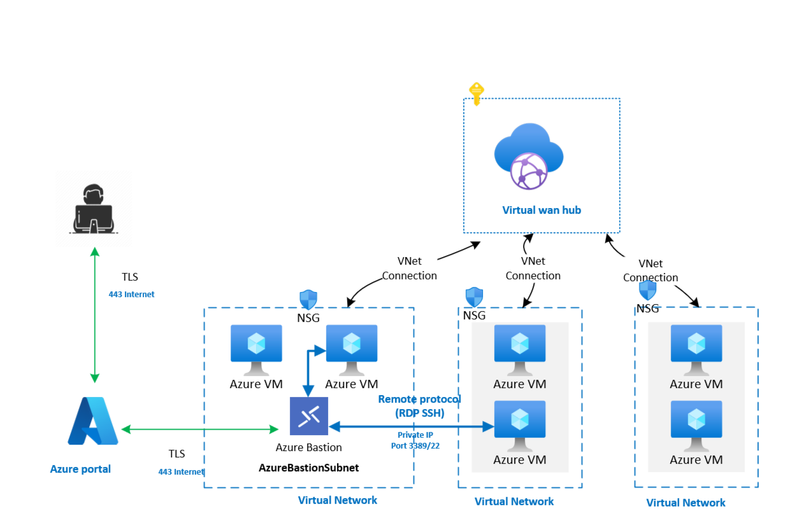
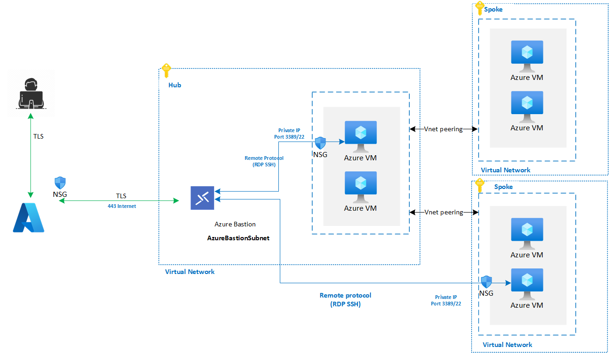
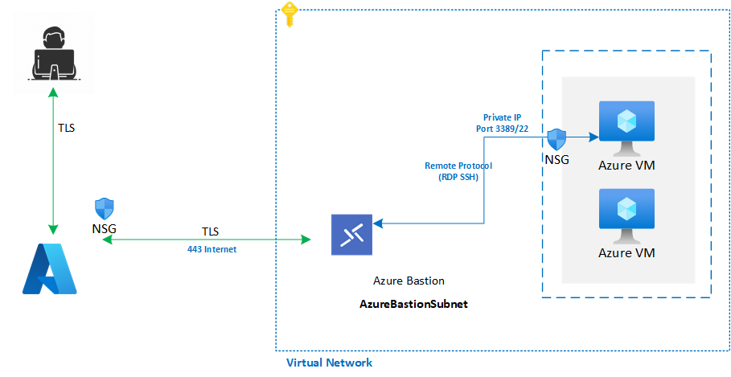

# Plan for Virtual Machine remote access

This document describes the recommended guidance for providing remote access to virtual machines deployed within an Azure Landing Zones architecture.
Azure offers different technologies for providing remote access to virtual machines: 

- [Azure Bastion](/azure/bastion/bastion-overview), a PaaS solution, for accessing virtual machines through a browser or currently in preview through the native SSH/RDP client on Windows workstations 
- Just in time [JIT](/azure/defender-for-cloud/just-in-time-access-overview) access provided through Azure Defender for Cloud 
- Hybrid connectivity options such as ExpressRoute and VPN
- Public IP attached directly to the Virtual Machine or through a NAT rule via an Azure public load balancer

The choice of which remote access solution is most appropriate depends on several factors such as scale, topology and security requirements.

## Design considerations

- When available, you can use existing hybrid connectivity to Azure VNets via ExpressRoute or S2S/P2S VPN connections to provide remote access from on-premises to Windows and Linux Azure VMs
- NSGs can be used to secure SSH/RDP connections to Azure VMs
- Just-in-time allows remote SSH/RDP access over the internet without having to deploy any additional infrastructure
  - Please note that there are some [availability limitation](/azure/defender-for-cloud/just-in-time-access-usage) with JIT access.
  - Just-in-time access cannot be used for VMs protected by Azure Firewalls controlled by Azure Firewall Manager
- [Azure Bastion](/azure/bastion/bastion-overview) provides an additional layer of control, enabling secure and seamless RDP/SSH connectivity to your virtual machines directly from the Azure portal or [native client](/azure/bastion/connect-native-client-windows) in preview over a secure TLS channel, also negating the need for hybrid connectivity.
- Consider the appropriate Azure Bastion SKU to use based on your requirements as documented here [About Azure Bastion configurationsettings](/azure/bastion/configuration-settings)
- Review the [Azure Bastion FAQ](/answers/products/) for answers to common questions you may have about the service
- Bastion can be used in VWAN topology, however there are some known limitations, such as:
  - Azure Bastion cannot be deployed in an Azure Virtual WAN Virtual Hub
  - o	Azure Bastion is currently not supported with Azure Virtual WAN's native routing capabilities, instead, it must be deployed within each spoke VNet to provide connectivity to VMs within the same VNet. 
  
## Design recommendations

- Use existing ExpressRoute and/or VPN connectivity to provide remote access to Azure virtual machines that are accessible from on-premises via the ExpressRoute and/or VPN connections.
- In a Virtual WAN based network topology where remote access to Azure virtual machines over the internet is required, deploy Azure Bastion in each spoke VNet of the respective VMs as depicted in Figure 1 below
- In Hub-and-Spoke network topology, where remote access to Azure virtual machines over the internet is required:
  - A single Azure Bastion host can be deployed in the hub VNet, which can provide connectivity to Azure VMs on spoke VNets via VNet peering. This configuration will reduce the number of Bastion instances to manage in your environment. However, this scenario requires that users logging on to Windows and Linux VMs via Bastion to have [Reader role on the Azure Bastion resource as well as the hub virtual network](/azure/bastion/bastion-faq#peering), which may have security/compliance considerations in some implementations. See Figure 2 below
  - If in your environment is not permitted to grant users the Reader RBAC role on the Azure Bastion resource as well as the Hub VNet, use Azure Bastion (Basic or Standard SKU) to provide connectivity to virtual machines within a spoke VNet by deploying a dedicated Azure Bastion instance into each spoke VNet that requires remote access. See Figure 3 below
- Configure NSG rules to protect Azure Bastion and the Virtual Machines to which it provides connectivity as per the guidance documented in [Working with VMs and NSGs in Azure Bastion](/azure/bastion/bastion-nsg) 
- Configure Azure Bastion diagnostic logs to be sent to the central Log Analytics Workspace as documented here [Enable and work with Azure Bastion resource logs](/azure/bastion/diagnostic-logs)
- Ensure the [required RBAC role assignments](/azure/bastion/bastion-faq#roles) are made for the users/groups connecting to the Virtual Machines via Azure Bastion are in place.
- If connecting to Linux Virtual Machines via SSH, utilize the feature of [Connecting Using a private key stored in Azure Key Vault](/azure/bastion/bastion-connect-vm-ssh-linux#akv)
- Deploy Azure Bastion in addition to ExpressRoute or VPN access to address specific needs such as Emergency break-glass access. 
- Remote access to Windows and Linux VMs via public IPs directly attached to the virtual machines is discouraged and should never be deployed without very strict NSG rules and firewalling.

  

   *Figure 1: Azure Virtual WAN topology.*

  

   *Figure 2: Azure Hub&Spoke topology.*

  

   *Figure 3: Azure Standalone VNet topology.*
