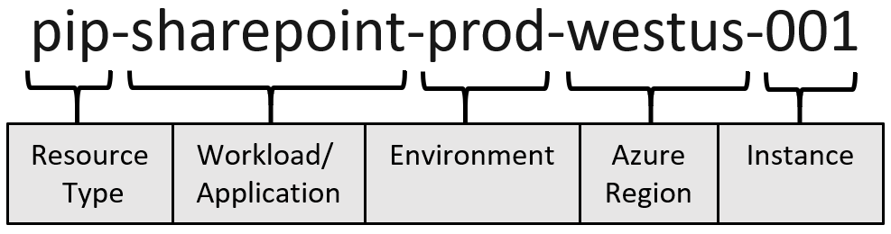
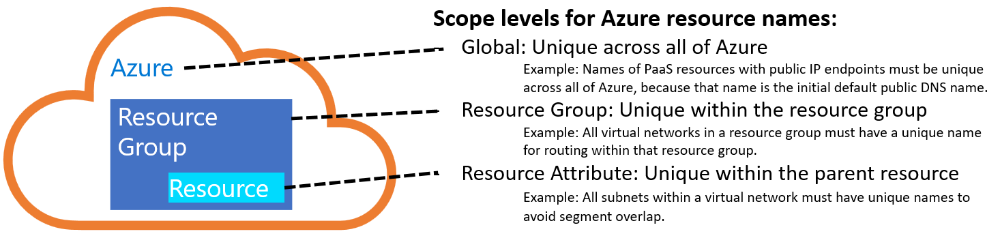

# Define your naming convention

An effective naming convention composes resource names from important information about each resource. A well-chosen name helps you quickly identify the resource's type, its associated workload, its deployment environment, and the Azure region hosting it. For example, a public IP resource for a production SharePoint workload residing in the West US region might be `pip-sharepoint-prod-westus-001`.

*Diagram 1: Components of an Azure resource name.*

## Naming scope

All Azure resource types have a scope that defines the level that resource names must be unique. A resource must have a unique name within its scope.

For example, a virtual network has a resource group scope, which means that there can be only one network named `vnet-prod-westus-001` in a given resource group. Other resource groups could have their own virtual network named `vnet-prod-westus-001`. Subnets are scoped to virtual networks, so each subnet within a virtual network must have a distinct name.

Some resource names, such as PaaS services with public endpoints or virtual machine DNS labels, have global scopes, so they must be unique across the entire Azure platform.

*Diagram 2: Scope levels for Azure resource names.*

Resource names have length limits. Balancing the context embedded in a name with its scope and length limit is important when you develop your naming conventions. For more information, see [naming rules and restrictions for Azure resources](/azure/azure-resource-manager/management/resource-name-rules).

### Recommended naming components

When you construct your naming convention, identify the key pieces of information that you want to reflect in a resource name. Different information is relevant for different resource types. The following list provides examples of information that are useful when you construct resource names.

Keep the length of naming components short to prevent exceeding resource name length limits.

| Naming component | Description |
|--|--|--|
| **Resource type** | An abbreviation that represents the type of Azure resource or asset. This component is often used as a prefix or suffix in the name. For more information, see [Recommended abbreviations for Azure resource types](./resource-abbreviations.md). Examples: `rg`, `vm` |
| **Business unit** | Top-level division of your company that owns the subscription or workload the resource belongs to. In smaller organizations, this component might represent a single corporate top-level organizational element. Examples: `fin`, `mktg`, `product`, `it`, `corp` |
| **Application or service name** | Name of the application, workload, or service that the resource is a part of. Examples: `navigator`, `emissions`, `sharepoint`, `hadoop` |
| **Subscription type** | Summary description of the purpose of the subscription that contains the resource. Often broken down by deployment environment type or specific workloads. Examples: `prod`, `shared`, `client` |
| **Deployment&nbsp;environment** | The stage of the development lifecycle for the workload that the resource supports. Examples: `prod`, `dev`, `qa`, `stage`, `test` |
| **Region** | The Azure region where the resource is deployed. Examples: `westus`, `eastus2`, `westeu`, `usva`, `ustx` |

## Example names for common Azure resource types

The following section provides some example names for common Azure resource types in an enterprise cloud deployment.

> [!NOTE]
> Some of these example names use a three-digit padding scheme (`###`), such as `mktg-prod-001`.
>
> Padding improves readability and sorting of assets when those assets are managed in a configuration management database (CMDB), IT Asset Management tool, or traditional accounting tools. When the deployed asset is managed centrally as part of a larger inventory or portfolio of IT assets, the padding approach aligns with interfaces those systems use to manage inventory naming.
>
> Unfortunately, the traditional asset padding approach can prove problematic in infrastructure-as-code approaches which may iterate through assets based on a non-padded number. This approach is common during deployment or automated configuration management tasks. Those scripts would have to routinely strip the padding and convert the padded number to a real number, which slows script development and run time.
>
> Choose an approach that's suitable for your organization. The padding shown here illustrates the importance of using a consistent approach to inventory numbering, rather than which approach is superior. Before choosing a numbering scheme (with or without padding), evaluate what will affect long-term operations more: CMDB/asset management solutions or code-based inventory management. Then consistently follow the padding option that best fits your operational needs.

<!-- cspell:ignore cloudapp azurewebsites servicebus -->

<!-- cspell:ignoreRegExp [a-z]+-[a-z]+ -->
<!-- cspell:ignoreRegExp `[a-z]+` -->
<!-- cspell:ignoreRegExp [a-z]+\d+ -->
<!-- cspell:ignoreRegExp [_\*][a-z]+[\\-] -->

## Example names: General

| Asset type | Scope | Format and examples |
|--|--|--|
| **Management group** | Business unit and/or   environment type | *mg-\<business unit>[-\<environment type>]*    <li> `mg-mktg` <li> `mg-hr` <li> `mg-corp-prod` <li> `mg-fin-client` |
| **Subscription** | Account / enterprise agreement | *\<business&nbsp;unit>-\<subscription&nbsp;type>-\<###>*    <li> `mktg-prod-001` <li> `corp-shared-001` <li> `fin-client-001` |
| **Resource group** | Subscription | *rg-\<app&nbsp;or&nbsp;service&nbsp;name>-<subscription&nbsp;type>-\<###>*    <li> `rg-mktgsharepoint-prod-001` <li> `rg-acctlookupsvc-shared-001` <li> `rg-ad-dir-services-shared-001` |
| **API management service instance** | Global | *apim-\<app&nbsp;or&nbsp;service&nbsp;name>*    `apim-navigator-prod` |
| **Managed identity** | Resource group | *id-\<app&nbsp;or&nbsp;service&nbsp;name>-\<environment type>-\<region name>-\<###>*    <li> `id-appcn-keda-prod-eastus2-001` |

## Example names: Networking

| Asset type | Scope | Format and examples |
|--|--|--|
| **Virtual network** | Resource group | *vnet-\<subscription&nbsp;type>-\<region>-\<###>*    <li> `vnet-shared-eastus2-001` <li> `vnet-prod-westus-001` <li> `vnet-client-eastus2-001` |
| **Subnet** | Virtual network | *snet-\<subscription>-\<region>-\<###>*    <li> `snet-shared-eastus2-001` <li> `snet-prod-westus-001` <li> `snet-client-eastus2-001` |
| **Network interface (NIC)** | Resource group | *nic-<##>-\<vm&nbsp;name>-\<subscription>-\<###>*    <li> `nic-01-dc1-shared-001` <li> `nic-02-vmhadoop1-prod-001` <li> `nic-02-vmtest1-client-001` |
| **Public IP address** | Resource group | *pip-\<vm&nbsp;name&nbsp;or&nbsp;app&nbsp;name>-\<environment>-\<region>-\<###>*    <li> `pip-dc1-shared-eastus2-001` <li> `pip-hadoop-prod-westus-001` |
| **Load balancer** | Resource group | *lb-\<app&nbsp;name&nbsp;or&nbsp;role>-<environment>-\<###>*    <li> `lb-navigator-prod-001` <li> `lb-sharepoint-dev-001` |
| **Network security group (NSG)** | Subnet or NIC | *nsg-\<policy&nbsp;name&nbsp;or&nbsp;app&nbsp;name>-\<###>*    <li> `nsg-weballow-001` <li> `nsg-rdpallow-001` <li> `nsg-sqlallow-001` <li> `nsg-dnsblocked-001` |
| **Local network gateway** | Virtual gateway | *lgw-\<subscription&nbsp;type>-\<region>-\<###>*    <li> `lgw-shared-eastus2-001` <li> `lgw-prod-westus-001` <li> `lgw-client-eastus2-001` |
| **Virtual network gateway** | Virtual network | *vgw-\<subscription&nbsp;type>-\<region>-\<###>*    <li> `vgw-shared-eastus2-001` <li> `vgw-prod-westus-001` <li> `vgw-client-eastus2-001` |
| **Site-to-Site connection** | Resource group | *cn-\<local&nbsp;gateway&nbsp;name>-to-\<virtual&nbsp;gateway&nbsp;name>*    <li> `cn-lgw-shared-eastus2-001-to-vgw-shared-eastus2-001` <li> `cn-lgw-shared-eastus2-001-to-vgw-shared-westus-001` |
| **VPN connection** | Resource group | *cn-\<subscription1>-\<region1>-to-\<subscription2>-\<region2>-*    <li> `cn-shared-eastus2-to-shared-westus` <li> `cn-prod-eastus2-to-prod-westus` |
| **Route table** | Resource group | *route-\<route&nbsp;table&nbsp;name>*    <li> `route-navigator` <li> `route-sharepoint` |
| **DNS label** | Global | *\<DNS&nbsp;A&nbsp;record&nbsp;for&nbsp;VM>.\<region>.cloudapp.azure.com*    <li> `dc1.westus.cloudapp.azure.com` <li> `web1.eastus2.cloudapp.azure.com` |

## Example names: Compute and Web

| Asset type | Scope | Format and examples |
|--|--|--|
| **Virtual machine** | Resource group | *vm\<policy name or app name>\<###>*    <li> `vmnavigator001` <li> `vmsharepoint001` <li> `vmsqlnode001` <li> `vmhadoop001` |
| **VM storage account** | Global | *stvm\<performance type>\<app name or prod name>\<region>\<###>*    <li> `stvmstcoreeastus2001` <li> `stvmpmcoreeastus2001` <li> `stvmstplmeastus2001` <li> `stvmsthadoopeastus2001` |
| **Web app** | Global | *app-\<app name>-\<environment>-\<###>.azurewebsites.net*    <li> `app-navigator-prod-001.azurewebsites.net` <li> `app-accountlookup-dev-001.azurewebsites.net` |
| **Function app** | Global | *func-\<app name>-\<environment>-\<###>.azurewebsites.net*    <li> `func-navigator-prod-001.azurewebsites.net` <li> `func-accountlookup-dev-001.azurewebsites.net` |
| **Cloud service** | Global | *cld-\<app name>-\<environment>-\<###>.cloudapp.net}*    <li> `cld-navigator-prod-001.azurewebsites.net` <li> `cld-accountlookup-dev-001.azurewebsites.net` |
| **Notification Hubs namespace** | Global | *ntfns-\<app name>-\<environment>*    <li> `ntfns-navigator-prod` <li> `ntfns-emissions-dev` |
| **Notification hub** | Notification Hubs namespace | *ntf-\<app name>-\<environment>*    <li> `ntf-navigator-prod` <li> `ntf-emissions-dev` |

## Example names: Databases

| Asset type | Scope | Format and examples |
|--|--|--|
| **Azure SQL Database server** | Global | *sql-\<app name>-\<environment>*    <li> `sql-navigator-prod` <li> `sql-emissions-dev` |
| **Azure SQL database** | Azure SQL Database | *sqldb-\<database name>-\<environment>*    <li> `sqldb-users-prod` <li> `sqldb-users-dev` |
| **Azure Cosmos DB database** | Global | *cosmos-\<app name>-\<environment>*    <li> `cosmos-navigator-prod` <li> `cosmos-emissions-dev` |
| **Azure Cache for Redis instance** | Global | *redis-\<app name>-\<environment>*    <li> `redis-navigator-prod` <li> `redis-emissions-dev` |
| **MySQL database** | Global | *mysql-\<app name>-\<environment>*    <li> `mysql-navigator-prod` <li> `mysql-emissions-dev` |
| **PostgreSQL database** | Global | *psql-\<app name>-\<environment>*    <li> `psql-navigator-prod` <li> `psql-emissions-dev` |
| **Azure Synapse Analytics** | Global | *syn-\<app name>-\<environment>*    <li> `syn-navigator-prod` <li> `syn-emissions-dev` |
| **SQL Server Stretch Database** | Azure SQL Database | *sqlstrdb-\<app name>-\<environment>*    <li> `sqlstrdb-navigator-prod` <li> `sqlstrdb-emissions-dev` |

## Example names: Storage

| Asset type | Scope | Format and examples |
|--|--|--|
| **Storage account (general use)** | Global | *st\<storage name>\<###>*    <li> `stnavigatordata001` <li> `stemissionsoutput001` |
| **Storage account (diagnostic logs)** | Global | *stdiag\<first 2 letters of subscription name and number>\<region>\<###>*    <li> `stdiagsh001eastus2001` <li> `stdiagsh001westus001` |
| **Azure StorSimple** | Global | *ssimp\<app name>-\<environment>*    <li> `ssimpnavigatorprod` <li> `ssimpemissionsdev` |
| **Azure Container Registry** | Global | *cr\<app name>\<environment>\<###>*    <li> `crnavigatorprod001` |

## Example names: AI and machine learning

| Asset type | Scope | Format and examples |
|--|--|--|
| **Azure Cognitive Search** | Global | *srch-\<app name>-\<environment>*    <li> `srch-navigator-prod` <li> `srch-emissions-dev` |
| **Azure Cognitive Services** | Resource group | *cog-\<app name>-\<environment>*    <li> `cog-navigator-prod` <li> `cog-emissions-dev` |
| **Azure Machine Learning workspace** | Resource group | *mlw-\<app name>-\<environment>*    <li> `mlw-navigator-prod` <li> `mlw-emissions-dev` |

## Example names: Analytics and IoT

| Asset type | Scope | Format and examples |
|--|--|--|
| **Azure Data Factory** | Global | *adf-\<app name>-\<environment>*    <li> `adf-navigator-prod` <li> `adf-emissions-dev` |
| **Azure Stream Analytics** | Resource group | *asa-\<app name>-\<environment>*    <li> `asa-navigator-prod` <li> `asa-emissions-dev` |
| **Data Lake Analytics account** | Global | *dla\<app name>\<environment>*    <li> `dlanavigatorprod` <li> `dlanavigatorprod` |
| **Data Lake Storage account** | Global | *dls\<app name>\<environment>*    <li> `dlsnavigatorprod` <li> `dlsemissionsdev` |
| **Event hub** | Global | *evh-\<app name>-\<environment>*    <li> `evh-navigator-prod` <li> `evh-emissions-dev` |
| **HDInsight - HBase cluster** | Global | *hbase-\<app name>-\<environment>*    <li> `hbase-navigator-prod` <li> `hbase-emissions-dev` |
| **HDInsight - Hadoop cluster** | Global | *hadoop-\<app name>-\<environment>*    <li> `hadoop-navigator-prod` <li> `hadoop-emissions-dev` |
| **HDInsight - Spark cluster** | Global | *spark-\<app name>-\<environment>*    <li> `spark-navigator-prod` <li> `spark-emissions-dev` |
| **IoT hub** | Global | *iot-\<app name>-\<environment>*    <li> `iot-navigator-prod` <li> `iot-emissions-dev` |
| **Power BI Embedded** | Global | *pbi-\<app name>-\<environment>*    <li> `pbi-navigator-prod` <li> `pbi-emissions-dev` |

## Example names: Integration

| Asset type | Scope | Format and Examples|
|--|--|--|
| **Service Bus** | Global | *sb-\<app name>-\<environment>.servicebus.windows.net*    <li> `sb-navigator-prod` <li> `sb-emissions-dev` |
| **Service Bus queue** | Service Bus | *sbq-\<query descriptor>*    <li> `sbq-messagequery` |
| **Service Bus topic** | Service Bus | *sbt-\<query descriptor>*    <li> `sbt-messagequery` |

## Next steps

Review recommended abbreviations to use for various Azure resource types when naming your resources and assets.

> [!div class="nextstepaction"]
> [Recommended abbreviations for Azure resource types](./resource-abbreviations.md)
