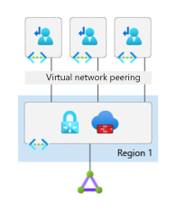
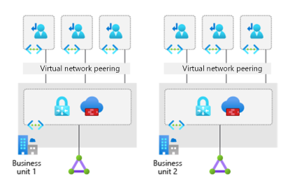
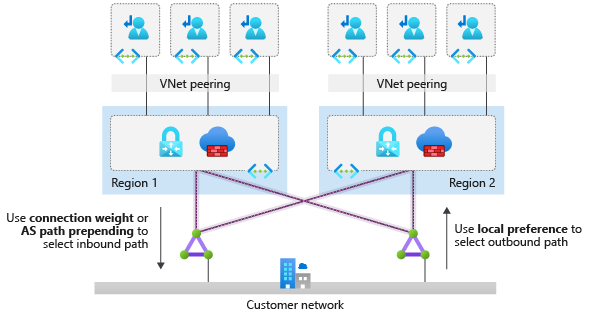

<!--docutune:casing "Layer-7 inbound" -->

# Traditional Azure networking topology

Explore key design considerations and recommendation surrounding network topologies in Microsoft Azure.

*Figure 1: A traditional Azure network topology.*

**Design considerations:**

- Various network topologies can connect multiple landing zone virtual networks. Examples are one large flat virtual network, multiple virtual networks connected with multiple Azure ExpressRoute circuits or connections, hub and spoke, full mesh, and hybrid.

- Virtual networks can't traverse subscription boundaries. However, you can achieve connectivity between virtual networks across different subscriptions by using virtual network peering, an ExpressRoute circuit, or VPN gateways.

- Virtual network peering is the preferred method to connect virtual networks in Azure. You can use virtual network peering to connect virtual networks in the same region, across different Azure regions, and across different Azure Active Directory (Azure AD) tenants.

- Virtual network peering and global virtual network peering aren't transitive. User-defined routes (UDRs) and network virtual appliances (NVAs) are required to enable a transit network. For more information, see [Hub-spoke network topology in Azure](/azure/architecture/reference-architectures/hybrid-networking/hub-spoke).

- An Azure DDoS Protection standard protection plan can be shared across all VNets in a single Azure AD Tenant to protect resources with public IP addresses. For more information, see [Azure DDoS Protection Standard](/azure/ddos-protection/ddos-protection-overview).

  - Only resources with Public IP addresses are covered by Azure DDoS Protection standard protection plans.

  - 100 public IP addresses are included in the cost of an Azure DDoS Protection standard protection plan across all protected VNets associated to the DDoS Protection plan. Any other public IP addresses over the 100 included with the plan, are charged separately. For more information on Azure DDoS Protection Standard Protection pricing, see the [pricing page](https://azure.microsoft.com/pricing/details/ddos-protection/) or the [FAQ](/azure/ddos-protection/ddos-faq#how-does-pricing-work).

  - Review the [supported resources of Azure DDoS Protection standard protection plans](/azure/ddos-protection/ddos-faq#what-are-the-supported-protected-resource-types)

- You can use ExpressRoute circuits to establish connectivity across virtual networks within the same geopolitical region or by using the premium add-on for connectivity across geopolitical regions. Keep these points in mind:

  - Network-to-network traffic might experience more latency because traffic must hairpin at the Microsoft Enterprise Edge (MSEE) routers.

  - Bandwidth will be constrained to the ExpressRoute gateway SKU.

  - You must deploy and manage UDRs if they require inspection or logging for traffic across virtual networks.

- VPN gateways with Border Gateway Protocol (BGP) are transitive within Azure and on-premises, but they do not provide transitive access to networks connected via ExpressRoute.

- When multiple ExpressRoute circuits are connected to the same virtual network, use connection weights and BGP techniques to ensure an optimal path for traffic between on-premises and Azure. For more information, see [Optimize ExpressRoute routing](/azure/expressroute/expressroute-optimize-routing).

- Using BGP metrics to influence ExpressRoute routing is a configuration change made outside of the Azure platform. Your organization or your connectivity provider must configure the on-premises routers accordingly.

- ExpressRoute circuits with premium add-ons provide global connectivity.

- ExpressRoute is bound to certain limits, such as maximum number of ExpressRoute connections per ExpressRoute gateway, or maximum number of routes that can be advertised from Azure to on-premises via ExpressRoute private peering. Such limits are documented in the [ExpressRoute limits](/azure/azure-resource-manager/management/azure-subscription-service-limits#expressroute-limits) article.

- A VPN gateway's maximum aggregated throughput is 10 Gbps. It supports up to 30 site-to-site or network-to-network tunnels.

**Design recommendations:**

- Consider a network design based on the traditional hub-and-spoke network topology for the following scenarios:

  - A network architecture deployed within a single Azure region.

  - A network architecture that spans multiple Azure regions, with no need for transitive connectivity between virtual networks for landing zones across regions.

  - A network architecture that spans multiple Azure regions, and global VNet peering can be used to connect virtual networks across Azure regions.

  - There's no need for transitive connectivity between VPN and ExpressRoute connections.

  - The main hybrid connectivity method in place is ExpressRoute, and the number of VPN connections is less than 30 per VPN gateway.

  - There's a dependency on centralized NVAs and granular routing.

- For regional deployments, primarily use the hub-and-spoke topology. Use landing zone virtual networks that connect with virtual network peering to a central hub virtual network for cross-premises connectivity via ExpressRoute, VPN for branch connectivity, spoke-to-spoke connectivity via NVAs and UDRs, and internet-outbound protection via Azure Firewall or other third-party NVA. The following diagram shows this topology. This configuration allows for appropriate traffic control to meet most requirements for segmentation and inspection.

  

 *Figure 2: Hub-and-spoke network topology.*

- Use the topology of multiple virtual networks connected with multiple ExpressRoute circuits when one of these conditions is true:

  - You need a high level of isolation.

  - You need dedicated ExpressRoute bandwidth for specific business units.

  - You've reached the maximum number of connections per ExpressRoute gateway (refer to the [ExpressRoute limits](/azure/azure-resource-manager/management/azure-subscription-service-limits#expressroute-limits) article for the maximum number).

The following figure shows this topology.

  

 *Figure 3: Multiple virtual networks connected with multiple ExpressRoute circuits.*

- Deploy a set of minimal shared services, including ExpressRoute gateways, VPN gateways (as required), and Azure Firewall or partner NVAs (as required) in the central-hub virtual network. If necessary, also deploy Active Directory domain controllers and DNS servers.

- Deploy Azure Firewall or partner NVAs for east/west or south/north traffic protection and filtering, in the central-hub virtual network.

- When you're deploying partner networking technologies or NVAs, follow the partner vendor's guidance to ensure that:

  - The vendor supports deployment.

  - The guidance is designed for high availability and maximum performance.

  - There are no conflicting configurations with Azure networking.

- Don't deploy Layer-7 inbound NVAs, such as Azure Application Gateway, as a shared service in the central-hub virtual network. Instead, deploy them together with the application in their respective landing zones.

- Deploy a single Azure DDoS standard protection plan in the Connectivity subscription.

  - All Landing Zone and Platform VNets should use this plan.

- Use your existing network, MPLS, and SD-WAN, to connect branch locations with corporate headquarters. Transit in Azure between ExpressRoute and VPN gateways isn't supported.

- For network architectures with multiple hub-and-spoke topologies across Azure regions, use global virtual network peering to connect landing-zone virtual networks when a small number of landing zones need to communicate across regions. This approach offers benefits such as high network bandwidth with global virtual network peering, as allowed by the VM SKU. However, it will bypass the central NVA, in case traffic inspection or filtering is required. This would also be subject to [limitations on global virtual network peering](/azure/virtual-network/virtual-network-peering-overview#constraints-for-peered-virtual-networks).

- When you deploy a hub-and-spoke network architecture in two or more Azure regions and transit connectivity between all landing zones across regions is required, use ExpressRoute with dual circuits to provide transit connectivity for landing-zone virtual networks across Azure regions. In this scenario, landing zones can transit within a region via NVA in the local-hub virtual network and across regions via ExpressRoute circuit. Traffic must hairpin at the MSEE routers. With this configuration, spokes across hubs will communicate directly bypassing the firewall, as they will learn via BGP routes to the spokes on the remote-hub.
  If you require traffic across hubs to be inspected by the firewall in the hub, you must implement one of these options:
  
  - Create more specific route entries in the spoke user defined routes (UDRs), so that traffic across hubs is redirected via the firewall in the local-hub virtual network.
  - [Disable BGP propagation](https://azure.microsoft.com/updates/disable-route-propagation-ga-udr) on the spokes, which simplifies the route configuration in the UDR. 
  
The following figure shows this design:
 
  

*Figure 4: Landing zone connectivity design.*

- When your organization requires hub-and-spoke network architectures across more than two Azure regions and global transit connectivity between landing zones, virtual networks across Azure regions are required. You can implement this architecture by interconnecting central-hub virtual networks with global virtual network peering and using UDRs and NVAs to enable global transit routing. Because the complexity and management overhead are high, it's recommended to evaluate a global transit network architecture with Virtual WAN.

- Deploy each region's hub network resources into separate resource groups, located in each of the regions being deployed to.

- Use [Azure Monitor for Networks (preview)](/azure/azure-monitor/insights/network-insights-overview) to monitor the end-to-end state of your networks on Azure.

- When you connect spoke virtual networks to the central hub virtual network, there are two [limits](/azure/azure-resource-manager/management/azure-subscription-service-limits) that must be considered:

  - The maximum number of virtual network peering connections per virtual network.
  - The maximum number of prefixes advertised from Azure to on-premises via ExpressRoute with private peering.

  Ensure that the number of spoke virtual networks connected to the hub virtual network don't exceed any of those limits.
