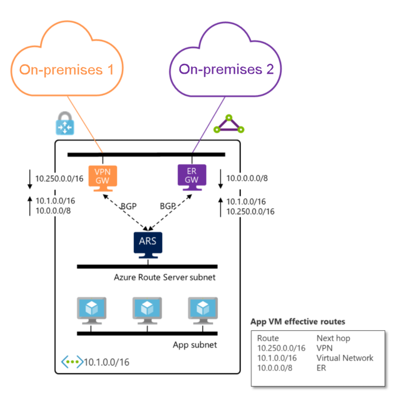
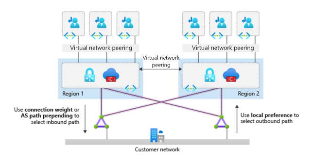
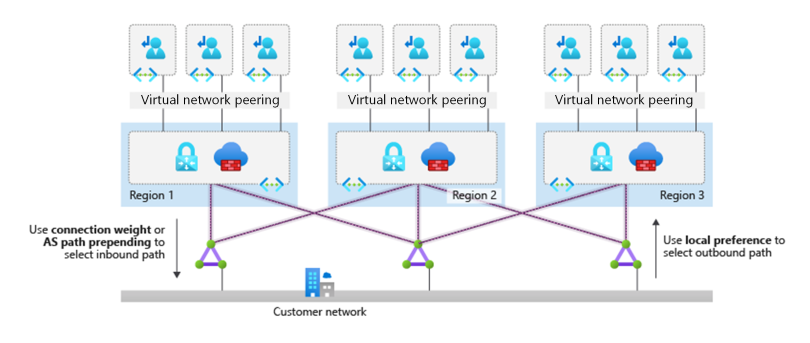

# Traditional Azure networking topology

> [!IMPORTANT]
> Try the new [Topology (Preview)](/azure/network-watcher/network-insights-topology) experience, which offers a visualization of Azure resources for ease of inventory management and monitoring network at scale. Use the Topology preview to visualize resources and their dependencies across subscriptions, regions and locations. [Select this link](https://portal.azure.com/#view/Microsoft_Azure_Monitoring/AzureMonitoringBrowseBlade/~/overview) to navigate to the experience.

Explore key design considerations and recommendations surrounding network topologies in Microsoft Azure.

*Figure 1: A traditional Azure network topology.*

**Design considerations:**

- Various network topologies can connect multiple landing zone virtual networks. Examples of network topologies include one large flat virtual network, multiple virtual networks connected with multiple Azure ExpressRoute circuits or connections, hub-and-spoke, full mesh, and hybrid.

- Virtual networks can't traverse subscription boundaries. However, you can achieve connectivity between virtual networks across different subscriptions by using virtual network peering, an ExpressRoute circuit, or VPN gateways.

- Virtual network peering is the preferred method to connect virtual networks in Azure. You can use virtual network peering to connect virtual networks in the same region, across different Azure regions, and across different Azure Active Directory (Azure AD) tenants.

- Virtual network peering and global virtual network peering aren't transitive. To enable a transit network, you need user-defined routes (UDRs) and network virtual appliances (NVAs). For more information, see [Hub-spoke network topology in Azure](/azure/architecture/reference-architectures/hybrid-networking/hub-spoke).

- You can share an Azure DDoS Protection plan across all virtual networks in a single Azure AD tenant to protect resources with public IP addresses. For more information, see [Azure DDoS Protection](/azure/ddos-protection/ddos-protection-overview).

  - Azure DDoS Protection plans cover only resources with public IP addresses.

  - The cost of an Azure DDoS Protection plan includes 100 public IP addresses across all protected virtual networks associated with the DDoS Protection plan. Protection for more resources is available at a separate cost. For more information on Azure DDoS Protection plan pricing, see the [Azure DDoS Protection pricing page](https://azure.microsoft.com/pricing/details/ddos-protection/) or the [FAQ](/azure/ddos-protection/ddos-faq#how-does-pricing-work-).

  - Review the [supported resources of Azure DDoS Protection plans](/azure/ddos-protection/ddos-faq#what-are-the-supported-protected-resource-types-).

- You can use ExpressRoute circuits to establish connectivity across virtual networks within the same geopolitical region or by using the premium add-on for connectivity across geopolitical regions. Keep these points in mind:

  - Network-to-network traffic might experience more latency, because traffic must hairpin at the Microsoft Enterprise Edge (MSEE) routers.

  - The ExpressRoute gateway SKU constrains bandwidth.

  - Deploy and manage UDRs if you need to inspect or log UDRs for traffic across virtual networks.

- VPN gateways with Border Gateway Protocol (BGP) are transitive within Azure and on-premises networks, but they don't provide transitive access to networks connected via ExpressRoute by default. If you need transitive access to networks connected via ExpressRoute, consider [Azure Route Server](/azure/route-server/overview).

- When you connect multiple ExpressRoute circuits to the same virtual network, use connection weights and BGP techniques to ensure an optimal path for traffic between on-premises networks and Azure. For more information, see [Optimize ExpressRoute routing](/azure/expressroute/expressroute-optimize-routing).

- Using BGP metrics to influence ExpressRoute routing is a configuration change made outside of the Azure platform. Your organization or your connectivity provider must configure the on-premises routers accordingly.

- ExpressRoute circuits with premium add-ons provide global connectivity.

- ExpressRoute has certain limits; there are a maximum number of ExpressRoute connections per ExpressRoute gateway, and ExpressRoute private peering can identify a maximum number of routes from Azure to on-premises. For more information about ExpressRoute limits, see [ExpressRoute limits](/azure/azure-resource-manager/management/azure-subscription-service-limits#expressroute-limits).

- A VPN gateway's maximum aggregated throughput is 10 gigabits per second. A VPN gateway supports up to 100 site-to-site or network-to-network tunnels.

- If an NVA is part of the architecture, consider Azure Route Server to simplify dynamic routing between your network virtual appliance (NVA) and your virtual network. Azure Route Server allows you to exchange routing information directly through Border Gateway Protocol (BGP) routing protocol between any NVA that supports the BGP routing protocol and the Azure software defined network (SDN) in the Azure virtual network (VNet) without the need to manually configure or maintain route tables.

**Design recommendations:**

- Consider a network design based on the traditional hub-and-spoke network topology for the following scenarios:

  - A network architecture deployed within a single Azure region.

  - A network architecture that spans multiple Azure regions, with no need for transitive connectivity between virtual networks for landing zones across regions.

  - A network architecture that spans multiple Azure regions, and global virtual network peering that can connect virtual networks across Azure regions.

  - There's no need for transitive connectivity between VPN and ExpressRoute connections.

  - The main hybrid connectivity method in place is ExpressRoute, and the number of VPN connections is less than 100 per VPN Gateway.

  - There's a dependency on centralized NVAs and granular routing.

- For regional deployments, primarily use the hub-and-spoke topology. Use landing zone virtual networks that connect with virtual network peering to a central hub virtual network for the following scenarios:

  - Cross-premises connectivity via ExpressRoute.

  - VPN for branch connectivity.

  - Spoke-to-spoke connectivity via NVAs and UDRs.

  - Internet-outbound protection via Azure Firewall or another third-party NVA.

The following diagram shows the hub-and-spoke topology. This configuration allows for appropriate traffic control to meet most requirements for segmentation and inspection.

  

 *Figure 2: Hub-and-spoke network topology.*

- Use the topology of multiple virtual networks connected with multiple ExpressRoute circuits when one of these conditions is true:

  - You need a high level of isolation.

  - You need dedicated ExpressRoute bandwidth for specific business units.

  - You've reached the maximum number of connections per ExpressRoute gateway (refer to the [ExpressRoute limits](/azure/azure-resource-manager/management/azure-subscription-service-limits#expressroute-limits) article for the maximum number).

The following figure shows this topology.

  

 *Figure 3: Multiple virtual networks connected with multiple ExpressRoute circuits.*

- Deploy a set of minimal shared services, including ExpressRoute gateways, VPN gateways (as required), and Azure Firewall or partner NVAs (as required) in the central-hub virtual network. If necessary, also deploy Active Directory domain controllers and DNS servers.

- Deploy Azure Firewall or partner NVAs for east/west or south/north traffic protection and filtering, in the central-hub virtual network.

- When you're deploying partner networking technologies or NVAs, follow the partner vendor's guidance to ensure that:

  - The vendor supports deployment.

  - The guidance supports high availability and maximum performance.

  - There are no conflicting configurations with Azure networking.

- Don't deploy Layer 7 inbound NVAs, such as Azure Application Gateway, as a shared service in the central-hub virtual network. Instead, deploy them together with the application in their respective landing zones.

- Deploy a single Azure DDoS standard protection plan in the connectivity subscription.

  - All landing zone and platform virtual networks should use this plan.

- Use your existing network, multiprotocol label switching, and SD-WAN to connect branch locations with corporate headquarters. If you don't use Azure Route Server, then there's no support for transit in Azure between ExpressRoute and VPN gateways.

- If you need transitivity between ExpressRoute and VPN gateways in a hub-and-spoke scenario, use Azure Route Server as described in [this reference scenario](/azure/route-server/expressroute-vpn-support).

    

- When you have hub-and-spoke networks in multiple Azure regions and a few landing zones need to connect across regions, use global virtual network peering to directly connect landing zone virtual networks that need to route traffic to each other. Depending on the communicating VM's SKU, global virtual network peering can provide high network throughput. Traffic between directly peered landing zone virtual networks bypasses NVAs within hub virtual networks. [Limitations on global virtual network peering](/azure/virtual-network/virtual-network-peering-overview#constraints-for-peered-virtual-networks) apply to the traffic.

- When you have hub-and-spoke networks in multiple Azure regions, and most landing zones need to connect across regions (or when using direct peering to bypass hub NVAs isn't compatible with your security requirements), use hub NVAs to connect hub virtual networks in each region to each other and to route traffic across regions. Global virtual network peering or ExpressRoute circuits can help to connect hub virtual networks in the following ways:

  - Global virtual network peering provides a low latency and high throughput connection but generates [traffic fees](/azure/virtual-network/virtual-network-peering-overview#pricing).

  - Routing via ExpressRoute might lead to increased latency (due to the MSEE hairpin), and the selected [ExpressRoute gateway SKU](/azure/expressroute/expressroute-about-virtual-network-gateways#gwsku) limits the throughput.

The following figure shows both options:

 

*Figure 4: Options for hub-to-hub connectivity.*

- When two Azure regions need to connect, evaluate, and use global virtual network peering or the same ExpressRoute circuits to connect both hub virtual networks.

- When more than two Azure regions need to connect, then we recommend that the hub virtual networks in each region connect to the same ExpressRoute circuits. Global virtual network peering would require managing a large number of peering relationships and a complex set of user-defined routes (UDRs) across multiple virtual networks. The following diagram shows how to connect hub-and-spoke networks in three regions:

*Figure 5: ExpressRoute providing hub-to-hub connectivity between multiple regions.*

- When you use ExpressRoute circuits for cross-region connectivity, spokes in different regions communicate directly and bypass the firewall because they learn via BGP routes to the spokes of the remote hub. If you need the firewall NVAs in the hub virtual networks to inspect traffic across spokes, you must implement one of these options:

  - Create more specific route entries in the spoke UDRs for the firewall in the local hub virtual network to redirect traffic across hubs.

  - To simplify route configuration, [disable BGP propagation](/azure/virtual-network/virtual-networks-udr-overview#border-gateway-protocol) on the spoke route tables.

- When your organization requires hub-and-spoke network architectures across more than two Azure regions and global transit connectivity between landing zones virtual networks across Azure regions, and you want to minimize network management overhead, we recommended a managed global transit network architecture that's based on [Virtual WAN](./virtual-wan-network-topology.md).

- Deploy each region's hub network resources into separate resource groups, and sort them into each deployed region.

- Use [Azure Virtual Network Manager](/azure/virtual-network-manager/overview) to manage connectivity and security configuration of virtual networks globally across subscriptions.

- Use [Azure Monitor for Networks](/azure/azure-monitor/insights/network-insights-overview) to monitor the end-to-end state of your networks on Azure.

- You must consider the following two [limits](/azure/azure-resource-manager/management/azure-subscription-service-limits) when you connect spoke virtual networks to the central hub virtual network:

  - The maximum number of virtual network peering connections per virtual network.
  - The maximum number of prefixes that ExpressRoute with private peering advertises from Azure to on-premises.

  Ensure that the number of spoke virtual networks connected to the hub virtual network don't exceed these limits.
